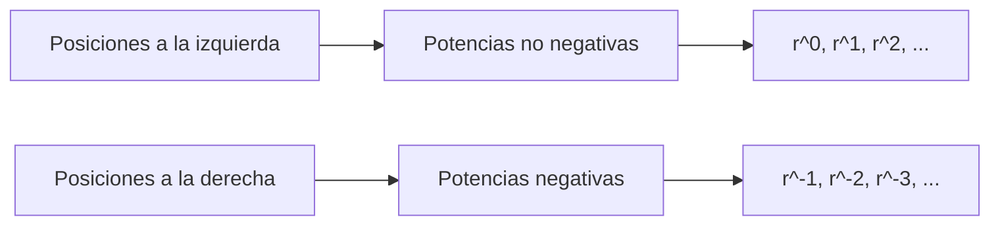
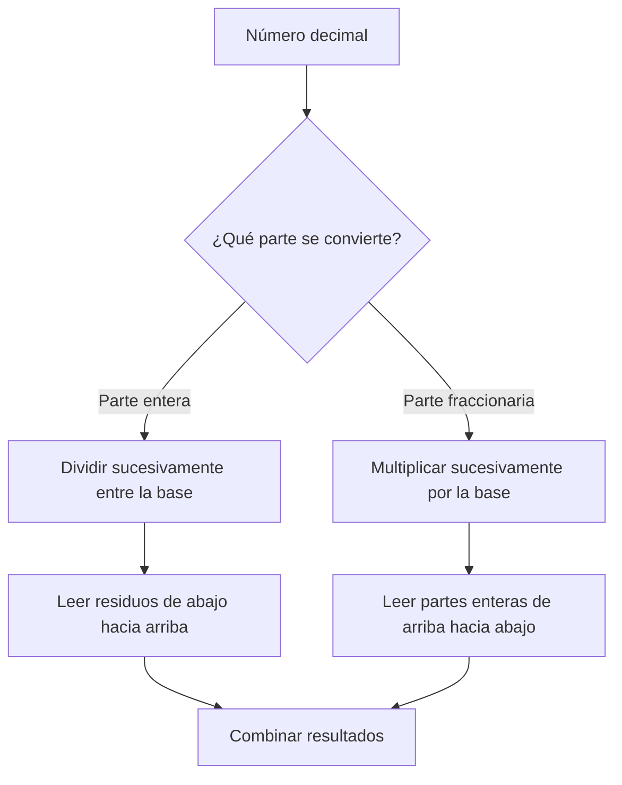
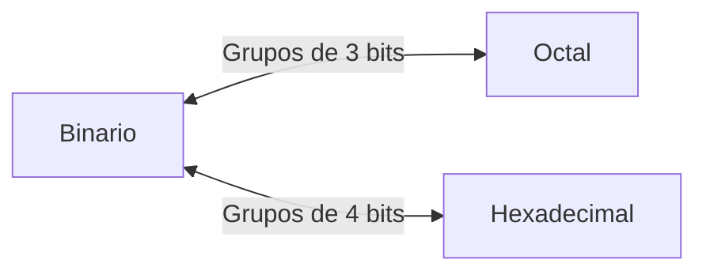

# Bases numéricas

## 1. Sistemas numéricos posicionales

Un **sistema numérico** es un conjunto de símbolos y reglas que permite representar cantidades.

En un sistema **posicional**, el valor de un dígito depende de:

1. El símbolo utilizado.
2. La posición que ocupa.
3. La base del sistema.

> **Ejemplo**
>
> En el número decimal `7392`, el dígito `7` no representa siete unidades, sino siete millares, porque ocupa la posición correspondiente a $10^3$:
>
> $$
> 7392 = 7(10^3)+3(10^2)+9(10^1)+2(10^0)
> $$

### 1.1 Base o raíz

La **base**, también llamada **raíz**, indica cuántos dígitos diferentes utiliza un sistema numérico.

Un sistema de base $r$ dispone de los dígitos comprendidos entre:

$$
0 \quad \text{y} \quad r-1
$$

| Base | Cantidad de dígitos | Dígitos permitidos         |
| ---: | ------------------: | -------------------------- |
|  $2$ |                   2 | $0,1$                      |
|  $5$ |                   5 | $0,1,2,3,4$                |
|  $8$ |                   8 | $0,1,2,3,4,5,6,7$          |
| $10$ |                  10 | $0,1,2,3,4,5,6,7,8,9$      |
| $16$ |                  16 | $0,1,\ldots,9,A,B,C,D,E,F$ |

> [!warning]
> Ningún dígito puede ser igual o mayor que la base.
>
> Mano señala, por ejemplo, que los coeficientes de un número en base 5 solamente pueden ser `0`, `1`, `2`, `3` y `4`.

### 1.2 Notación de la base

Para evitar ambigüedades, la base se escribe como un subíndice a la derecha del número:

| Notación       | Interpretación              |
| -------------- | --------------------------- |
| $(1010,011)_2$ | Número expresado en base 2  |
| $(630,4)_8$    | Número expresado en base 8  |
| $(7392)_{10}$  | Número expresado en base 10 |
| $(B65F)_{16}$  | Número expresado en base 16 |

El subíndice es especialmente importante cuando el contenido del número no permite deducir su base de manera inequívoca.

### 1.3 Valor posicional

En un número de base $r$, cada posición posee un peso que es una potencia de $r$.

Para un número con parte entera y fraccionaria:

$$
(a_na_{n-1}\ldots a_1a_0,a_{-1}a_{-2}\ldots a_{-m})_r
$$

su valor se obtiene mediante:

$$
a_nr^n+a_{n-1}r^{n-1}+\cdots+a_1r^1+a_0r^0+a_{-1}r^{-1}+\cdots+a_{-m}r^{-m}
$$

Las posiciones se cuentan desde el punto que separa la parte entera de la fraccionaria:

- Hacia la izquierda se utilizan los exponentes $0,1,2,3,\ldots$
- Hacia la derecha se utilizan los exponentes $-1,-2,-3,\ldots$

> **Ejemplo**
>
> Para interpretar $(4021,2)_5$, se multiplica cada dígito por el peso de su posición:
>
> $$
> (4021,2)_5=4(5^3)+0(5^2)+2(5^1)+1(5^0)+2(5^{-1})
> $$
>
> $$
> =500+0+10+1+0,4=(511,4)_{10}
> $$

## 2. Sistemas numéricos principales

En organización computacional se utilizan principalmente los sistemas decimal, binario, octal y hexadecimal.

| Sistema     | Base | Dígitos               | Uso principal                                  |
| ----------- | ---: | --------------------- | ---------------------------------------------- |
| Decimal     |   10 | `0` a `9`             | Representación cotidiana de cantidades         |
| Binario     |    2 | `0` y `1`             | Representación interna en sistemas digitales   |
| Octal       |    8 | `0` a `7`             | Forma compacta de representar grupos de 3 bits |
| Hexadecimal |   16 | `0` a `9` y `A` a `F` | Forma compacta de representar grupos de 4 bits |

### 2.1 Sistema decimal

El sistema **decimal** tiene base 10. Sus posiciones corresponden a potencias de 10.

$$
\ldots,10^3,10^2,10^1,10^0,10^{-1},10^{-2},\ldots
$$

Debido a su uso cotidiano, normalmente se omite el subíndice 10 cuando la base resulta evidente.

### 2.2 Sistema binario

El sistema **binario** tiene base 2 y utiliza únicamente los dígitos `0` y `1`.

Cada dígito binario recibe el nombre de **bit**, abreviatura de *binary digit*.

$$
\ldots,2^4,2^3,2^2,2^1,2^0,2^{-1},2^{-2},\ldots
$$

Los sistemas digitales emplean dos valores porque los circuitos electrónicos pueden distinguir de manera confiable entre dos estados físicos, como nivel bajo y nivel alto.

> [!note]
> Los símbolos `0` y `1` no significan necesariamente “apagado” y “encendido” en todos los circuitos.
>
> Son valores lógicos que se representan físicamente mediante rangos de voltaje definidos por la tecnología utilizada.

### 2.3 Sistema octal

El sistema **octal** tiene base 8 y utiliza los dígitos del `0` al `7`.

Como $8=2^3$, cada dígito octal representa exactamente tres bits.

> **Ejemplo**
>
> Equivalencia de la Tabla 1-1 del libro.
>
> $$
> (7)_8=(111)_2
> $$

### 2.4 Sistema hexadecimal

El sistema **hexadecimal** tiene base 16. Utiliza los diez dígitos decimales y seis letras adicionales.

| Hexadecimal | Decimal | Binario |
| :---------: | ------: | :-----: |
|      A      |      10 |  1010   |
|      B      |      11 |  1011   |
|      C      |      12 |  1100   |
|      D      |      13 |  1101   |
|      E      |      14 |  1110   |
|      F      |      15 |  1111   |

Como $16=2^4$, cada dígito hexadecimal representa exactamente cuatro bits.

> **Ejemplo**
>
> Equivalencia de la Tabla 1-1 del libro.
>
> $$
> (F)_{16}=(15)_{10}=(1111)_2
> $$

### Comparación de valores entre sistemas

| Decimal | Binario | Octal | Hexadecimal |
| ------: | :-----: | :---: | :---------: |
|       0 |  0000   |   0   |      0      |
|       1 |  0001   |   1   |      1      |
|       2 |  0010   |   2   |      2      |
|       3 |  0011   |   3   |      3      |
|       4 |  0100   |   4   |      4      |
|       5 |  0101   |   5   |      5      |
|       6 |  0110   |   6   |      6      |
|       7 |  0111   |   7   |      7      |
|       8 |  1000   |  10   |      8      |
|       9 |  1001   |  11   |      9      |
|      10 |  1010   |  12   |      A      |
|      11 |  1011   |  13   |      B      |
|      12 |  1100   |  14   |      C      |
|      13 |  1101   |  15   |      D      |
|      14 |  1110   |  16   |      E      |
|      15 |  1111   |  17   |      F      |

## 3. Conversión de una base a decimal

Para convertir un número de base $r$ a decimal se utiliza su expansión posicional:

1. Identificar el peso de cada posición.
2. Multiplicar cada dígito por la potencia correspondiente de la base.
3. Sumar todos los productos.

### 3.1 Conversión de la parte entera

> **Ejemplo**
>
> Convertir $(B65F)_{16}$ a decimal. 
> 
> En hexadecimal, $F=15$:
>
> $$
> (B65F)_{16}=11(16^3)+6(16^2)+5(16^1)+15(16^0)
> $$
>
> $$
> =45056+1536+80+15=(46687)_{10}
> $$

### 3.2 Conversión de la parte fraccionaria

Los dígitos situados a la derecha del punto se multiplican por potencias negativas de la base.

> **Ejemplo**
>
> Convertir $(1010,011)_2$ a decimal.
> 
> $$
> (1010,011)_2=1(2^3)+1(2^1)+1(2^{-2})+1(2^{-3})
> $$
>
> $$
> =8+2+0,25+0,125=(10,375)_{10}
> $$

> [!tip]
> Los ceros pueden omitirse en la suma porque no aportan valor, pero conviene escribirlos durante el aprendizaje para conservar claramente las posiciones.

### 3.3 Conversión de números mixtos

Un número mixto posee una parte entera y una parte fraccionaria. Ambas se evalúan en una sola expansión posicional.

> **Ejemplo**
>
> Convertir $(630,4)_8$ a decimal.
>
> $$
> (630,4)_8=6(8^2)+3(8^1)+0(8^0)+4(8^{-1})
> $$
>
> $$
> =384+24+0+0,5=(408,5)_{10}
> $$

## 4. Conversión de decimal a otra base

Para convertir desde decimal conviene separar el número en dos partes:

- La **parte entera** se convierte mediante divisiones sucesivas.
- La **parte fraccionaria** se convierte mediante multiplicaciones sucesivas.

### 4.1 Conversión de la parte entera

El procedimiento para convertir un entero decimal a base $r$ es:

1. Dividir el número entre $r$.
2. Conservar el residuo.
3. Dividir nuevamente el cociente entero entre $r$.
4. Repetir hasta obtener un cociente igual a cero.
5. Leer los residuos desde el último hasta el primero.

> **Ejemplo 1**
> 
> Convertir $(41)_{10}$ a binario.
>
>|División|Cociente|Residuo|
>|---:|---:|---:|
>|$41\div2$|20|1|
>|$20\div2$|10|0|
>|$10\div2$|5|0|
>|$5\div2$|2|1|
>|$2\div2$|1|0|
>|$1\div2$|0|1|
>
> Al leer los residuos de abajo hacia arriba:
>
> $$
> (41)_{10}=(101001)_2
> $$

> **Ejemplo 2**
> 
> Convertir $(153)_{10}$ a octal.
>
>|División|Cociente|Residuo|
>|---:|---:|---:|
>|$153\div8$|19|1|
>|$19\div8$|2|3|
>|$2\div8$|0|2|
>
> $$
> (153)_{10}=(231)_8
> $$

> [!warning]
> Los residuos de las divisiones no se leen en el orden en que fueron obtenidos. Para formar el resultado, se leen **de abajo hacia arriba**.

### 4.2 Conversión de la parte fraccionaria

El procedimiento para convertir una fracción decimal a base $r$ es:

1. Multiplicar la fracción por $r$.
2. Conservar la parte entera del producto.
3. Multiplicar nuevamente la parte fraccionaria resultante por $r$.
4. Repetir hasta que la fracción sea cero o se alcance la precisión requerida.
5. Leer las partes enteras desde la primera hasta la última.

> **Ejemplo**
>
> Convertir $(0,6875)_{10}$ a binario.
>
>|Multiplicación|Parte entera|Nueva fracción|
>|---|---:|---:|
>|$0,6875\times2=1,3750$|1|0,3750|
>|$0,3750\times2=0,7500$|0|0,7500|
>|$0,7500\times2=1,5000$|1|0,5000|
>|$0,5000\times2=1,0000$|1|0,0000|
>
> Las partes enteras se leen de arriba hacia abajo:
>
> $$
> (0,6875)_{10}=(0,1011)_2
> $$

> [!warning]
> No todas las fracciones decimales poseen una representación finita en otra base.
>
> Si la parte fraccionaria no llega a cero, el procedimiento se detiene al alcanzar la precisión solicitada. El resultado obtenido será una aproximación.

### 4.3 Conversión de un número mixto

La parte entera y la fraccionaria se convierten por separado y después se unen alrededor del punto.

> **Ejemplo**
>
>
> De los procedimientos anteriores:
>
> $$
> (41)_{10}=(101001)_2
> $$
>
> $$
> (0,6875)_{10}=(0,1011)_2
> $$
>
> Al combinar ambas partes:
>
> $$
> (41,6875)_{10}=(101001,1011)_2
> $$

## 5. Conversiones directas entre binario, octal y hexadecimal

Las conversiones entre estos sistemas pueden realizarse sin pasar por decimal porque:

$$
8=2^3 \qquad 16=2^4
$$

### 5.1 Conversión de binario a octal

1. Separar los bits en grupos de tres desde el punto hacia los extremos.
2. Agregar ceros en los extremos si algún grupo queda incompleto.
3. Sustituir cada grupo por su dígito octal equivalente.

> **Ejemplo**
>
> El número binario se agrupa en bloques de tres bits a partir del punto:
>
> $$
> (10\;110\;001\;101\;011,111\;100\;000\;110)_2
> $$
>
>|Grupo binario|010|110|001|101|011|111|100|000|110|
>|---|:---:|:---:|:---:|:---:|:---:|:---:|:---:|:---:|:---:|
>|Dígito octal|2|6|1|5|3|7|4|0|6|
>
> $$
> (10110001101011,111100000110)_2=(26153,7406)_8
> $$

### 5.2 Conversión de binario a hexadecimal

El procedimiento es el mismo, pero los bits se separan en grupos de cuatro.

> **Ejemplo**
>
> El mismo procedimiento se realiza con grupos de cuatro bits:
>
> $$
> (10\;1100\;0110\;1011,1111\;0010)_2
> $$
>
>|Grupo binario|0010|1100|0110|1011|1111|0010|
>|---|:---:|:---:|:---:|:---:|:---:|:---:|
>|Dígito hexadecimal|2|C|6|B|F|2|
>
> $$
> (10110001101011,11110010)_2=(2C6B,F2)_{16}
> $$

> [!tip]
> Los ceros agregados para completar grupos no cambian el valor:
>
> - En la parte entera se agregan a la izquierda.
> - En la parte fraccionaria se agregan a la derecha.

### 5.3 Conversión de octal o hexadecimal a binario

Para realizar la conversión inversa, cada dígito se sustituye por el grupo binario de longitud fija que le corresponde:

- Cada dígito octal se convierte en **3 bits**.
- Cada dígito hexadecimal se convierte en **4 bits**.

> **Ejemplo**
> 1
> Convertir $(673,124)_8$ a binario.
>
> $$
> 6\rightarrow110,\quad7\rightarrow111,\quad3\rightarrow011
> $$
>
> $$
> 1\rightarrow001,\quad2\rightarrow010,\quad4\rightarrow100
> $$
>
> $$
> (673,124)_8=(110111011,001010100)_2
> $$

> **Ejemplo**
> 2
> onvertir $(306,D)_{16}$ a binario.
>
> $$
> 3\rightarrow0011,\quad0\rightarrow0000,\quad6\rightarrow0110,\quad D\rightarrow1101
> $$
>
> $$
> (306,D)_{16}=(001100000110,1101)_2
> $$
>
> Los ceros no significativos de la izquierda pueden eliminarse:
>
> $$
> (306,D)_{16}=(1100000110,1101)_2
> $$

### 5.4 Conversión entre octal y hexadecimal

Como los grupos tienen tamaños diferentes, la forma más segura de convertir entre octal y hexadecimal consiste en utilizar binario como sistema intermedio.

Este procedimiento se aplica en los incisos (c) y (d) del problema 1-6 del libro, donde se solicita convertir números octales y hexadecimales a otras bases utilizando su relación con el sistema binario.

## 6. Importancia de las bases numéricas en computación

El sistema binario se adapta directamente a los dos estados distinguibles por los circuitos digitales. Sin embargo, una representación binaria puede requerir muchos dígitos.

Por esta razón, octal y hexadecimal se utilizan como formas compactas de lectura:

| Representación | Número             |
| -------------- | ------------------ |
| Binaria        | $(111111111111)_2$ |
| Octal          | $(7777)_8$         |
| Hexadecimal    | $(FFF)_{16}$       |
| Decimal        | $(4095)_{10}$      |

Las cuatro expresiones representan la misma cantidad.

El sistema hexadecimal es especialmente conveniente porque cada dígito reemplaza cuatro bits, lo que facilita la lectura de:

- Direcciones de memoria.
- Contenido de registros.
- Instrucciones de máquina.
- Máscaras de bits.
- Valores almacenados en bytes y palabras.

### Resumen de métodos de conversión

| Conversión                      | Método recomendado                 | Orden de lectura                   |
| ------------------------------- | ---------------------------------- | ---------------------------------- |
| Base $r$ a decimal              | Expansión en potencias de $r$      | De acuerdo con las posiciones      |
| Entero decimal a base $r$       | Divisiones sucesivas entre $r$     | Residuos de abajo hacia arriba     |
| Fracción decimal a base $r$     | Multiplicaciones sucesivas por $r$ | Enteros de arriba hacia abajo      |
| Binario a octal                 | Agrupar en 3 bits                  | Desde el punto hacia los extremos  |
| Binario a hexadecimal           | Agrupar en 4 bits                  | Desde el punto hacia los extremos  |
| Octal a binario                 | Sustituir cada dígito por 3 bits   | En el mismo orden                  |
| Hexadecimal a binario           | Sustituir cada dígito por 4 bits   | En el mismo orden                  |
| Octal a hexadecimal o viceversa | Usar binario como intermediario    | Reagrupar según la base de destino |

# Verificación del aprendizaje

**Problema 1:** escriba los primeros 20 números decimales en base 3.

**Problema 2:** convierta los siguientes números decimales a binario:
1. $(12,0625)_{10}$.
2. $(104)_{10}$.
3. $(673,23)_{10}$.
4. $(1998)_{10}$.

**Problema 3:** convierta los siguientes números binarios a decimal:
1. $(10,10001)_2$.
2. $(101110,0101)_2$.
3. $(1110101,110)_2$.
4. $(1101101,111)_2$.

**Problema 4:** realice las conversiones indicadas:
1. Convierta $(225,225)_{10}$ a binario, octal y hexadecimal.
2. Convierta $(11010111,110)_2$ a decimal, octal y hexadecimal.
3. Convierta $(623,77)_8$ a decimal, binario y hexadecimal.
4. Convierta $(2AC5,D)_{16}$ a decimal, octal y binario.

**Problema 5:** convierta los siguientes números a decimal:
1. $(1001001,011)_2$.
2. $(12121)_3$.
3. $(1032,2)_4$.
4. $(4310)_5$.
5. $(0,342)_6$.
6. $(50)_7$.
7. $(8,3)_9$.
8. $(198)_{12}$.

> **Soluciones**
>
> **Problema 1**
>
> $0,1,2,10,11,12,20,21,22,100,101,102,110,111,112,120,121,122,200,201$
>
> **Problema 2**
>
>1. $(1100,0001)_2$
>2. $(1101000)_2$
>3. $(1010100001,00\overline{11101011100001010001})_2$
>4. $(11111001110)_2$
>
> **Problema 3**
>
>1. $(2,53125)_{10}$
>2. $(46,3125)_{10}$
>3. $(117,75)_{10}$
>4. $(109,875)_{10}$
>
> ### **Problema 4**
> 
> 1. $(225{,}225)_{10} = (11100001{,}001\overline{1100})_2 = (341{,}1\overline{6314})_8 = (E1{,}3\overline{9})_{16}$
> 2. $(11010111{,}110)_2 = (215{,}75)_{10} = (327{,}6)_8 = (D7{,}C)_{16}$
> 3. $(623{,}77)_8 = (403{,}984375)_{10} = (110010011{,}111111)_2 = (193{,}FC)_{16}$
> 4. $(2AC5{,}D)_{16} = (10949{,}8125)_{10} = (25305{,}64)_8 = (10101011000101{,}1101)_2$
> 
> ### **Problema 5**
> 
> 1. $(1001001{,}011)_2 = (73{,}375)_{10}$
> 2. $(12121)_3 = (151)_{10}$
> 3. $(1032{,}2)_4 = (78{,}5)_{10}$
> 4. $(4310)_5 = (580)_{10}$
> 5. $(0{,}342)_6 = (0{,}62\overline{037})_{10}$
> 6. $(50)_7 = (35)_{10}$
> 7. $(8{,}3)_9 = (8{,}\overline{3})_{10}$
> 8. $(198)_{12} = (260)_{10}$

> [!tip]
> Para comprobar una conversión, convierta el resultado nuevamente al sistema de origen. Si recupera el número inicial, el procedimiento probablemente es correcto.

<table width="100%">
  <tr>
    <td align="left">⬅️ Tema anterior</td>
    <td align="right"><a href="./Tema%202.md">Siguiente tema ➡️</a></td>
  </tr>
</table>
