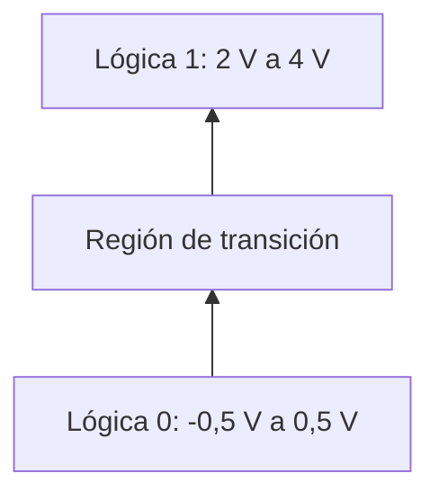
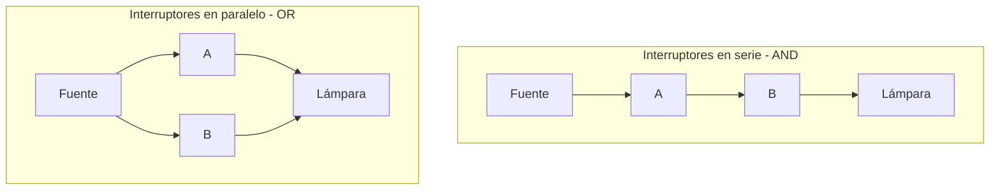
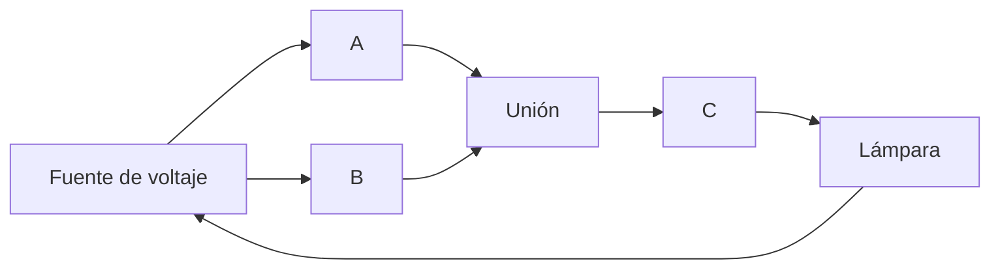

# Lógica binaria

## 1. Concepto de lógica binaria

La **lógica binaria** estudia variables que solamente pueden tomar dos valores discretos y las operaciones que se realizan con ellas.

Estos dos valores pueden interpretarse de distintas maneras:

| Valor lógico | Interpretaciones posibles                     |
| :----------: | --------------------------------------------- |
|     $0$      | Falso, no, abierto, apagado, nivel bajo       |
|     $1$      | Verdadero, sí, cerrado, encendido, nivel alto |

En los sistemas digitales resulta conveniente representar estos valores mediante los bits `0` y `1`.

La lógica binaria permite describir matemáticamente el procesamiento y la manipulación de información binaria. Por esta razón, se utiliza en el análisis y diseño de sistemas digitales.

> [!note]
> Los valores lógicos `0` y `1` representan estados. No deben interpretarse automáticamente como cantidades aritméticas.

### 1.1 Variables binarias

Una **variable binaria** es una variable que puede tomar únicamente uno de los valores del conjunto:

$$
B=\{0,1\}
$$

Las variables binarias suelen identificarse con letras como:

$$
A,B,C,x,y,z
$$

> **Ejemplo**
>
> Si una variable $A$ representa el estado de un interruptor, puede establecerse que:
>
> - $A=0$ cuando el interruptor está abierto.
> - $A=1$ cuando el interruptor está cerrado.
>
> La variable no puede tomar ningún otro valor dentro de este modelo lógico.

### 1.2 Relación con el álgebra de Boole

La lógica binaria de dos valores es equivalente a una forma de álgebra conocida como **álgebra de Boole** o **álgebra de conmutación**.

El álgebra de Boole proporciona las reglas que permiten:

- Representar operaciones lógicas mediante expresiones matemáticas.
- Analizar el comportamiento de sistemas digitales.
- Transformar circuitos en expresiones algebraicas.
- Transformar expresiones algebraicas en circuitos.

En este tema se presenta la lógica binaria de forma introductoria. Las propiedades y teoremas formales del álgebra de Boole se estudiarán posteriormente.

## 2. Operaciones lógicas básicas

La lógica binaria posee tres operaciones fundamentales:

1. **AND**.
2. **OR**.
3. **NOT**.

Cada operación establece una relación entre una o más variables de entrada y una variable de salida.

### 2.1 Operación AND

La operación **AND** produce una salida igual a $1$ si y solo si **todas** sus entradas son iguales a $1$.

Se representa mediante un punto o mediante la ausencia de un operador:

$$
z=x\cdot y
$$

$$
z=xy
$$

Ambas expresiones se leen: “$x$ AND $y$ es igual a $z$”.

Si alguna entrada es igual a $0$, el resultado será $0$.

> **Ejemplo**
>
> Para $x=1$ y $y=1$:
>
> $$
> z=x\cdot y=1\cdot1=1
> $$
>
> Si $x=1$ y $y=0$:
>
> $$
> z=x\cdot y=1\cdot0=0
> $$

### 2.2 Operación OR

La operación **OR** produce una salida igual a $1$ cuando **al menos una** de sus entradas es igual a $1$.

Se representa mediante el signo más:

$$
z=x+y
$$

La expresión se lee: “$x$ OR $y$ es igual a $z$”.

La salida solamente será $0$ cuando todas las entradas sean iguales a $0$.

> **Ejemplo**
>
> Para $x=0$ y $y=1$:
>
> $$
> z=x+y=0+1=1
> $$
>
> Si $x=0$ y $y=0$:
>
> $$
> z=x+y=0+0=0
> $$

### 2.3 Operación NOT

La operación **NOT** produce el valor opuesto al de la variable de entrada.

Puede representarse mediante un apóstrofo o mediante una barra:

$$
z=x'
$$

$$
z=\overline{x}
$$

La operación NOT también se denomina **complementación lógica** o **inversión**.

> **Ejemplo**
>
> Si $x=0$, entonces:
>
> $$
> z=x'=1
> $$
>
> Si $x=1$, entonces:
>
> $$
> z=x'=0
> $$

### Comparación de las operaciones básicas

| Operación | Notación              | Condición para obtener $1$  |
| --------- | --------------------- | --------------------------- |
| AND       | $x\cdot y$            | Todas las entradas son $1$  |
| OR        | $x+y$                 | Al menos una entrada es $1$ |
| NOT       | $x'$ o $\overline{x}$ | La entrada es $0$           |

> [!tip]
> Las palabras clave ayudan a recordar cada operación:
>
> - AND: **todas**.
> - OR: **al menos una**.
> - NOT: **opuesto**.

## 3. Tablas de verdad

Una **tabla de verdad** muestra todas las combinaciones posibles de los valores de entrada y el resultado producido por una operación lógica.

Para dos variables binarias $x$ y $y$ existen cuatro combinaciones posibles:

$$
00,01,10,11
$$

### 3.1 Tabla de verdad de AND y OR

La Tabla 1-6 del libro presenta las operaciones AND y OR de la siguiente manera:

|  $x$  |  $y$  | $x\cdot y$ | $x+y$ |
| :---: | :---: | :--------: | :---: |
|   0   |   0   |     0      |   0   |
|   0   |   1   |     0      |   1   |
|   1   |   0   |     0      |   1   |
|   1   |   1   |     1      |   1   |

La tabla permite comprobar que:

- AND solamente produce $1$ en la combinación `11`.
- OR solamente produce $0$ en la combinación `00`.

### 3.2 Tabla de verdad de NOT

Como NOT trabaja con una sola variable, únicamente existen dos casos:

|  $x$  | $x'$  |
| :---: | :---: |
|   0   |   1   |
|   1   |   0   |

> **Ejemplo**
>
> Si las entradas son $x=1$ y $y=0$, la Tabla 1-6 permite obtener:
>
> $$
> x\cdot y=0
> $$
>
> $$
> x+y=1
> $$
>
> $$
> x'=0
> $$

## 4. Lógica binaria y aritmética binaria

La **lógica binaria** no debe confundirse con la **aritmética binaria**.

Aunque AND y OR utilizan símbolos parecidos a la multiplicación y la suma, sus operandos son valores lógicos individuales y sus resultados siguen definiciones lógicas.

| Característica          | Lógica binaria       | Aritmética binaria         |
| ----------------------- | -------------------- | -------------------------- |
| Objeto de trabajo       | Variables lógicas    | Números binarios           |
| Valores de una variable | Únicamente $0$ o $1$ | Puede contener varios bits |
| Significado de $+$      | Operación OR         | Suma aritmética            |
| Resultado de $1+1$      | $1$                  | $10$                       |

> **Ejemplo**
>
> En aritmética binaria:
>
> $$
> 1+1=10
> $$
>
> En lógica binaria, el signo $+$ representa OR:
>
> $$
> 1+1=1
> $$
>
> Las expresiones usan los mismos símbolos, pero representan operaciones diferentes.

> [!warning]
> Antes de efectuar una operación, debe identificarse si la expresión pertenece a la aritmética binaria o a la lógica binaria.

## 5. Señales binarias

Los valores lógicos se representan físicamente mediante **señales binarias**, como voltajes o corrientes eléctricas.

Un circuito digital reconoce dos regiones de valores:

- Una región correspondiente a lógica $0$.
- Una región correspondiente a lógica $1$.

Los valores físicos no tienen que ser exactamente iguales al valor nominal. Cada nivel admite un intervalo de tolerancia.

### 5.1 Niveles lógicos

La Figura 1-5 del libro muestra un sistema ilustrativo con los siguientes niveles:

| Estado     | Valor nominal |                Intervalo permitido |
| ---------- | ------------: | ---------------------------------: |
| Lógica $0$ | $0\ \text{V}$ | $-0,5\ \text{V}$ a $0,5\ \text{V}$ |
| Lógica $1$ | $3\ \text{V}$ |      $2\ \text{V}$ a $4\ \text{V}$ |

La región comprendida entre $0,5\ \text{V}$ y $2\ \text{V}$ se atraviesa durante la transición de un estado a otro.

> [!warning]
> Los voltajes anteriores son un ejemplo utilizado por el libro, no valores universales. Los intervalos válidos dependen de la tecnología del circuito.

### 5.2 Estados lógicos y estados físicos

La correspondencia entre lógica y voltaje puede resumirse así:

Durante el funcionamiento normal, las entradas de un circuito reciben señales dentro de los intervalos permitidos y generan salidas que también pertenecen a una región lógica reconocible.

## 6. Circuitos de conmutación

Los circuitos digitales electrónicos también reciben el nombre de **circuitos de conmutación**, porque sus elementos activos pueden compararse con interruptores abiertos o cerrados.

El libro demuestra las operaciones AND y OR mediante una fuente de voltaje, interruptores y una lámpara $L$.

### 6.1 Interruptores en serie

Cuando los interruptores $A$ y $B$ están conectados en serie, la corriente puede circular únicamente si ambos están cerrados.

Esta condición corresponde a la operación AND:

$$
L=A\cdot B
$$

> **Ejemplo**
>
> La lámpara se enciende únicamente cuando $A=1$ y $B=1$.
>
>|$A$|$B$|$L=A\cdot B$|
>|:---:|:---:|:---:|
>|0|0|0|
>|0|1|0|
>|1|0|0|
>|1|1|1|

### 6.2 Interruptores en paralelo

Cuando los interruptores $A$ y $B$ están conectados en paralelo, la corriente puede circular si cualquiera de ellos está cerrado.

Esta condición corresponde a la operación OR:

$$
L=A+B
$$

> **Ejemplo**
>
> La lámpara se enciende cuando $A=1$, cuando $B=1$ o cuando ambos son iguales a $1$.
>
>|$A$|$B$|$L=A+B$|
>|:---:|:---:|:---:|
>|0|0|0|
>|0|1|1|
>|1|0|1|
>|1|1|1|

### Comparación de los circuitos de conmutación

| Configuración             | Operación | Expresión    | Condición para encender la lámpara     |
| ------------------------- | --------- | ------------ | -------------------------------------- |
| Interruptores en serie    | AND       | $L=A\cdot B$ | Todos los interruptores están cerrados |
| Interruptores en paralelo | OR        | $L=A+B$      | Al menos un interruptor está cerrado   |

## 7. Síntesis de la lógica binaria

| Concepto             | Idea principal                                 |
| -------------------- | ---------------------------------------------- |
| Variable binaria     | Solamente puede tomar los valores $0$ y $1$    |
| AND                  | Produce $1$ cuando todas las entradas son $1$  |
| OR                   | Produce $1$ cuando al menos una entrada es $1$ |
| NOT                  | Invierte el valor de la entrada                |
| Tabla de verdad      | Enumera entradas posibles y sus resultados     |
| Señal binaria        | Representación física de un valor lógico       |
| Circuito en serie    | Representa una operación AND                   |
| Circuito en paralelo | Representa una operación OR                    |

# Verificación del aprendizaje

**Problema 1:** exprese el siguiente circuito de conmutación en notación lógica binaria:

Los interruptores $A$ y $B$ se encuentran en paralelo. El interruptor $C$ está conectado en serie con ese conjunto.

> **Soluciones**
>
> **Problema 1**
>
> Los interruptores $A$ y $B$ en paralelo representan la operación OR:
>
> $$
> A+B
> $$
>
> Como el interruptor $C$ está en serie, representa una operación AND con el resultado anterior:
>
> $$
> L=(A+B)\cdot C
> $$

> [!tip]
> Para traducir un circuito de conmutación, identifique primero los grupos en paralelo y después las conexiones en serie.

<table width="100%">
  <tr>
    <td align="left"><a href="./Tema%201.md">⬅️ Tema anterior</a></td>
    <td align="right"><a href="./Tema%203.md">Siguiente tema ➡️</a></td>
  </tr>
</table>
