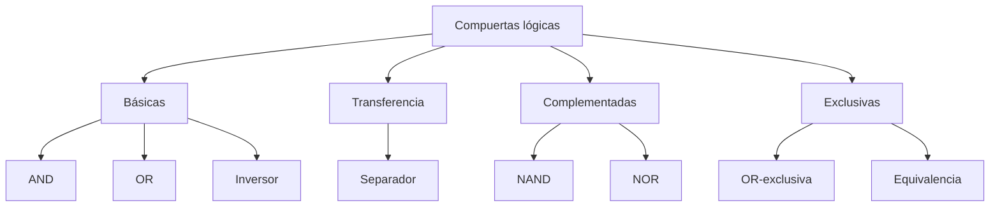
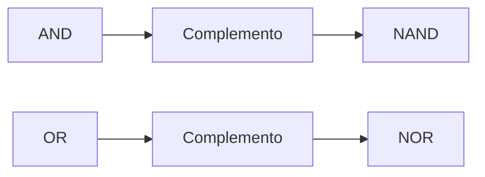
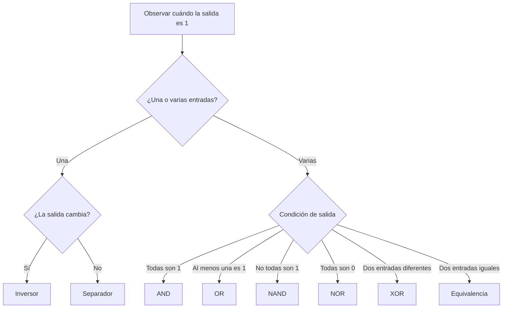

# Compuertas lógicas

## 1. Concepto de compuerta lógica

Una **compuerta lógica** es un bloque de circuitería digital que recibe una o más señales binarias y produce una señal binaria de salida de acuerdo con una operación lógica.

Cada señal de entrada representa una variable binaria y transporta un bit de información. La salida solamente puede tomar uno de los valores:

$$
F\in\{0,1\}
$$

Los términos **circuito digital**, **circuito de conmutación**, **circuito lógico** y **compuerta** suelen utilizarse para referirse a circuitos que manipulan información binaria.

> [!note]
> Una operación lógica describe matemáticamente el comportamiento. La compuerta es el circuito físico que realiza esa operación.

### 1.1 Entradas y salida

Una compuerta posee:

- Una o más variables de entrada.
- Una función lógica definida.
- Una variable de salida.

Para una compuerta de dos entradas se utiliza frecuentemente la notación:

$$
x,y\longrightarrow F
$$

> **Ejemplo**
>
> Una compuerta AND con entradas $x$ y $y$ produce la función:
>
> $$
> F=xy
> $$
>
> La salida depende de la combinación presente en ambas entradas.

### 1.2 Compuertas normalizadas

Mano presenta ocho funciones utilizadas como compuertas normalizadas para el diseño digital:

1. AND.
2. OR.
3. Inversor.
4. Separador.
5. NAND.
6. NOR.
7. OR-exclusiva.
8. Equivalencia o NOR-exclusiva.

## 2. Compuertas básicas

Las compuertas AND, OR y NOT realizan las tres operaciones fundamentales de la lógica binaria.

### 2.1 Compuerta AND

La compuerta **AND** produce una salida igual a $1$ únicamente cuando todas sus entradas son iguales a $1$.

Su función para dos entradas es:

$$
F=xy
$$

El símbolo gráfico posee un lado plano en las entradas y un lado curvo en la salida.

|  $x$  |  $y$  | $F=xy$ |
| :---: | :---: | :----: |
|   0   |   0   |   0    |
|   0   |   1   |   0    |
|   1   |   0   |   0    |
|   1   |   1   |   1    |

> **Ejemplo**
>
> La Figura 1-6 del libro presenta una compuerta AND de tres entradas:
>
> $$
> F=ABC
> $$
>
> La salida $F$ será igual a $1$ solamente cuando $A=B=C=1$.

### 2.2 Compuerta OR

La compuerta **OR** produce una salida igual a $1$ cuando al menos una de sus entradas es igual a $1$.

Su función para dos entradas es:

$$
F=x+y
$$

El símbolo gráfico posee un lado curvo en las entradas y termina en una forma puntiaguda en la salida.

|  $x$  |  $y$  | $F=x+y$ |
| :---: | :---: | :-----: |
|   0   |   0   |    0    |
|   0   |   1   |    1    |
|   1   |   0   |    1    |
|   1   |   1   |    1    |

> **Ejemplo**
>
> La Figura 1-6 del libro presenta una compuerta OR de cuatro entradas:
>
> $$
> G=A+B+C+D
> $$
>
> La salida $G$ será igual a $0$ solamente cuando todas las entradas sean iguales a $0$.

### 2.3 Compuerta NOT o inversor

La compuerta **NOT** posee una entrada y produce su complemento lógico.

$$
F=x'
$$

|  $x$  | $F=x'$ |
| :---: | :----: |
|   0   |   1    |
|   1   |   0    |

Su símbolo es un triángulo seguido por un círculo pequeño en la salida. Este círculo indica una inversión lógica.

> **Ejemplo**
>
> Si la entrada cambia de $0$ a $1$, la salida del inversor cambia de $1$ a $0$:
>
> $$
> 0'=1\qquad1'=0
> $$

## 3. Compuerta separadora

La compuerta **separadora**, también conocida como *buffer*, realiza la función de transferencia.

$$
F=x
$$

|  $x$  | $F=x$ |
| :---: | :---: |
|   0   |   0   |
|   1   |   1   |

Su símbolo es un triángulo sin el círculo de inversión.

La salida conserva el mismo valor lógico de la entrada. Por tanto, no ejecuta una operación lógica distinta, sino que se utiliza para amplificar la potencia de una señal.

> [!tip]
> El inversor y el separador se distinguen por el círculo de la salida:
>
> - Triángulo sin círculo: separador.
> - Triángulo con círculo: inversor.

## 4. Compuertas complementadas

Las compuertas NAND y NOR se obtienen al complementar las salidas de AND y OR, respectivamente.

En los símbolos gráficos, el complemento se representa mediante un círculo pequeño en la salida.

### 4.1 Compuerta NAND

La compuerta **NAND** es el complemento de AND.

$$
F=(xy)'
$$

Su salida solamente será $0$ cuando todas las entradas sean iguales a $1$.

|  $x$  |  $y$  | $xy$  | $F=(xy)'$ |
| :---: | :---: | :---: | :-------: |
|   0   |   0   |   0   |     1     |
|   0   |   1   |   0   |     1     |
|   1   |   0   |   0   |     1     |
|   1   |   1   |   1   |     0     |

> **Ejemplo**
>
> Para $x=1$ y $y=1$, AND produce $1$ y la inversión cambia el resultado a $0$:
>
> $$
> F=(1\cdot1)'=1'=0
> $$

### 4.2 Compuerta NOR

La compuerta **NOR** es el complemento de OR.

$$
F=(x+y)'
$$

Su salida solamente será $1$ cuando todas las entradas sean iguales a $0$.

|  $x$  |  $y$  | $x+y$ | $F=(x+y)'$ |
| :---: | :---: | :---: | :--------: |
|   0   |   0   |   0   |     1      |
|   0   |   1   |   1   |     0      |
|   1   |   0   |   1   |     0      |
|   1   |   1   |   1   |     0      |

> **Ejemplo**
>
> Para $x=0$ y $y=0$, OR produce $0$ y la inversión cambia el resultado a $1$:
>
> $$
> F=(0+0)'=0'=1
> $$

### Comparación entre NAND y NOR

| Característica            | NAND                      | NOR                      |
| ------------------------- | ------------------------- | ------------------------ |
| Función original          | AND                       | OR                       |
| Función algebraica        | $(xy)'$                   | $(x+y)'$                 |
| Único caso con salida $0$ | $x=y=1$                   | Todos menos $x=y=0$      |
| Único caso con salida $1$ | Todos menos $x=y=1$       | $x=y=0$                  |
| Símbolo                   | AND con círculo de salida | OR con círculo de salida |

> [!note]
> NAND y NOR se utilizan ampliamente como compuertas normalizadas porque pueden construirse con facilidad y permiten realizar funciones de Boole.

### 4.3 Carácter universal

NAND y NOR pueden utilizarse individualmente para realizar las operaciones básicas NOT, AND y OR. En consecuencia, cualquier función de Boole puede implementarse utilizando únicamente compuertas NAND o únicamente compuertas NOR.

Por esta propiedad reciben el nombre de **compuertas universales**.

> [!note]
> Las transformaciones necesarias para construir funciones completas con NAND o NOR se desarrollarán junto con el álgebra de Boole y los teoremas de De Morgan.

## 5. Compuertas exclusivas

Las compuertas OR-exclusiva y de equivalencia comparan los valores de sus entradas.

### 5.1 Compuerta OR-exclusiva

La compuerta **OR-exclusiva**, abreviada **XOR**, produce una salida igual a $1$ cuando sus dos entradas son diferentes.

$$
F=xy'+x'y
$$

También puede escribirse mediante el operador $\oplus$:

$$
F=x\oplus y
$$

|  $x$  |  $y$  | $F=x\oplus y$ |
| :---: | :---: | :-----------: |
|   0   |   0   |       0       |
|   0   |   1   |       1       |
|   1   |   0   |       1       |
|   1   |   1   |       0       |

Su símbolo es parecido al de OR, pero posee una línea curva adicional en el lado de las entradas.

> **Ejemplo**
>
> XOR puede interpretarse como un detector de diferencia:
>
> $$
> 0\oplus1=1
> $$
>
> $$
> 1\oplus1=0
> $$

### 5.2 Compuerta de equivalencia

La compuerta de **equivalencia**, también llamada **NOR-exclusiva** o **XNOR**, es el complemento de XOR.

Produce una salida igual a $1$ cuando sus dos entradas son iguales.

$$
F=xy+x'y'
$$

El libro representa esta operación mediante $\odot$:

$$
F=x\odot y
$$

|  $x$  |  $y$  | $F=x\odot y$ |
| :---: | :---: | :----------: |
|   0   |   0   |      1       |
|   0   |   1   |      0       |
|   1   |   0   |      0       |
|   1   |   1   |      1       |

Su símbolo corresponde a XOR con un círculo de complemento en la salida.

> **Ejemplo**
>
> La equivalencia puede interpretarse como un detector de igualdad:
>
> $$
> 0\odot0=1
> $$
>
> $$
> 0\odot1=0
> $$

### Comparación entre XOR y equivalencia

| Entradas       | XOR                | Equivalencia     |
| -------------- | ------------------ | ---------------- |
| Iguales        | 0                  | 1                |
| Diferentes     | 1                  | 0                |
| Interpretación | Detecta diferencia | Detecta igualdad |

## 6. Tabla general de compuertas

### 6.1 Compuertas de dos entradas

|  $x$  |  $y$  |  AND  |  OR   | NAND  |  NOR  |  XOR  | Equivalencia |
| :---: | :---: | :---: | :---: | :---: | :---: | :---: | :----------: |
|   0   |   0   |   0   |   0   |   1   |   1   |   0   |      1       |
|   0   |   1   |   0   |   1   |   1   |   0   |   1   |      0       |
|   1   |   0   |   0   |   1   |   1   |   0   |   1   |      0       |
|   1   |   1   |   1   |   1   |   0   |   0   |   0   |      1       |

### 6.2 Compuertas de una entrada

|  $x$  | Inversor | Separador |
| :---: | :------: | :-------: |
|   0   |    1     |     0     |
|   1   |    0     |     1     |

### Resumen de símbolos y funciones

| Compuerta    | Función       | Característica del símbolo            |
| ------------ | ------------- | ------------------------------------- |
| AND          | $F=xy$        | Lado de entrada plano y salida curva  |
| OR           | $F=x+y$       | Entrada curva y salida puntiaguda     |
| Inversor     | $F=x'$        | Triángulo con círculo de salida       |
| Separador    | $F=x$         | Triángulo sin círculo                 |
| NAND         | $F=(xy)'$     | AND con círculo de salida             |
| NOR          | $F=(x+y)'$    | OR con círculo de salida              |
| XOR          | $F=x\oplus y$ | OR con una curva adicional de entrada |
| Equivalencia | $F=x\odot y$  | XOR con círculo de salida             |

## 7. Compuertas con entradas múltiples

Las compuertas AND y OR pueden extenderse a tres o más entradas porque sus operaciones son conmutativas y asociativas.

### 7.1 AND y OR de varias entradas

Una compuerta AND de tres entradas realiza:

$$
F=xyz
$$

La salida es $1$ cuando las tres entradas son iguales a $1$.

Una compuerta OR de cuatro entradas realiza:

$$
F=w+x+y+z
$$

La salida es $1$ cuando al menos una entrada es igual a $1$.

### 7.2 NAND y NOR de varias entradas

Una compuerta NAND de varias entradas se define como una AND complementada:

$$
F=(xyz)'
$$

Una compuerta NOR de varias entradas se define como una OR complementada:

$$
F=(x+y+z)'
$$

> [!warning]
> NAND y NOR no son operaciones asociativas. Cuando varias compuertas se conectan en cascada, los paréntesis indican el orden de las operaciones y no deben omitirse.

### 7.3 OR-exclusiva de varias entradas

Para varias entradas, la función XOR produce $1$ cuando existe un número impar de unos.

La Figura 2-8 del libro presenta:

$$
F=x\oplus y\oplus z
$$

|  $x$  |  $y$  |  $z$  |  $F$  |
| :---: | :---: | :---: | :---: |
|   0   |   0   |   0   |   0   |
|   0   |   0   |   1   |   1   |
|   0   |   1   |   0   |   1   |
|   0   |   1   |   1   |   0   |
|   1   |   0   |   0   |   1   |
|   1   |   0   |   1   |   0   |
|   1   |   1   |   0   |   0   |
|   1   |   1   |   1   |   1   |

> [!tip]
> Para XOR de varias entradas, cuente la cantidad de unos:
>
> - Cantidad impar de unos: salida $1$.
> - Cantidad par de unos: salida $0$.

## 8. Selección de una compuerta

Para identificar una compuerta a partir de su comportamiento puede utilizarse el siguiente proceso:

# Verificación del aprendizaje

**Problema 1:** muestre las señales de salida $F$ y $G$ de las compuertas de la Figura 1-6 para señales arbitrarias en las entradas $A$, $B$, $C$ y $D$.

$$
F=ABC\qquad G=A+B+C+D
$$

**Problema 2:** verifique la tabla de verdad de la compuerta OR-exclusiva de tres entradas de la Figura 2-8. Evalúe primero:

$$
A=x\oplus y
$$

y después:

$$
F=A\oplus z=x\oplus y\oplus z
$$

**Problema 3:** una pastilla SSI de TTL posee 14 patillas. Dos se reservan para la fuente de poder y las restantes se utilizan como terminales de entrada y salida. Determine cuántas compuertas pueden encapsularse si contiene:

1. Compuertas OR-exclusivas de 2 entradas.
2. Compuertas AND de 3 entradas.
3. Compuertas NAND de 4 entradas.
4. Compuertas NOR de 5 entradas.
5. Compuertas NAND de 8 entradas.

> [!success]- Soluciones
>
> **Problema 1**
>
> Una posible selección de señales arbitrarias es:
>
>|Instante|$A$|$B$|$C$|$D$|$F=ABC$|$G=A+B+C+D$|
>|:---:|:---:|:---:|:---:|:---:|:---:|:---:|
>|$t_0$|0|0|0|0|0|0|
>|$t_1$|1|0|0|0|0|1|
>|$t_2$|1|1|0|0|0|1|
>|$t_3$|1|1|1|0|1|1|
>|$t_4$|1|1|1|1|1|1|
>|$t_5$|0|1|1|0|0|1|
>|$t_6$|0|0|0|1|0|1|
>|$t_7$|0|0|0|0|0|0|
>
> $F$ toma el valor $1$ únicamente cuando $A$, $B$ y $C$ son iguales a $1$. La salida $G$ toma el valor $1$ cuando al menos una de sus cuatro entradas es igual a $1$.
>
> **Problema 2**
>
>|$x$|$y$|$z$|$A=x\oplus y$|$F=A\oplus z$|
>|:---:|:---:|:---:|:---:|:---:|
>|0|0|0|0|0|
>|0|0|1|0|1|
>|0|1|0|1|1|
>|0|1|1|1|0|
>|1|0|0|1|1|
>|1|0|1|1|0|
>|1|1|0|0|0|
>|1|1|1|0|1|
>
> La salida es $1$ para las combinaciones que contienen una cantidad impar de unos.
>
> **Problema 3**
>
> Después de reservar dos patillas para alimentación quedan:
>
> $$
> 14-2=12\text{ patillas}
> $$
>
>|Inciso|Patillas por compuerta|Compuertas por pastilla|
>|:---:|:---:|:---:|
>|1|$2+1=3$|$12\div3=4$|
>|2|$3+1=4$|$12\div4=3$|
>|3|$4+1=5$|$2$ compuertas y $2$ patillas sin utilizar|
>|4|$5+1=6$|$12\div6=2$|
>|5|$8+1=9$|$1$ compuerta y $3$ patillas sin utilizar|

> [!tip]
> Cada compuerta requiere una patilla por entrada y una patilla adicional para su salida.

<table width="100%">
  <tr>
    <td align="left"><a href="./Tema%202.md">⬅️ Tema anterior</a></td>
    <td align="right"><a href="./Tema%204.md">Siguiente tema ➡️</a></td>
  </tr>
</table>
