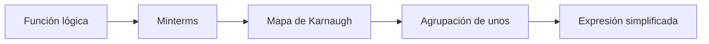
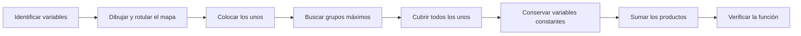

# Métodos de agrupación

## 1. El método del mapa

El **método del mapa** es un procedimiento gráfico que permite simplificar funciones de Boole. También se conoce como **mapa de Karnaugh** o **mapa K**.

Cada función lógica puede representarse mediante una suma de minterms. En el mapa, cada minterm ocupa un cuadrado y los cuadrados que contienen unos se agrupan para obtener una expresión simplificada.

El mapa es una forma modificada de la tabla de verdad. La diferencia principal consiste en que sus casillas se ordenan de modo que los minterms adyacentes difieran en el valor de una sola variable.

> [!note]
> El método del mapa proporciona de manera directa una expresión simplificada cuando el número de variables no es demasiado grande. Para funciones con muchas variables, el mapa se vuelve difícil de utilizar.

### 1.1 Minterms y notación de suma

Un **minterm** es un producto que contiene todas las variables de la función, complementadas o sin complementar. Cada minterm corresponde a una combinación distinta de la tabla de verdad.

Para tres variables, por ejemplo:

$$
m_0=x'y'z'\qquad m_1=x'y'z\qquad m_2=x'yz'
$$

La notación de suma de minterms enumera las combinaciones para las cuales la función vale $1$:

$$
F(x,y,z)=\sum(0,2,5,7)
$$

Esto significa que deben colocarse unos en los cuadrados $m_0$, $m_2$, $m_5$ y $m_7$ del mapa; los demás cuadrados contienen ceros.

### 1.2 Número de cuadrados

Un mapa de $n$ variables contiene:

$$
2^n\text{ cuadrados}
$$

| Variables | Cuadrados del mapa |
| :-------: | :----------------: |
|     2     |         4          |
|     3     |         8          |
|     4     |         16         |
|     5     |         32         |
|     6     |         64         |

Cada cuadrado representa exactamente un minterm de la función.

## 2. Orden del mapa y adyacencia

Las filas y columnas del mapa no siguen el orden binario ordinario. Se ordenan mediante una secuencia reflejada o **código Gray**:

$$
00, 01, 11, 10
$$

Entre dos posiciones consecutivas solamente cambia un bit. Por ejemplo:

$$
01\longrightarrow11
$$

Aquí cambia el primer bit, mientras el segundo permanece igual.

> [!warning]
> El orden $00,01,10,11$ no debe utilizarse en el mapa, porque entre $01$ y $10$ cambian dos bits y esas columnas no son adyacentes.

### 2.1 Cuadrados adyacentes

Dos cuadrados son **adyacentes** cuando sus minterms difieren en una sola variable. La variable que cambia se elimina al combinar ambos minterms.

Por ejemplo:

$$
xy'z+xyz=yz(x'+x)=yz
$$

Los términos difieren únicamente en $x$; por ello, $x$ desaparece del resultado.

En el mapa se consideran adyacentes:

- Los cuadrados que comparten un lado.
- Los cuadrados de los extremos izquierdo y derecho de una misma fila.
- Los cuadrados de los extremos superior e inferior de una misma columna.

Los cuadrados que solamente se tocan en una esquina **no** son adyacentes.

> [!tip]
> Puede imaginarse que el mapa se enrolla horizontal y verticalmente. Por ello, los bordes opuestos se encuentran conectados.

## 3. Reglas de agrupación

Para simplificar una función expresada como suma de productos se agrupan los cuadrados que contienen $1$.

### 3.1 Tamaño de los grupos

Cada grupo debe contener una potencia de dos de cuadrados adyacentes:

$$
1, 2, 4, 8, 16,\ldots
$$

Los grupos siempre forman rectángulos. Un grupo no puede contener tres, cinco o seis cuadrados.

### 3.2 Criterios de selección

Al formar los grupos deben seguirse estas reglas:

1. Incluir solamente cuadrados que contengan $1$.
2. Cubrir todos los unos de la función.
3. Formar grupos tan grandes como sea posible.
4. Utilizar la menor cantidad de grupos necesaria.
5. Permitir que un mismo cuadrado pertenezca a más de un grupo cuando esto produzca grupos mayores.
6. Considerar la adyacencia entre los bordes opuestos del mapa.

> [!note]
> La superposición de grupos es válida. Un minterm puede utilizarse más de una vez si ayuda a eliminar más literales.

### 3.3 Literales eliminados

En un grupo se conservan únicamente las variables cuyo valor permanece constante. Las variables que cambian se eliminan.

Si una función posee $n$ variables y un grupo contiene $2^k$ cuadrados, el término resultante posee:

$$
n-k\text{ literales}
$$

| Cuadrados del grupo | Variables que cambian | Literales eliminados |
| :-----------------: | :-------------------: | :------------------: |
|          1          |           0           |          0           |
|          2          |           1           |          1           |
|          4          |           2           |          2           |
|          8          |           3           |          3           |
|         16          |           4           |          4           |

Por tanto, cuanto mayor sea el grupo, más sencilla será la expresión resultante.

### 3.4 Obtención del término de un grupo

Para traducir un grupo a un producto:

1. Observe el valor de cada variable en todos los cuadrados del grupo.
2. Elimine las variables que toman tanto el valor $0$ como el valor $1$.
3. Escriba sin complemento las variables que permanecen en $1$.
4. Escriba complementadas las variables que permanecen en $0$.
5. Sume los productos obtenidos de todos los grupos.

## 4. Mapas de dos variables

Un mapa de dos variables posee cuatro cuadrados:

| $x\backslash y$ |    $0$     |    $1$    |
| :-------------: | :--------: | :-------: |
|       $0$       | $m_0=x'y'$ | $m_1=x'y$ |
|       $1$       | $m_2=xy'$  | $m_3=xy$  |

Dos cuadrados adyacentes eliminan una variable. Una fila completa conserva solamente $x$ o $x'$, mientras una columna completa conserva solamente $y$ o $y'$.

| Grupo                | Término obtenido |
| -------------------- | ---------------- |
| Fila superior        | $x'$             |
| Fila inferior        | $x$              |
| Columna izquierda    | $y'$             |
| Columna derecha      | $y$              |
| Los cuatro cuadrados | $1$              |

## 5. Mapas de tres variables

Un mapa de tres variables posee ocho cuadrados. Una variable identifica las filas y las otras dos identifican las columnas en código Gray.

| $x\backslash yz$ | $00$  | $01$  | $11$  | $10$  |
| :--------------: | :---: | :---: | :---: | :---: |
|       $0$        | $m_0$ | $m_1$ | $m_3$ | $m_2$ |
|       $1$        | $m_4$ | $m_5$ | $m_7$ | $m_6$ |

Los cuadrados de la primera y la última columna son adyacentes porque las combinaciones $00$ y $10$ difieren solamente en $y$.

### 5.1 Agrupación de pares

> **Ejemplo 1**
> 
> El ejemplo 3-1 del libro presenta:
>
> $$
> F=x'yz+x'yz'+xy'z'+xy'z
> $$
>
> Los minterms son $m_3$, $m_2$, $m_4$ y $m_5$:
>
>|$x\backslash yz$|$00$|$01$|$11$|$10$|
>|:---:|:---:|:---:|:---:|:---:|
>|$0$|0|0|1|1|
>|$1$|1|1|0|0|
>
> El par $m_2,m_3$ mantiene $x=0$ y $y=1$, por lo que produce $x'y$. El par $m_4,m_5$ mantiene $x=1$ y $y=0$, por lo que produce $xy'$.
>
> $$
> \boxed{F=x'y+xy'}
> $$

> **Ejemplo 2**
> 
> El ejemplo 3-2 del libro presenta:
>
> $$
> F=x'yz+xy'z'+xyz+xyz'
> $$
>
>|$x\backslash yz$|$00$|$01$|$11$|$10$|
>|:---:|:---:|:---:|:---:|:---:|
>|$0$|0|0|1|0|
>|$1$|1|0|1|1|
>
> El par vertical $m_3,m_7$ produce $yz$. Los cuadrados $m_4$ y $m_6$ se encuentran en los extremos de la fila inferior y son adyacentes; forman el término $xz'$.
>
> $$
> \boxed{F=yz+xz'}
> $$

### 5.2 Superposición de grupos

> **Ejemplo**
>
> En el ejemplo 3-3 del libro:
>
> $$
> F=A'C+A'B+AB'C+BC
> $$
>
> Los cuatro cuadrados en los que $C=1$ forman un grupo que produce $C$. Los dos cuadrados restantes necesarios para cubrir la función se agrupan con cuadrados que ya pertenecen al primer grupo; este segundo grupo produce $A'B$.
>
> $$
> \boxed{F=C+A'B}
> $$
>
> La superposición permite obtener grupos de cuatro cuadrados y eliminar más literales.

### 5.3 Función expresada como suma de minterms

> **Ejemplo**
>
> El ejemplo 3-4 del libro presenta:
>
> $$
> F(x,y,z)=\sum(0,2,4,5,6)
> $$
>
>|$x\backslash yz$|$00$|$01$|$11$|$10$|
>|:---:|:---:|:---:|:---:|:---:|
>|$0$|1|0|0|1|
>|$1$|1|1|0|1|
>
> Las columnas extremas forman un grupo de cuatro cuadrados. En ellas $z=0$, de modo que el grupo produce $z'$. El cuadrado $m_5$ se combina con $m_4$ y produce $xy'$.
>
> $$
> \boxed{F=z'+xy'}
> $$

## 6. Mapas de cuatro variables

Un mapa de cuatro variables posee 16 cuadrados. Tanto las filas como las columnas siguen el orden Gray.

| $wx\backslash yz$ |   $00$   |   $01$   |   $11$   |   $10$   |
| :---------------: | :------: | :------: | :------: | :------: |
|       $00$        |  $m_0$   |  $m_1$   |  $m_3$   |  $m_2$   |
|       $01$        |  $m_4$   |  $m_5$   |  $m_7$   |  $m_6$   |
|       $11$        | $m_{12}$ | $m_{13}$ | $m_{15}$ | $m_{14}$ |
|       $10$        |  $m_8$   |  $m_9$   | $m_{11}$ | $m_{10}$ |

Las filas superior e inferior son adyacentes, al igual que las columnas izquierda y derecha. Por ello, las cuatro esquinas del mapa también forman un grupo válido de cuatro cuadrados.

### 6.1 Selección de los grupos mayores

> **Ejemplo**
>
> El ejemplo 3-5 del libro presenta:
>
> $$
> F(w,x,y,z)=\sum(0,1,2,4,5,6,8,9,12,13,14)
> $$
>
> Los ocho cuadrados de las dos columnas izquierdas forman el grupo correspondiente a $y'$. Los minterms $m_0,m_2,m_4,m_6$ forman un grupo entre las columnas extremas y producen $w'z'$. Finalmente, $m_4,m_6,m_{12},m_{14}$ producen $xz'$.
>
> $$
> \boxed{F=y'+w'z'+xz'}
> $$

### 6.2 Traducción de una expresión al mapa

> **Ejemplo**
>
> En el ejemplo 3-6 del libro:
>
> $$
> F=A'B'C'+B'CD'+A'BCD'+AB'C'
> $$
>
> Cada producto se marca en el mapa. Los términos que carecen de una variable abarcan los dos valores posibles de esa variable y, por tanto, ocupan dos cuadrados.
>
> Después de agrupar los unos se obtiene:
>
> $$
> \boxed{F=B'D'+B'C'+A'CD'}
> $$

> [!tip]
> Un producto con $r$ literales representa $2^{n-r}$ cuadrados en un mapa de $n$ variables.

## 7. Mapas de cinco y seis variables

Los mapas de más de cuatro variables se construyen como combinaciones de mapas de cuatro variables.

### 7.1 Mapa de cinco variables

Un mapa de cinco variables contiene 32 cuadrados y puede considerarse como dos mapas de cuatro variables colocados uno junto al otro:

- Un mapa corresponde a $A=0$.
- El otro mapa corresponde a $A=1$.

Los cuadrados situados en posiciones equivalentes de ambos mapas son adyacentes porque solamente difieren en $A$. En la representación del libro, esta correspondencia puede verse como una reflexión con respecto a la línea central.

> **Ejemplo**
>
> El ejemplo 3-7 del libro presenta:
>
> $$
> F(A,B,C,D,E)=\sum(0,2,4,6,9,11,13,15,17,21,25,27,29,31)
> $$
>
> Al considerar la adyacencia entre ambos mapas de cuatro variables se forman tres grupos, que producen:
>
> $$
> \boxed{F=BE+AD'E+A'B'E'}
> $$

### 7.2 Mapa de seis variables

Un mapa de seis variables contiene 64 cuadrados y puede considerarse como cuatro mapas de cuatro variables. Los cuadrados correspondientes entre mapas adyacentes también pueden agruparse.

Por ejemplo, en un mapa de cinco variables los cuadrados adyacentes a $m_{31}$ son:

$$
m_{30},m_{15},m_{29},m_{23},m_{27}
$$

En un mapa de seis variables, $m_{63}$ es un sexto cuadrado adyacente a $m_{31}$.

> [!warning]
> Los mapas de cinco y seis variables requieren especial cuidado al reconocer la adyacencia entre secciones. Para siete o más variables, el método gráfico se vuelve impráctico y conviene utilizar otros procedimientos de simplificación.

## 8. Procedimiento completo de simplificación

Para simplificar una función mediante agrupación:

1. Determine el número de variables y dibuje el mapa correspondiente.
2. Rotule filas y columnas en código Gray.
3. Convierta la función a minterms si es necesario.
4. Coloque un $1$ en cada cuadrado incluido en la función y un $0$ en los restantes.
5. Identifique los grupos más grandes posibles, considerando los bordes opuestos.
6. Cubra todos los unos con la menor cantidad de grupos.
7. Obtenga el producto de cada grupo conservando las variables constantes.
8. Sume los productos obtenidos.
9. Compruebe que la expresión simplificada representa los mismos minterms que la función original.

### Errores frecuentes

| Error                                     | Consecuencia                                             | Corrección                        |
| ----------------------------------------- | -------------------------------------------------------- | --------------------------------- |
| Usar orden binario ordinario              | Se agrupan cuadrados que difieren en más de una variable | Utilizar código Gray              |
| Ignorar los bordes                        | Se pierden grupos mayores                                | Revisar extremos y esquinas       |
| Formar grupos diagonales                  | Se combinan minterms no adyacentes                       | Agrupar solamente por lados       |
| Formar grupos que no son potencias de dos | La eliminación algebraica deja de ser válida             | Usar grupos de $1,2,4,8,\ldots$   |
| Elegir grupos pequeños antes que grandes  | La expresión conserva literales innecesarios             | Buscar primero los grupos máximos |
| No cubrir un uno                          | La función resultante cambia                             | Comprobar todos los minterms      |

# Verificación del aprendizaje

**Problema 1:** simplifique mediante mapas las siguientes funciones del problema 3-1 del libro:

1. $F(x,y,z)=\sum(2,3,6,7)$
2. $F(A,B,C,D)=\sum(7,13,14,15)$
3. $F(A,B,C,D)=\sum(4,6,7,15)$
4. $F(w,x,y,z)=\sum(2,3,12,13,14,15)$

**Problema 2:** simplifique mediante mapas las siguientes funciones del problema 3-2 del libro:

1. $xy+x'y'z'+x'yz'$
2. $A'B+BC'+B'C'$
3. $a'b'+bc+a'bc'$
4. $xy'z+xyz'+x'yz+xyz$

**Problema 3:** simplifique mediante un mapa de cinco variables la función del problema 3-4(a) del libro:

$$
F(A,B,C,D,E)=\sum(0,1,4,5,16,17,21,25,29)
$$

> **Soluciones**
>
> **Problema 1**
>
> 1. Los minterms forman un grupo de cuatro en el que $y=1$:
>
> $$
> \boxed{F=y}
> $$
>
> 2. Los pares $(7,15)$, $(13,15)$ y $(14,15)$ producen, respectivamente, $BCD$, $ABD$ y $ABC$:
>
> $$
> \boxed{F=BCD+ABD+ABC}
> $$
>
> 3. El par $(4,6)$ produce $A'BD'$ y el par $(7,15)$ produce $BCD$:
>
> $$
> \boxed{F=A'BD'+BCD}
> $$
>
> 4. El par $(2,3)$ produce $w'x'y$ y el grupo $(12,13,14,15)$ produce $wx$:
>
> $$
> \boxed{F=w'x'y+wx}
> $$
>
> **Problema 2**
>
> 1. Los minterms equivalentes son $0,2,6,7$. Los grupos producen:
>
> $$
> \boxed{F=x'z'+xy}
> $$
>
> 2. Los minterms equivalentes son $0,2,3,4,6$. Un grupo de cuatro produce $C'$ y el par restante produce $A'B$:
>
> $$
> \boxed{F=C'+A'B}
> $$
>
> 3. Los minterms equivalentes son $0,1,2,3,7$. Un grupo de cuatro produce $a'$ y el par restante produce $bc$:
>
> $$
> \boxed{F=a'+bc}
> $$
>
> 4. Los minterms equivalentes son $3,5,6,7$. Los tres pares necesarios producen $yz$, $xz$ y $xy$:
>
> $$
> \boxed{F=yz+xz+xy}
> $$
>
> **Problema 3**
>
> Los grupos máximos producen $A'B'D'$, $B'C'D'$ y $AD'E$:
>
> $$
> \boxed{F=A'B'D'+B'C'D'+AD'E}
> $$

<table width="100%">
  <tr>
    <td align="left"><a href="./Tema%203.md">⬅️ Tema anterior</a></td>
    <td align="right"><a href="./Tema%205.md">Siguiente tema ➡️</a></td>
  </tr>
</table>
