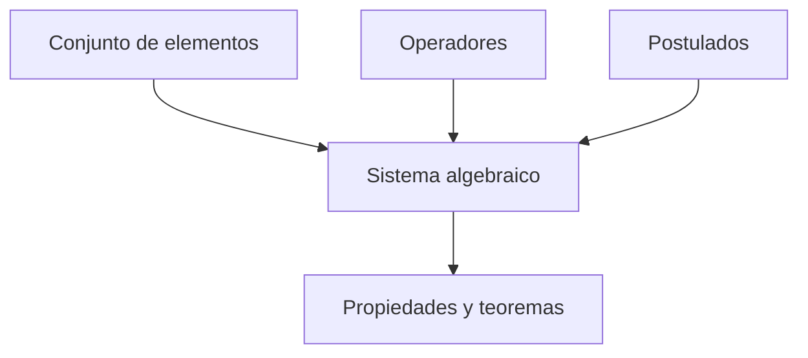

# Álgebra de Boole

## 1. Definiciones lógicas

El **álgebra de Boole** es un sistema matemático que permite representar, analizar y transformar funciones lógicas. Como cualquier sistema matemático deductivo, se define mediante:

- Un conjunto de elementos.
- Uno o más operadores.
- Un conjunto de axiomas o postulados.

Los postulados son las suposiciones básicas a partir de las cuales se deducen las propiedades y los teoremas del sistema.

### 1.1 Conjunto y pertenencia

Un **conjunto** es una colección de objetos que comparten alguna propiedad. Si $S$ es un conjunto:

$$
x\in S
$$

indica que $x$ pertenece a $S$, mientras que:

$$
y\notin S
$$

indica que $y$ no pertenece a $S$.

Un conjunto finito puede escribirse entre llaves. Por ejemplo:

$$
A=\{1,2,3,4\}
$$

### 1.2 Operador binario

Un **operador binario** definido sobre un conjunto $S$ es una regla que asigna a cada par de elementos de $S$ un único elemento del mismo conjunto.

Si el operador se representa mediante $*$:

$$
a*b=c
$$

debe cumplirse que:

$$
a,b\in S\Longrightarrow c\in S
$$

> [!note]
> En este contexto, la palabra *binario* indica que el operador recibe dos operandos. No significa necesariamente que el conjunto esté formado por los valores $0$ y $1$.

## 2. Propiedades de los sistemas algebraicos

Mano presenta seis propiedades utilizadas para describir las estructuras algebraicas.

### 2.1 Conjunto cerrado

Un conjunto $S$ es **cerrado** respecto de un operador $*$ cuando el resultado de operar dos elementos de $S$ también pertenece a $S$:

$$
a,b\in S\Longrightarrow a*b\in S
$$

Los números naturales son cerrados respecto de la suma, pero no respecto de la resta, porque una operación como $2-3=-1$ produce un resultado que no pertenece al conjunto de los naturales.

### 2.2 Ley asociativa

Un operador es asociativo cuando la manera de agrupar sus operandos no cambia el resultado:

$$
(x*y)*z=x*(y*z)
$$

### 2.3 Ley conmutativa

Un operador es conmutativo cuando el orden de sus operandos no cambia el resultado:

$$
x*y=y*x
$$

### 2.4 Elemento de identidad

Un elemento $e\in S$ es una **identidad** respecto de $*$ cuando:

$$
e*x=x*e=x
$$

Por ejemplo, $0$ es la identidad de la suma aritmética porque $x+0=x$.

### 2.5 Inverso

Si $e$ es la identidad, un elemento $y$ es el **inverso** de $x$ cuando:

$$
x*y=e
$$

En la suma de números enteros, el inverso de $a$ es $-a$ porque:

$$
a+(-a)=0
$$

### 2.6 Ley distributiva

Si $*$ y $\cdot$ son dos operadores, se dice que $*$ es distributivo respecto de $\cdot$ cuando:

$$
x*(y\cdot z)=(x*y)\cdot(x*z)
$$

Estas definiciones permiten comparar el álgebra ordinaria con el álgebra de Boole.

## 3. Definición axiomática del álgebra booleana

Un **álgebra de Boole** es una estructura formada por:

- Un conjunto de elementos $B$.
- Dos operadores binarios, $+$ y $\cdot$.
- Un operador complemento, representado mediante una prima.
- Los postulados de Huntington.

### 3.1 Postulados de Huntington

Para todos los elementos $x,y,z\in B$ deben cumplirse los siguientes postulados:

|  N.º  | Respecto de $+$                                  | Respecto de $\cdot$                 |
| :---: | ------------------------------------------------ | ----------------------------------- |
|   1   | $B$ es cerrado respecto de $+$.                  | $B$ es cerrado respecto de $\cdot$. |
|   2   | $x+0=x$                                          | $x\cdot1=x$                         |
|   3   | $x+y=y+x$                                        | $xy=yx$                             |
|   4   | $x(y+z)=xy+xz$                                   | $x+yz=(x+y)(x+z)$                   |
|   5   | $x+x'=1$                                         | $xx'=0$                             |
|   6   | Existen al menos dos elementos distintos en $B$. | En particular, $0\ne1$.             |

El elemento $x'$ recibe el nombre de **complemento** de $x$.

> [!warning]
> Los símbolos $+$ y $\cdot$ no representan las operaciones aritméticas ordinarias. En el álgebra booleana representan OR y AND, respectivamente.

### 3.2 Diferencias con el álgebra ordinaria

Aunque se emplean símbolos semejantes, ambos sistemas poseen reglas diferentes:

| Álgebra ordinaria                                | Álgebra de Boole                            |
| ------------------------------------------------ | ------------------------------------------- |
| $1+1=2$                                          | $1+1=1$                                     |
| La suma no distribuye sobre el producto.         | $x+yz=(x+y)(x+z)$                           |
| Existen resta y división.                        | No existen resta ni división booleanas.     |
| No posee un operador de complemento equivalente. | Cada elemento posee un complemento $x'$.    |
| Puede contener infinitos elementos.              | La aplicación bivalente contiene $0$ y $1$. |

## 4. Álgebra booleana bivalente

Para el estudio de los circuitos digitales se utiliza el conjunto:

$$
B=\{0,1\}
$$

Los dos operadores binarios y el complemento corresponden a las operaciones lógicas:

| Operación booleana | Operación lógica |
| ------------------ | ---------------- |
| $x\cdot y$         | AND              |
| $x+y$              | OR               |
| $x'$               | NOT              |

### 4.1 Tablas de operación

|  $x$  |  $y$  | $xy$  | $x+y$ |
| :---: | :---: | :---: | :---: |
|   0   |   0   |   0   |   0   |
|   0   |   1   |   0   |   1   |
|   1   |   0   |   0   |   1   |
|   1   |   1   |   1   |   1   |

|  $x$  | $x'$  |
| :---: | :---: |
|   0   |   1   |
|   1   |   0   |

Estas tablas permiten verificar que el conjunto $\{0,1\}$ satisface los seis postulados de Huntington.

## 5. Principio de dualidad

Los postulados y teoremas del álgebra de Boole aparecen en pares. El **dual** de una expresión se obtiene intercambiando simultáneamente:

- OR por AND y AND por OR.
- $0$ por $1$ y $1$ por $0$.

Las variables y sus complementos no cambian.

> **Ejemplo**
>
> La identidad:
>
> $$
> x+0=x
> $$
>
> tiene como dual:
>
> $$
> x\cdot1=x
> $$

Otro par dual es:

$$
x+xy=x
$$

$$
x(x+y)=x
$$

> [!note]
> Obtener el dual no es lo mismo que complementar una función. En el dual no se complementa cada literal.

## 6. Teoremas básicos

La tabla 2-1 del libro reúne los postulados y teoremas fundamentales del álgebra de Boole.

| Nombre       | Forma OR          | Forma AND o dual |
| ------------ | ----------------- | ---------------- |
| Identidad    | $x+0=x$           | $x\cdot1=x$      |
| Complemento  | $x+x'=1$          | $xx'=0$          |
| Idempotencia | $x+x=x$           | $xx=x$           |
| Dominación   | $x+1=1$           | $x\cdot0=0$      |
| Involución   | $(x')'=x$         | $(x')'=x$        |
| Conmutativa  | $x+y=y+x$         | $xy=yx$          |
| Asociativa   | $x+(y+z)=(x+y)+z$ | $x(yz)=(xy)z$    |
| Distributiva | $x+yz=(x+y)(x+z)$ | $x(y+z)=xy+xz$   |
| De Morgan    | $(x+y)'=x'y'$     | $(xy)'=x'+y'$    |
| Absorción    | $x+xy=x$          | $x(x+y)=x$       |

Estas relaciones permiten sustituir una expresión por otra equivalente sin cambiar el valor de la función.

### 6.1 Demostración algebraica

Los teoremas se derivan a partir de los postulados y de teoremas previamente demostrados.

> **Ejemplo**
>
> El teorema de absorción puede demostrarse de la siguiente manera:
>
> $$
> \begin{aligned}
> x+xy
> &=x\cdot1+xy\\
> &=x(1+y)\\
> &=x\cdot1\\
> &=x
> \end{aligned}
> $$

### 6.2 Verificación mediante tabla de verdad

Una identidad también puede comprobarse evaluando ambos lados para todas las combinaciones posibles.

Para el primer teorema de De Morgan:

$$
(x+y)'=x'y'
$$

|  $x$  |  $y$  | $x+y$ | $(x+y)'$ | $x'$  | $y'$  | $x'y'$ |
| :---: | :---: | :---: | :------: | :---: | :---: | :----: |
|   0   |   0   |   0   |    1     |   1   |   1   |   1    |
|   0   |   1   |   1   |    0     |   1   |   0   |   0    |
|   1   |   0   |   1   |    0     |   0   |   1   |   0    |
|   1   |   1   |   1   |    0     |   0   |   0   |   0    |

Las columnas $(x+y)'$ y $x'y'$ son iguales; por ello, la identidad es válida.

## 7. Prioridad de los operadores

El orden de evaluación de una expresión booleana es:

1. Paréntesis.
2. Complemento o NOT.
3. Producto o AND.
4. Suma u OR.

Por ejemplo:

$$
x+y'z
$$

se interpreta como:

$$
x+(y'\cdot z)
$$

Primero se complementa $y$, luego se realiza el producto con $z$ y finalmente se aplica OR con $x$.

## 8. Funciones booleanas

Una **función booleana** es una expresión formada por variables binarias, operadores OR y AND, el complemento y, cuando sea necesario, paréntesis.

Para cada combinación de valores de entrada, la función produce un único valor de salida perteneciente a $\{0,1\}$.

> **Ejemplo**
>
> Para la función:
>
> $$
> F_1=xyz'
> $$
>
> la salida será $1$ únicamente cuando:
>
> $$
> x=1,qquad y=1,qquad z=0
> $$

### 8.1 Representación mediante tabla de verdad

Una función de $n$ variables posee:

$$
2^n
$$

combinaciones posibles de entrada. Cada fila de su tabla de verdad representa una de esas combinaciones.

Dos expresiones son equivalentes si producen la misma salida para cada combinación posible de sus variables.

### 8.2 Expresión y circuito

Una expresión booleana puede ejecutarse mediante compuertas lógicas:

- Cada complemento requiere un inversor.
- Cada término producto requiere una compuerta AND.
- La suma de los términos requiere una compuerta OR.

Expresiones diferentes pueden representar la misma función y originar circuitos con distinta cantidad de compuertas o entradas.

## 9. Manipulación algebraica

La manipulación algebraica busca una expresión equivalente con menos literales. Un **literal** es una variable en forma normal o complementada:

$$
x\qquad\text{o}\qquad x'
$$

Mano señala que no existe una secuencia algebraica única que garantice siempre la forma mínima. Es necesario aplicar los postulados y teoremas hasta obtener una reducción útil.

> **Ejemplo**
>
> El ejemplo 2-1 del libro simplifica cinco expresiones:
>
> **1.**
>
> $$
> \begin{aligned}
> x+x'y
> &=(x+x')(x+y)\\
> &=1(x+y)\\
> &=x+y
> \end{aligned}
> $$
>
> **2.**
>
> $$
> \begin{aligned}
> x(x'+y)
> &=xx'+xy\\
> &=0+xy\\
> &=xy
> \end{aligned}
> $$
>
> **3.**
>
> $$
> \begin{aligned}
> x'y'z+x'yz+xy'
> &=x'z(y'+y)+xy'\\
> &=x'z+xy'
> \end{aligned}
> $$
>
> **4.**
>
> $$
> \begin{aligned}
> xy+x'z+yz
> &=xy+x'z+yz(x+x')\\
> &=xy+x'z+xyz+x'yz\\
> &=xy(1+z)+x'z(1+y)\\
> &=xy+x'z
> \end{aligned}
> $$
>
> **5.** Por dualidad del resultado anterior:
>
> $$
> (x+y)(x'+z)(y+z)=(x+y)(x'+z)
> $$

> [!tip]
> Una transformación intermedia puede aumentar el número de literales y aun así conducir a una expresión final más sencilla.

## 10. Complemento de una función

El complemento de una función $F$ se representa mediante $F'$ e intercambia los valores $0$ y $1$ de su salida.

Los teoremas de De Morgan se extienden a cualquier número de variables:

$$
(A+B+C+\cdots+F)'=A'B'C'\cdots F'
$$

$$
(ABC\cdots F)'=A'+B'+C'+\cdots+F'
$$

Para obtener el complemento de una expresión:

1. Intercambie AND y OR.
2. Complemente cada literal.

### 10.1 Aplicación repetida de De Morgan

> **Ejemplo 1**
> 
> En el ejemplo 2-2 del libro:
>
> $$
> F_1=x'yz'+x'y'z
> $$
>
> Aplicando De Morgan:
>
> $$
> \begin{aligned}
> F_1'
> &=(x'yz'+x'y'z)'\\
> &=(x'yz')'(x'y'z)'\\
> &=(x+y'+z)(x+y+z')
> \end{aligned}
> $$

> **Ejemplo 2**
> 
> Para la segunda función del ejemplo 2-2:
>
> $$
> F_2=x(y'z'+yz)
> $$
>
> se obtiene:
>
> $$
> \begin{aligned}
> F_2'
> &=[x(y'z'+yz)]'\\
> &=x'+(y'z'+yz)'\\
> &=x'+(y+z)(y'+z')
> \end{aligned}
> $$

El ejemplo 2-3 obtiene los mismos resultados formando primero el dual y complementando después cada literal.

## 11. Términos mínimos y términos máximos

### 11.1 Término mínimo

Un **término mínimo** o *minterm* es un producto que contiene todas las variables de la función exactamente una vez, complementadas o sin complementar.

Cada término mínimo vale $1$ para una sola combinación de entrada. Se designa mediante $m_j$, donde $j$ es el valor decimal de la combinación binaria correspondiente.

Para formar un minterm:

- Un bit $0$ produce una variable complementada.
- Un bit $1$ produce una variable sin complementar.

Para la combinación $xyz=101$:

$$
m_5=xy'z
$$

### 11.2 Término máximo

Un **término máximo** o *maxterm* es una suma que contiene todas las variables exactamente una vez.

Cada término máximo vale $0$ para una sola combinación de entrada. Se designa mediante $M_j$.

Para formar un maxterm:

- Un bit $0$ produce una variable sin complementar.
- Un bit $1$ produce una variable complementada.

Para la combinación $xyz=101$:

$$
M_5=x'+y+z'
$$

### 11.3 Tabla de tres variables

|  $x$  |  $y$  |  $z$  | Término mínimo | Designación | Término máximo | Designación |
| :---: | :---: | :---: | -------------- | :---------: | -------------- | :---------: |
|   0   |   0   |   0   | $x'y'z'$       |    $m_0$    | $x+y+z$        |    $M_0$    |
|   0   |   0   |   1   | $x'y'z$        |    $m_1$    | $x+y+z'$       |    $M_1$    |
|   0   |   1   |   0   | $x'yz'$        |    $m_2$    | $x+y'+z$       |    $M_2$    |
|   0   |   1   |   1   | $x'yz$         |    $m_3$    | $x+y'+z'$      |    $M_3$    |
|   1   |   0   |   0   | $xy'z'$        |    $m_4$    | $x'+y+z$       |    $M_4$    |
|   1   |   0   |   1   | $xy'z$         |    $m_5$    | $x'+y+z'$      |    $M_5$    |
|   1   |   1   |   0   | $xyz'$         |    $m_6$    | $x'+y'+z$      |    $M_6$    |
|   1   |   1   |   1   | $xyz$          |    $m_7$    | $x'+y'+z'$     |    $M_7$    |

Cada término máximo es el complemento del término mínimo del mismo índice:

$$
m_j'=M_j
$$

## 12. Formas canónicas

Una función puede expresarse directamente a partir de su tabla de verdad de dos maneras.

### 12.1 Suma de términos mínimos

Se aplica OR a los minterms de las filas donde la función vale $1$.

Si una función vale $1$ para los índices $1$, $4$ y $7$:

$$
F=x'y'z+xy'z'+xyz
$$

La notación abreviada es:

$$
F(x,y,z)=\sum(1,4,7)
$$

### 12.2 Producto de términos máximos

Se aplica AND a los maxterms de las filas donde la función vale $0$.

Si la misma función vale $0$ para los índices $0$, $2$, $3$, $5$ y $6$:

$$
F(x,y,z)=\prod(0,2,3,5,6)
$$

En forma desarrollada:

$$
\begin{aligned}
F={}&(x+y+z)(x+y'+z)(x+y'+z')\\
&\cdot(x'+y+z')(x'+y'+z)
\end{aligned}
$$

> [!note]
> La suma canónica enumera las filas donde $F=1$; el producto canónico enumera las filas donde $F=0$.

## 13. Conversión a formas canónicas

### 13.1 Conversión a suma de minterms

Cuando falta una variable en un término producto, se multiplica por una expresión de la forma:

$$
x+x'=1
$$

> **Ejemplo**
>
> El ejemplo 2-4 del libro expresa:
>
> $$
> F=A+B'C
> $$
>
> como suma de minterms de $A$, $B$ y $C$.
>
> Para completar el término $A$:
>
> $$
> \begin{aligned}
> A
> &=A(B+B')\\
> &=AB+AB'\\
> &=AB(C+C')+AB'(C+C')
> \end{aligned}
> $$
>
> Para completar $B'C$:
>
> $$
> B'C=B'C(A+A')=AB'C+A'B'C
> $$
>
> Al combinar y eliminar términos repetidos:
>
> $$
> F=A'B'C+AB'C'+AB'C+ABC'+ABC
> $$
>
> Por tanto:
>
> $$
> \boxed{F(A,B,C)=\sum(1,4,5,6,7)}
> $$

### 13.2 Conversión a producto de maxterms

Para obtener un producto canónico se transforma primero la función en producto de sumas. Después se agregan las variables faltantes mediante la forma distributiva:

$$
x+yz=(x+y)(x+z)
$$

> **Ejemplo**
>
> El ejemplo 2-5 del libro expresa:
>
> $$
> F=xy+x'z
> $$
>
> como producto de maxterms.
>
> Primero se obtiene un producto de sumas:
>
> $$
> \begin{aligned}
> F
> &=xy+x'z\\
> &=(xy+x')(xy+z)\\
> &=(x'+y)(x+z)(y+z)
> \end{aligned}
> $$
>
> Después de incluir las variables faltantes y eliminar factores repetidos:
>
> $$
> F=(x+y+z)(x+y'+z)(x'+y+z)(x'+y+z')
> $$
>
> Por tanto:
>
> $$
> \boxed{F(x,y,z)=\prod(0,2,4,5)}
> $$

## 14. Conversión entre formas canónicas

Para convertir una forma canónica en la otra:

1. Determine todos los índices posibles, desde $0$ hasta $2^n-1$.
2. Identifique los índices que no aparecen en la expresión original.
3. Sustituya $\sum$ por $\prod$, o $\prod$ por $\sum$.
4. Escriba los índices faltantes.

Por ejemplo:

$$
F(A,B,C)=\sum(1,4,5,6,7)
$$

Los índices faltantes son $0$, $2$ y $3$; por tanto:

$$
F(A,B,C)=\prod(0,2,3)
$$

El complemento de la función utiliza como minterms los índices faltantes:

$$
F'(A,B,C)=\sum(0,2,3)
$$

## 15. Formas normalizadas

Las formas canónicas contienen todas las variables en cada término. Las formas **normalizadas** conservan una estructura determinada, pero sus términos no necesitan contener todas las variables.

### 15.1 Suma de productos

Una **suma de productos** es una operación OR entre uno o más términos producto:

$$
F_1=y'+xy+x'yz'
$$

### 15.2 Producto de sumas

Un **producto de sumas** es una operación AND entre uno o más términos suma:

$$
F_2=x(y'+z)(x'+y+z'+w)
$$

### 15.3 Comparación

| Forma                         | Estructura              | ¿Cada término contiene todas las variables? |
| ----------------------------- | ----------------------- | :-----------------------------------------: |
| Suma canónica                 | Suma de minterms        |                     Sí                      |
| Producto canónico             | Producto de maxterms    |                     Sí                      |
| Suma de productos normalizada | OR de términos producto |              No necesariamente              |
| Producto de sumas normalizado | AND de términos suma    |              No necesariamente              |

Toda forma canónica es también una forma normalizada, pero no toda forma normalizada es canónica.

## 16. Procedimiento general

Para resolver ejercicios de álgebra de Boole:

1. Identifique las variables y los operadores de la expresión.
2. Respete la prioridad: paréntesis, NOT, AND y OR.
3. Si debe simplificar, aplique postulados y teoremas indicando cada equivalencia.
4. Si debe comprobar una identidad, transforme algebraicamente un lado o construya una tabla de verdad.
5. Si debe obtener un complemento, intercambie AND y OR y complemente cada literal.
6. Si debe construir una suma canónica, seleccione las filas donde $F=1$.
7. Si debe construir un producto canónico, seleccione las filas donde $F=0$.
8. Verifique que los índices correspondan al orden declarado de las variables.

### Errores frecuentes

| Error                                          | Corrección                                                        |
| ---------------------------------------------- | ----------------------------------------------------------------- |
| Tratar $+$ como suma aritmética                | Recordar que representa OR.                                       |
| Cancelar términos como en álgebra ordinaria    | No existen resta ni división booleanas.                           |
| Confundir dual y complemento                   | El complemento también invierte cada literal.                     |
| Ignorar la prioridad de operaciones            | Evaluar paréntesis, NOT, AND y OR, en ese orden.                  |
| Formar un minterm con la regla de los maxterms | En un minterm, el bit $0$ complementa la variable.                |
| Llamar canónica a cualquier suma de productos  | En una forma canónica, cada término contiene todas las variables. |
| Omitir el orden de las variables               | El índice decimal depende de ese orden.                           |

# Verificación del aprendizaje

**Problema 1:** simplifique al menor número de literales las funciones del problema 2-5 del libro:

1. $xy+xy'$
2. $(x+y)(x+y')$
3. $xyz+x'y+xyz'$
4. $zx+zx'y$
5. $(A+B)'(A'+B')'$
6. $y(wz'+wz)+xy$

**Problema 2:** encuentre el complemento de la función del problema 2-7(d) del libro y redúzcalo al menor número de literales:

$$
F=AB'+C'D'
$$

**Problema 3:** obtenga la tabla de verdad de la función del problema 2-9 del libro:

$$
F=xy+xy'+y'z
$$

**Problema 4:** convierta las expresiones del problema 2-14 del libro a la otra forma canónica:

1. $F(x,y,z)=\sum(1,3,7)$
2. $F(A,B,C,D)=\sum(0,2,6,11,13,14)$
3. $F(x,y,z)=\prod(0,3,6,7)$
4. $F(A,B,C,D)=\prod(0,1,2,3,4,6,12)$

> **Soluciones**
>
> **Problema 1**
>
> 1. $xy+xy'=x(y+y')=\boxed{x}$
> 2. $(x+y)(x+y')=x+yy'=\boxed{x}$
> 3. $xyz+x'y+xyz'=xy(z+z')+x'y=y(x+x')=\boxed{y}$
> 4. $zx+zx'y=z(x+x'y)=\boxed{z(x+y)}$
> 5. $(A+B)'(A'+B')'=A'B'\cdot AB=\boxed{0}$
> 6. $y(wz'+wz)+xy=y[w(z'+z)+x]=\boxed{y(w+x)}$
>
> **Problema 2**
>
> Aplicando De Morgan:
>
> $$
> \begin{aligned}
> F'
> &=(AB'+C'D')'\\
> &=(AB')'(C'D')'\\
> &=\boxed{(A'+B)(C+D)}
> \end{aligned}
> $$
>
> **Problema 3**
>
> Primero puede simplificarse la función:
>
> $$
> F=x(y+y')+y'z=x+y'z
> $$
>
>|$x$|$y$|$z$|$F$|
>|:---:|:---:|:---:|:---:|
>|0|0|0|0|
>|0|0|1|1|
>|0|1|0|0|
>|0|1|1|0|
>|1|0|0|1|
>|1|0|1|1|
>|1|1|0|1|
>|1|1|1|1|
>
> **Problema 4**
>
> 1. Para tres variables, los índices faltantes son $0,2,4,5,6$:
>
> $$
> \boxed{F(x,y,z)=\prod(0,2,4,5,6)}
> $$
>
> 2. Para cuatro variables, los índices faltantes son $1,3,4,5,7,8,9,10,12,15$:
>
> $$
> \boxed{F(A,B,C,D)=\prod(1,3,4,5,7,8,9,10,12,15)}
> $$
>
> 3. Los índices faltantes son $1,2,4,5$:
>
> $$
> \boxed{F(x,y,z)=\sum(1,2,4,5)}
> $$
>
> 4. Los índices faltantes son $5,7,8,9,10,11,13,14,15$:
>
> $$
> \boxed{F(A,B,C,D)=\sum(5,7,8,9,10,11,13,14,15)}
> $$

  <a href="./Tema%204.md" style="float: left;">⬅️ Tema anterior</a>
  <a href="./Tema%206.md">Siguiente tema ➡️</a>

