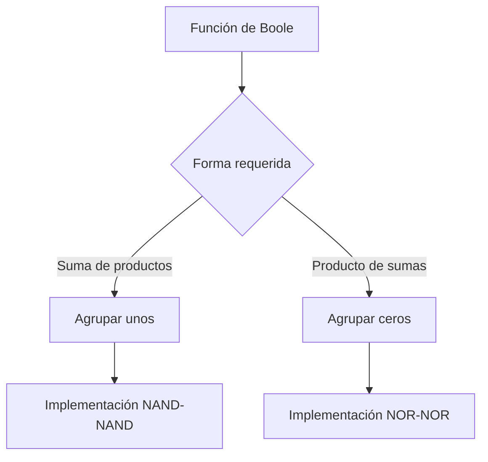
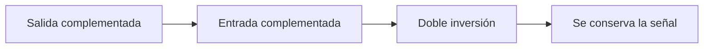

# Métodos de simplificación

## 1. Formas de simplificación

Una función de Boole puede poseer varias expresiones algebraicas equivalentes. La simplificación busca una expresión con menos literales y, por tanto, una ejecución lógica más económica.

Los métodos desarrollados en este tema permiten obtener principalmente dos formas normalizadas:

- **Suma de productos:** productos unidos mediante OR.
- **Producto de sumas:** sumas unidas mediante AND.

El método del mapa resulta práctico para una cantidad pequeña de variables. El método del tabulado proporciona un procedimiento sistemático cuando la inspección visual deja de ser conveniente.

## 2. Simplificación de un producto de sumas

Al agrupar los unos de un mapa se obtiene directamente una **suma de productos**. Para obtener un **producto de sumas**, Mano modifica el procedimiento:

1. Se identifican los cuadrados que contienen $0$.
2. Se agrupan los ceros adyacentes en potencias de dos.
3. Los grupos producen una suma de productos simplificada para $F'$.
4. Se complementa $F'$ mediante los teoremas de De Morgan.
5. El resultado queda expresado como producto de sumas para $F$.

Los ceros de $F$ son los unos de $F'$. Por ello pueden agruparse siguiendo las mismas reglas estudiadas para los minterms.

### 2.1 Regla directa para los grupos de ceros

Al traducir un grupo de ceros a un término suma de $F$:

- Una variable constante en $0$ aparece sin complementar.
- Una variable constante en $1$ aparece complementada.
- Una variable que cambia se elimina.

> [!note]
> Un término suma debe valer $0$ para los cuadrados agrupados. Si $A=0$, el literal $A$ ya vale $0$; si $A=1$, el literal que vale $0$ es $A'$.

### 2.2 Comparación de las reglas

| Agrupación | Forma obtenida                    | Constante en $0$       | Constante en $1$       |
| ---------- | --------------------------------- | ---------------------- | ---------------------- |
| Unos       | Producto de una suma de productos | Variable complementada | Variable normal        |
| Ceros      | Suma de un producto de sumas      | Variable normal        | Variable complementada |

> **Ejemplo**
>
> El ejemplo 3-8 del libro simplifica:
>
> $$
> F(A,B,C,D)=\sum(0,1,2,5,8,9,10)
> $$
>
> Al combinar los unos se obtiene la suma de productos:
>
> $$
> F=B'D'+B'C'+A'C'D
> $$
>
> Al combinar los ceros se obtiene primero:
>
> $$
> F'=AB+CD+BD'
> $$
>
> Al complementar mediante De Morgan:
>
> $$
> \begin{aligned}
> F
> &=(AB+CD+BD')'\\
> &=(A'+B')(C'+D')(B'+D)
> \end{aligned}
> $$
>
> Por tanto, la misma función posee las dos formas simplificadas:
>
> $$
> \boxed{F=B'D'+B'C'+A'C'D}
> $$
>
> $$
> \boxed{F=(A'+B')(C'+D')(B'+D)}
> $$

## 3. Ejecución de dos niveles

Una función en forma normalizada puede realizarse mediante dos niveles de compuertas.

### 3.1 Suma de productos

En una suma de productos:

1. El primer nivel contiene una compuerta AND para cada término producto.
2. El segundo nivel contiene una compuerta OR que suma las salidas anteriores.

Para:

$$
F=AB+CD+E
$$

la estructura es AND-OR.

### 3.2 Producto de sumas

En un producto de sumas:

1. El primer nivel contiene una compuerta OR para cada término suma.
2. El segundo nivel contiene una compuerta AND que multiplica las salidas anteriores.

Para:

$$
F=(A+B)(C+D)E
$$

la estructura es OR-AND.

> [!note]
> Un término de un solo literal puede conectarse directamente al segundo nivel. La forma sigue considerándose una ejecución de dos niveles.

### 3.3 Relación entre unos, ceros y formas canónicas

Los unos de una función representan sus minterms y los ceros representan sus maxterms. Por ejemplo:

$$
F(x,y,z)=\sum(1,3,4,6)
$$

también puede escribirse como:

$$
F(x,y,z)=\prod(0,2,5,7)
$$

La selección entre ambas formas depende de la implementación deseada y de cuál produzca una expresión más sencilla.

## 4. Compuertas NAND y NOR

Las compuertas NAND y NOR se emplean ampliamente en circuitos digitales. Ambas permiten realizar cualquier función de Boole y reciben el nombre de **compuertas universales**.

### 4.1 Símbolos equivalentes

Por De Morgan, una NAND puede interpretarse de dos maneras equivalentes:

$$
(xy)'=x'+y'
$$

- AND con un círculo en la salida.
- OR con círculos en las entradas.

De manera dual, una NOR puede representarse como:

$$
(x+y)'=x'y'
$$

- OR con un círculo en la salida.
- AND con círculos en las entradas.

### 4.2 Transferencia de círculos

Cuando el círculo de salida de una compuerta se conecta con un círculo de entrada de la siguiente, ambas inversiones se cancelan.

> [!tip]
> La técnica de trasladar círculos permite reconocer implementaciones NAND-NAND y NOR-NOR sin alterar la función lógica.

## 5. Ejecución con NAND

Una ejecución de dos niveles con NAND requiere que la función se encuentre en **suma de productos**.

Para:

$$
F=AB+CD+E
$$

se introduce una doble complementación:

$$
F=[(AB)'(CD)'E']'
$$

Las NAND del primer nivel producen los complementos de los términos producto. La NAND del segundo nivel aplica otra complementación y, por De Morgan, realiza la suma.

### 5.1 Procedimiento NAND-NAND

1. Simplifique la función en suma de productos.
2. Dibuje una NAND por cada término que posea dos o más literales.
3. Conecte esas salidas a una NAND de segundo nivel.
4. Si existe un término de un literal, compleméntelo antes de conectarlo al segundo nivel.
5. Considere inversores adicionales si no están disponibles las entradas complementadas.

> **Ejemplo**
>
> El ejemplo 3-9 del libro solicita ejecutar con NAND:
>
> $$
> F(x,y,z)=\sum(0,6)
> $$
>
> Los dos unos no pueden combinarse. La suma de productos es:
>
> $$
> F=x'y'z'+xyz'
> $$
>
> Esta expresión se realiza directamente con dos niveles NAND.
>
> Al combinar los ceros se obtiene también:
>
> $$
> F'=x'y+xy'+z
> $$
>
> $F'$ puede realizarse con dos niveles NAND. Si se necesita la salida normal $F$, debe agregarse un inversor y la realización pasa a tres niveles.

## 6. Ejecución con NOR

NOR es el dual de NAND. Una ejecución NOR-NOR de dos niveles requiere que la función esté expresada en **producto de sumas**.

Para:

$$
F=(A+B)(C+D)E
$$

se introduce una doble complementación:

$$
F=[(A+B)'+(C+D)'+E']'
$$

Las NOR del primer nivel complementan los términos suma y la NOR final realiza su producto.

### 6.1 Procedimiento NOR-NOR

1. Simplifique la función en producto de sumas.
2. Dibuje una NOR por cada término suma de dos o más literales.
3. Conecte esas salidas a una NOR de segundo nivel.
4. Si existe un término de un literal, compleméntelo antes de conectarlo al segundo nivel.
5. Considere inversores de entrada si los complementos no están disponibles.

> **Ejemplo**
>
> El ejemplo 3-10 utiliza la misma función del ejemplo anterior. Como:
>
> $$
> F'=x'y+xy'+z
> $$
>
> su complemento es:
>
> $$
> F=(x+y')(x'+y)z'
> $$
>
> Esta forma permite realizar $F$ con dos niveles NOR.
>
> También puede partirse de:
>
> $$
> F=x'y'z'+xyz'
> $$
>
> cuyo complemento es:
>
> $$
> F'=(x+y+z)(x'+y'+z)
> $$
>
> En este segundo caso se obtiene $F'$ con dos niveles NOR y se necesita un tercer nivel para recuperar $F$.

### 6.2 Resumen de NAND y NOR

| Función simplificada | Forma utilizada   | Derivación                          | Ejecución              | Niveles para obtener $F$ |
| -------------------- | ----------------- | ----------------------------------- | ---------------------- | :----------------------: |
| $F$                  | Suma de productos | Agrupar unos                        | NAND-NAND              |            2             |
| $F'$                 | Suma de productos | Agrupar ceros                       | NAND-NAND más inversor |            3             |
| $F$                  | Producto de sumas | Complementar la agrupación de ceros | NOR-NOR                |            2             |
| $F'$                 | Producto de sumas | Complementar la agrupación de unos  | NOR-NOR más inversor   |            3             |

> [!warning]
> Una suma de productos se adapta directamente a NAND-NAND; un producto de sumas se adapta directamente a NOR-NOR. Intercambiar estas formas produce una función diferente.

## 7. Otras ejecuciones con dos niveles

Si se consideran AND, OR, NAND y NOR para el primer y el segundo nivel, existen 16 combinaciones posibles. Ocho son **formas degeneradas** y ocho son **formas no degeneradas**.

### 7.1 Formas degeneradas

Una forma es degenerada cuando los dos niveles se reducen a una sola operación lógica. Por ejemplo, una AND seguida por otra AND equivale a una AND de más entradas debido a la ley asociativa.

Estas formas pueden utilizarse físicamente para aumentar la capacidad de conexión o *fan-out*, aunque no producen una nueva forma algebraica.

### 7.2 Formas no degeneradas

Las ocho formas no degeneradas son:

| Forma    | Forma dual o equivalente |
| -------- | ------------------------ |
| AND-OR   | NAND-NAND                |
| OR-NAND  | NOR-OR                   |
| OR-AND   | NOR-NOR                  |
| NAND-AND | AND-NOR                  |

El primer nombre identifica las compuertas del primer nivel y el segundo nombre identifica la compuerta del segundo nivel.

### 7.3 Formas invertidas

Las formas AND-NOR y NAND-AND ejecutan el complemento de una suma de productos:

$$
F=(AB+CD+E)'
$$

Las formas OR-NAND y NOR-OR ejecutan el complemento de un producto de sumas:

$$
F=[(A+B)(C+D)E]'
$$

> **Ejemplo**
>
> El ejemplo 3-11 vuelve a utilizar la función de los ejemplos 3-9 y 3-10.
>
> Como:
>
> $$
> F'=x'y+xy'+z
> $$
>
> entonces:
>
> $$
> F=(x'y+xy'+z)'
> $$
>
> Esta expresión se ejecuta mediante AND-NOR o NAND-AND.
>
> Por otra parte:
>
> $$
> F=x'y'z'+xyz'
> $$
>
> produce:
>
> $$
> F'=(x+y+z)(x'+y'+z)
> $$
>
> y, por tanto:
>
> $$
> F=[(x+y+z)(x'+y'+z)]'
> $$
>
> Esta segunda expresión se ejecuta mediante OR-NAND o NOR-OR.

## 8. Condiciones de no importa

En ciertos sistemas algunas combinaciones de entrada no ocurren durante el funcionamiento normal. Como la salida para esas combinaciones no está especificada, puede elegirse como $0$ o $1$ según convenga para simplificar.

Estas combinaciones reciben el nombre de **condiciones de no importa** y se representan mediante:

$$
X
$$

En un mapa, una condición de no importa:

- Puede incluirse en un grupo de unos.
- Puede incluirse en un grupo de ceros.
- Puede quedar sin utilizar.
- Se elige de forma independiente según la expresión buscada.

> [!warning]
> Una condición de no importa no debe marcarse inicialmente como $0$ o $1$. Su valor solamente se decide cuando permite obtener una agrupación más sencilla.

> **Ejemplo**
>
> El ejemplo 3-12 del libro simplifica:
>
> $$
> F(w,x,y,z)=\sum(1,3,7,11,15)
> $$
>
> con las condiciones:
>
> $$
> d(w,x,y,z)=\sum(0,2,5)
> $$
>
> Al combinar los unos con las `X` convenientes:
>
> $$
> \boxed{F=w'z+yz}
> $$
>
> Al combinar los ceros con otras `X` se obtiene:
>
> $$
> F'=z'+wy'
> $$
>
> y, al complementar:
>
> $$
> \boxed{F=z(w'+y)}
> $$
>
> Mano muestra otra suma de productos mínima posible:
>
> $$
> \boxed{F=w'x'+yz}
> $$
>
> Las expresiones coinciden en todas las combinaciones especificadas, aunque pueden asignar valores diferentes a las condiciones de no importa.

### 8.1 Soluciones mínimas no únicas

Una función puede poseer más de una expresión con el mismo número mínimo de literales. Cuando existen condiciones de no importa, dos soluciones válidas no necesitan representar la misma salida para las combinaciones no especificadas.

## 9. El método del tabulado

El mapa resulta conveniente mientras el número de variables no excede aproximadamente cinco o seis. Al aumentar las variables:

- Crece el número de cuadrados.
- Los grupos se vuelven difíciles de reconocer.
- La selección depende de la habilidad visual.
- Resulta difícil asegurar que se encontró una expresión mínima.

El **método del tabulado**, formulado por Quine y posteriormente mejorado por McCluskey, sustituye la inspección visual por un procedimiento sistemático.

### 9.1 Etapas del método

El método posee dos partes:

1. Determinar todos los candidatos llamados **primeros implicados**.
2. Seleccionar entre ellos un conjunto que cubra la función con el menor número de literales.

> [!note]
> Los primeros implicados también se conocen como *implicados primos*. Se conserva aquí la terminología utilizada por esta edición del libro.

## 10. Determinación de los primeros implicados

El punto de partida es la lista de minterms de la función. Dos términos pueden aparearse cuando difieren en una sola variable. Esa variable se elimina y se obtiene un término con un literal menos.

El apareamiento se repite hasta que ningún término pueda seguir combinándose. Los términos que no se utilizaron para formar otro término son los **primeros implicados**.

### 10.1 Notación binaria

En una representación como:

$$
0\text{-}10
$$

- `0` representa una variable complementada.
- `1` representa una variable sin complementar.
- `-` representa una variable eliminada.

Si el orden es $w,x,y,z$:

$$
0\text{-}10=w'yz'
$$

El guion indica que $x$ puede valer $0$ o $1$.

### 10.2 Reglas de apareamiento

1. Ordene los minterms según su número de unos.
2. Compare solamente grupos consecutivos.
3. Aparee términos que difieran en exactamente un bit.
4. Sustituya el bit diferente por un guion.
5. Marque los términos que participaron en un apareamiento.
6. En ciclos posteriores, compare solamente términos con guiones en las mismas posiciones.
7. Repita hasta que no puedan efectuarse nuevas combinaciones.
8. Los términos no marcados son los primeros implicados.

## 11. Procedimiento binario

> **Ejemplo**
>
> El ejemplo 3-13 del libro simplifica mediante tabulación:
>
> $$
> F=\sum(0,1,2,8,10,11,14,15)
> $$
>
> **Paso 1: agrupación por número de unos**
>
>|Número de unos|Minterms|
>|:---:|---|
>|0|$0=0000$|
>|1|$1=0001$, $2=0010$, $8=1000$|
>|2|$10=1010$|
>|3|$11=1011$, $14=1110$|
>|4|$15=1111$|
>
> **Paso 2: primer ciclo de apareamiento**
>
> Algunos pares son:
>
> $$
> 0000+0001\longrightarrow000\text{-}
> $$
>
> $$
> 0000+0010\longrightarrow00\text{-}0
> $$
>
> $$
> 0000+1000\longrightarrow\text{-}000
> $$
>
> El primer apareamiento representa:
>
> $$
> w'x'y'z'+w'x'y'z=w'x'y'
> $$
>
> **Paso 3: ciclos posteriores**
>
> Al comparar los términos nuevos se obtienen, entre otros:
>
> $$
> \text{-}0\text{-}0
> $$
>
> $$
> 1\text{-}1\text{-}
> $$
>
> **Paso 4: primeros implicados**
>
> Los términos que no se combinaron nuevamente son:
>
>|Binario|Término|
>|---|---|
>|`000-`|$w'x'y'$|
>|`-0-0`|$x'z'$|
>|`1-1-`|$wy$|
>
> En este ejemplo, la suma de los tres primeros implicados ya es mínima:
>
> $$
> \boxed{F=w'x'y'+x'z'+wy}
> $$

## 12. Notación decimal en la tabulación

Para reducir el trabajo, Mano propone comparar los equivalentes decimales:

- Dos minterms pueden aparearse si su diferencia es una potencia de dos.
- La potencia señala la posición del bit eliminado.
- En ciclos posteriores deben coincidir también las posiciones ya eliminadas.

Por ejemplo:

$$
0,1\ (1)
$$

representa `000-`, porque los términos difieren en la posición de peso $1$.

Asimismo:

$$
0,2,8,10\ (2,8)
$$

representa:

$$
\text{-}0\text{-}0
$$

Los indicadores $2$ y $8$ identifican las posiciones eliminadas.

> [!warning]
> En ciclos posteriores no basta con que la diferencia sea una potencia de dos. Los términos deben representar conjuntos compatibles y poseer guiones en las mismas posiciones.

## 13. Primeros implicados y expresión mínima

La suma de todos los primeros implicados representa la función, pero no necesariamente es mínima. Puede contener términos que resultan innecesarios para cubrir los minterms.

> **Ejemplo**
>
> El ejemplo 3-14 considera:
>
> $$
> F(w,x,y,z)=\sum(1,4,6,7,8,9,10,11,15)
> $$
>
> La tabulación produce seis primeros implicados:
>
>|Minterms cubiertos|Binario|Primer implicado|
>|---|---|---|
>|$1,9$|`-001`|$x'y'z$|
>|$4,6$|`01-0`|$w'xz'$|
>|$6,7$|`011-`|$w'xy$|
>|$7,15$|`-111`|$xyz$|
>|$11,15$|`1-11`|$wyz$|
>|$8,9,10,11$|`10--`|$wx'$|
>
> La suma de los seis es válida, pero el mapa permite reconocer que solo cuatro son necesarios:
>
> $$
> \boxed{F=x'y'z+w'xz'+xyz+wx'}
> $$
>
> Por tanto, el método necesita una segunda etapa para seleccionar los primeros implicados indispensables.

## 14. Tabla de primeros implicados

La selección final se realiza mediante una tabla de cobertura:

- Cada fila representa un primer implicado.
- Cada columna representa un minterm de la función.
- Una `X` indica que el primer implicado cubre ese minterm.

> **Ejemplo**
>
> El ejemplo 3-15 construye la tabla para la función del ejemplo anterior:
>
>|Primer implicado|1|4|6|7|8|9|10|11|15|
>|---|:---:|:---:|:---:|:---:|:---:|:---:|:---:|:---:|:---:|
>|$x'y'z$|X|||||X||||
>|$w'xz'$||X|X|||||||
>|$w'xy$|||X|X||||||
>|$xyz$||||X|||||X|
>|$wyz$||||||||X|X|
>|$wx'$|||||X|X|X|X||
>
> El minterm $1$ obliga a seleccionar $x'y'z$; el minterm $4$ obliga a seleccionar $w'xz'$; y los minterms $8$ y $10$ obligan a seleccionar $wx'$.
>
> Estos tres términos cubren:
>
> $$
> 1,4,6,8,9,10,11
> $$
>
> Quedan sin cubrir $7$ y $15$. El término $xyz$ cubre ambos. La solución mínima es:
>
> $$
> \boxed{F=x'y'z+w'xz'+wx'+xyz}
> $$

### 14.1 Primer implicado esencial

Un **primer implicado esencial** cubre al menos un minterm que ningún otro primer implicado puede cubrir.

En la tabla se reconoce porque existe una columna con una sola `X`. La fila que contiene esa marca debe incluirse obligatoriamente en la solución.

### 14.2 Selección final

El procedimiento de selección es:

1. Identificar todas las columnas con una sola `X`.
2. Seleccionar sus primeros implicados esenciales.
3. Eliminar las columnas ya cubiertas.
4. Escoger el menor conjunto adicional de filas que cubra las columnas restantes.
5. Traducir las filas seleccionadas a términos algebraicos.

## 15. Adaptaciones del método del tabulado

### 15.1 Producto de sumas

Para obtener un producto de sumas mediante tabulación:

1. Considere los ceros de $F$ como minterms de $F'$.
2. Simplifique $F'$ en suma de productos.
3. Complemente la expresión obtenida.
4. Aplique De Morgan para obtener el producto de sumas de $F$.

### 15.2 Condiciones de no importa

Cuando existen condiciones de no importa:

- Se incluyen junto con los minterms durante la determinación de primeros implicados.
- No se incluyen como columnas obligatorias en la tabla de cobertura.

Las condiciones `X` pueden ayudar a crear términos mayores, pero no necesitan quedar cubiertas en la solución final.

## 16. Comparación de métodos

| Aspecto                        | Método del mapa                       | Método del tabulado                          |
| ------------------------------ | ------------------------------------- | -------------------------------------------- |
| Naturaleza                     | Gráfica                               | Sistemática y tabular                        |
| Cantidad práctica de variables | Hasta cinco o seis aproximadamente    | Puede manejar más variables                  |
| Búsqueda                       | Reconocimiento visual                 | Apareamiento exhaustivo                      |
| Uso manual                     | Rápido para funciones pequeñas        | Tedioso y propenso a errores rutinarios      |
| Mecanización                   | Poco conveniente                      | Adecuado para computador                     |
| Resultado                      | Depende de reconocer todos los grupos | Garantiza la búsqueda de primeros implicados |

Ambos métodos, tal como se presentan en el libro, simplifican funciones expresadas en formas normalizadas.

### 16.1 Variaciones de los mapas

La distribución gráfica de un mapa puede variar. Es posible intercambiar filas, columnas u orientación siempre que:

- Cada cuadrado conserve el minterm asignado.
- Dos cuadrados adyacentes difieran en un solo bit.

La secuencia Gray concreta puede representarse de varias maneras sin cambiar el procedimiento de simplificación.

## 17. Procedimiento integrado

1. Determine si necesita suma de productos o producto de sumas.
2. Para suma de productos, agrupe unos; para producto de sumas, agrupe ceros.
3. Utilice las condiciones `X` solamente cuando permitan grupos mayores.
4. Si la implementación es NAND-NAND, obtenga una suma de productos.
5. Si la implementación es NOR-NOR, obtenga un producto de sumas.
6. Cuando el mapa resulte poco práctico, liste los minterms para tabulación.
7. Agrúpelos según su número de unos.
8. Aparee términos de secciones consecutivas que difieran en un bit.
9. Repita el proceso conservando las posiciones de los guiones.
10. Reúna los términos no combinados como primeros implicados.
11. Construya la tabla de cobertura.
12. Seleccione primero los primeros implicados esenciales.
13. Cubra los minterms restantes con el menor conjunto adicional.
14. Verifique que todos los minterms requeridos estén cubiertos.

### Errores frecuentes

| Error                                                            | Corrección                                                     |
| ---------------------------------------------------------------- | -------------------------------------------------------------- |
| Agrupar unos para obtener directamente un producto de sumas      | Agrupar los ceros y complementar el resultado.                 |
| Aplicar a los ceros la misma regla de literales que a los unos   | Invertir la convención de las variables constantes.            |
| Usar producto de sumas directamente con NAND-NAND                | NAND-NAND requiere suma de productos.                          |
| Usar suma de productos directamente con NOR-NOR                  | NOR-NOR requiere producto de sumas.                            |
| Obligar a utilizar todas las `X`                                 | Usarlas únicamente cuando mejoren la simplificación.           |
| Aparear términos que difieren en más de un bit                   | Cada apareamiento elimina exactamente una variable.            |
| Comparar términos con guiones incompatibles                      | Los guiones deben ocupar las mismas posiciones.                |
| Confundir todos los primeros implicados con la solución mínima   | Seleccionar un conjunto mínimo mediante la tabla de cobertura. |
| Omitir un primer implicado esencial                              | Toda columna con una sola `X` obliga a seleccionar su fila.    |
| Incluir las condiciones de no importa como columnas obligatorias | Solo los minterms verdaderos necesitan ser cubiertos.          |

# Verificación del aprendizaje

**Problema 1:** obtenga las expresiones simplificadas en producto de sumas del problema 3-6 del libro:

1. $F(x,y,z)=\prod(0,1,4,5)$
2. $F(A,B,C,D)=\prod(0,1,2,3,4,10,11)$
3. $F(w,x,y,z)=\prod(1,3,5,7,13,15)$

**Problema 2:** simplifique en suma de productos las funciones del problema 3-15 utilizando las condiciones de no importa indicadas:

1. $F=y'+x'z'$ con $d=yz+xy$.
2. $F=B'C'D'+BCD'+ABCD'$ con $d=B'CD'+A'BC'D$.

**Problema 3:** simplifique mediante el método del tabulado los incisos (a) y (b) del problema 3-24:

1. $F(A,B,C,D,E,F,G)=\sum(20,28,52,60)$
2. $F(A,B,C,D,E,F,G)=\sum(20,28,38,39,52,60,102,103,127)$

> **Soluciones**
>
> **Problema 1**
>
> 1. Los cuatro ceros forman un grupo en el que $y=0$. Por tanto:
>
> $$
> \boxed{F=y}
> $$
>
> 2. Los ceros, considerados como unos de $F'$, producen:
>
> $$
> F'=A'B'+A'C'D'+B'C
> $$
>
> Al complementar:
>
> $$
> \boxed{F=(A+B)(A+C+D)(B+C')}
> $$
>
> 3. Para el complemento se obtiene:
>
> $$
> F'=w'z+xz
> $$
>
> Por De Morgan:
>
> $$
> \boxed{F=(w+z')(x'+z')}
> $$
>
> **Problema 2**
>
> 1. Los minterms de $F$ son $0,1,2,4,5$ y las condiciones de no importa son $3,6,7$. Al utilizar las tres `X`, las ocho combinaciones forman un solo grupo:
>
> $$
> \boxed{F=1}
> $$
>
> 2. Los minterms de $F$ son $0,6,8,14$ y las condiciones de no importa son $2,5,10$. Los grupos máximos producen:
>
> $$
> \boxed{F=B'D'+CD'}
> $$
>
> **Problema 3**
>
> 1. Las representaciones binarias son:
>
>|Minterm|Binario|
>|:---:|:---:|
>|20|`0010100`|
>|28|`0011100`|
>|52|`0110100`|
>|60|`0111100`|
>
> Los cuatro términos se combinan hasta obtener el patrón `0-1-100`. Las variables $B$ y $D$ se eliminan:
>
> $$
> \boxed{F=A'CEF'G'}
> $$
>
> 2. Los primeros implicados necesarios poseen los patrones:
>
>|Patrón|Minterms cubiertos|Término|
>|---|---|---|
>|`0-1-100`|$20,28,52,60$|$A'CEF'G'$|
>|`-10011-`|$38,39,102,103$|$BC'D'EF$|
>|`1111111`|$127$|$ABCDEFG$|
>
> Cada conjunto contiene al menos un minterm que no cubre otro primer implicado. Por tanto:
>
> $$
> \boxed{F=A'CEF'G'+BC'D'EF+ABCDEFG}
> $$

  <a href="./Tema%205.md">⬅️ Tema anterior</a> | <a href="./Tema%207.md">Siguiente tema ➡️</a>

