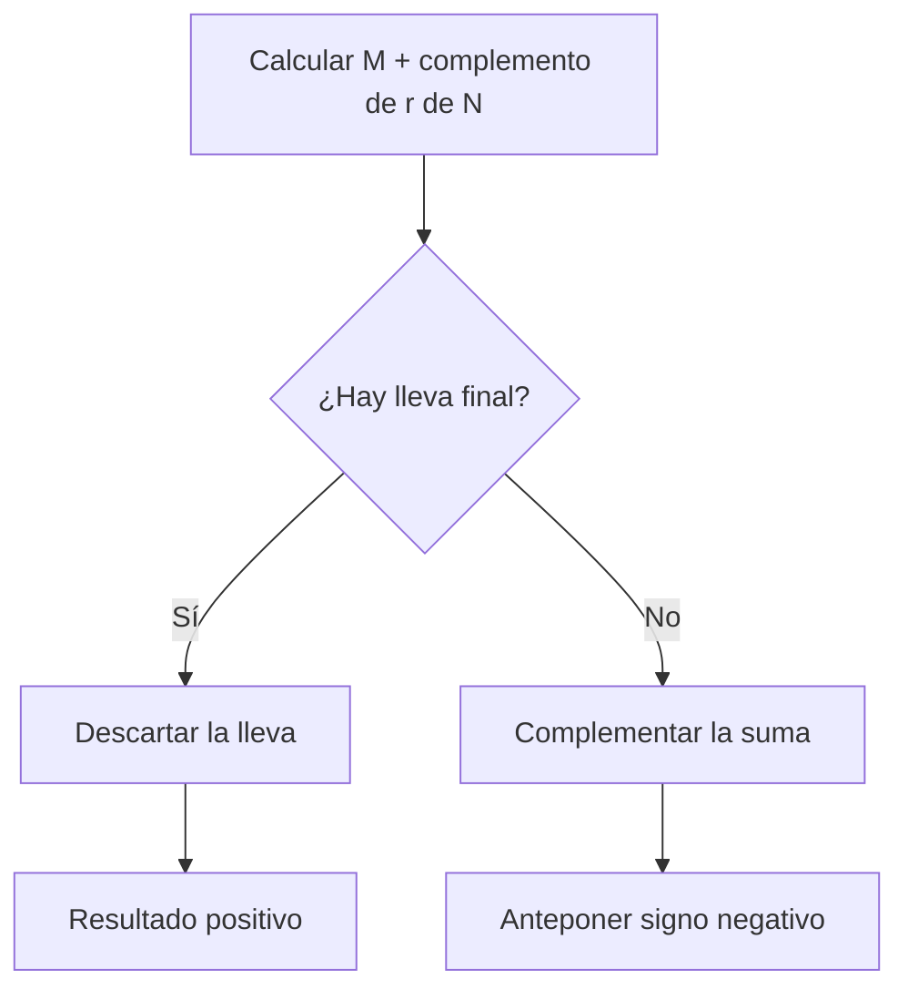

# Códigos binarios y complementos en base $r$ y $r-1$

# Parte I. Complementos

## 1. Concepto de complemento

Los **complementos** permiten convertir una operación de sustracción en una suma. En los computadores digitales se utilizan para simplificar la aritmética y determinadas manipulaciones lógicas.

Para cada sistema de base $r$ existen dos complementos:

1. Complemento de $r$.
2. Complemento de $(r-1)$.

|Base|Complemento de $r$|Complemento de $(r-1)$|
|:---:|---|---|
|10|Complemento de 10|Complemento de 9|
|2|Complemento de 2|Complemento de 1|

> [!note]
> El valor de un complemento depende de la cantidad de posiciones utilizadas. Por ello, los ceros a la izquierda forman parte de la representación.

## 2. Complemento de $r$

Sea $N$ un número positivo en base $r$ con $n$ dígitos en su parte entera. El complemento de $r$ se define como:

$$
r^n-N
$$

para $N\ne0$. Si $N=0$, el complemento se define como $0$.

### 2.1 Ejemplos decimales

Para un número decimal de cinco dígitos:

$$
(52520)_{10}
$$

el complemento de 10 es:

$$
10^5-52520=100000-52520=47480
$$

Para un número sin parte entera distinta de cero:

$$
(0.3267)_{10}
$$

se utiliza $10^0=1$:

$$
1-0.3267=0.6733
$$

Para:

$$
(25.639)_{10}
$$

el complemento de 10 es:

$$
10^2-25.639=100-25.639=74.361
$$

### 2.2 Ejemplos binarios

Para el número binario de seis bits:

$$
(101100)_2
$$

el complemento de 2 es:

$$
2^6-(101100)_2=(1000000)_2-(101100)_2=(010100)_2
$$

Para una fracción binaria:

$$
(0.0110)_2
$$

se obtiene:

$$
(1.0000)_2-(0.0110)_2=(0.1010)_2
$$

### 2.3 Procedimiento directo

El complemento de $r$ puede obtenerse a partir del complemento de $(r-1)$ y sumando una unidad en la posición menos significativa.

En decimal, el complemento de 10 puede calcularse:

1. Dejando sin cambio los ceros menos significativos.
2. Dejando sin cambio el primer dígito distinto de cero.
3. Restando de 9 todos los dígitos más significativos restantes.

En binario, el complemento de 2 puede calcularse:

1. Recorriendo el número desde la derecha.
2. Conservando los ceros menos significativos y el primer $1$.
3. Complementando todos los bits situados a su izquierda.

> [!example]- Ejemplo 1
> Para obtener el complemento de 10 de `52520`, se conservan el cero final y el primer dígito distinto de cero, que es `2`. Los dígitos restantes se restan de 9:
>
> $$
> 52520\longrightarrow47480
> $$

> [!example]- Ejemplo 2
> Para obtener el complemento de 2 de `101100`, se conservan los dos ceros finales y el primer `1`; los bits más significativos se invierten:
>
> $$
> 101100\longrightarrow010100
> $$

## 3. Complemento de $(r-1)$

Sea $N$ un número en base $r$ con $n$ dígitos enteros y $m$ dígitos fraccionarios. El complemento de $(r-1)$ se define como:

$$
r^n-r^{-m}-N
$$

En la práctica se obtiene restando cada dígito de $(r-1)$.

### 3.1 Complemento de 9

Cada dígito decimal se resta de $9$.

Para:

$$
(52520)_{10}
$$

se obtiene:

$$
99999-52520=47479
$$

Para:

$$
(0.3267)_{10}
$$

el complemento de 9 es:

$$
0.9999-0.3267=0.6732
$$

Para:

$$
(25.639)_{10}
$$

se obtiene:

$$
99.999-25.639=74.360
$$

### 3.2 Complemento de 1

En binario, restar cada bit de $1$ equivale a intercambiar ceros y unos.

Para:

$$
(101100)_2
$$

el complemento de 1 es:

$$
(010011)_2
$$

Para:

$$
(0.0110)_2
$$

se obtiene:

$$
(0.1001)_2
$$

> [!tip]
> El complemento de 1 se obtiene invirtiendo cada bit. El complemento de 2 se obtiene invirtiendo cada bit y sumando $1$.

## 4. Relación entre ambos complementos

El complemento de $r$ se obtiene sumando una unidad menos significativa al complemento de $(r-1)$:

$$
C_r(N)=C_{r-1}(N)+r^{-m}
$$

Para números enteros:

$$
C_r(N)=C_{r-1}(N)+1
$$

|Sistema|Primer complemento|Segundo complemento|
|---|---|---|
|Decimal|Complemento de 9|Complemento de 10 = complemento de 9 $+1$|
|Binario|Complemento de 1|Complemento de 2 = complemento de 1 $+1$|

Complementar dos veces devuelve el número original, siempre que se conserve el mismo ancho:

$$
C_r(C_r(N))=N
$$

$$
C_{r-1}(C_{r-1}(N))=N
$$

## 5. Sustracción con complemento de $r$

Para calcular:

$$
M-N
$$

mediante el complemento de $r$:

1. Iguale la cantidad de dígitos de $M$ y $N$.
2. Obtenga el complemento de $r$ del sustraendo $N$.
3. Sume ese complemento al minuendo $M$.
4. Inspeccione la lleva final.

Si aparece una lleva final, se descarta y el resultado es positivo. Si no aparece, se obtiene el complemento de $r$ del resultado y se antepone un signo negativo.

> [!example]- Ejemplo
> El ejemplo 1-5 del libro utiliza el complemento de 10 para calcular:
>
> $$
> 72532-03250
> $$
>
> El complemento de 10 de `03250` es `96750`:
>
> $$
> \begin{array}{r}
> 72532\\
> +96750\\ \hline
> 1\ 69282
> \end{array}
> $$
>
> Se descarta la lleva final:
>
> $$
> \boxed{72532-03250=69282}
> $$

> [!example]- Ejemplo
> El ejemplo 1-6 invierte el orden:
>
> $$
> 03250-72532
> $$
>
> El complemento de 10 de `72532` es `27468`:
>
> $$
> \begin{array}{r}
> 03250\\
> +27468\\ \hline
> 30718
> \end{array}
> $$
>
> Como no aparece una lleva, se obtiene el complemento de 10 de `30718`:
>
> $$
> 100000-30718=69282
> $$
>
> y se antepone el signo negativo:
>
> $$
> \boxed{03250-72532=-69282}
> $$

### 5.1 Sustracción binaria con complemento de 2

> [!example]- Ejemplo
> El ejemplo 1-7 aplica el mismo procedimiento en binario.
>
> **Caso 1: $M>N$**
>
> $$
> M=1010100,qquad N=1000100
> $$
>
> El complemento de 2 de $N$ es `0111100`:
>
> $$
> \begin{array}{r}
> 1010100\\
> +0111100\\ \hline
> 1\ 0010000
> \end{array}
> $$
>
> Se descarta la lleva:
>
> $$
> \boxed{M-N=0010000}
> $$
>
> **Caso 2: $M<N$**
>
> $$
> M=1000100,qquad N=1010100
> $$
>
> El complemento de 2 de $N$ es `0101100`:
>
> $$
> \begin{array}{r}
> 1000100\\
> +0101100\\ \hline
> 1110000
> \end{array}
> $$
>
> No hay lleva. El complemento de 2 de `1110000` es `0010000`:
>
> $$
> \boxed{M-N=-0010000}
> $$

## 6. Sustracción con complemento de $(r-1)$

El procedimiento es semejante, pero la lleva final recibe un tratamiento distinto:

1. Sume $M$ al complemento de $(r-1)$ de $N$.
2. Si existe una lleva final, agréguela a la posición menos significativa. Este proceso se denomina **lleva final de reinicio**.
3. Si no existe una lleva, complemente el resultado con $(r-1)$ y anteponga un signo negativo.

> [!warning]
> Con el complemento de $r$, la lleva final se descarta. Con el complemento de $(r-1)$, la lleva final se suma nuevamente al resultado.

### 6.1 Complemento de 9

> [!example]- Ejemplo
> El ejemplo 1-8 repite las sustracciones decimales anteriores.
>
> **Caso 1: resultado positivo**
>
> El complemento de 9 de `03250` es `96749`:
>
> $$
> \begin{array}{r}
> 72532\\
> +96749\\ \hline
> 1\ 69281
> \end{array}
> $$
>
> La lleva se reinicia:
>
> $$
> 69281+1=69282
> $$
>
> **Caso 2: resultado negativo**
>
> El complemento de 9 de `72532` es `27467`:
>
> $$
> \begin{array}{r}
> 03250\\
> +27467\\ \hline
> 30717
> \end{array}
> $$
>
> No aparece una lleva. El complemento de 9 de `30717` es `69282`:
>
> $$
> \boxed{03250-72532=-69282}
> $$

### 6.2 Complemento de 1

> [!example]- Ejemplo
> El ejemplo 1-9 repite la sustracción binaria del ejemplo 1-7.
>
> **Caso 1: resultado positivo**
>
> Para $M=1010100$ y $N=1000100$, el complemento de 1 de $N$ es `0111011`:
>
> $$
> \begin{array}{r}
> 1010100\\
> +0111011\\ \hline
> 1\ 0001111
> \end{array}
> $$
>
> Al reiniciar la lleva:
>
> $$
> 0001111+1=0010000
> $$
>
> **Caso 2: resultado negativo**
>
> Para $M=1000100$ y $N=1010100$, el complemento de 1 de $N$ es `0101011`:
>
> $$
> \begin{array}{r}
> 1000100\\
> +0101011\\ \hline
> 1101111
> \end{array}
> $$
>
> No existe lleva final. Al complementar `1101111` se obtiene `0010000`:
>
> $$
> \boxed{M-N=-0010000}
> $$

## 7. Complemento de 2 y complemento de 1

|Característica|Complemento de 2|Complemento de 1|
|---|---|---|
|Obtención|Invertir bits y sumar $1$|Invertir todos los bits|
|Cero|Una representación|Cero positivo y cero negativo|
|Lleva final|Se descarta|Se reinicia|
|Uso aritmético|Más conveniente|Requiere tratamiento adicional|

En complemento de 1 existen dos representaciones del cero para un ancho fijo:

$$
0000
$$

$$
1111
$$

El complemento de 2 solamente posee el cero `0000`. Esta es una de las razones por las que resulta más conveniente para operaciones aritméticas.

# Parte II. Códigos binarios

## 8. Número binario y código binario

Los sistemas digitales utilizan señales con dos estados. Una combinación de bits puede representar una cantidad o cualquier otro elemento de información.

Un **número binario** utiliza sus bits con cargas posicionales para representar una cantidad. Un **código binario** asigna combinaciones de bits a un conjunto de símbolos según una convención.

> [!note]
> Una palabra como `1001` no posee un significado único. Puede representar el número binario $9$, un dígito codificado, una letra o un estado, según el código empleado.

## 9. Cantidad de combinaciones

Con $n$ bits pueden formarse:

$$
2^n
$$

combinaciones diferentes.

Para representar $N$ elementos distintos debe elegirse el menor $n$ que satisfaga:

$$
2^n\ge N
$$

|Elementos|Bits mínimos|Combinaciones disponibles|
|:---:|:---:|:---:|
|4|2|4|
|8|3|8|
|10|4|16|
|20|5|32|
|52|6|64|

Cuando sobran combinaciones, algunas palabras del código quedan sin asignar.

## 10. Códigos decimales de cuatro bits

Los diez dígitos decimales necesitan al menos cuatro bits porque:

$$
2^3=8<10\le16=2^4
$$

Es posible construir diferentes códigos de cuatro bits. La tabla 1-2 del libro presenta los siguientes:

|Dígito|BDC 8421|Exceso a 3|$8,4,-2,-1$|2421|
|:---:|:---:|:---:|:---:|:---:|
|0|0000|0011|0000|0000|
|1|0001|0100|0111|0001|
|2|0010|0101|0110|0010|
|3|0011|0110|0101|0011|
|4|0100|0111|0100|0100|
|5|0101|1000|1011|1011|
|6|0110|1001|1010|1100|
|7|0111|1010|1001|1101|
|8|1000|1011|1000|1110|
|9|1001|1100|1111|1111|

## 11. BDC o binario decimal codificado

El código **BDC 8421** asigna a cada dígito decimal su equivalente binario de cuatro bits. Las cargas de sus posiciones son:

$$
8, 4, 2, 1
$$

Por ejemplo:

$$
0110=0(8)+1(4)+1(2)+0(1)=6
$$

Las combinaciones desde `1010` hasta `1111` no representan dígitos decimales en BDC.

### 11.1 Codificación por dígitos

Cada dígito decimal se codifica por separado.

> [!example]- Ejemplo
> El decimal $395$ se representa en BDC como:
>
> $$
> 3\longrightarrow0011
> $$
>
> $$
> 9\longrightarrow1001
> $$
>
> $$
> 5\longrightarrow0101
> $$
>
> Por tanto:
>
> $$
> \boxed{(395)_{10}=0011\ 1001\ 0101\text{ en BDC}}
> $$

### 11.2 BDC frente a binario puro

La conversión a binario y la codificación en BDC son procesos diferentes:

$$
(395)_{10}=(110001011)_2
$$

Mientras el binario puro necesita nueve bits, BDC emplea doce:

$$
0011\ 1001\ 0101
$$

BDC utiliza más bits, pero conserva directamente los dígitos decimales.

> [!warning]
> No debe interpretarse una palabra BDC completa como si fuera un número binario posicional. Cada grupo de cuatro bits representa un dígito decimal independiente.

## 12. Códigos con carga

En un **código con carga**, cada posición posee un peso. El valor representado se obtiene sumando las cargas correspondientes a los bits iguales a $1$.

### 12.1 Código $8,4,-2,-1$

La palabra `1010` representa:

$$
1(8)+0(4)+1(-2)+0(-1)=6
$$

Las cargas negativas permiten construir códigos con propiedades diferentes de BDC.

### 12.2 Código 2421

Las cargas son:

$$
2, 4, 2, 1
$$

La palabra `1100` representa:

$$
1(2)+1(4)+0(2)+0(1)=6
$$

### 12.3 Código de exceso a 3

El código de **exceso a 3** se obtiene sumando $3$ a cada dígito decimal y escribiendo el resultado con cuatro bits.

Para el dígito $6$:

$$
6+3=9
$$

$$
9=(1001)_2
$$

Por tanto, el código de exceso a 3 para $6$ es `1001`.

El código de exceso a 3 no posee cargas posicionales fijas y se considera un código sin carga.

## 13. Códigos autocomplementarios

Un código decimal es **autocomplementario** cuando el complemento de 9 de un dígito se obtiene intercambiando unos por ceros y ceros por unos en su palabra.

Los siguientes códigos de la tabla 1-2 poseen esta propiedad:

- Exceso a 3.
- $8,4,-2,-1$.
- 2421.

Por ejemplo, en exceso a 3:

$$
2\longrightarrow0101
$$

Al invertir los bits:

$$
0101\longrightarrow1010
$$

La palabra `1010` representa $7$, que es el complemento de 9 de $2$:

$$
9-2=7
$$

BDC 8421 no es autocomplementario.

## 14. Código biquinario

El código **biquinario** de la tabla 1-2 utiliza siete bits divididos en dos grupos:

- Dos bits identifican uno de dos grupos.
- Cinco bits seleccionan una posición dentro del grupo.

Cada palabra válida contiene exactamente dos unos: uno entre los primeros dos bits y otro entre los últimos cinco.

Esta estructura proporciona una propiedad de detección de errores, ya que una palabra con una cantidad distinta de unos no pertenece al código.

## 15. Códigos para detección de errores

Durante la transmisión o el almacenamiento, uno o más bits pueden cambiar accidentalmente. Un código de detección de errores incorpora información redundante para reconocer determinadas alteraciones.

Detectar un error no implica necesariamente corregirlo. El receptor puede solicitar que el mensaje sea transmitido nuevamente.

## 16. Bit de paridad

Un **bit de paridad** es un bit adicional incluido en un mensaje para controlar la cantidad total de unos.

### 16.1 Paridad par

El bit se elige para que la cantidad total de unos sea par.

> [!example]- Ejemplo 1
> El mensaje `1011` contiene tres unos. Para obtener paridad par debe agregarse un bit igual a $1$:
>
> $$
> 1\ 1011
> $$
>
> La palabra resultante contiene cuatro unos.

### 16.2 Paridad impar

El bit se elige para que la cantidad total de unos sea impar.

> [!example]- Ejemplo 2
> El mensaje `1011` ya contiene tres unos. Su bit de paridad impar es $0$:
>
> $$
> 0\ 1011
> $$

### 16.3 Detección

En el extremo de recepción se comprueba nuevamente la paridad. El método detecta:

- Un bit alterado.
- Tres bits alterados.
- Cualquier cantidad impar de errores.

No detecta necesariamente una cantidad par de errores, porque la paridad total puede conservarse.

> [!note]
> El bit de paridad permite detectar ciertas alteraciones, pero no identifica cuál bit cambió ni corrige por sí mismo el mensaje.

## 17. Código reflejado o código Gray

El **código reflejado**, conocido también como **código Gray**, posee la propiedad de que dos palabras consecutivas difieren en un solo bit.

La tabla 1-4 presenta el código Gray de cuatro bits:

|Decimal|Código Gray|Decimal|Código Gray|
|:---:|:---:|:---:|:---:|
|0|0000|8|1100|
|1|0001|9|1101|
|2|0011|10|1111|
|3|0010|11|1110|
|4|0110|12|1010|
|5|0111|13|1011|
|6|0101|14|1001|
|7|0100|15|1000|

### 17.1 Utilidad

En sistemas que representan una posición física, varios bits de un número binario ordinario pueden cambiar simultáneamente entre dos valores consecutivos. Si los cambios no ocurren exactamente al mismo tiempo, puede leerse temporalmente un valor incorrecto.

Como en Gray solamente cambia un bit entre posiciones adyacentes, se reduce esta ambigüedad.

> [!warning]
> El código Gray no es un sistema numérico posicional. Sus palabras son etiquetas y no deben interpretarse mediante cargas binarias ordinarias.

## 18. Códigos alfanuméricos

Los sistemas digitales también deben representar letras, números y símbolos especiales. Un **código alfanumérico** asigna una palabra binaria a cada carácter.

Para representar al menos 26 letras se necesitan cinco bits, pero al incluir letras, diez dígitos y símbolos especiales se requieren más combinaciones. La tabla 1-5 del libro presenta:

- Un código interno de seis bits.
- ASCII de siete bits.
- EBCDIC de ocho bits.
- Un código de tarjeta perforada de doce posiciones.

### 18.1 ASCII

ASCII significa *American Standard Code for Information Interchange*. La versión mostrada por Mano utiliza siete bits y puede acompañarse de un octavo bit de paridad.

Algunos caracteres son:

|Carácter|ASCII de 7 bits|
|:---:|:---:|
|A|1000001|
|B|1000010|
|J|1001010|
|0|0110000|
|1|0110001|
|Espacio|0100000|

> [!example]- Ejemplo
> El libro representa “John Doe” mediante su código interno de seis bits:
>
> $$
> \begin{array}{c|c}
> \text{Carácter}&\text{Código interno}\\ \hline
> J&100001\\
> O&100110\\
> H&011000\\
> N&100101\\
> \text{espacio}&110000\\
> D&010100\\
> O&100110\\
> E&010101
> \end{array}
> $$

### 18.2 Tarjetas perforadas

El código de tarjeta utiliza doce posiciones. Un orificio representa $1$ y la ausencia de orificio representa $0$. Mano señala que esta representación resulta menos eficiente que los códigos internos de seis, siete u ocho bits.

## 19. Procedimientos de resolución

### 19.1 Obtener un complemento

1. Fije la base y el ancho de la palabra.
2. Conserve los ceros a la izquierda.
3. Para complemento de $(r-1)$, reste cada dígito de $(r-1)$.
4. Para complemento de $r$, sume una unidad en la posición menos significativa.
5. Compruebe que complementar nuevamente devuelve el valor original.

### 19.2 Restar mediante complementos

1. Iguale la cantidad de posiciones de ambos operandos.
2. Complemente el sustraendo.
3. Súmelo al minuendo.
4. Si utiliza complemento de $r$:
   - descarte la lleva final;
   - si no hay lleva, complemente la suma y escriba signo negativo.
5. Si utiliza complemento de $(r-1)$:
   - reinicie la lleva sumándola al resultado;
   - si no hay lleva, complemente la suma y escriba signo negativo.

### 19.3 Interpretar una palabra codificada

1. Determine el código empleado.
2. Separe la palabra en grupos según el tamaño del código.
3. Consulte la asignación o aplique las cargas correspondientes.
4. Compruebe que cada combinación sea válida.
5. No interprete automáticamente la palabra como binario puro.

### Errores frecuentes

|Error|Corrección|
|---|---|
|Calcular un complemento sin fijar el ancho|Conservar la misma cantidad de posiciones.|
|Omitir ceros a la izquierda|Igualar el ancho de los operandos.|
|Confundir complemento de 1 y de 2|El complemento de 2 agrega una unidad.|
|Conservar la lleva en complemento de $r$|La lleva debe descartarse.|
|Descartar la lleva en complemento de $(r-1)$|Debe reiniciarse en la posición menos significativa.|
|Codificar un número decimal completo como un solo binario BDC|Codificar cada dígito por separado.|
|Usar palabras BDC entre `1010` y `1111`|Estas combinaciones no representan dígitos.|
|Suponer que la paridad corrige el error|Solamente permite detectar ciertas alteraciones.|
|Esperar que la paridad detecte dos errores|Una cantidad par de cambios puede conservar la paridad.|
|Leer Gray como binario posicional|Interpretarlo como una asignación de código.|

# Verificación del aprendizaje

**Problema 1:** obtenga los complementos de 1 y de 2 de los números binarios del problema 1-8 del libro:

1. `1010101`
2. `0111000`
3. `0000001`
4. `10000`
5. `00000`

**Problema 2:** realice las sustracciones del problema 1-11 utilizando primero complemento de 10 y después complemento de 9:

1. $5250-321$
2. $3570-2100$
3. $753-864$
4. $20-1000$

**Problema 3:** represente el número decimal $8620$, como solicita el problema 1-15 del libro, en:

1. BDC 8421.
2. Código de exceso a 3.
3. Código 2421.
4. Número binario puro.

> [!success]- Soluciones
>
> **Problema 1**
>
>|Número|Complemento de 1|Complemento de 2|
>|---|---|---|
>|`1010101`|`0101010`|`0101011`|
>|`0111000`|`1000111`|`1001000`|
>|`0000001`|`1111110`|`1111111`|
>|`10000`|`01111`|`10000`|
>|`00000`|`11111`|`00000`|
>
> En el último caso, sumar $1$ al complemento de 1 produce una lleva que se descarta al conservar cinco bits.
>
> **Problema 2**
>
> 1. Con cuatro posiciones, el complemento de 10 de `0321` es `9679`:
>
> $$
> 5250+9679=1\ 4929\longrightarrow\boxed{4929}
> $$
>
> Con complemento de 9:
>
> $$
> 5250+9678=1\ 4928,qquad4928+1=\boxed{4929}
> $$
>
> 2. Con complemento de 10:
>
> $$
> 3570+7900=1\ 1470\longrightarrow\boxed{1470}
> $$
>
> Con complemento de 9:
>
> $$
> 3570+7899=1\ 1469,qquad1469+1=\boxed{1470}
> $$
>
> 3. Con complemento de 10:
>
> $$
> 753+136=889
> $$
>
> No existe lleva. El complemento de 10 de `889` es `111`:
>
> $$
> \boxed{753-864=-111}
> $$
>
> Con complemento de 9:
>
> $$
> 753+135=888
> $$
>
> El complemento de 9 de `888` es `111`, por lo que se obtiene el mismo resultado.
>
> 4. Se utilizan cuatro posiciones: $M=0020$ y $N=1000$. Con complemento de 10:
>
> $$
> 0020+9000=9020
> $$
>
> El complemento de 10 de `9020` es `0980`:
>
> $$
> \boxed{20-1000=-980}
> $$
>
> Con complemento de 9:
>
> $$
> 0020+8999=9019
> $$
>
> El complemento de 9 de `9019` es `0980`, que confirma el resultado.
>
> **Problema 3**
>
> 1. En BDC se codifica cada dígito por separado:
>
> $$
> \boxed{8620=1000\ 0110\ 0010\ 0000\text{ en BDC}}
> $$
>
> 2. En exceso a 3:
>
> $$
> 8+3=11,quad6+3=9,quad2+3=5,quad0+3=3
> $$
>
> $$
> \boxed{8620=1011\ 1001\ 0101\ 0011\text{ en exceso a 3}}
> $$
>
> 3. Según la tabla del código 2421:
>
> $$
> \boxed{8620=1110\ 1100\ 0010\ 0000\text{ en 2421}}
> $$
>
> 4. La conversión del número completo a binario puro produce:
>
> $$
> \boxed{(8620)_{10}=(10000110101100)_2}
> $$

  <a href="./U1-T6.md">Tema anterior</a>
  <a href="./U1-T8.md">Siguiente tema</a>

