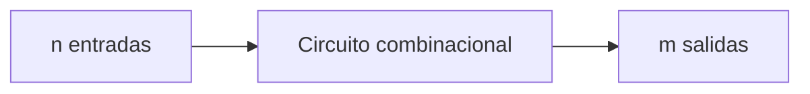

# Diseño con lógica combinacional

## 1. Circuitos combinacionales

Un **circuito combinacional** es una red de compuertas cuyas salidas dependen únicamente de la combinación presente en sus entradas. No contiene elementos de memoria, por lo que un mismo conjunto de entradas siempre produce el mismo conjunto de salidas.

Un circuito combinacional con $n$ variables de entrada y $m$ variables de salida puede describirse mediante:

- Una tabla de verdad con $2^n$ combinaciones de entrada.
- $m$ funciones booleanas, una por cada salida.
- Un diagrama lógico que implemente dichas funciones.

> [!note]
> Si una red posee realimentación o su respuesta depende de valores almacenados, no es puramente combinacional.

## 2. Procedimiento de diseño

El diseño transforma una especificación verbal en un circuito lógico. El procedimiento general es:

1. Enunciar el problema.
2. Determinar la cantidad de variables de entrada y de salida.
3. Asignar símbolos a las variables.
4. Construir la tabla de verdad que relaciona entradas y salidas.
5. Obtener y simplificar una función booleana para cada salida.
6. Dibujar el diagrama lógico.

La simplificación puede realizarse mediante álgebra de Boole, mapas de Karnaugh o el método del tabulado. La forma seleccionada debe considerar las compuertas disponibles y no solamente la cantidad de literales.

## 3. Sumadores

La suma binaria básica se rige por:

|  $x$  |  $y$  | Suma  | Lleva |
| :---: | :---: | :---: | :---: |
|   0   |   0   |   0   |   0   |
|   0   |   1   |   1   |   0   |
|   1   |   0   |   1   |   0   |
|   1   |   1   |   0   |   1   |

La suma y la lleva deben representarse como salidas separadas porque $1+1=(10)_2$.

### 3.1 Semisumador

El **semisumador** suma dos bits. Sus entradas son $x$ y $y$; sus salidas son la suma $S$ y la lleva $C$.

|  $x$  |  $y$  |  $C$  |  $S$  |
| :---: | :---: | :---: | :---: |
|   0   |   0   |   0   |   0   |
|   0   |   1   |   0   |   1   |
|   1   |   0   |   0   |   1   |
|   1   |   1   |   1   |   0   |

De la tabla se obtienen:

$$
S=x'y+xy'=x\oplus y
$$

$$
C=xy
$$

> **Ejemplo**
>
> Para sumar $x=1$ y $y=1$:
>
> $$
> S=1\oplus1=0
> $$
>
> $$
> C=(1)(1)=1
> $$
>
> Por tanto, el resultado completo es $CS=10$, que equivale a $2$ en decimal.

El semisumador no acepta una lleva procedente de una posición menos significativa. Por ello no basta para sumar posiciones interiores de dos números de varios bits.

### 3.2 Sumador completo

El **sumador completo** suma tres bits: $x$, $y$ y una lleva de entrada $z$. Produce una suma $S$ y una lleva de salida $C$.

|  $x$  |  $y$  |  $z$  |  $C$  |  $S$  |
| :---: | :---: | :---: | :---: | :---: |
|   0   |   0   |   0   |   0   |   0   |
|   0   |   0   |   1   |   0   |   1   |
|   0   |   1   |   0   |   0   |   1   |
|   0   |   1   |   1   |   1   |   0   |
|   1   |   0   |   0   |   0   |   1   |
|   1   |   0   |   1   |   1   |   0   |
|   1   |   1   |   0   |   1   |   0   |
|   1   |   1   |   1   |   1   |   1   |

La suma vale $1$ cuando existe una cantidad impar de unos:

$$
S=x'y'z+x'yz'+xy'z'+xyz
$$

$$
\boxed{S=x\oplus y\oplus z}
$$

La lleva vale $1$ cuando al menos dos entradas son $1$:

$$
\boxed{C=xy+xz+yz}
$$

> **Ejemplo**
>
> Para $x=1$, $y=0$ y $z=1$:
>
> $$
> S=1\oplus0\oplus1=0
> $$
>
> $$
> C=(1)(0)+(1)(1)+(0)(1)=1
> $$
>
> El resultado es $CS=10$. En efecto, $1+0+1=2$.

### 3.3 Implementación con dos semisumadores

Un sumador completo puede construirse con dos semisumadores y una compuerta OR:

$$
S_1=x\oplus y,\qquad C_1=xy
$$

$$
S=z\oplus S_1,\qquad C_2=zS_1
$$

$$
C=C_1+C_2=xy+z(x\oplus y)
$$

Esta construcción muestra cómo un circuito pequeño puede utilizarse como bloque para formar otro de mayor complejidad.

## 4. Sustractores

En una resta binaria, $x$ representa el minuendo y $y$ el sustraendo. Cuando se intenta calcular $0-1$, es necesario pedir un préstamo a la posición siguiente.

### 4.1 Semisustractor

El **semisustractor** resta $y$ de $x$. Produce la diferencia $D$ y el préstamo $B$.

|  $x$  |  $y$  |  $B$  |  $D$  |
| :---: | :---: | :---: | :---: |
|   0   |   0   |   0   |   0   |
|   0   |   1   |   1   |   1   |
|   1   |   0   |   0   |   1   |
|   1   |   1   |   0   |   0   |

Las funciones son:

$$
\boxed{D=x'y+xy'=x\oplus y}
$$

$$
\boxed{B=x'y}
$$

> **Ejemplo**
>
> Para $x=0$ y $y=1$, se pide un préstamo. En consecuencia:
>
> $$
> D=0\oplus1=1,\qquad B=0'(1)=1
> $$
>
> El préstamo convierte temporalmente el minuendo en $(10)_2$, y $(10)_2-1=1$.

### 4.2 Sustractor completo

El **sustractor completo** considera un préstamo de entrada $z$. Sus entradas son $x$, $y$ y $z$; sus salidas son la diferencia $D$ y el préstamo de salida $B$.

|  $x$  |  $y$  |  $z$  |  $B$  |  $D$  |
| :---: | :---: | :---: | :---: | :---: |
|   0   |   0   |   0   |   0   |   0   |
|   0   |   0   |   1   |   1   |   1   |
|   0   |   1   |   0   |   1   |   1   |
|   0   |   1   |   1   |   1   |   0   |
|   1   |   0   |   0   |   0   |   1   |
|   1   |   0   |   1   |   0   |   0   |
|   1   |   1   |   0   |   0   |   0   |
|   1   |   1   |   1   |   1   |   1   |

La diferencia es:

$$
\boxed{D=x\oplus y\oplus z}
$$

El préstamo de salida es:

$$
\boxed{B=x'y+x'z+yz}
$$

> **Ejemplo**
>
> Para $x=0$, $y=1$ y $z=1$ se calcula $0-1-1$. La tabla indica:
>
> $$
> D=0,\qquad B=1
> $$
>
> El préstamo aporta $(10)_2$ a la posición, de modo que $(10)_2-1-1=0$.

### 4.3 Relación entre sumadores y sustractores

La suma de un sumador completo y la diferencia de un sustractor completo poseen la misma función:

$$
S=D=x\oplus y\oplus z
$$

Además, la función de préstamo se obtiene a partir de una forma semejante a la lleva, pero con el minuendo complementado:

$$
C=xy+xz+yz
$$

$$
B=x'y+x'z+yz
$$

## 5. Conversión de códigos

Un **convertidor de código** es un circuito combinacional que recibe una palabra en un código y produce la palabra equivalente en otro. El procedimiento de diseño no cambia: se construye una tabla que asocia cada palabra válida de entrada con su salida correspondiente.

Las combinaciones que no pertenecen al código de entrada pueden tratarse como condiciones de no importa, siempre que nunca aparezcan durante la operación normal.

### 5.1 Convertidor de BDC a exceso a 3

Considérese un convertidor de BDC 8421 a exceso a 3. Las entradas son $A,B,C,D$ y las salidas $w,x,y,z$.

| Decimal |  BDC $ABCD$   | Exceso a 3 $wxyz$ |
| :-----: | :-----------: | :---------------: |
|    0    |    `0000`     |      `0011`       |
|    1    |    `0001`     |      `0100`       |
|    2    |    `0010`     |      `0101`       |
|    3    |    `0011`     |      `0110`       |
|    4    |    `0100`     |      `0111`       |
|    5    |    `0101`     |      `1000`       |
|    6    |    `0110`     |      `1001`       |
|    7    |    `0111`     |      `1010`       |
|    8    |    `1000`     |      `1011`       |
|    9    |    `1001`     |      `1100`       |
|  10–15  | `1010`–`1111` |      `XXXX`       |

Al simplificar cada salida con las seis condiciones de no importa se obtiene:

$$
\boxed{z=D'}
$$

$$
\boxed{y=CD+C'D'}
$$

$$
\boxed{x=B'C+B'D+BC'D'}
$$

$$
\boxed{w=A+BC+BD}
$$

> **Ejemplo**
>
> Para convertir el dígito decimal $6$:
>
> $$
> 6_{10}=0110_{\text{BDC}}
> $$
>
> Al evaluar las funciones con $A=0$, $B=1$, $C=1$ y $D=0$:
>
> $$
> wxyz=1001
> $$
>
> Esta salida representa $6+3=9$, por lo que corresponde al código de exceso a 3.

### 5.2 Compartición de señales

La forma mínima de cada salida por separado no siempre produce el circuito completo más económico. Si se define la señal compartida:

$$
T=C+D
$$

las funciones anteriores pueden escribirse como:

$$
z=D'
$$

$$
y=CD+T'
$$

$$
x=B'T+BT'
$$

$$
w=A+BT
$$

Esta realización aprovecha $T$ y $T'$ en varias salidas. El diseño de múltiples salidas debe considerar la posibilidad de compartir términos y compuertas.

## 6. Análisis de circuitos combinacionales

El análisis recorre el proceso inverso al diseño: parte de un diagrama lógico y determina las funciones o la tabla de verdad que describe su comportamiento.

El procedimiento es:

1. Verificar que la red no posea realimentación ni memoria.
2. Asignar símbolos a las salidas de las compuertas intermedias.
3. Escribir la función de cada compuerta desde las entradas hacia las salidas.
4. Sustituir las expresiones intermedias hasta obtener cada salida en función de las entradas originales.
5. Simplificar las funciones.
6. Construir una tabla de verdad si se necesita describir todas las combinaciones.

### 6.1 Análisis algebraico

Considérese una red cuyas señales se describen mediante:

$$
F_2=AB+AC+BC
$$

$$
T_1=A+B+C,\qquad T_2=ABC
$$

$$
T_3=F_2'T_1
$$

$$
F_1=T_3+T_2
$$

Al sustituir y simplificar:

$$
F_1=A'BC'+A'B'C+AB'C'+ABC
$$

$$
\boxed{F_1=A\oplus B\oplus C}
$$

La salida $F_2$ vale $1$ cuando al menos dos entradas valen $1$. Por tanto, la red corresponde a un sumador completo:

- $F_1$ es la suma.
- $F_2$ es la lleva.

> **Ejemplo**
>
> Para $A=1$, $B=0$ y $C=1$:
>
> $$
> F_2=AB+AC+BC=0+1+0=1
> $$
>
> $$
> T_1=1,\qquad T_2=0,\qquad T_3=F_2'T_1=0
> $$
>
> $$
> F_1=T_3+T_2=0
> $$
>
> La salida $F_2F_1=10$ confirma que $1+0+1=2$.

### 6.2 Análisis mediante tabla de verdad

El mismo circuito puede analizarse evaluando todas sus señales intermedias:

|  $A$  |  $B$  |  $C$  | $F_2$ | $F_2'$ | $T_1$ | $T_2$ | $T_3$ | $F_1$ |
| :---: | :---: | :---: | :---: | :----: | :---: | :---: | :---: | :---: |
|   0   |   0   |   0   |   0   |   1    |   0   |   0   |   0   |   0   |
|   0   |   0   |   1   |   0   |   1    |   1   |   0   |   1   |   1   |
|   0   |   1   |   0   |   0   |   1    |   1   |   0   |   1   |   1   |
|   0   |   1   |   1   |   1   |   0    |   1   |   0   |   0   |   0   |
|   1   |   0   |   0   |   0   |   1    |   1   |   0   |   1   |   1   |
|   1   |   0   |   1   |   1   |   0    |   1   |   0   |   0   |   0   |
|   1   |   1   |   0   |   1   |   0    |   1   |   0   |   0   |   0   |
|   1   |   1   |   1   |   1   |   0    |   1   |   1   |   0   |   1   |

> [!warning]
> Las condiciones de no importa pertenecen a la especificación del diseño. Una vez construido el circuito, todas las combinaciones físicas de entrada producen una salida determinada, incluso aquellas que no se esperaba utilizar.

## 7. Circuitos NAND de niveles múltiples

La compuerta NAND es **universal**: mediante compuertas NAND puede implementarse cualquier función booleana.

Las operaciones básicas se obtienen así:

$$
x'=(xx)'
$$

$$
xy=\big[(xy)'\big]'
$$

$$
x+y=(x'y')'
$$

### 7.1 Método de diagrama de bloques

Para transformar una red AND-OR-NOT en una red NAND de niveles múltiples:

1. Dibujar el circuito con compuertas AND, OR e inversores.
2. Sustituir cada compuerta por su circuito equivalente con NAND.
3. Cancelar las inversiones consecutivas que aparezcan en una misma línea.
4. Ajustar los complementos de las entradas externas.

> **Ejemplo 1**
> 
> Para la función:
>
> $$
> F=A(B+CD)+BC'
> $$
>
> se identifican primero las señales:
>
> $$
> T_1=CD,\qquad T_2=B+T_1,\qquad T_3=AT_2,\qquad T_4=BC'
> $$
>
> El bloque final calcula $F=T_3+T_4$. Cada operación se reemplaza por su equivalente NAND y se cancelan las inversiones adyacentes.

> **Ejemplo 2**
> 
> Para:
>
> $$
> F=(A+B')(CD+E)
> $$
>
> la operación externa es AND. Su equivalente requiere una NAND seguida por inversión, por lo que la inversión de salida no siempre puede eliminarse al transformar una red multinivel.

### 7.2 Análisis de una red NAND

Una red NAND puede analizarse escribiendo las señales intermedias y aplicando De Morgan. Por ejemplo:

$$
T_1=(CD)'=C'+D'
$$

$$
T_2=(BC')'=B'+C
$$

$$
T_3=(B'T_1)'=B+CD
$$

$$
T_4=(AT_3)'=[A(B+CD)]'
$$

$$
F=(T_2T_4)'=BC'+A(B+CD)
$$

Otra estrategia consiste en alternar símbolos AND y OR a través de los niveles, agregar burbujas de inversión donde corresponda y cancelar las burbujas conectadas directamente.

## 8. Circuitos NOR de niveles múltiples

La compuerta NOR también es universal. Las operaciones fundamentales se forman mediante:

$$
x'=(x+x)'
$$

$$
x+y=\big[(x+y)'\big]'
$$

$$
xy=(x'+y')'
$$

El procedimiento de conversión es dual al de NAND:

1. Dibujar la red AND-OR-NOT.
2. Reemplazar sus bloques por equivalentes NOR.
3. Cancelar inversiones consecutivas.
4. Ajustar las entradas y la salida que todavía requieran complemento.

> **Ejemplo**
>
> La función:
>
> $$
> F=A(B+CD)+BC'
> $$
>
> se divide en las operaciones $CD$, $B+CD$, $A(B+CD)$, $BC'$ y la OR final. Al sustituir cada bloque por compuertas NOR equivalentes se obtiene una implementación únicamente con NOR; después se eliminan los pares de inversiones conectados en cascada.

### 8.1 Comparación entre NAND y NOR

| Característica                     | NAND                                                | NOR                            |
| ---------------------------------- | --------------------------------------------------- | ------------------------------ |
| Operación complementada            | Producto                                            | Suma                           |
| Realización natural de dos niveles | NAND-NAND para suma de productos                    | NOR-NOR para producto de sumas |
| Compuerta universal                | Sí                                                  | Sí                             |
| Conversión multinivel              | Sustitución de bloques y cancelación de inversiones | Procedimiento dual al de NAND  |

En una red multinivel, la mejor elección depende de la forma de la función, la disponibilidad de señales complementadas y la posibilidad de compartir términos.

## 9. Funciones OR exclusivo y equivalencia

### 9.1 OR exclusivo

La función OR exclusivo vale $1$ cuando sus dos entradas son diferentes:

$$
\boxed{x\oplus y=xy'+x'y}
$$

|  $x$  |  $y$  | $x\oplus y$ |
| :---: | :---: | :---------: |
|   0   |   0   |      0      |
|   0   |   1   |      1      |
|   1   |   0   |      1      |
|   1   |   1   |      0      |

### 9.2 Equivalencia

La función de equivalencia, también llamada NOR exclusivo, es el complemento de XOR. Vale $1$ cuando sus entradas son iguales:

$$
\boxed{x\odot y=xy+x'y'}
$$

|  $x$  |  $y$  | $x\odot y$ |
| :---: | :---: | :--------: |
|   0   |   0   |     1      |
|   0   |   1   |     0      |
|   1   |   0   |     0      |
|   1   |   1   |     1      |

Por tanto:

$$
(x\oplus y)'=x\odot y
$$

$$
(x\odot y)'=x\oplus y
$$

### 9.3 Propiedades

XOR es conmutativa y asociativa:

$$
x\oplus y=y\oplus x
$$

$$
(x\oplus y)\oplus z=x\oplus(y\oplus z)
$$

Para varias entradas, XOR vale $1$ cuando existe una cantidad impar de unos. Por ejemplo:

$$
A\oplus B\oplus C\oplus D=\sum(1,2,4,7,8,11,13,14)
$$

Una función XOR de $n$ variables contiene $2^{n-1}$ minterms.

Al asociar compuertas de equivalencia de dos entradas, la función resultante vale $1$ cuando existe una cantidad par de ceros. En consecuencia:

- Con una cantidad impar de variables, XOR y equivalencia producen la misma función.
- Con una cantidad par de variables, una es el complemento de la otra.

Por ejemplo:

$$
A\oplus B\oplus C=A\odot B\odot C
$$

> [!note]
> La interpretación de una equivalencia de múltiples entradas depende de asociar compuertas de dos entradas. Esta convención debe distinguirse de una compuerta hipotética que simplemente comprobara si todas las entradas son iguales.

### 9.4 Aplicaciones aritméticas

XOR aparece de forma natural en circuitos aritméticos:

$$
S_{\text{semisumador}}=x\oplus y
$$

$$
S_{\text{sumador completo}}=x\oplus y\oplus z
$$

$$
D_{\text{semisustractor}}=x\oplus y
$$

$$
D_{\text{sustractor completo}}=x\oplus y\oplus z
$$

## 10. Generación y comprobación de paridad

Las funciones XOR y de equivalencia permiten generar y comprobar bits de paridad con circuitos compactos.

### 10.1 Generador de paridad impar

Sean $x,y,z$ los bits de información y $P$ el bit de paridad. Para que la palabra transmitida posea una cantidad impar de unos, $P$ debe tomar los valores siguientes:

|  $x$  |  $y$  |  $z$  |  $P$  |
| :---: | :---: | :---: | :---: |
|   0   |   0   |   0   |   1   |
|   0   |   0   |   1   |   0   |
|   0   |   1   |   0   |   0   |
|   0   |   1   |   1   |   1   |
|   1   |   0   |   0   |   0   |
|   1   |   0   |   1   |   1   |
|   1   |   1   |   0   |   1   |
|   1   |   1   |   1   |   0   |

La función es:

$$
\boxed{P=x\odot y\odot z}
$$

Con compuertas de dos entradas también puede escribirse:

$$
P=(x\odot y)\oplus z
$$

> **Ejemplo**
>
> Si se transmiten los datos `101`, ya existen dos unos. El generador produce:
>
> $$
> P=1
> $$
>
> La palabra `1011` contiene tres unos y, por tanto, posee paridad impar.

### 10.2 Comprobador de paridad impar

El receptor evalúa los datos y el bit de paridad recibido:

$$
\boxed{C=x\odot y\odot z\odot P}
$$

Con cuatro variables, la equivalencia vale $1$ cuando existe una cantidad par de unos. Por ello:

- $C=0$: la cantidad recibida de unos es impar; no se detecta error.
- $C=1$: la cantidad recibida de unos es par; se detecta error.

> [!warning]
> La paridad detecta cualquier cantidad impar de bits alterados, pero no garantiza detectar una cantidad par de errores. Tampoco identifica la posición dañada ni corrige la información.

## 11. Procedimientos de resolución

### 11.1 Diseñar un circuito combinacional

1. Identifique las entradas y salidas sin anticipar todavía las compuertas.
2. Asigne un significado preciso a los valores $0$ y $1$ de cada variable.
3. Complete todas las filas relevantes de la tabla de verdad.
4. Marque como no importa únicamente las combinaciones imposibles o no utilizadas.
5. Simplifique cada salida y busque términos que puedan compartirse.
6. Seleccione una implementación compatible con las compuertas requeridas.
7. Verifique el circuito contra la tabla original.

### 11.2 Analizar un circuito

1. Confirme que no exista realimentación.
2. Nombre las señales intermedias.
3. Escriba la ecuación de cada compuerta en orden de niveles.
4. Sustituya hasta expresar las salidas mediante las entradas originales.
5. Simplifique y reconozca funciones conocidas.
6. Evalúe todas las combinaciones cuando se solicite la tabla de verdad.

### 11.3 Convertir a NAND o NOR

1. Conserve primero la estructura lógica de la expresión.
2. Sustituya cada bloque por su equivalente NAND o NOR.
3. Aplique De Morgan para comprobar las inversiones.
4. Elimine solamente pares de inversiones realmente conectados en cascada.
5. Verifique algebraicamente la función final.

### Errores frecuentes

| Error                                                                        | Corrección                                                                           |
| ---------------------------------------------------------------------------- | ------------------------------------------------------------------------------------ |
| Confundir una red combinacional con una secuencial                           | Comprobar si hay memoria o realimentación.                                           |
| Omitir la lleva de entrada en una suma de varios bits                        | Utilizar un sumador completo en las posiciones que reciben lleva.                    |
| Confundir la lleva con el préstamo                                           | Derivar cada función desde su propia tabla de verdad.                                |
| Asignar valores arbitrarios a entradas inválidas de un código                | Marcarlas como no importa solamente si la especificación permite excluirlas.         |
| Minimizar cada salida sin buscar términos comunes                            | Comparar el costo del circuito completo.                                             |
| Analizar una red NAND como si sus compuertas fueran AND                      | Conservar la negación de cada salida NAND.                                           |
| Cancelar una sola inversión                                                  | Solo dos complementos sucesivos se anulan.                                           |
| Suponer que XOR equivale a OR                                                | XOR vale $0$ cuando ambas entradas valen $1$.                                        |
| Interpretar $C=1$ como recepción correcta en el comprobador de paridad impar | En el circuito estudiado, $C=1$ indica una cantidad par de unos y, por tanto, error. |
| Afirmar que la paridad detecta todos los errores                             | Una cantidad par de alteraciones puede pasar inadvertida.                            |

# Verificación del aprendizaje

**Problema 1:** diseñe el circuito combinacional del problema 4-1 del libro. El circuito tiene cuatro entradas y una salida. La salida vale $1$ cuando el número de entradas iguales a $1$ es $0$, $1$, $3$ o $4. Obtenga la tabla de verdad y las expresiones simplificadas en suma de productos y producto de sumas.

**Problema 2:** resuelva el problema 4-2 del libro. Un número binario de tres bits, comprendido entre $0$ y $7$, se aplica a la entrada de un circuito. Diseñe un circuito cuya salida binaria represente el cuadrado del número de entrada.

**Problema 3:** resuelva el problema 4-28 del libro. Diseñe un convertidor de código Gray de cuatro bits a código binario utilizando compuertas OR exclusivo.

> **Soluciones**
>
> **Problema 1**
>
> Sean $A,B,C,D$ las entradas y $F$ la salida. La tabla de verdad es:
>
>|$A$|$B$|$C$|$D$|Cantidad de unos|$F$|
>|:---:|:---:|:---:|:---:|:---:|:---:|
>|0|0|0|0|0|1|
>|0|0|0|1|1|1|
>|0|0|1|0|1|1|
>|0|0|1|1|2|0|
>|0|1|0|0|1|1|
>|0|1|0|1|2|0|
>|0|1|1|0|2|0|
>|0|1|1|1|3|1|
>|1|0|0|0|1|1|
>|1|0|0|1|2|0|
>|1|0|1|0|2|0|
>|1|0|1|1|3|1|
>|1|1|0|0|2|0|
>|1|1|0|1|3|1|
>|1|1|1|0|3|1|
>|1|1|1|1|4|1|
>
> En forma canónica:
>
> $$
> F=\sum(0,1,2,4,7,8,11,13,14,15)
> $$
>
> La suma de productos simplificada es:
>
> $$
> \boxed{F=A'B'C'+A'B'D'+A'C'D'+B'C'D'+ABC+ABD+ACD+BCD}
> $$
>
> Los ceros se encuentran en $3,5,6,9,10,12$. El producto de sumas simplificado es:
>
> $$
> \boxed{F=(A+B+C'+D')(A+B'+C+D')(A+B'+C'+D)}
> $$
>
> $$
> \boxed{\phantom{F={}}(A'+B+C+D')(A'+B+C'+D)(A'+B'+C+D)}
> $$
>
> **Problema 2**
>
> Sean $x,y,z$ los bits de entrada, con $x$ como el más significativo. Se requieren seis salidas $P_5,P_4,P_3,P_2,P_1,P_0$, porque $7^2=49=(110001)_2$.
>
>|Decimal|$xyz$|Cuadrado|$P_5P_4P_3P_2P_1P_0$|
>|:---:|:---:|:---:|:---:|
>|0|`000`|0|`000000`|
>|1|`001`|1|`000001`|
>|2|`010`|4|`000100`|
>|3|`011`|9|`001001`|
>|4|`100`|16|`010000`|
>|5|`101`|25|`011001`|
>|6|`110`|36|`100100`|
>|7|`111`|49|`110001`|
>
> Al simplificar cada salida:
>
> $$
> \boxed{P_5=xy}
> $$
>
> $$
> \boxed{P_4=xy'+xz}
> $$
>
> $$
> \boxed{P_3=x'yz+xy'z}
> $$
>
> $$
> \boxed{P_2=yz'}
> $$
>
> $$
> \boxed{P_1=0}
> $$
>
> $$
> \boxed{P_0=z}
> $$
>
> El circuito se implementa con una red por cada salida; $P_1$ se conecta a $0$ lógico y $P_0$ directamente a $z$.
>
> **Problema 3**
>
> Sean $G_3,G_2,G_1,G_0$ los bits Gray, desde el más significativo hasta el menos significativo, y $B_3,B_2,B_1,B_0$ los bits binarios. El bit más significativo se conserva y cada bit binario siguiente se obtiene acumulando XOR desde la izquierda:
>
> $$
> \boxed{B_3=G_3}
> $$
>
> $$
> \boxed{B_2=G_3\oplus G_2}
> $$
>
> $$
> \boxed{B_1=G_3\oplus G_2\oplus G_1}
> $$
>
> $$
> \boxed{B_0=G_3\oplus G_2\oplus G_1\oplus G_0}
> $$
>
> Una implementación en cascada reutiliza las salidas anteriores:
>
> $$
> B_3=G_3,\qquad B_2=B_3\oplus G_2,\qquad B_1=B_2\oplus G_1,\qquad B_0=B_1\oplus G_0
> $$

  <a href="./Tema%207.md">⬅️ Tema anterior</a> | <a href="./Tema%209.md">Siguiente tema ➡️</a>

