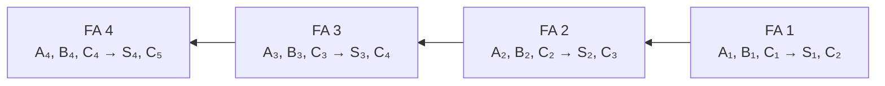

# Bloques digitales combinacionales de mediana escala de integración

## 1. Del diseño con compuertas a los bloques integrados

El diseño combinacional clásico busca simplificar las funciones booleanas y reducir la cantidad de compuertas. Sin embargo, cuando el circuito se construye con circuitos integrados, el menor número de compuertas no siempre implica el menor costo.

Una pastilla puede contener varias compuertas y conexiones internas. Por ello, el costo práctico depende de:

- La cantidad y el tipo de circuitos integrados utilizados.
- El número de conexiones externas entre pastillas.
- La posibilidad de aprovechar bloques ya disponibles.
- La velocidad, el consumo y las restricciones de cada componente.

Antes de diseñar una función con compuertas individuales conviene preguntar si existe un circuito integrado que ya realice la operación requerida.

### 1.1 Escalas de integración

| Escala | Enfoque funcional                        | Ejemplos del capítulo                                    |
| ------ | ---------------------------------------- | -------------------------------------------------------- |
| SSI    | Compuertas elementales                   | AND, OR, NOT, NAND y NOR                                 |
| MSI    | Funciones digitales completas            | Sumadores, comparadores, decodificadores y multiplexores |
| LSI    | Redes combinacionales de mayor capacidad | ROM y PLA                                                |

El bloque integrado se utiliza como una unidad funcional: basta conocer sus entradas, salidas y comportamiento para incorporarlo a un sistema mayor.

> [!note]
> El capítulo utiliza MSI y LSI como una continuación del diseño combinacional. Los elementos secuenciales y las funciones de procesador se estudian posteriormente.

## 2. Sumador paralelo binario

Un sumador completo agrega dos bits y un arrastre de entrada. Para sumar dos números binarios de $n$ bits se conectan $n$ sumadores completos.

Existen dos métodos generales:

- **Suma en serie:** un solo sumador completo procesa un par de bits a la vez y un elemento de memoria conserva el arrastre.
- **Suma en paralelo:** se utiliza un sumador completo por posición y todos los bits se aplican simultáneamente.

En un sumador paralelo, el arrastre de salida de cada etapa se conecta a la entrada de arrastre de la posición inmediata de mayor orden.

- $C_1$ es el arrastre de entrada de toda la unidad.
- $C_5$ es el arrastre de salida.
- $S_1$ es el bit menos significativo de la suma.
- $S_4$ es el bit más significativo de la suma.

> **Ejemplo**
>
> Sean:
>
> $$
> A=1011,\qquad B=0011,\qquad C_1=0
> $$
>
> La operación es:
>
> $$
> \begin{array}{r}
> 1011\\
> +\ 0011\\
> \hline
> 1110
> \end{array}
> $$
>
> Los arrastres se transmiten desde la posición menos significativa hacia la izquierda hasta producir el resultado estable.

### 2.1 Construcción iterativa

Un diseño directo del sumador de cuatro bits tendría nueve entradas:

- Cuatro bits de $A$.
- Cuatro bits de $B$.
- Un arrastre de entrada.

La tabla de verdad tendría:

$$
2^9=512
$$

filas. La conexión repetida de sumadores completos evita deducir el circuito desde una tabla tan extensa y produce una estructura regular que puede ampliarse a más bits.

### 2.2 Conversión de BDC a exceso a 3 con un sumador

Un dígito en exceso a 3 se obtiene sumando `0011` a su representación BDC. Por tanto, un sumador paralelo de cuatro bits puede realizar la conversión:

- El dígito BDC se conecta a las entradas $A$.
- Las entradas $B$ se fijan en `0011`.
- El arrastre inicial se fija en $0$.
- Las salidas de suma entregan el código de exceso a 3.
- El arrastre final no se utiliza.

> **Ejemplo**
>
> Para convertir el dígito decimal $5$:
>
> $$
> 0101_{\text{BDC}}+0011=1000_{\text{exceso a 3}}
> $$
>
> El uso de un sumador MSI reemplaza la red de compuertas diseñada individualmente para cada salida.

## 3. Propagación del arrastre

Aunque todos los operandos se aplican al mismo tiempo, cada compuerta posee una demora de propagación. En un sumador en cascada, el camino crítico suele ser:

$$
C_1\rightarrow C_2\rightarrow C_3\rightarrow\cdots\rightarrow C_{n+1}
$$

Cada etapa debe esperar el arrastre correcto de la etapa anterior. Por ello, una suma en paralelo no produce necesariamente todas sus salidas definitivas de manera simultánea.

### 3.1 Arrastre propagado y generado

Para la posición $i$ se definen:

$$
\boxed{P_i=A_i\oplus B_i}
$$

$$
\boxed{G_i=A_iB_i}
$$

$P_i$ es el **arrastre propagado** y $G_i$ el **arrastre generado**. Las salidas del sumador completo se expresan como:

$$
\boxed{S_i=P_i\oplus C_i}
$$

$$
\boxed{C_{i+1}=G_i+P_iC_i}
$$

- Si $G_i=1$, la etapa genera un arrastre sin depender de $C_i$.
- Si $P_i=1$, un arrastre presente en $C_i$ se propaga a la salida.

### 3.2 Arrastre posterior

El **arrastre posterior**, también llamado anticipado, calcula los arrastres directamente a partir de $P$, $G$ y $C_1$, sin esperar que atraviesen toda la cadena.

Para cuatro bits:

$$
C_2=G_1+P_1C_1
$$

$$
C_3=G_2+P_2G_1+P_2P_1C_1
$$

$$
C_4=G_3+P_3G_2+P_3P_2G_1+P_3P_2P_1C_1
$$

$$
C_5=G_4+P_4G_3+P_4P_3G_2+P_4P_3P_2G_1+P_4P_3P_2P_1C_1
$$

Cada término indica dónde se generó el arrastre y por cuáles posiciones pudo propagarse.

> **Ejemplo**
>
> En la expresión de $C_4$, el término:
>
> $$
> P_3P_2G_1
> $$
>
> significa que la primera etapa generó un arrastre y que las etapas 2 y 3 lo propagaron hasta $C_4$.

El generador de arrastre posterior introduce más compuertas, pero reduce la cantidad de niveles que debe recorrer la señal y mejora la velocidad.

## 4. Sumador decimal

Los computadores que operan con números decimales codificados necesitan sumar dígitos BDC. Dos dígitos BDC, junto con un arrastre de entrada, pueden producir resultados entre $0$ y $19$.

Un sumador binario de cuatro bits produce inicialmente:

- Una suma intermedia $Z_8Z_4Z_2Z_1$.
- Un arrastre $K$.

Las representaciones binarias `0000` a `1001` son BDC válidas. Las sumas `1010` a `1111` deben corregirse, y los resultados de $16$ a $19$ producen además $K=1$.

### 4.1 Condición de corrección

La corrección se necesita cuando:

- Existe un arrastre $K=1$; o
- La suma intermedia es mayor que $1001$.

La señal de corrección es:

$$
\boxed{C=K+Z_8Z_4+Z_8Z_2}
$$

Cuando $C=1$, se agrega `0110` a la suma intermedia. Cuando $C=0$, se agrega `0000`.

### 4.2 Razón de sumar seis

En cuatro bits existen seis combinaciones inválidas entre `1010` y `1111`. Sumar `0110` desplaza la suma binaria hacia la representación BDC correcta y genera el arrastre decimal requerido.

> **Ejemplo 1**
> 
> Para sumar $7+8$:
>
> $$
> 0111+1000=1111
> $$
>
> Como $1111>1001$, la señal de corrección vale $1$:
>
> $$
> 1111+0110=1\ 0101
> $$
>
> El resultado BDC es `0001 0101`, que representa $15$.

> **Ejemplo 2**
> 
> Para sumar $4+3$:
>
> $$
> 0100+0011=0111
> $$
>
> La suma es BDC válida y $K=0$, por lo que no se agrega `0110`. El resultado representa $7$.

### 4.3 Estructura del sumador BDC

El circuito utiliza:

1. Un sumador binario de cuatro bits para obtener $K$ y $Z_8Z_4Z_2Z_1$.
2. Lógica para calcular $C$.
3. Un segundo sumador de cuatro bits que agrega `0110` cuando $C=1$.

Para sumar números decimales de varios dígitos se conecta una etapa BDC por dígito. El arrastre de salida de una etapa se convierte en el arrastre de entrada de la siguiente.

## 5. Comparador de magnitudes

Un **comparador de magnitudes** determina la relación entre dos números binarios $A$ y $B$. Produce tres salidas mutuamente excluyentes:

$$
A>B,\qquad A=B,\qquad A<B
$$

La comparación comienza en los bits de mayor orden. Si estos difieren, determinan inmediatamente el resultado; solo cuando son iguales se examina la posición siguiente.

### 5.1 Igualdad

Para cada posición se define:

$$
x_i=A_i\odot B_i=A_iB_i+A_i'B_i'
$$

$x_i=1$ indica que el par de bits es igual. Para números de cuatro bits:

$$
\boxed{(A=B)=x_3x_2x_1x_0}
$$

### 5.2 Mayor que y menor que

Para cuatro bits:

$$
\boxed{(A>B)=A_3B_3'+x_3A_2B_2'+x_3x_2A_1B_1'+x_3x_2x_1A_0B_0'}
$$

$$
\boxed{(A<B)=A_3'B_3+x_3A_2'B_2+x_3x_2A_1'B_1+x_3x_2x_1A_0'B_0}
$$

Cada término significa que todos los pares de mayor orden fueron iguales y que en esa posición aparece la primera desigualdad.

> **Ejemplo**
>
> Compárense:
>
> $$
> A=1010,\qquad B=1001
> $$
>
> Los bits $A_3B_3$ y $A_2B_2$ son iguales. En la posición siguiente, $A_1=1$ y $B_1=0$; por tanto:
>
> $$
> A>B
> $$
>
> El bit menos significativo ya no modifica la decisión.

Los comparadores MSI suelen incorporar entradas adicionales para conectarse en cascada y comparar palabras de más bits.

## 6. Decodificadores

Un **decodificador** convierte información binaria de $n$ líneas de entrada en un máximo de $2^n$ líneas de salida. En un decodificador completo, cada salida corresponde a un término mínimo.

Para un decodificador de $n$ a $m$ líneas:

$$
m\leq2^n
$$

### 6.1 Decodificador de 3 a 8

|  $x$  |  $y$  |  $z$  | Salida activa |
| :---: | :---: | :---: | :-----------: |
|   0   |   0   |   0   |     $D_0$     |
|   0   |   0   |   1   |     $D_1$     |
|   0   |   1   |   0   |     $D_2$     |
|   0   |   1   |   1   |     $D_3$     |
|   1   |   0   |   0   |     $D_4$     |
|   1   |   0   |   1   |     $D_5$     |
|   1   |   1   |   0   |     $D_6$     |
|   1   |   1   |   1   |     $D_7$     |

Sus funciones son:

$$
\begin{aligned}
D_0&=x'y'z',&D_1&=x'y'z,\\
D_2&=x'yz',&D_3&=x'yz,\\
D_4&=xy'z',&D_5&=xy'z,\\
D_6&=xyz',&D_7&=xyz.
\end{aligned}
$$

Las salidas son mutuamente excluyentes: para cada entrada válida solo una se encuentra activa.

> **Ejemplo**
>
> La entrada `101` selecciona la salida $D_5$ porque:
>
> $$
> D_5=xy'z=(1)(1)(1)=1
> $$
>
> Los demás términos mínimos valen $0$.

### 6.2 Decodificador BDC a decimal

Un decodificador BDC a decimal posee cuatro entradas $w,x,y,z$ y diez salidas $D_0$ a $D_9$. Las combinaciones `1010` a `1111` pueden utilizarse como condiciones de no importa.

Al simplificar con esas condiciones:

$$
\begin{aligned}
D_0&=w'x'y'z',&D_1&=w'x'y'z,\\
D_2&=x'yz',&D_3&=x'yz,\\
D_4&=xy'z',&D_5&=xy'z,\\
D_6&=xyz',&D_7&=xyz,\\
D_8&=wz',&D_9&=wz.
\end{aligned}
$$

Esta simplificación reduce literales, pero hace que algunas entradas inválidas activen dos salidas. Por ejemplo, `1010` activa $D_2$ y $D_8$. Las condiciones de no importa deben usarse considerando el comportamiento real ante fallas o entradas prohibidas.

### 6.3 Configuración de funciones con decodificador

Como el decodificador genera todos los términos mínimos, cualquier función puede implementarse sumando las salidas apropiadas mediante una compuerta OR.

Para un circuito de $n$ entradas y $m$ salidas se emplean:

- Un decodificador de $n$ a $2^n$.
- Una compuerta OR por función de salida.

> **Ejemplo**
>
> El sumador completo se expresa como:
>
> $$
> S(x,y,z)=\sum(1,2,4,7)
> $$
>
> $$
> C(x,y,z)=\sum(3,5,6,7)
> $$
>
> Con un decodificador de 3 a 8:
>
> $$
> S=D_1+D_2+D_4+D_7
> $$
>
> $$
> C=D_3+D_5+D_6+D_7
> $$

Si una función posee muchos términos mínimos, puede ser más conveniente sumar mediante una NOR los pocos términos de su complemento.

## 7. Activación, demultiplexores y expansión

Muchos decodificadores incluyen una entrada de **activación** o *enable*. Esta entrada permite habilitar o inhibir todo el bloque.

Debe comprobarse si las entradas y salidas son activas en $1$ o activas en $0$. Los círculos en un símbolo lógico indican señales complementadas o activas en bajo.

### 7.1 Demultiplexor

Un **demultiplexor** recibe datos por una línea y los dirige hacia una de $2^n$ salidas. Las $n$ líneas de selección determinan el destino.

Un decodificador con activación puede funcionar como demultiplexor:

- La entrada de activación se utiliza como entrada de datos.
- Las demás entradas se utilizan como selección.

### 7.2 Expansión

Dos decodificadores de 3 a 8 con activación pueden formar uno de 4 a 16:

- Las tres variables inferiores llegan a ambos bloques.
- La cuarta variable habilita uno e inhabilita el otro.
- Un bloque genera las salidas 0 a 7 y el otro las salidas 8 a 15.

Las entradas de activación permiten ampliar la capacidad conectando varias unidades MSI.

## 8. Codificadores

Un **codificador** realiza la operación inversa de un decodificador: recibe hasta $2^n$ líneas y entrega un código binario de $n$ bits.

### 8.1 Codificador octal a binario

| Entrada activa |  $x$  |  $y$  |  $z$  |
| :------------: | :---: | :---: | :---: |
|     $D_0$      |   0   |   0   |   0   |
|     $D_1$      |   0   |   0   |   1   |
|     $D_2$      |   0   |   1   |   0   |
|     $D_3$      |   0   |   1   |   1   |
|     $D_4$      |   1   |   0   |   0   |
|     $D_5$      |   1   |   0   |   1   |
|     $D_6$      |   1   |   1   |   0   |
|     $D_7$      |   1   |   1   |   1   |

Las funciones de salida son:

$$
x=D_4+D_5+D_6+D_7
$$

$$
y=D_2+D_3+D_6+D_7
$$

$$
z=D_1+D_3+D_5+D_7
$$

El circuito presupone que solo una entrada vale $1$. Si todas las entradas valen $0$, la salida también es `000`, igual que cuando $D_0=1$. Puede agregarse una salida adicional que indique si existe alguna entrada activa.

### 8.2 Codificador de prioridad

Un **codificador de prioridad** establece qué entrada debe codificarse cuando varias se activan simultáneamente. Si la prioridad aumenta con el subíndice y $D_2=D_5=1$, la salida representa a $D_5$:

$$
xyz=101
$$

La especificación debe indicar con claridad el orden de prioridad y el comportamiento cuando ninguna entrada está activa.

## 9. Multiplexores

Un **multiplexor** selecciona una entre varias líneas de entrada y dirige su información a una sola salida. También se denomina selector de datos o MUX.

Normalmente, un multiplexor posee:

- $2^n$ entradas de datos.
- $n$ líneas de selección.
- Una salida.
- Una entrada de activación opcional.

### 9.1 Multiplexor de 4 a 1

| $s_1$ | $s_0$ | Salida $Y$ |
| :---: | :---: | :--------: |
|   0   |   0   |   $I_0$    |
|   0   |   1   |   $I_1$    |
|   1   |   0   |   $I_2$    |
|   1   |   1   |   $I_3$    |

Su función es:

$$
\boxed{Y=I_0s_1's_0'+I_1s_1's_0+I_2s_1s_0'+I_3s_1s_0}
$$

Solo una compuerta AND queda habilitada por cada combinación de selección y la OR transmite la entrada correspondiente.

> **Ejemplo**
>
> Si $s_1s_0=10$, la salida es:
>
> $$
> Y=I_2
> $$
>
> Los valores de $I_0$, $I_1$ e $I_3$ no afectan la salida mientras se conserve esa selección.

### 9.2 Multiplexor cuádruple de 2 a 1

Un bloque puede contener cuatro multiplexores de 2 a 1 que comparten las líneas de selección y activación. Así se selecciona simultáneamente uno de dos grupos de cuatro bits.

La entrada de activación puede:

- Habilitar el bloque.
- Forzar la salida a un valor fijo cuando está inactivo.
- Permitir la expansión mediante varias pastillas.

## 10. Implementación de funciones con multiplexores

Un multiplexor contiene internamente la decodificación de sus líneas de selección y una suma lógica. Por ello puede utilizarse para implementar funciones booleanas.

Una función de $n$ variables puede configurarse con un multiplexor de:

$$
\boxed{2^{n-1}\text{ a }1}
$$

Se conectan $n-1$ variables a las líneas de selección. En las entradas de datos se colocan $0$, $1$, la variable restante o su complemento.

### 10.1 Regla de configuración

Cada entrada del multiplexor corresponde a una pareja de términos mínimos que solo difieren en la variable restante:

| Términos incluidos en $F$                     | Conexión de datos          |
| --------------------------------------------- | -------------------------- |
| Ninguno                                       | $0$                        |
| Ambos                                         | $1$                        |
| Solo el término con la variable normal        | Variable                   |
| Solo el término con la variable complementada | Complemento de la variable |

> **Ejemplo 1**
> 
> Configurar:
>
> $$
> F(A,B,C)=\sum(1,3,5,6)
> $$
>
> Se conectan $B$ y $C$ como selección y se reserva $A$ para los datos:
>
>|Entrada|Pareja de minterms|Conexión|
>|---|---|---|
>|$I_0$|$0,4$|$0$|
>|$I_1$|$1,5$|$1$|
>|$I_2$|$2,6$|$A$|
>|$I_3$|$3,7$|$A'$|
>
> Por tanto:
>
> $$
> I_0=0,\qquad I_1=1,\qquad I_2=A,\qquad I_3=A'
> $$

> **Ejemplo 2**
> 
> Configurar:
>
> $$
> F(A,B,C,D)=\sum(0,1,3,4,8,9,15)
> $$
>
> Con $B,C,D$ como selección y $A$ como variable de datos:
>
>|Entrada|Pareja de minterms|Conexión|
>|---|---|---|
>|$I_0$|$0,8$|$1$|
>|$I_1$|$1,9$|$1$|
>|$I_2$|$2,10$|$0$|
>|$I_3$|$3,11$|$A'$|
>|$I_4$|$4,12$|$A'$|
>|$I_5$|$5,13$|$0$|
>|$I_6$|$6,14$|$0$|
>|$I_7$|$7,15$|$A$|

Puede elegirse otra variable como dato, pero la tabla debe reorganizarse de acuerdo con las nuevas líneas de selección.

## 11. Memoria de solo lectura

Una **memoria de solo lectura**, ROM, combina:

- Un decodificador de $n$ a $2^n$.
- $m$ compuertas OR.
- Enlaces que determinan qué términos mínimos llegan a cada salida.

La ROM puede interpretarse como un circuito que produce $m$ funciones booleanas o como una memoria que entrega una palabra fija para cada dirección.

### 11.1 Dirección, palabra y tamaño

Una ROM con $n$ entradas y $m$ salidas posee:

- $2^n$ direcciones.
- $2^n$ palabras.
- $m$ bits por palabra.

Su tamaño se expresa como:

$$
\boxed{2^n\times m}
$$

Cada combinación de entrada es una **dirección**. Los $m$ bits de salida forman la **palabra** almacenada en esa dirección.

> **Ejemplo**
>
> Una ROM de $32\times8$ contiene 32 palabras de 8 bits. Necesita:
>
> $$
> \log_2 32=5
> $$
>
> líneas de dirección y almacena en total:
>
> $$
> 32(8)=256\text{ bits}
> $$

### 11.2 Configuración de lógica combinacional

Para implementar un circuito de $n$ entradas y $m$ salidas:

1. Construir la tabla de verdad.
2. Usar cada combinación de entrada como dirección.
3. Usar sus salidas como la palabra correspondiente.
4. Programar los enlaces para reproducir los unos y ceros.

No es necesario simplificar las funciones: la tabla de verdad contiene toda la información requerida.

### 11.3 Ejemplo de dos funciones

Sean:

$$
F_1(A_1,A_0)=\sum(1,2,3)
$$

$$
F_2(A_1,A_0)=\sum(0,2)
$$

La tabla de programación es:

| $A_1A_0$ | $F_1F_2$ |
| :------: | :------: |
|   `00`   |   `01`   |
|   `01`   |   `10`   |
|   `10`   |   `11`   |
|   `11`   |   `10`   |

Se necesita una ROM de $4\times2$.

### 11.4 Circuito del cuadrado con ROM

Un circuito recibe un número de tres bits y produce su cuadrado de seis bits:

| Entrada | Cuadrado |  Salida  |
| :-----: | :------: | :------: |
|  `000`  |    0     | `000000` |
|  `001`  |    1     | `000001` |
|  `010`  |    4     | `000100` |
|  `011`  |    9     | `001001` |
|  `100`  |    16    | `010000` |
|  `101`  |    25    | `011001` |
|  `110`  |    36    | `100100` |
|  `111`  |    49    | `110001` |

Una ejecución directa requeriría una ROM de $8\times6$. Sin embargo:

$$
B_0=A_0,\qquad B_1=0
$$

Solo deben almacenarse $B_5,B_4,B_3,B_2$, por lo que basta una ROM de $8\times4$. Las salidas conocidas o conectadas directamente no necesitan ocupar bits de la memoria.

### 11.5 Tipos de ROM

| Tipo           | Forma de programación o borrado                               |
| -------------- | ------------------------------------------------------------- |
| ROM de máscara | El fabricante fija el patrón durante la fabricación.          |
| PROM           | El usuario programa de forma permanente determinados enlaces. |
| EPROM          | Puede borrarse con luz ultravioleta y programarse nuevamente. |
| EAROM          | Puede alterarse mediante señales eléctricas.                  |

En este contexto, programar una ROM es un procedimiento físico de *hardware*, no la ejecución de instrucciones de software.

## 12. Arreglo lógico programable

Una ROM genera todos los $2^n$ términos mínimos, aunque muchos no se utilicen. Un **arreglo lógico programable**, PLA, genera solamente los términos producto necesarios.

Un PLA contiene:

- $n$ entradas normales y complementadas.
- Un arreglo AND programable que forma $k$ términos producto.
- Un arreglo OR programable que combina esos productos.
- $m$ salidas.
- Inversores de salida opcionales.

El tamaño de un PLA se especifica mediante el número de entradas, términos producto y salidas.

### 12.1 ROM frente a PLA

| Característica        | ROM                                          | PLA                                        |
| --------------------- | -------------------------------------------- | ------------------------------------------ |
| Primer nivel          | Decodificador fijo con todos los minterms    | Arreglo AND programable                    |
| Segundo nivel         | Arreglo OR programable                       | Arreglo OR programable                     |
| Productos generados   | Los $2^n$ términos mínimos                   | Solo los productos necesarios              |
| Simplificación previa | No es indispensable                          | Sí es importante                           |
| Reutilización         | Una dirección puede alimentar varias salidas | Un producto puede alimentar varias salidas |

El PLA resulta especialmente útil cuando existen muchas combinaciones de no importa o varias funciones comparten términos producto.

## 13. Tabla de programación de un PLA

Una tabla de programación especifica:

1. Los literales que forman cada término producto.
2. Las salidas OR a las que se conecta cada producto.
3. La polaridad verdadera o complementada de cada salida.

### 13.1 Convenciones

En las columnas de entrada:

- `1`: la variable aparece normal.
- `0`: la variable aparece complementada.
- `-`: la variable no aparece.

En las columnas de salida:

- `1`: el producto se conecta a la OR.
- `-`: el producto no se conecta.
- `T`: se utiliza la salida verdadera.
- `C`: se utiliza la salida complementada.

### 13.2 Productos compartidos

Sean:

$$
F_1=AB'+AC
$$

$$
F_2=AC+BC
$$

Se requieren solamente tres productos distintos:

$$
AB',\qquad AC,\qquad BC
$$

| Producto        |  $A$  |  $B$  |  $C$  | $F_1$ | $F_2$ |
| --------------- | :---: | :---: | :---: | :---: | :---: |
| $AB'$           |   1   |   0   |   -   |   1   |   -   |
| $AC$            |   1   |   -   |   1   |   1   |   1   |
| $BC$            |   -   |   1   |   1   |   -   |   1   |
| Forma de salida |       |       |       |   T   |   T   |

El producto $AC$ se comparte entre ambas funciones.

### 13.3 Selección de la polaridad de salida

Para un PLA deben simplificarse tanto las funciones como sus complementos. Puede convenir generar $F'$ y utilizar el inversor de salida si así se reduce la cantidad total de productos distintos.

> **Ejemplo**
>
> Sean:
>
> $$
> F_1(A,B,C)=\sum(3,5,6,7)
> $$
>
> $$
> F_2(A,B,C)=\sum(0,2,4,7)
> $$
>
> Una configuración de cuatro productos es:
>
> $$
> F_1=(B'C'+A'C'+A'B')'
> $$
>
> $$
> F_2=B'C'+A'C'+ABC
> $$
>
>|Producto|$A$|$B$|$C$|Columna de $F_1$|$F_2$|
>|---|:---:|:---:|:---:|:---:|:---:|
>|$B'C'$|-|0|0|1|1|
>|$A'C'$|0|-|0|1|1|
>|$A'B'$|0|0|-|1|-|
>|$ABC$|1|1|1|-|1|
>|Forma de salida||||C|T|
>
> La primera OR forma $F_1'$ y el inversor de salida entrega $F_1$. Los dos primeros productos se comparten con $F_2$.

### 13.4 Criterio de simplificación

En un PLA, el recurso crítico suele ser el número total de términos producto diferentes. Por ello, el procedimiento es:

1. Simplificar cada función y su complemento.
2. Comparar las formas verdaderas y complementadas.
3. Buscar productos compartidos entre salidas.
4. Elegir la combinación que utilice menos líneas de producto.
5. Completar la tabla de programación y verificar cada salida.

## 14. Comparación de recursos combinacionales

| Recurso            | Estructura                                         | Ventaja principal                                  | Limitación principal                           |
| ------------------ | -------------------------------------------------- | -------------------------------------------------- | ---------------------------------------------- |
| Decodificador + OR | Genera todos los minterms y suma los seleccionados | Un decodificador puede servir a varias funciones   | Puede requerir OR de muchas entradas           |
| Multiplexor        | Selecciona entre datos configurados                | Implementación compacta de una función             | Normalmente se necesita un MUX por salida      |
| ROM                | Decodificador completo y palabras programadas      | Se configura directamente desde la tabla de verdad | Genera todas las direcciones aunque no se usen |
| PLA                | AND y OR programables                              | Comparte productos y evita minterms innecesarios   | Dispone de una cantidad finita de productos    |

La selección depende de la cantidad de entradas y salidas, los productos compartidos, las condiciones de no importa y los componentes disponibles.

## 15. Procedimientos de resolución

### 15.1 Seleccionar un bloque integrado

1. Identifique la operación completa antes de diseñar compuertas.
2. Determine el ancho de los datos y las entradas de control.
3. Compruebe si existe un bloque MSI o LSI que ejecute la función.
4. Revise la polaridad de las señales de activación.
5. Considere las conexiones necesarias para ampliar el bloque.
6. Verifique las combinaciones normales y las entradas no utilizadas.

### 15.2 Configurar una función con decodificador

1. Exprese cada salida como suma de minterms.
2. Seleccione un decodificador que genere dichos minterms.
3. Conecte las salidas requeridas a una OR por función.
4. Considere usar el complemento y una NOR si necesita menos términos.
5. Verifique si las salidas del bloque son activas en alto o en bajo.

### 15.3 Configurar una función con multiplexor

1. Reserve una variable como entrada de datos.
2. Use las demás variables como selección.
3. Agrupe los minterms en parejas que difieran en la variable reservada.
4. Conecte en cada entrada $0$, $1$, la variable o su complemento.
5. Evalúe las combinaciones para confirmar la configuración.

### 15.4 Programar una ROM

1. Determine $n$ entradas y $m$ salidas.
2. Seleccione una ROM de $2^n\times m$.
3. Construya la tabla de verdad completa.
4. Interprete cada entrada como dirección y cada salida como palabra.
5. Elimine del ancho las salidas constantes o conectables directamente cuando sea posible.

### 15.5 Programar un PLA

1. Simplifique las funciones verdaderas y complementadas.
2. Reúna el menor conjunto de productos diferentes.
3. Marque los literales de cada producto en el arreglo AND.
4. Conecte los productos a las salidas apropiadas del arreglo OR.
5. Seleccione la polaridad de salida.
6. Compruebe la tabla para todas las entradas relevantes.

### Errores frecuentes

| Error                                                     | Corrección                                                  |
| --------------------------------------------------------- | ----------------------------------------------------------- |
| Elegir únicamente por la cantidad de compuertas           | Contar pastillas, conexiones y bloques disponibles.         |
| Suponer que una suma paralela es instantánea              | Considerar la propagación del arrastre.                     |
| Agregar `0110` a toda suma BDC                            | Aplicar la corrección solo cuando $C=1$.                    |
| Comparar desde el bit menos significativo                 | Comenzar por la posición de mayor orden.                    |
| Suponer que todo decodificador activa una salida con $1$  | Revisar burbujas y polaridad de activación.                 |
| Confundir un decodificador con un demultiplexor           | Distinguir código de selección y entrada de datos.          |
| Usar un codificador ordinario con varias entradas activas | Emplear un codificador de prioridad.                        |
| Conectar todas las variables como selección de un MUX     | Reservar una variable para las entradas de datos.           |
| Simplificar obligatoriamente antes de usar una ROM        | Programar directamente la tabla de verdad.                  |
| Confundir una dirección con una palabra                   | La dirección selecciona; la palabra aparece en las salidas. |
| Programar un PLA como una ROM                             | Generar solo los productos necesarios.                      |
| Minimizar cada salida del PLA de forma aislada            | Buscar productos compartidos y considerar complementos.     |

# Verificación del aprendizaje

**Problema 1:** resuelva el problema 5-1 del libro. Diseñe un convertidor de código de exceso a 3 a BDC utilizando un circuito MSI de sumadores completos de cuatro bits.

**Problema 2:** resuelva el problema 5-18 del libro. Un circuito combinacional se define mediante:

$$
F_1(x,y)=\sum(0,3)
$$

$$
F_2(x,y)=\sum(1,2,3)
$$

Configure el circuito con un decodificador y compuertas externas.

**Problema 3:** resuelva el problema 5-32 del libro. Liste la tabla de programación de un PLA para el convertidor de código BDC a exceso a 3 definido en el tema anterior.

> **Soluciones**
>
> **Problema 1**
>
> Convertir exceso a 3 en BDC equivale a restar `0011`. Con aritmética de complemento de 2:
>
> $$
> -0011=1101\pmod{16}
> $$
>
> Se utiliza un sumador paralelo de cuatro bits con:
>
> - La palabra de exceso a 3 conectada a las entradas $A$.
> - La constante `1101` conectada a las entradas $B$.
> - El arrastre inicial fijado en $0$.
> - Las cuatro salidas de suma como resultado BDC.
> - El arrastre final sin utilizar.
>
> Para verificar el extremo inferior:
>
> $$
> 0011+1101=1\ 0000\longrightarrow0000_{\text{BDC}}
> $$
>
> Para el extremo superior:
>
> $$
> 1100+1101=1\ 1001\longrightarrow1001_{\text{BDC}}
> $$
>
> Al descartar el arrastre final, las entradas válidas `0011` a `1100` se convierten en los dígitos BDC `0000` a `1001`.
>
> **Problema 2**
>
> Se utiliza un decodificador de 2 a 4 con entradas $x,y$ y salidas:
>
> $$
> D_0=x'y',\qquad D_1=x'y,\qquad D_2=xy',\qquad D_3=xy
> $$
>
> Las conexiones externas son:
>
> $$
> \boxed{F_1=D_0+D_3}
> $$
>
> $$
> \boxed{F_2=D_1+D_2+D_3}
> $$
>
> Por tanto, una OR de dos entradas produce $F_1$ y una OR de tres entradas produce $F_2$.
>
> **Problema 3**
>
> Sean $A,B,C,D$ las entradas BDC y $w,x,y,z$ las salidas de exceso a 3. Las funciones simplificadas son:
>
> $$
> w=A+BC+BD
> $$
>
> $$
> x=B'C+B'D+BC'D'
> $$
>
> $$
> y=CD+C'D'
> $$
>
> $$
> z=D'
> $$
>
> Se requieren nueve productos distintos. La tabla de programación es:
>
>|Producto|$A$|$B$|$C$|$D$|$w$|$x$|$y$|$z$|
>|---|:---:|:---:|:---:|:---:|:---:|:---:|:---:|:---:|
>|$A$|1|-|-|-|1|-|-|-|
>|$BC$|-|1|1|-|1|-|-|-|
>|$BD$|-|1|-|1|1|-|-|-|
>|$B'C$|-|0|1|-|-|1|-|-|
>|$B'D$|-|0|-|1|-|1|-|-|
>|$BC'D'$|-|1|0|0|-|1|-|-|
>|$CD$|-|-|1|1|-|-|1|-|
>|$C'D'$|-|-|0|0|-|-|1|-|
>|$D'$|-|-|-|0|-|-|-|1|
>|Forma de salida|||||T|T|T|T|
>
> Cada `1` en una columna de salida conecta el producto a su compuerta OR. Las cuatro salidas se utilizan en forma verdadera.

  <a href="./Tema%208.md">⬅️ Tema anterior</a> | Siguiente tema ➡️

