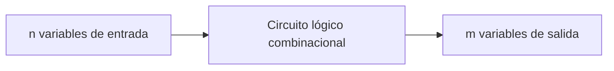
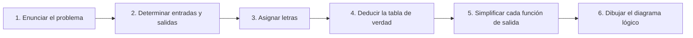

# Diseño con lógica combinacional

## Ubicación y alcance en el libro

Este desarrollo sigue el **capítulo 4, “Lógica combinacional”**, de Morris Mano:

1. **Sección 4-1, “Introducción”**, PDF pp. 132–133 (libro pp. 120–121).
2. **Sección 4-2, “Procedimiento de diseño”**, PDF pp. 133–135 (libro pp. 121–123).
3. **Sección 4-3, “Sumadores”**, PDF pp. 135–139 (libro pp. 123–127).
4. **Sección 4-4, “Sustractores”**, PDF pp. 139–142 (libro pp. 127–130).
5. **Sección 4-5, “Conversión entre códigos”**, PDF pp. 142–145 (libro pp. 130–133).
6. **Sección 4-6, “Procedimiento de análisis”**, PDF pp. 145–148 (libro pp. 133–136).
7. **Sección 4-7, “Circuitos NAND de multinivel”**, PDF pp. 148–156 (libro pp. 136–144).
8. **Sección 4-8, “Circuitos NOR de multinivel”**, PDF pp. 156–160 (libro pp. 144–148).
9. **Sección 4-9, “Las funciones OR exclusiva y de equivalencia”**, PDF pp. 160–166 (libro pp. 148–154).

Se incluyen las tablas 4-1 a 4-5 y los ejemplos de diseño y análisis de las figuras 4-1 a 4-24. Los problemas situados después de la p. 154 impresa no forman parte del desarrollo. Tampoco se adelantan los bloques combinacionales MSI y LSI del capítulo 5, que corresponden al siguiente tema del curso. [[Raw/Lógica Digital y Diseño de Computadores, 1ra Edición, por M. Morris Mano.pdf#page=132|Mano, PDF pp. 132–166 (libro pp. 120–154), capítulo 4]]

## Objetivos de aprendizaje

Al terminar el tema, un estudiante debería poder:

1. explicar qué distingue a un circuito combinacional de uno secuencial;
2. relacionar `n` entradas con sus $2^n$ combinaciones posibles;
3. transformar una especificación verbal en entradas, salidas, tabla de verdad, funciones simplificadas y diagrama lógico;
4. describir y diseñar sumadores y sustractores medios y completos;
5. diseñar un conversor de código usando condiciones de no importa;
6. analizar un circuito dado y obtener sus funciones, tabla de verdad y operación;
7. configurar y analizar funciones multinivel con NAND o NOR;
8. reconocer las propiedades de OR-exclusiva y equivalencia;
9. usar esas funciones para generar y comprobar paridad impar;
10. distinguir el contenido de este capítulo de los bloques MSI/LSI posteriores.

## 1. Qué es un circuito combinacional

Los circuitos lógicos de los sistemas digitales pueden ser **combinacionales** o **secuenciales**.

Un **circuito combinacional** es un conjunto de compuertas lógicas cuyas salidas, en cualquier momento, quedan determinadas directamente por la combinación presente de entradas. No toma en cuenta entradas anteriores. Su comportamiento puede describirse por completo mediante funciones de Boole. [[Raw/Lógica Digital y Diseño de Computadores, 1ra Edición, por M. Morris Mano.pdf#page=132|Mano, PDF pp. 132–133 (libro pp. 120–121), sección 4-1]]

Un circuito secuencial, en cambio, posee elementos de memoria. Sus salidas dependen de:

- las entradas presentes; y
- el estado almacenado, que a su vez refleja entradas anteriores.

El capítulo 4 se limita a circuitos combinacionales. Los secuenciales se reservan para el capítulo 6.

### 1.1 Entradas, compuertas y salidas

El modelo de la figura 4-1 contiene:

- $n$ variables binarias de entrada;
- un conjunto de compuertas lógicas;
- $m$ variables binarias de salida.

Cada entrada y salida solo puede tomar los valores lógicos `0` o `1`. El circuito transforma la información binaria de entrada en la información binaria de salida requerida.

Con $n$ entradas existen:

$$
2^n
$$

combinaciones posibles. Para cada combinación hay una sola combinación de salida. Si existen $m$ salidas, el circuito queda descrito por $m$ funciones de Boole, una para cada salida, y cada función se expresa en términos de las $n$ entradas. [[Raw/Lógica Digital y Diseño de Computadores, 1ra Edición, por M. Morris Mano.pdf#page=133|Mano, PDF p. 133 (libro p. 121)]]

> **Explicación complementaria**
>
> “Una sola combinación de salida” no significa que todas las entradas produzcan salidas diferentes. Dos entradas distintas pueden producir la misma salida. Significa que, fijada una combinación de entrada, el circuito no puede responder unas veces de una forma y otras veces de otra si no posee memoria ni cambia su especificación.

### 1.2 Variables normales y complementadas

Una variable puede llegar al circuito:

- en forma normal, por ejemplo $A$;
- en forma complementada, por ejemplo $A'$;
- o en ambas formas, mediante dos terminales.

Si solo está disponible $A$ y se necesita $A'$, debe añadirse un inversor. Mano supone en los desarrollos siguientes que cada variable puede estar disponible tanto normal como complementada. Esta suposición afecta el conteo de compuertas: si solo se reciben entradas normales, deben contarse los inversores necesarios. [[Raw/Lógica Digital y Diseño de Computadores, 1ra Edición, por M. Morris Mano.pdf#page=133|Mano, PDF p. 133 (libro p. 121)]]

## 2. Procedimiento de diseño

Diseñar significa partir del enunciado de una operación requerida y terminar con:

- funciones de Boole de salida; o
- un diagrama lógico que pueda construirse con compuertas.

Mano organiza el procedimiento en seis pasos. [[Raw/Lógica Digital y Diseño de Computadores, 1ra Edición, por M. Morris Mano.pdf#page=133|Mano, PDF pp. 133–135 (libro pp. 121–123), sección 4-2]]

### Paso 1. Enunciar el problema

Se expresa con precisión qué transformación debe realizar el circuito.

### Paso 2. Determinar el número de entradas y salidas

Se identifica cuántas cantidades binarias debe recibir el circuito y cuántos resultados binarios debe producir.

### Paso 3. Asignar letras

Se asignan símbolos a las variables. Por ejemplo:

- entradas: $x$, $y$, $z$;
- salidas: $S$, $C$.

### Paso 4. Deducir la tabla de verdad

La tabla debe contener:

- una columna por cada entrada;
- una columna por cada salida;
- $2^n$ filas para las combinaciones de las $n$ entradas.

Los valores de salida se deducen del enunciado. Si ciertas combinaciones no pueden ocurrir, se convierten en **condiciones de no importa**.

### Paso 5. Obtener una función simplificada para cada salida

Cada columna de salida representa una función de Boole. Mano permite simplificarla mediante:

- manipulación algebraica;
- método del mapa;
- procedimiento del tabulado.

Estos métodos se desarrollan en [[Wiki/Conceptos/Álgebra de Boole|Álgebra de Boole]], [[Wiki/Conceptos/Métodos de agrupación|Métodos de agrupación]] y [[Wiki/Conceptos/Métodos de simplificación|Métodos de simplificación]].

### Paso 6. Dibujar el diagrama lógico

Se traduce cada función seleccionada a compuertas y conexiones.

### 2.1 La interpretación del enunciado

La tabla de verdad define exactamente el circuito. Por ello, interpretar mal una especificación produce una tabla incorrecta y, en consecuencia, un circuito que no satisface la necesidad planteada. Mano advierte que las especificaciones rara vez son completas y exactas; el diseñador puede necesitar intuición y experiencia para interpretarlas correctamente. [[Raw/Lógica Digital y Diseño de Computadores, 1ra Edición, por M. Morris Mano.pdf#page=134|Mano, PDF p. 134 (libro p. 122)]]

### 2.2 No existe un único criterio de “mejor circuito”

Entre varias expresiones equivalentes pueden considerarse:

1. número mínimo de compuertas;
2. número mínimo de entradas de compuerta;
3. tiempo mínimo de propagación;
4. número mínimo de interconexiones;
5. limitaciones de capacidad de accionamiento o *fan-out*.

No suele ser posible optimizar todos los criterios a la vez. El libro adopta primero la simplificación algebraica de una forma normalizada y deja que la aplicación concreta determine otras restricciones. [[Raw/Lógica Digital y Diseño de Computadores, 1ra Edición, por M. Morris Mano.pdf#page=134|Mano, PDF pp. 134–135 (libro pp. 122–123)]]

> **Explicación complementaria**
>
> El *fan-out* es la cantidad de entradas de otras compuertas que una salida puede accionar correctamente. Una expresión con pocas compuertas puede no ser la más conveniente si una de sus señales debe alimentar demasiadas entradas o si atraviesa muchos niveles antes de producir el resultado.

## 3. Sumadores

La suma de dos dígitos binarios tiene cuatro casos elementales:

$$
\begin{aligned}
0+0&=0,\\
0+1&=1,\\
1+0&=1,\\
1+1&=10.
\end{aligned}
$$

En el último caso, el resultado ocupa dos bits. El bit menos significativo es la suma y el más significativo es el **bit de arrastre**. Un circuito que suma dos bits es un **sumador medio**; uno que suma tres bits, incluido un arrastre de entrada, es un **sumador completo**. [[Raw/Lógica Digital y Diseño de Computadores, 1ra Edición, por M. Morris Mano.pdf#page=135|Mano, PDF p. 135 (libro p. 123), sección 4-3]]

### 3.1 Sumador medio

El sumador medio recibe:

- $x$: primer sumando;
- $y$: segundo sumando.

Produce:

- $S$: bit de suma;
- $C$: bit de arrastre.

| $x$ | $y$ | $C$ | $S$ |
|---:|---:|---:|---:|
| 0 | 0 | 0 | 0 |
| 0 | 1 | 0 | 1 |
| 1 | 0 | 0 | 1 |
| 1 | 1 | 1 | 0 |

De la tabla:

$$
S=x'y+xy'=x\oplus y
$$

$$
C=xy.
$$

La suma vale `1` si las entradas son diferentes. El arrastre vale `1` únicamente si ambas entradas son `1`. [[Raw/Lógica Digital y Diseño de Computadores, 1ra Edición, por M. Morris Mano.pdf#page=135|Mano, PDF pp. 135–137 (libro pp. 123–125), figura 4-2]]

Mano muestra varias configuraciones equivalentes:

1. suma de productos:

   $$
   S=x'y+xy', \qquad C=xy;
   $$

2. producto de sumas:

   $$
   S=(x+y)(x'+y'), \qquad C=xy;
   $$

3. uso de $S'$, sabiendo que:

   $$
   S'=xy+x'y';
   $$

4. otra forma de producir el arrastre:

   $$
   C=xy=(x'+y')';
   $$

5. una compuerta OR-exclusiva para $S$ y una AND para $C$.

Todas producen el mismo comportamiento de entrada y salida. La elección depende de las compuertas disponibles y de las restricciones del diseño.

### 3.2 Sumador completo

Un sumador completo forma la suma aritmética de tres bits:

- $x$ y $y$: bits que se agregan;
- $z$: bit de arrastre procedente de la posición menos significativa anterior.

Produce:

- $S$: bit menos significativo de la suma;
- $C$: arrastre de salida.

| $x$ | $y$ | $z$ | $C$ | $S$ |
|---:|---:|---:|---:|---:|
| 0 | 0 | 0 | 0 | 0 |
| 0 | 0 | 1 | 0 | 1 |
| 0 | 1 | 0 | 0 | 1 |
| 0 | 1 | 1 | 1 | 0 |
| 1 | 0 | 0 | 0 | 1 |
| 1 | 0 | 1 | 1 | 0 |
| 1 | 1 | 0 | 1 | 0 |
| 1 | 1 | 1 | 1 | 1 |

$S=1$ cuando hay un número impar de unos en las entradas. $C=1$ cuando al menos dos de las tres entradas son `1`. Los mapas de la figura 4-3 producen:

$$
S=x'y'z+x'yz'+xy'z'+xyz
$$

$$
C=xy+xz+yz.
$$

[[Raw/Lógica Digital y Diseño de Computadores, 1ra Edición, por M. Morris Mano.pdf#page=137|Mano, PDF pp. 137–139 (libro pp. 125–127), figuras 4-3 y 4-4]]

### 3.3 Sumador completo construido con dos sumadores medios

Mano aprovecha la asociatividad de OR-exclusiva:

$$
S=z\oplus(x\oplus y).
$$

El primer sumador medio suma $x$ y $y$:

$$
S_1=x\oplus y,
$$

y produce el arrastre:

$$
C_1=xy.
$$

El segundo suma $S_1$ con $z$:

$$
S=z\oplus S_1,
$$

y produce:

$$
C_2=z(x\oplus y).
$$

Los arrastres se unen con una OR:

$$
\begin{aligned}
C
&=C_1+C_2\\
&=xy+z(xy'+x'y)\\
&=xy+xy'z+x'yz.
\end{aligned}
$$

Esta función es equivalente a $xy+xz+yz$. El circuito completo utiliza dos sumadores medios y una compuerta OR. [[Raw/Lógica Digital y Diseño de Computadores, 1ra Edición, por M. Morris Mano.pdf#page=139|Mano, PDF p. 139 (libro p. 127), figura 4-5]]

> **Explicación complementaria**
>
> El arrastre de salida debe valer `1` si cualquiera de las dos etapas produjo arrastre. No pueden producirlo simultáneamente: si $xy=1$, entonces $x\oplus y=0$ y la segunda etapa no genera arrastre. Por eso basta sumar lógicamente $C_1$ y $C_2$ con una OR.

## 4. Sustractores

La sustracción binaria puede transformarse en suma usando el complemento del sustraendo. Mano estudia aquí una ejecución directa, semejante al procedimiento de lápiz y papel.

Cuando el bit del minuendo es menor que el del sustraendo, se **presta** un `1` de la posición más significativa siguiente. En binario, ese `1` prestado agrega `2` a la posición actual. La existencia del préstamo debe comunicarse a la posición siguiente mediante una señal binaria. [[Raw/Lógica Digital y Diseño de Computadores, 1ra Edición, por M. Morris Mano.pdf#page=139|Mano, PDF pp. 139–140 (libro pp. 127–128), sección 4-4]]

### 4.1 Sustractor medio

El sustractor medio realiza:

$$
x-y.
$$

Entradas:

- $x$: bit del minuendo;
- $y$: bit del sustraendo.

Salidas:

- $D$: diferencia;
- $B$: bit prestado, de *borrow*.

| $x$ | $y$ | $B$ | $D$ |
|---:|---:|---:|---:|
| 0 | 0 | 0 | 0 |
| 0 | 1 | 1 | 1 |
| 1 | 0 | 0 | 1 |
| 1 | 1 | 0 | 0 |

Las funciones son:

$$
D=x'y+xy'=x\oplus y
$$

$$
B=x'y.
$$

La diferencia tiene la misma lógica que la suma del sumador medio. El préstamo solo aparece en $0-1$: se presta `1`, por lo que la operación se convierte en $2-1=1$. [[Raw/Lógica Digital y Diseño de Computadores, 1ra Edición, por M. Morris Mano.pdf#page=140|Mano, PDF p. 140 (libro p. 128)]]

### 4.2 Sustractor completo

El sustractor completo realiza:

$$
x-y-z,
$$

donde:

- $x$ es el minuendo;
- $y$ es el sustraendo;
- $z$ es el bit prestado de entrada;
- $D$ es la diferencia;
- $B$ es el bit prestado de salida.

| $x$ | $y$ | $z$ | $B$ | $D$ |
|---:|---:|---:|---:|---:|
| 0 | 0 | 0 | 0 | 0 |
| 0 | 0 | 1 | 1 | 1 |
| 0 | 1 | 0 | 1 | 1 |
| 0 | 1 | 1 | 1 | 0 |
| 1 | 0 | 0 | 0 | 1 |
| 1 | 0 | 1 | 0 | 0 |
| 1 | 1 | 0 | 0 | 0 |
| 1 | 1 | 1 | 1 | 1 |

Las funciones simplificadas son:

$$
D=x'y'z+x'yz'+xy'z'+xyz
$$

$$
B=x'y+x'z+yz.
$$

La función de $D$ es idéntica a la función de $S$ del sumador completo. La función de préstamo se parece a la de arrastre:

$$
C=xy+xz+yz,
$$

pero con $x$ complementada:

$$
B=x'y+x'z+yz.
$$

Por esta semejanza, un sumador completo puede convertirse en sustractor completo complementando $x$ antes de aplicarla a las compuertas que forman el arrastre de salida. [[Raw/Lógica Digital y Diseño de Computadores, 1ra Edición, por M. Morris Mano.pdf#page=141|Mano, PDF pp. 141–142 (libro pp. 129–130), figura 4-6]]

## 5. Conversión entre códigos

Dos sistemas digitales pueden representar la misma información con códigos binarios diferentes. Cuando la salida de uno debe servir como entrada de otro, se intercala un **conversor de código**.

Un conversor es un circuito combinacional que recibe las palabras del código A y produce las palabras correspondientes del código B. Mano aplica el procedimiento de diseño a un conversor de BDC a exceso 3. [[Raw/Lógica Digital y Diseño de Computadores, 1ra Edición, por M. Morris Mano.pdf#page=142|Mano, PDF p. 142 (libro p. 130), sección 4-5]]

### 5.1 Tabla 4-1: BDC a exceso 3

Entradas BDC: $A,B,C,D$.

Salidas en exceso 3: $w,x,y,z$.

| Decimal | $A$ | $B$ | $C$ | $D$ | $w$ | $x$ | $y$ | $z$ |
|---:|---:|---:|---:|---:|---:|---:|---:|---:|
| 0 | 0 | 0 | 0 | 0 | 0 | 0 | 1 | 1 |
| 1 | 0 | 0 | 0 | 1 | 0 | 1 | 0 | 0 |
| 2 | 0 | 0 | 1 | 0 | 0 | 1 | 0 | 1 |
| 3 | 0 | 0 | 1 | 1 | 0 | 1 | 1 | 0 |
| 4 | 0 | 1 | 0 | 0 | 0 | 1 | 1 | 1 |
| 5 | 0 | 1 | 0 | 1 | 1 | 0 | 0 | 0 |
| 6 | 0 | 1 | 1 | 0 | 1 | 0 | 0 | 1 |
| 7 | 0 | 1 | 1 | 1 | 1 | 0 | 1 | 0 |
| 8 | 1 | 0 | 0 | 0 | 1 | 0 | 1 | 1 |
| 9 | 1 | 0 | 0 | 1 | 1 | 1 | 0 | 0 |

BDC utiliza diez combinaciones de cuatro bits. Las otras seis, de `1010` a `1111`, no representan dígitos decimales y se marcan como condiciones de no importa. Cada una puede emplearse como `0` o `1` en cada mapa según convenga para simplificar la salida correspondiente. [[Raw/Lógica Digital y Diseño de Computadores, 1ra Edición, por M. Morris Mano.pdf#page=142|Mano, PDF pp. 142–143 (libro pp. 130–131), tabla 4-1 y figura 4-7]]

### 5.2 Funciones simplificadas

Los mapas de la figura 4-7 producen:

$$
z=D'
$$

$$
y=CD+C'D'
$$

$$
x=B'C+B'D+BC'D'
$$

$$
w=A+BC+BD.
$$

Estas expresiones permiten una ejecución de dos niveles. Sin embargo, Mano las manipula para compartir la señal $C+D$:

$$
z=D'
$$

$$
\begin{aligned}
y
&=CD+C'D'\\
&=CD+(C+D)'
\end{aligned}
$$

$$
\begin{aligned}
x
&=B'C+B'D+BC'D'\\
&=B'(C+D)+B(C+D)'
\end{aligned}
$$

$$
\begin{aligned}
w
&=A+BC+BD\\
&=A+B(C+D).
\end{aligned}
$$

La salida de una compuerta OR que calcula $C+D$ se reutiliza en $y$, $x$ y $w$. La figura 4-8 muestra así una ejecución de tres o más niveles con compuertas comunes a varias salidas. [[Raw/Lógica Digital y Diseño de Computadores, 1ra Edición, por M. Morris Mano.pdf#page=144|Mano, PDF p. 144 (libro p. 132), figura 4-8]]

### 5.3 Comparación de las dos ejecuciones

Sin contar inversores de entrada:

- la suma de productos directa requiere siete AND y tres OR;
- la configuración multinivel de la figura 4-8 requiere cuatro AND, cuatro OR y un inversor.

Si solo existen entradas normales:

- la primera ejecución requiere inversores para $B$, $C$ y $D$;
- la segunda requiere inversores para $B$ y $D$.

> **Explicación complementaria**
>
> Este ejemplo muestra por qué “simplificar cada salida por separado” no siempre produce la mejor red completa. En un circuito con varias salidas, una expresión intermedia como $C+D$ puede calcularse una sola vez y compartirse.

## 6. Procedimiento de análisis

El **análisis** es, en cierto sentido, el proceso inverso del diseño:

- el diseño parte de una especificación y llega a funciones o a un diagrama;
- el análisis parte de un diagrama y llega a funciones, tabla de verdad y explicación de la operación.

Antes de analizarlo como combinacional, debe comprobarse que el diagrama no contiene caminos de realimentación ni elementos de memoria. Si los contiene, es secuencial y requiere otro procedimiento. [[Raw/Lógica Digital y Diseño de Computadores, 1ra Edición, por M. Morris Mano.pdf#page=145|Mano, PDF p. 145 (libro p. 133), sección 4-6]]

### 6.1 Obtención de las funciones de salida

Mano propone:

1. señalar con símbolos arbitrarios las salidas de las compuertas que dependen directamente de las entradas y escribir sus funciones;
2. marcar las compuertas que dependen de señales ya identificadas y obtener sus funciones;
3. repetir hasta alcanzar las salidas del circuito;
4. sustituir repetidamente las funciones intermedias hasta expresar cada salida solo con variables de entrada.

### 6.2 Ejemplo de la figura 4-9

El circuito tiene entradas $A,B,C$ y salidas $F_1,F_2$. Las primeras señales son:

$$
F_2=AB+AC+BC
$$

$$
T_1=A+B+C
$$

$$
T_2=ABC.
$$

Las señales siguientes son:

$$
T_3=F_2'T_1
$$

$$
F_1=T_3+T_2.
$$

Sustituyendo:

$$
\begin{aligned}
F_1
&=F_2'T_1+ABC\\
&=(AB+AC+BC)'(A+B+C)+ABC\\
&=A'BC'+A'B'C+AB'C'+ABC.
\end{aligned}
$$

$F_1$ vale `1` cuando hay un número impar de unos; $F_2$ vale `1` cuando al menos dos entradas son `1`. Por tanto, el circuito es un sumador completo:

- $F_1$ es la suma;
- $F_2$ es el arrastre.

[[Raw/Lógica Digital y Diseño de Computadores, 1ra Edición, por M. Morris Mano.pdf#page=146|Mano, PDF pp. 146–147 (libro pp. 134–135), figura 4-9 y tabla 4-2]]

### 6.3 Tabla 4-2

| $A$ | $B$ | $C$ | $F_2$ | $F_2'$ | $T_1$ | $T_2$ | $T_3$ | $F_1$ |
|---:|---:|---:|---:|---:|---:|---:|---:|---:|
| 0 | 0 | 0 | 0 | 1 | 0 | 0 | 0 | 0 |
| 0 | 0 | 1 | 0 | 1 | 1 | 0 | 1 | 1 |
| 0 | 1 | 0 | 0 | 1 | 1 | 0 | 1 | 1 |
| 0 | 1 | 1 | 1 | 0 | 1 | 0 | 0 | 0 |
| 1 | 0 | 0 | 0 | 1 | 1 | 0 | 1 | 1 |
| 1 | 0 | 1 | 1 | 0 | 1 | 0 | 0 | 0 |
| 1 | 1 | 0 | 1 | 0 | 1 | 0 | 0 | 0 |
| 1 | 1 | 1 | 1 | 0 | 1 | 1 | 0 | 1 |

La tabla también puede obtenerse directamente del diagrama:

1. listar las $2^n$ combinaciones de entrada;
2. marcar salidas intermedias;
3. llenar primero las columnas de compuertas que dependen solo de entradas;
4. continuar en cadena hasta obtener todas las salidas.

### 6.4 Análisis de condiciones de no importa

Durante el diseño, una `X` puede asignarse como `0` o `1`. Una vez construido el circuito, ya no existe una salida indeterminada: incluso una combinación “no usada” produce un valor binario concreto, determinado por la elección hecha al simplificar.

Para el conversor BDC a exceso 3 de la figura 4-8:

| Entrada BDC no usada | $wxyz$ producido |
|---:|---:|
| `1010` | `1101` |
| `1011` | `1110` |
| `1100` | `1111` |
| `1101` | `1000` |
| `1110` | `1001` |
| `1111` | `1010` |

Las tres primeras salidas no tienen significado en exceso 3. Las tres últimas coinciden con las palabras que representan los decimales `5`, `6` y `7`, respectivamente. El resultado depende de cómo se aprovecharon las `X` durante el diseño. [[Raw/Lógica Digital y Diseño de Computadores, 1ra Edición, por M. Morris Mano.pdf#page=148|Mano, PDF p. 148 (libro p. 136)]]

## 7. Circuitos NAND de multinivel

Los circuitos combinacionales se construyen con frecuencia con NAND o NOR porque estas compuertas son comunes en circuitos integrados. La sección 3-6 estudia realizaciones de dos niveles; la sección 4-7 extiende el procedimiento a redes de varios niveles. [[Raw/Lógica Digital y Diseño de Computadores, 1ra Edición, por M. Morris Mano.pdf#page=148|Mano, PDF pp. 148–149 (libro pp. 136–137), sección 4-7]]

### 7.1 NAND como compuerta universal

NAND es **universal** porque permite ejecutar las tres operaciones básicas:

| Operación | Ejecución con NAND |
|---|---|
| NOT | Una NAND de una entrada: $A'=(A)'$ |
| AND | Dos NAND: $AB=[(AB)']'$ |
| OR | Invertir entradas y aplicar NAND: $A+B=(A'B')'$ |

Como cualquier función de Boole puede expresarse con AND, OR y NOT, cualquier función puede configurarse únicamente con NAND. [[Raw/Lógica Digital y Diseño de Computadores, 1ra Edición, por M. Morris Mano.pdf#page=149|Mano, PDF p. 149 (libro p. 137), figura 4-10]]

### 7.2 Método del diagrama de bloque

Mano propone tres pasos:

1. dibujar, a partir de la expresión, el diagrama con AND, OR y NOT, suponiendo disponibles las entradas normales y complementadas;
2. sustituir cada AND, OR y NOT por su lógica NAND equivalente;
3. eliminar pares de inversores en cascada; quitar los inversores conectados a entradas externas simples y complementar la variable de entrada correspondiente.

El resultado es la configuración NAND requerida. [[Raw/Lógica Digital y Diseño de Computadores, 1ra Edición, por M. Morris Mano.pdf#page=150|Mano, PDF pp. 150–153 (libro pp. 138–141), figuras 4-11 y 4-12]]

### 7.3 Primer ejemplo

Para:

$$
F=A(B+CD)+BC',
$$

se dibuja primero la configuración AND-OR. Al sustituir cada bloque por NAND equivalentes, aparecen inversores en cascada que se cancelan. El inversor de la entrada $B$ se quita y la entrada se cambia a $B'$. La figura 4-11(c) muestra la red NAND final.

### 7.4 Segundo ejemplo

Para:

$$
F=(A+B')(CD+E),
$$

se aplica el mismo procedimiento. En la figura 4-12 queda un inversor adicional en la salida, ejecutado mediante una NAND de una entrada.

En general, si están disponibles las variables normales y complementadas, el número de NAND tiende a ser igual al número de compuertas AND-OR, salvo algún inversor ocasional. Si solo existen entradas normales, deben agregarse inversores para generar los complementos requeridos.

### 7.5 Análisis algebraico de una red NAND

El análisis sigue la sección 4-6, pero usa repetidamente De Morgan. Para la figura 4-13:

$$
T_1=(CD)'=C'+D'
$$

$$
T_2=(BC')'=B'+C
$$

$$
\begin{aligned}
T_3
&=(B'T_1)'\\
&=[B'(C'+D')]'\\
&=B+CD
\end{aligned}
$$

$$
T_4=(AT_3)'=[A(B+CD)]'
$$

$$
\begin{aligned}
F
&=(T_2T_4)'\\
&=BC'+A(B+CD).
\end{aligned}
$$

La tabla 4-3 y el mapa de la figura 4-14 confirman:

$$
F=AB+ACD+BC'=A(B+CD)+BC'.
$$

La tabla se obtiene evaluando primero $T_1$ y $T_2$, que dependen solo de entradas, y continuando después con $T_3$, $T_4$ y $F$:

| $A$ | $B$ | $C$ | $D$ | $T_1$ | $T_2$ | $T_3$ | $T_4$ | $F$ |
|---:|---:|---:|---:|---:|---:|---:|---:|---:|
| 0 | 0 | 0 | 0 | 1 | 1 | 0 | 1 | 0 |
| 0 | 0 | 0 | 1 | 1 | 1 | 0 | 1 | 0 |
| 0 | 0 | 1 | 0 | 1 | 1 | 0 | 1 | 0 |
| 0 | 0 | 1 | 1 | 0 | 1 | 1 | 1 | 0 |
| 0 | 1 | 0 | 0 | 1 | 0 | 1 | 1 | 1 |
| 0 | 1 | 0 | 1 | 1 | 0 | 1 | 1 | 1 |
| 0 | 1 | 1 | 0 | 1 | 1 | 1 | 1 | 0 |
| 0 | 1 | 1 | 1 | 0 | 1 | 1 | 1 | 0 |
| 1 | 0 | 0 | 0 | 1 | 1 | 0 | 1 | 0 |
| 1 | 0 | 0 | 1 | 1 | 1 | 0 | 1 | 0 |
| 1 | 0 | 1 | 0 | 1 | 1 | 0 | 1 | 0 |
| 1 | 0 | 1 | 1 | 0 | 1 | 1 | 0 | 1 |
| 1 | 1 | 0 | 0 | 1 | 0 | 1 | 0 | 1 |
| 1 | 1 | 0 | 1 | 1 | 0 | 1 | 0 | 1 |
| 1 | 1 | 1 | 0 | 1 | 1 | 1 | 0 | 1 |
| 1 | 1 | 1 | 1 | 0 | 1 | 1 | 0 | 1 |

[[Raw/Lógica Digital y Diseño de Computadores, 1ra Edición, por M. Morris Mano.pdf#page=153|Mano, PDF pp. 153–155 (libro pp. 141–143), figuras 4-13 y 4-14 y tabla 4-3]]

### 7.6 Transformación del diagrama de bloque NAND

Una NAND puede representarse como:

- AND con salida invertida; o
- OR con entradas invertidas.

Para convertir una red NAND a su equivalente AND-OR:

1. comenzar en el último nivel;
2. cambiar la NAND de ese nivel a su símbolo OR invertido;
3. cambiar símbolos en niveles alternos;
4. eliminar pares de círculos en la misma línea;
5. retirar los círculos de entradas externas complementando la variable correspondiente;
6. eliminar compuertas AND u OR de una sola entrada que no inviertan.

Los círculos representan complementación; dos círculos consecutivos se cancelan. La figura 4-16 ilustra la conversión. [[Raw/Lógica Digital y Diseño de Computadores, 1ra Edición, por M. Morris Mano.pdf#page=156|Mano, PDF pp. 156–157 (libro pp. 144–145), figuras 4-15 y 4-16]]

## 8. Circuitos NOR de multinivel

NOR es el dual de NAND. Por ello, sus procedimientos y reglas son los duales de los estudiados para NAND. [[Raw/Lógica Digital y Diseño de Computadores, 1ra Edición, por M. Morris Mano.pdf#page=156|Mano, PDF pp. 156–160 (libro pp. 144–148), sección 4-8]]

### 8.1 NOR como compuerta universal

| Operación | Ejecución con NOR |
|---|---|
| NOT | Una NOR de una entrada: $A'=(A)'$ |
| OR | Dos NOR: $A+B=[(A+B)']'$ |
| AND | Invertir entradas y aplicar NOR: $AB=(A'+B')'$ |

La figura 4-17 muestra estas tres configuraciones.

### 8.2 Método del diagrama de bloque

1. Dibujar el diagrama AND-OR desde la expresión, suponiendo entradas normales y complementadas.
2. Sustituir cada AND, OR y NOT por su lógica NOR equivalente.
3. Eliminar inversores en cascada; quitar inversores de entradas externas simples y complementar las variables correspondientes.

Mano aplica el procedimiento a:

$$
F=A(B+CD)+BC'.
$$

La figura 4-18 muestra la configuración AND-OR, la sustitución por bloques NOR y el circuito NOR final.

### 8.3 Análisis de NOR

Se marcan señales intermedias, se aplican las funciones de cada NOR y se sustituye hasta expresar la salida con las entradas. También puede obtenerse la tabla de verdad directamente, llenando las columnas de las compuertas en el orden en que se propagan las señales.

Una salida NOR típica:

$$
T=(A+B'+C)'
$$

vale `0` cuando $A=1$, $B=0$ o $C=1$, y vale `1` en las demás combinaciones.

### 8.4 Transformación del diagrama de bloque NOR

Una NOR puede representarse como:

- OR con salida invertida; o
- AND con entradas invertidas.

Para convertir una red NOR a AND-OR:

1. cambiar la NOR del último nivel a su símbolo AND invertido;
2. continuar alternando símbolos entre niveles;
3. cancelar pares de círculos en una misma línea;
4. quitar círculos de entradas externas complementando las variables;
5. eliminar compuertas de una entrada sin función lógica.

La figura 4-20 muestra el procedimiento completo. [[Raw/Lógica Digital y Diseño de Computadores, 1ra Edición, por M. Morris Mano.pdf#page=160|Mano, PDF pp. 160–161 (libro pp. 148–149), figuras 4-19 y 4-20]]

## 9. OR-exclusiva y equivalencia

Mano define dos operaciones binarias:

$$
x\oplus y=xy'+x'y
$$

$$
x\odot y=xy+x'y'.
$$

La OR-exclusiva vale `1` cuando las dos entradas son diferentes. La equivalencia vale `1` cuando son iguales. Son complementos entre sí:

$$
(x\oplus y)'=x\odot y.
$$

Ambas son:

- conmutativas;
- asociativas.

Por tanto, una expresión con tres o más variables puede escribirse sin paréntesis:

$$
(A\oplus B)\oplus C=A\oplus(B\oplus C)=A\oplus B\oplus C.
$$

Aunque se dibujan compuertas de varias entradas, Mano advierte que pueden ser poco económicas y que incluso la función de dos entradas suele construirse internamente con otras compuertas. La figura 4-21 muestra una OR-exclusiva construida con AND-OR-NOT y otra con NAND. [[Raw/Lógica Digital y Diseño de Computadores, 1ra Edición, por M. Morris Mano.pdf#page=160|Mano, PDF pp. 160–162 (libro pp. 148–150), sección 4-9 y figura 4-21]]

### 9.1 OR-exclusiva de $n$ variables

Una expresión OR-exclusiva de $n$ variables corresponde a una función con:

$$
\frac{2^n}{2}
$$

términos mínimos. Son aquellos cuyos índices binarios contienen un número **impar de unos**.

Para cuatro variables:

$$
A\oplus B\oplus C\oplus D
=\Sigma(1,2,4,7,8,11,13,14).
$$

Cada índice de esa lista contiene uno o tres bits iguales a `1`. [[Raw/Lógica Digital y Diseño de Computadores, 1ra Edición, por M. Morris Mano.pdf#page=162|Mano, PDF pp. 162–163 (libro pp. 150–151), figura 4-22(a)]]

### 9.2 Equivalencia de $n$ variables

Según la convención usada por Mano, una expresión de equivalencia de $n$ variables contiene los $2^n/2$ términos mínimos cuyos índices binarios tienen un número **par de ceros**.

Esto produce una consecuencia que depende de si $n$ es par o impar:

- si $n$ es impar, “número par de ceros” equivale a “número impar de unos”, por lo que OR-exclusiva y equivalencia de las mismas $n$ variables representan la misma función;
- si $n$ es par, las dos funciones son complementarias.

Por ejemplo, para cuatro variables los mapas de $A\oplus B\oplus C\oplus D$ y $A\odot B\odot C\odot D$ son complementarios. Para tres variables:

$$
A\oplus B\oplus C=A\odot B\odot C.
$$

También:

$$
(A\oplus B\oplus C)'=A\oplus B\odot C
$$

o:

$$
(A\odot B\odot C)'=A\odot B\oplus C.
$$

[[Raw/Lógica Digital y Diseño de Computadores, 1ra Edición, por M. Morris Mano.pdf#page=163|Mano, PDF pp. 163–164 (libro pp. 151–152), figuras 4-22 y 4-23]]

> **Explicación complementaria**
>
> La equivalencia de más de dos entradas puede resultar contraintuitiva. En este capítulo debe seguirse la definición operacional del autor: asociar compuertas de equivalencia de dos entradas. La relación con “ceros pares” y su coincidencia con OR-exclusiva cuando hay un número impar de variables se deriva de esa asociación.

### 9.3 Uso aritmético

Las funciones de suma y diferencia:

$$
S=x\oplus y
$$

y:

$$
D=x\oplus y\oplus z
$$

son funciones OR-exclusivas. Esto explica su utilidad en sumas y restas repetitivas.

## 10. Generación y comprobación de paridad impar

Un bit de paridad es un bit adicional que hace que la cantidad total de unos sea par o impar. El generador se coloca en el transmisor y el comprobador en el receptor. Si la paridad recibida no coincide con la esperada, se detecta un error. [[Raw/Lógica Digital y Diseño de Computadores, 1ra Edición, por M. Morris Mano.pdf#page=164|Mano, PDF pp. 164–165 (libro pp. 152–153), figura 4-24]]

### 10.1 Tabla 4-4: generador de paridad impar

Para un mensaje de tres bits $x,y,z$, se elige $P$ de modo que los cuatro bits contengan una cantidad impar de unos:

| $x$ | $y$ | $z$ | $P$ |
|---:|---:|---:|---:|
| 0 | 0 | 0 | 1 |
| 0 | 0 | 1 | 0 |
| 0 | 1 | 0 | 0 |
| 0 | 1 | 1 | 1 |
| 1 | 0 | 0 | 0 |
| 1 | 0 | 1 | 1 |
| 1 | 1 | 0 | 1 |
| 1 | 1 | 1 | 0 |

La salida vale `1` cuando $x,y,z$ contienen un número par de unos:

$$
P=x\odot y\odot z.
$$

Por la relación para tres variables:

$$
P=x\odot y\oplus z.
$$

La figura 4-24(a) utiliza una OR-exclusiva de dos entradas seguida de una equivalencia de dos entradas; pueden intercambiarse sin cambiar la función.

### 10.2 Tabla 4-5: comprobador de paridad impar

El comprobador recibe $x,y,z,P$. Si la transmisión correcta debía contener un número impar de unos, existe error cuando recibe un número **par** de unos. Por ello, $C=1$ indica error.

| $x$ | $y$ | $z$ | $P$ | $C$ |
|---:|---:|---:|---:|---:|
| 0 | 0 | 0 | 0 | 1 |
| 0 | 0 | 0 | 1 | 0 |
| 0 | 0 | 1 | 0 | 0 |
| 0 | 0 | 1 | 1 | 1 |
| 0 | 1 | 0 | 0 | 0 |
| 0 | 1 | 0 | 1 | 1 |
| 0 | 1 | 1 | 0 | 1 |
| 0 | 1 | 1 | 1 | 0 |
| 1 | 0 | 0 | 0 | 0 |
| 1 | 0 | 0 | 1 | 1 |
| 1 | 0 | 1 | 0 | 1 |
| 1 | 0 | 1 | 1 | 0 |
| 1 | 1 | 0 | 0 | 1 |
| 1 | 1 | 0 | 1 | 0 |
| 1 | 1 | 1 | 0 | 0 |
| 1 | 1 | 1 | 1 | 1 |

La función es:

$$
C=x\odot y\odot z\odot P.
$$

El comprobador utiliza tres compuertas de equivalencia de dos entradas. El mismo circuito puede servir como generador si se mantiene $P=0$ y se interpreta la salida como el bit de paridad generado. [[Raw/Lógica Digital y Diseño de Computadores, 1ra Edición, por M. Morris Mano.pdf#page=165|Mano, PDF pp. 165–166 (libro pp. 153–154), tablas 4-4 y 4-5 y figura 4-24]]

> **Explicación complementaria**
>
> El circuito comprueba la paridad global, no identifica qué bit cambió. Además, si se alteran dos bits, la paridad puede conservarse y el error no ser detectado. Esa limitación procede de la técnica de paridad descrita en la sección 1-6; aquí el capítulo se concentra en construir el generador y el comprobador.

## 11. Síntesis del procedimiento completo

| Situación inicial | Procedimiento | Resultado |
|---|---|---|
| Especificación verbal | Identificar variables, construir tabla, simplificar y dibujar | Circuito diseñado |
| Tabla de verdad | Simplificar cada salida y elegir compuertas | Diagrama lógico |
| Diagrama AND-OR | Marcar señales y sustituir funciones | Funciones y tabla |
| Expresión AND-OR | Sustituir bloques universales y cancelar inversiones | Red NAND o NOR |
| Diagrama NAND/NOR | Aplicar De Morgan nivel por nivel | Función equivalente |
| Código de entrada y código de salida | Relacionar palabras y usar `X` en entradas no usadas | Conversor de código |

La idea central del capítulo es que especificación, tabla de verdad, función de Boole y diagrama lógico son representaciones diferentes de un mismo comportamiento combinacional.

## 12. Errores frecuentes

> **Explicación complementaria**

1. **Confundir arrastre de entrada con arrastre de salida.** En el sumador completo, $z$ entra desde la posición menos significativa y $C$ sale hacia la más significativa.
2. **Intercambiar minuendo y sustraendo.** En $x-y$, el préstamo del sustractor medio es $B=x'y$, no $xy'$.
3. **Usar una `X` como si permaneciera indeterminada.** Después de construir el circuito, la entrada no usada produce una salida concreta.
4. **Analizar una red con realimentación como combinacional.** La ausencia de memoria y de caminos de realimentación debe comprobarse primero.
5. **Cancelar una sola inversión.** Solo dos complementaciones consecutivas sobre la misma señal se anulan.
6. **Olvidar los inversores de entrada.** El conteo de Mano supone con frecuencia disponibles las formas normal y complementada.
7. **Suponer que OR-exclusiva de muchas entradas significa “exactamente un uno”.** En el capítulo significa un número impar de unos.
8. **Confundir detectar con corregir errores.** El comprobador de paridad solo produce una indicación de error.

## 13. Preguntas de comprobación

> **Explicación complementaria**
>
> Estas preguntas se limitan al contenido del capítulo 4.

1. ¿Cuántas combinaciones de entrada tiene un circuito con cinco entradas?
2. ¿Cuántas funciones de salida describen un circuito con cuatro salidas?
3. Enumere los seis pasos del procedimiento de diseño.
4. Escriba las funciones de un sumador medio.
5. ¿Cuándo vale `1` el arrastre de un sumador completo?
6. Escriba las funciones de un sustractor medio.
7. ¿Qué relación existe entre la diferencia del sustractor completo y la suma del sumador completo?
8. ¿Por qué aparecen seis condiciones de no importa en el conversor BDC?
9. ¿Qué señal intermedia comparten las salidas del conversor de la figura 4-8?
10. ¿Qué debe verificarse antes de analizar un circuito como combinacional?
11. ¿Por qué NAND y NOR se llaman compuertas universales?
12. ¿Cuándo vale `1` una OR-exclusiva de $n$ entradas?
13. ¿Qué valor debe generar el bit de paridad impar para el mensaje `101`?
14. ¿Qué indica $C=1$ en el comprobador de paridad impar?
15. ¿Puede un comprobador de paridad localizar el bit alterado?

## 14. Respuestas breves

1. $2^5=32$.
2. Cuatro, una por cada salida.
3. Enunciar; contar entradas y salidas; asignar letras; deducir la tabla; simplificar cada salida; dibujar el diagrama.
4. $S=x\oplus y$ y $C=xy$.
5. Cuando al menos dos de sus tres entradas valen `1`.
6. $D=x\oplus y$ y $B=x'y$.
7. Son la misma función OR-exclusiva de tres variables.
8. Porque cuatro bits producen 16 combinaciones y BDC solo usa 10.
9. $C+D$.
10. Que no existan caminos de realimentación ni elementos de memoria.
11. Porque cada una puede ejecutar NOT, AND y OR.
12. Cuando hay un número impar de unos.
13. `1`, para que el total de unos sea tres.
14. Que se recibió un número par de unos y, por tanto, la paridad impar es incorrecta.
15. No.

## Relación con el curso

Este tema integra los conocimientos previos:

- [[Wiki/Conceptos/Bases numéricas|Bases numéricas]] y [[Wiki/Conceptos/Códigos binarios y complementos|Códigos binarios y complementos]] aportan las operaciones y representaciones;
- [[Wiki/Conceptos/Lógica binaria|Lógica binaria]] y [[Wiki/Conceptos/Compuertas lógicas|Compuertas lógicas]] aportan las operaciones físicas;
- [[Wiki/Conceptos/Álgebra de Boole|Álgebra de Boole]], [[Wiki/Conceptos/Métodos de agrupación|Métodos de agrupación]] y [[Wiki/Conceptos/Métodos de simplificación|Métodos de simplificación]] permiten derivar y reducir las funciones.

Pertenece a la [[Wiki/Unidades/Unidad 1 - Lógica combinacional|Unidad 1 - Lógica combinacional]]. El capítulo 5 reutiliza este procedimiento en [[Wiki/Conceptos/Bloques digitales combinacionales de mediana escala de integración|Bloques digitales combinacionales de mediana escala de integración]], pero esos dispositivos quedan fuera de esta página.

## Fuentes y límites

- Definición y procedimiento general: §§4-1 y 4-2. [[Raw/Lógica Digital y Diseño de Computadores, 1ra Edición, por M. Morris Mano.pdf#page=132|Mano, PDF pp. 132–135 (libro pp. 120–123)]]
- Sumadores y sustractores: §§4-3 y 4-4. [[Raw/Lógica Digital y Diseño de Computadores, 1ra Edición, por M. Morris Mano.pdf#page=135|Mano, PDF pp. 135–142 (libro pp. 123–130)]]
- Conversión de códigos y análisis: §§4-5 y 4-6. [[Raw/Lógica Digital y Diseño de Computadores, 1ra Edición, por M. Morris Mano.pdf#page=142|Mano, PDF pp. 142–148 (libro pp. 130–136)]]
- NAND y NOR multinivel: §§4-7 y 4-8. [[Raw/Lógica Digital y Diseño de Computadores, 1ra Edición, por M. Morris Mano.pdf#page=148|Mano, PDF pp. 148–160 (libro pp. 136–148)]]
- OR-exclusiva, equivalencia y paridad: §4-9. [[Raw/Lógica Digital y Diseño de Computadores, 1ra Edición, por M. Morris Mano.pdf#page=160|Mano, PDF pp. 160–166 (libro pp. 148–154)]]
- Se combinaron extracción textual y revisión visual de las 35 páginas PDF.
- Se incluyeron las tablas 4-1 a 4-5 y los ejemplos de las figuras 4-1 a 4-24.
- Se excluyeron los problemas del capítulo 4 y los bloques MSI/LSI del capítulo 5, desarrollados por separado en [[Wiki/Conceptos/Bloques digitales combinacionales de mediana escala de integración|Bloques digitales combinacionales de mediana escala de integración]].

## Contradicciones y dudas

- La figura 4-6 aparece dentro de la sección de sustractores, deriva $D$ y $B$ y el texto la presenta como los mapas del sustractor completo; sin embargo, su pie dice «Mapas para un sumador completo». Se considera una errata de rotulación de la edición disponible. [[Raw/Lógica Digital y Diseño de Computadores, 1ra Edición, por M. Morris Mano.pdf#page=141|Mano, PDF p. 141 (libro p. 129), figura 4-6]]
- La sección 4-9 afirma «La salida S de un sumador medio y la salida D de un sumador completo». Según las definiciones de §§4-3 y 4-4, $D$ es la salida de diferencia del **sustractor** completo. Se conserva como posible errata sin alterar la fuente. [[Raw/Lógica Digital y Diseño de Computadores, 1ra Edición, por M. Morris Mano.pdf#page=163|Mano, PDF p. 163 (libro p. 151)]]
