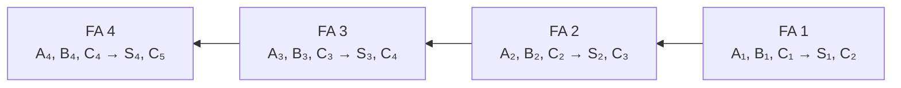
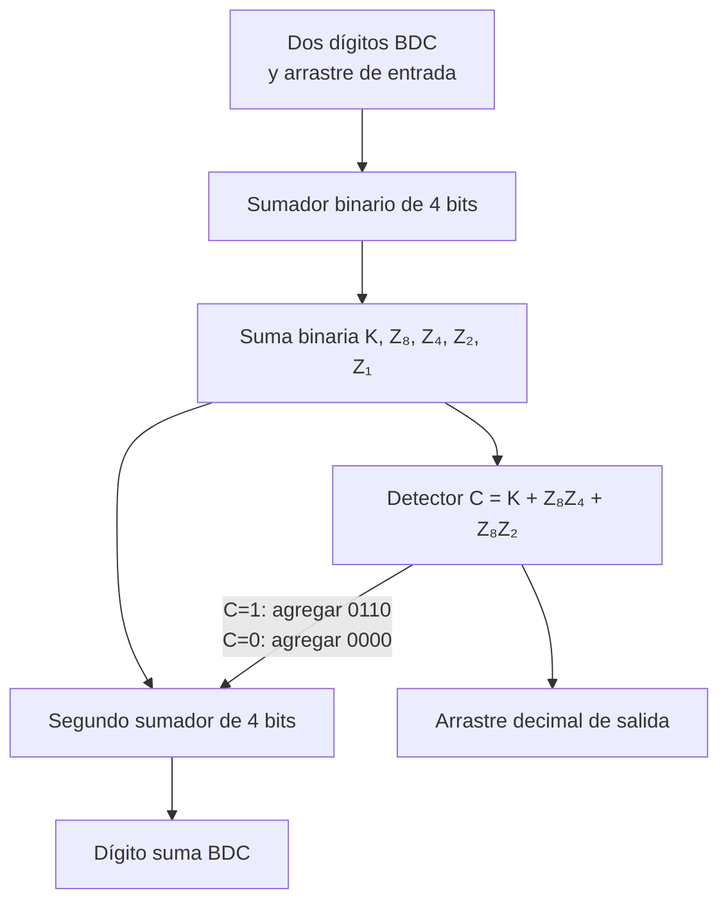

# Bloques digitales combinacionales de mediana escala de integración

## Ubicación y alcance en el libro

Este desarrollo sigue el **capítulo 5, “Lógica combinacional con MSI y LSI”**, de Morris Mano:

1. **Sección 5-1, “Introducción”**, PDF pp. 171–172 (libro pp. 159–160).
2. **Sección 5-2, “Sumador paralelo binario”**, PDF pp. 172–178 (libro pp. 160–166).
3. **Sección 5-3, “Sumador decimal”**, PDF pp. 178–181 (libro pp. 166–169).
4. **Sección 5-4, “Comparador de magnitudes”**, PDF pp. 182–184 (libro pp. 170–172).
5. **Sección 5-5, “Decodificadores”**, PDF pp. 183–193 (libro pp. 171–181).
6. **Sección 5-6, “Multiplexores”**, PDF pp. 193–200 (libro pp. 181–188).
7. **Sección 5-7, “Memoria de solo lectura (ROM)”**, PDF pp. 200–207 (libro pp. 188–195).
8. **Sección 5-8, “Arreglo lógico programable (PLA)”**, PDF pp. 207–213 (libro pp. 195–201).
9. **Sección 5-9, “Notas concluyentes”**, PDF pp. 213–214 (libro pp. 201–202).

El nombre oficial del tema menciona bloques de **mediana escala de integración (MSI)**. El capítulo de Mano incluye también ROM y PLA, clasificados allí como **LSI**, y los presenta como continuación directa de los métodos MSI para ejecutar lógica combinacional. Por eso se desarrolla el capítulo completo, respetando el orden del autor. Se incluyen las tablas 5-1 a 5-5 y los ejemplos 5-1 a 5-6. Se excluyen las referencias, los problemas y las aplicaciones secuenciales o de procesador anunciadas para capítulos posteriores. [[Raw/Lógica Digital y Diseño de Computadores, 1ra Edición, por M. Morris Mano.pdf#page=171|Mano, PDF pp. 171–214 (libro pp. 159–202), capítulo 5]]

## Objetivos de aprendizaje

Al terminar el tema, un estudiante debería poder:

1. explicar por qué el menor número de compuertas no siempre produce el circuito integrado más económico;
2. distinguir el uso de compuertas SSI, funciones MSI y funciones LSI en el enfoque del capítulo;
3. construir conceptualmente un sumador paralelo conectando sumadores completos en cascada;
4. explicar el problema de propagación del arrastre y el principio del arrastre posterior;
5. describir la corrección necesaria en un sumador BDC;
6. comparar dos números binarios mediante las salidas $A>B$, $A=B$ y $A<B$;
7. explicar y utilizar decodificadores, demultiplexores, codificadores y codificadores de prioridad;
8. explicar y utilizar multiplexores como selectores de datos y como ejecutores de funciones de Boole;
9. determinar el tamaño de una ROM a partir del número de entradas y salidas;
10. obtener una tabla de programación para ROM;
11. explicar la organización y programación lógica de un PLA;
12. comparar las realizaciones con decodificador, multiplexor, ROM y PLA.

## 1. Del diseño con compuertas a los bloques integrados

En [[Wiki/Conceptos/Diseño con lógica combinacional|Diseño con lógica combinacional]], el procedimiento clásico busca simplificar cada función de Boole y reducir el número de compuertas. Ese criterio supone que, entre dos circuitos equivalentes, el que usa menos compuertas cuesta menos.

Mano advierte que esta suposición deja de ser necesariamente cierta cuando se usan circuitos integrados:

- una sola pastilla puede contener varias compuertas;
- conviene aprovechar compuertas ya incluidas, aunque aumente el total lógico;
- muchas conexiones entre compuertas son internas a la pastilla;
- el costo depende del número y tipo de circuitos integrados y de sus conexiones externas, no solo del número abstracto de compuertas.

Por ello, la primera pregunta antes de un diseño detallado debe ser:

> ¿La función requerida ya está disponible en una pastilla de circuito integrado?

Si existe una función MSI apropiada, suele reducir de manera importante el número de pastillas y el cableado frente a una realización con compuertas SSI. Si no produce exactamente la operación requerida, puede incorporarse como parte de un método alternativo. [[Raw/Lógica Digital y Diseño de Computadores, 1ra Edición, por M. Morris Mano.pdf#page=171|Mano, PDF pp. 171–172 (libro pp. 159–160), sección 5-1]]

### 1.1 SSI, MSI y LSI en el enfoque del capítulo

El autor emplea tres niveles de integración:

- **SSI**: pastillas de pequeña escala que contienen compuertas elementales;
- **MSI**: pastillas que realizan funciones digitales completas y comunes, como sumadores, comparadores, decodificadores o multiplexores;
- **LSI**: componentes de mayor integración que permiten ejecutar redes combinacionales más extensas, como ROM y PLA.

El capítulo no fija aquí cantidades universales de compuertas para separar las categorías. Su interés es funcional: pasar de conectar compuertas individuales a reutilizar bloques integrados.

> **Explicación complementaria**
>
> Un bloque MSI se estudia como una “caja” con una operación conocida. Para usarlo no hace falta rediseñar todas sus compuertas internas; basta comprender sus entradas, salidas y comportamiento. Las figuras internas del capítulo sirven para entender la función, mientras que en un diseño real suele dibujarse solamente el bloque.

### 1.2 Organización del capítulo

La primera parte presenta la construcción y aplicación de funciones MSI:

1. sumador paralelo binario;
2. sumador decimal;
3. comparador de magnitudes.

La segunda introduce cuatro recursos generales para configurar circuitos combinacionales:

1. decodificadores;
2. multiplexores;
3. memorias de solo lectura, ROM;
4. arreglos lógicos programables, PLA.

## 2. Sumador paralelo binario

Un sumador completo agrega dos bits y un arrastre de entrada. Para sumar dos números de $n$ bits se conectan $n$ sumadores completos.

Mano distingue dos métodos:

- **suma en serie**: usa un solo sumador completo y procesa un par de bits a la vez; un elemento conserva el arrastre;
- **suma en paralelo**: usa $n$ sumadores completos y aplica simultáneamente todos los bits de los dos números.

Un **sumador paralelo binario** es una función digital que produce en paralelo la suma aritmética de dos números binarios. Los sumadores completos se conectan en cascada: el arrastre de salida de cada posición se convierte en el arrastre de entrada de la posición inmediata de mayor orden. [[Raw/Lógica Digital y Diseño de Computadores, 1ra Edición, por M. Morris Mano.pdf#page=172|Mano, PDF pp. 172–174 (libro pp. 160–162), sección 5-2 y figura 5-1]]

### 2.1 Ejemplo de suma de cuatro bits

Sean:

$$
A=1011
$$

$$
B=0011.
$$

Con arrastre inicial $C_1=0$:

| Posición $i$ | 4 | 3 | 2 | 1 |
|---|---:|---:|---:|---:|
| Arrastre de entrada $C_i$ | 0 | 1 | 1 | 0 |
| Sumando $A_i$ | 1 | 0 | 1 | 1 |
| Sumando $B_i$ | 0 | 0 | 1 | 1 |
| Suma $S_i$ | 1 | 1 | 1 | 0 |
| Arrastre de salida $C_{i+1}$ | 0 | 0 | 1 | 1 |

El resultado es:

$$
1011+0011=1110.
$$

La suma comienza lógicamente en la posición menos significativa. Cada arrastre debe alcanzar la etapa siguiente antes de que esa etapa produzca su suma definitiva.

### 2.2 Sumador paralelo de cuatro bits

La figura 5-1 conecta cuatro bloques FA (*full adder*):

- $C_1$ es el arrastre de entrada de toda la unidad.
- $C_5$ es el arrastre de salida.
- $S_1$ es el bit de suma de menor orden.
- $S_4$ es el bit de suma de mayor orden.

Para aumentar el número de bits se conectan en cascada pastillas sumadoras de uno, dos o cuatro bits. La salida de arrastre de una pastilla se conecta a la entrada de arrastre de la siguiente.

### 2.3 Por qué conviene el método iterativo

Un diseño clásico del sumador de cuatro bits tendría nueve entradas:

- cuatro bits de $A$;
- cuatro bits de $B$;
- un arrastre de entrada.

Su tabla tendría:

$$
2^9=512
$$

filas. La conexión repetida de un bloque conocido produce una estructura más sencilla y regular que deducir nueve funciones desde esa tabla.

### 2.4 Ejemplo 5-1: conversor BDC a exceso 3

En exceso 3, cada dígito BDC se transforma sumándole:

$$
0011.
$$

El conversor diseñado en el capítulo 4 con compuertas SSI requiere, según Mano:

- 11 compuertas;
- tres circuitos integrados;
- 14 conexiones internas, sin contar entradas y salidas.

Con un sumador MSI de cuatro bits:

- el dígito BDC se conecta a las entradas $A$;
- las entradas $B$ se fijan en `0011`;
- $C_1$ se fija en `0`;
- las salidas $S$ entregan el código exceso 3;
- $C_5$ no se usa.

La nueva configuración requiere una pastilla y cinco conexiones internas, sin contar entradas y salidas. El ejemplo muestra que reconocer una operación aritmética conocida puede ser más eficiente que simplificar cada salida por separado. [[Raw/Lógica Digital y Diseño de Computadores, 1ra Edición, por M. Morris Mano.pdf#page=174|Mano, PDF pp. 174–175 (libro pp. 162–163), ejemplo 5-1 y figura 5-2]]

## 3. Propagación del arrastre

Aunque todos los bits se aplican al mismo tiempo, las señales necesitan propagarse por las compuertas. Una salida transitoria no debe considerarse válida hasta que haya transcurrido el tiempo necesario.

En un sumador en cascada, el camino más largo suele ser el del arrastre:

$$
C_1\rightarrow C_2\rightarrow C_3\rightarrow\cdots\rightarrow C_{n+1}.
$$

Cada arrastre atraviesa una AND y una OR dentro del sumador completo, es decir, dos niveles. Para $n$ sumadores:

$$
2n
$$

niveles intervienen en la propagación desde el arrastre de entrada hasta el arrastre final. En cuatro bits son ocho niveles, además de la demora necesaria para formar las señales locales. [[Raw/Lógica Digital y Diseño de Computadores, 1ra Edición, por M. Morris Mano.pdf#page=175|Mano, PDF pp. 175–176 (libro pp. 163–164), figura 5-3]]

> **Explicación complementaria**
>
> “Paralelo” significa que los bits llegan simultáneamente, no que el resultado final aparezca de manera instantánea. La dependencia entre arrastres crea una cadena temporal: una etapa puede conocer $A_i$ y $B_i$, pero aún debe esperar el $C_i$ correcto.

### 3.1 Arrastre propagado y arrastre generado

Para la etapa $i$, Mano define:

$$
P_i=A_i\oplus B_i
$$

$$
G_i=A_iB_i.
$$

$G_i$ es el **arrastre generado**: vale `1` cuando $A_i=B_i=1$, sin importar $C_i$.

$P_i$ es el **arrastre propagado** porque determina si el arrastre de entrada puede continuar hacia la salida.

La suma y el arrastre son:

$$
S_i=P_i\oplus C_i
$$

$$
C_{i+1}=G_i+P_iC_i.
$$

### 3.2 Principio de observación del arrastre posterior

En lugar de esperar que cada etapa produzca el arrastre de la siguiente, se sustituyen algebraicamente los arrastres:

$$
C_2=G_1+P_1C_1
$$

$$
\begin{aligned}
C_3
&=G_2+P_2C_2\\
&=G_2+P_2G_1+P_2P_1C_1
\end{aligned}
$$

$$
\begin{aligned}
C_4
&=G_3+P_3C_3\\
&=G_3+P_3G_2+P_3P_2G_1+P_3P_2P_1C_1.
\end{aligned}
$$

Cada función queda en suma de productos y puede ejecutarse con dos niveles AND-OR o NAND-NAND. Así, $C_4$ no necesita esperar físicamente a que $C_2$ y $C_3$ recorran una cadena; los arrastres se calculan en paralelo a partir de $P$, $G$ y $C_1$. Mano llama a este recurso **generador del bit de arrastre posterior**. [[Raw/Lógica Digital y Diseño de Computadores, 1ra Edición, por M. Morris Mano.pdf#page=176|Mano, PDF pp. 176–178 (libro pp. 164–166), figuras 5-4 y 5-5]]

En el sumador de cuatro bits de la figura 5-5:

1. las OR-exclusivas forman $P_i$;
2. las AND forman $G_i$;
3. el generador produce los arrastres;
4. una segunda OR-exclusiva produce cada $S_i$.

Después de que $P$ y $G$ se estabilizan, todos los arrastres aparecen tras la demora de dos niveles del generador.

## 4. Sumador decimal

Los sistemas que operan directamente con números decimales codificados necesitan aceptar y producir el código decimal elegido. En BDC, cada dígito decimal utiliza cuatro bits.

Un sumador de un dígito BDC recibe:

- cuatro bits del primer dígito;
- cuatro bits del segundo;
- un arrastre de entrada.

Produce:

- cuatro bits de suma BDC;
- un arrastre de salida.

El máximo es:

$$
9+9+1=19.
$$

Si se aplican los dos dígitos a un sumador binario de cuatro bits, la salida inicial es un número binario entre 0 y 19. Los resultados de 10 a 19 no forman directamente una palabra BDC válida de un solo dígito y deben corregirse. [[Raw/Lógica Digital y Diseño de Computadores, 1ra Edición, por M. Morris Mano.pdf#page=178|Mano, PDF pp. 178–180 (libro pp. 166–168), sección 5-3]]

### 4.1 Tabla 5-1: deducción de la corrección BDC

$KZ_8Z_4Z_2Z_1$ es la suma binaria inicial. $CS_8S_4S_2S_1$ es la salida BDC requerida.

| Decimal | Suma binaria $KZ_8Z_4Z_2Z_1$ | Suma BDC $CS_8S_4S_2S_1$ |
|---:|---:|---:|
| 0 | `00000` | `00000` |
| 1 | `00001` | `00001` |
| 2 | `00010` | `00010` |
| 3 | `00011` | `00011` |
| 4 | `00100` | `00100` |
| 5 | `00101` | `00101` |
| 6 | `00110` | `00110` |
| 7 | `00111` | `00111` |
| 8 | `01000` | `01000` |
| 9 | `01001` | `01001` |
| 10 | `01010` | `10000` |
| 11 | `01011` | `10001` |
| 12 | `01100` | `10010` |
| 13 | `01101` | `10011` |
| 14 | `01110` | `10100` |
| 15 | `01111` | `10101` |
| 16 | `10000` | `10110` |
| 17 | `10001` | `10111` |
| 18 | `10010` | `11000` |
| 19 | `10011` | `11001` |

Para 0 a 9 no se necesita corrección. Para 10 a 19 se agrega:

$$
0110.
$$

La condición de corrección es:

$$
C=K+Z_8Z_4+Z_8Z_2.
$$

La corrección se requiere:

- si el primer sumador produce $K=1$; o
- si $Z_8=1$ y al menos uno de $Z_4$ o $Z_2$ vale `1`, lo cual reconoce `1010` a `1111`.

[[Raw/Lógica Digital y Diseño de Computadores, 1ra Edición, por M. Morris Mano.pdf#page=180|Mano, PDF p. 180 (libro p. 168), tabla 5-1]]

### 4.2 Construcción del sumador BDC

La figura 5-6 utiliza:

1. un sumador binario de cuatro bits para obtener $K,Z_8,Z_4,Z_2,Z_1$;
2. lógica que calcula $C$;
3. un segundo sumador de cuatro bits que agrega `0110` si $C=1$, o `0000` si $C=0$.

El arrastre generado por el primer sumador puede ignorarse en el segundo porque la información ya está disponible en $C$. Para sumar $n$ dígitos decimales se conectan $n$ etapas BDC y el arrastre de cada etapa pasa a la siguiente de mayor orden. [[Raw/Lógica Digital y Diseño de Computadores, 1ra Edición, por M. Morris Mano.pdf#page=181|Mano, PDF p. 181 (libro p. 169), figura 5-6]]

## 5. Comparador de magnitudes

Comparar dos números significa determinar una de tres relaciones:

$$
A>B,\qquad A=B,\qquad A<B.
$$

Un **comparador de magnitudes** es un circuito combinacional que compara dos números y produce tres variables binarias de salida, una para cada relación. Solo una debe valer `1` en una comparación válida. [[Raw/Lógica Digital y Diseño de Computadores, 1ra Edición, por M. Morris Mano.pdf#page=182|Mano, PDF pp. 182–184 (libro pp. 170–172), sección 5-4 y figura 5-7]]

### 5.1 Igualdad bit a bit

Para números de cuatro bits:

$$
A=A_3A_2A_1A_0
$$

$$
B=B_3B_2B_1B_0.
$$

Cada par se compara con equivalencia:

$$
x_i=A_iB_i+A_i'B_i',\qquad i=0,1,2,3.
$$

$x_i=1$ si los dos bits de la posición $i$ son iguales.

Los números completos son iguales si todos los pares lo son:

$$
(A=B)=x_3x_2x_1x_0.
$$

### 5.2 Mayor que y menor que

La comparación comienza en el bit más significativo. Si $A_3$ y $B_3$ difieren, ese par decide el resultado. Solo si son iguales se examina la posición 2, y así sucesivamente.

$$
\begin{aligned}
(A>B)={}&A_3B_3'
+x_3A_2B_2'\\
&+x_3x_2A_1B_1'
+x_3x_2x_1A_0B_0'
\end{aligned}
$$

$$
\begin{aligned}
(A<B)={}&A_3'B_3
+x_3A_2'B_2\\
&+x_3x_2A_1'B_1
+x_3x_2x_1A_0'B_0.
\end{aligned}
$$

Cada término significa: “todos los bits más significativos anteriores fueron iguales y en esta posición aparece la primera desigualdad”.

> **Explicación complementaria**
>
> En decimal, `507` es mayor que `498` porque la primera diferencia desde la izquierda es `5>4`; ya no importa que `0<9`. Las variables $x_i$ cumplen en binario la función de “permitir continuar” mientras los pares anteriores sean iguales.

La regularidad permite ampliar el comparador a más bits. El mismo comparador de cuatro bits puede comparar dos dígitos BDC.

## 6. Decodificadores

Un código binario de $n$ bits puede representar hasta $2^n$ elementos.

Un **decodificador** es un circuito combinacional que convierte la información binaria de $n$ líneas de entrada en un máximo de $2^n$ líneas únicas de salida. Si el código contiene combinaciones no usadas, puede haber menos de $2^n$ salidas.

Un decodificador de $n$ a $m$ líneas cumple:

$$
m\le 2^n.
$$

Su propósito lógico es generar los $2^n$, o menos, términos mínimos de las entradas. [[Raw/Lógica Digital y Diseño de Computadores, 1ra Edición, por M. Morris Mano.pdf#page=183|Mano, PDF pp. 183–185 (libro pp. 171–173), sección 5-5 y figura 5-8]]

### 6.1 Tabla 5-2: decodificador de 3 a 8

| $x$ | $y$ | $z$ | $D_0$ | $D_1$ | $D_2$ | $D_3$ | $D_4$ | $D_5$ | $D_6$ | $D_7$ |
|---:|---:|---:|---:|---:|---:|---:|---:|---:|---:|---:|
| 0 | 0 | 0 | 1 | 0 | 0 | 0 | 0 | 0 | 0 | 0 |
| 0 | 0 | 1 | 0 | 1 | 0 | 0 | 0 | 0 | 0 | 0 |
| 0 | 1 | 0 | 0 | 0 | 1 | 0 | 0 | 0 | 0 | 0 |
| 0 | 1 | 1 | 0 | 0 | 0 | 1 | 0 | 0 | 0 | 0 |
| 1 | 0 | 0 | 0 | 0 | 0 | 0 | 1 | 0 | 0 | 0 |
| 1 | 0 | 1 | 0 | 0 | 0 | 0 | 0 | 1 | 0 | 0 |
| 1 | 1 | 0 | 0 | 0 | 0 | 0 | 0 | 0 | 1 | 0 |
| 1 | 1 | 1 | 0 | 0 | 0 | 0 | 0 | 0 | 0 | 1 |

Las salidas son mutuamente exclusivas: solo una vale `1` en cada momento. Sus funciones son:

$$
\begin{aligned}
D_0&=x'y'z',&D_1&=x'y'z,\\
D_2&=x'yz',&D_3&=x'yz,\\
D_4&=xy'z',&D_5&=xy'z,\\
D_6&=xyz',&D_7&=xyz.
\end{aligned}
$$

La entrada binaria selecciona la salida del mismo número. Por ejemplo, `101` selecciona $D_5$.

### 6.2 Ejemplo 5-2: decodificador BDC a decimal

Un dígito BDC necesita:

- cuatro entradas $w,x,y,z$;
- diez salidas $D_0,\ldots,D_9$.

Las combinaciones `1010` a `1111` son condiciones de no importa. Mano las utiliza para reducir literales:

$$
\begin{aligned}
D_0&=w'x'y'z',\\
D_1&=w'x'y'z,\\
D_2&=x'yz',\\
D_3&=x'yz,\\
D_4&=xy'z',\\
D_5&=xy'z,\\
D_6&=xyz',\\
D_7&=xyz,\\
D_8&=wz',\\
D_9&=wz.
\end{aligned}
$$

$D_2$ puede agruparse con el término no usado `1010`, eliminando $w$. $D_9$ puede agruparse con tres condiciones no usadas y se reduce a $wz$. [[Raw/Lógica Digital y Diseño de Computadores, 1ra Edición, por M. Morris Mano.pdf#page=186|Mano, PDF pp. 186–187 (libro pp. 174–175), ejemplo 5-2 y figuras 5-9 y 5-10]]

### 6.3 Tabla 5-3: efecto de las entradas BDC inválidas

La simplificación anterior hace que dos salidas valgan `1` ante cada entrada inválida:

| $wxyz$ | Salidas que valen `1` |
|---:|---|
| `1010` | $D_2,D_8$ |
| `1011` | $D_3,D_9$ |
| `1100` | $D_4,D_8$ |
| `1101` | $D_5,D_9$ |
| `1110` | $D_6,D_8$ |
| `1111` | $D_7,D_9$ |

Una alternativa sería exigir que todas las salidas sean `0` ante entradas inválidas, pero requeriría diez AND de cuatro entradas. Mano insiste en que las condiciones de no importa no deben utilizarse de manera indiscriminada: debe investigarse su efecto si una falla produce una combinación prohibida. [[Raw/Lógica Digital y Diseño de Computadores, 1ra Edición, por M. Morris Mano.pdf#page=188|Mano, PDF p. 188 (libro p. 176), tabla 5-3]]

### 6.4 Configuración de funciones con decodificador

Como el decodificador genera todos los términos mínimos, cualquier función puede ejecutarse sumando con una OR las salidas apropiadas.

Un circuito de $n$ entradas y $m$ salidas puede configurarse con:

- un decodificador de $n$ a $2^n$;
- $m$ compuertas OR.

Procedimiento:

1. expresar cada función como suma de términos mínimos;
2. escoger el decodificador que genere todos los términos;
3. conectar a cada OR las salidas incluidas en su función.

### 6.5 Ejemplo 5-3: sumador completo con decodificador

Para el sumador completo:

$$
S(x,y,z)=\Sigma(1,2,4,7)
$$

$$
C(x,y,z)=\Sigma(3,5,6,7).
$$

Se usa un decodificador de 3 a 8:

- una OR suma $D_1,D_2,D_4,D_7$ para producir $S$;
- otra suma $D_3,D_5,D_6,D_7$ para producir $C$.

Si una función tiene $k>2^n/2$ términos mínimos, puede convenir expresar $F'$ con $2^n-k$ términos y aplicar esas salidas a una NOR, cuya salida será $F$. [[Raw/Lógica Digital y Diseño de Computadores, 1ra Edición, por M. Morris Mano.pdf#page=188|Mano, PDF pp. 188–189 (libro pp. 176–177), ejemplo 5-3 y figura 5-11]]

## 7. Decodificadores con activación y demultiplexores

Muchos decodificadores poseen una entrada de **activación** o *enable*. La figura 5-12 muestra un decodificador de 2 a 4 construido con NAND, activo cuando $E=0$ y con salidas complementadas.

| $E$ | $A$ | $B$ | $D_0$ | $D_1$ | $D_2$ | $D_3$ |
|---:|---:|---:|---:|---:|---:|---:|
| 1 | X | X | 1 | 1 | 1 | 1 |
| 0 | 0 | 0 | 0 | 1 | 1 | 1 |
| 0 | 0 | 1 | 1 | 0 | 1 | 1 |
| 0 | 1 | 0 | 1 | 1 | 0 | 1 |
| 0 | 1 | 1 | 1 | 1 | 1 | 0 |

Cuando $E=1$, ninguna salida está seleccionada. Cuando $E=0$, la salida seleccionada toma el valor activo `0`. Los círculos en el símbolo indican activación y salidas en lógica complementada. [[Raw/Lógica Digital y Diseño de Computadores, 1ra Edición, por M. Morris Mano.pdf#page=189|Mano, PDF pp. 189–190 (libro pp. 177–178), figuras 5-12 y 5-13]]

### 7.1 Demultiplexor

Un **demultiplexor** recibe información por una sola línea y la transmite a una de $2^n$ salidas. Las $n$ líneas de selección determinan el destino.

El decodificador anterior funciona como demultiplexor si:

- $E$ se usa como entrada de datos;
- $A$ y $B$ se usan como líneas de selección.

Por ejemplo, con $AB=10$, $D_2$ sigue el valor de $E$ y las demás salidas permanecen en `1`. El decodificador con activación se denomina por ello **decodificador/demultiplexor**.

> **Explicación complementaria**
>
> El decodificador responde a “¿qué salida corresponde a este código?”. El demultiplexor responde a “¿por cuál salida debe viajar este dato?”. El circuito físico puede ser el mismo; cambia la interpretación de la entrada de activación.

### 7.2 Expansión de decodificadores

Dos decodificadores de 3 a 8 con activación pueden formar uno de 4 a 16:

- las tres variables inferiores llegan a ambos;
- la cuarta variable $w$ habilita una unidad e inhabilita la otra;
- con $w=0$ se generan los términos `0000` a `0111`;
- con $w=1$ se generan `1000` a `1111`.

Las entradas de activación permiten ampliar funciones conectando varias pastillas. [[Raw/Lógica Digital y Diseño de Computadores, 1ra Edición, por M. Morris Mano.pdf#page=191|Mano, PDF p. 191 (libro p. 179), figura 5-14]]

## 8. Codificadores

Un **codificador** realiza la operación inversa del decodificador:

- recibe hasta $2^n$ líneas;
- produce un código binario de $n$ bits.

El ejemplo de Mano convierte una de ocho entradas octales en tres salidas binarias. [[Raw/Lógica Digital y Diseño de Computadores, 1ra Edición, por M. Morris Mano.pdf#page=191|Mano, PDF pp. 191–193 (libro pp. 179–181), figura 5-15 y tabla 5-4]]

### 8.1 Tabla 5-4: codificador octal a binario

| Entrada activa | $x$ | $y$ | $z$ |
|---:|---:|---:|---:|
| $D_0$ | 0 | 0 | 0 |
| $D_1$ | 0 | 0 | 1 |
| $D_2$ | 0 | 1 | 0 |
| $D_3$ | 0 | 1 | 1 |
| $D_4$ | 1 | 0 | 0 |
| $D_5$ | 1 | 0 | 1 |
| $D_6$ | 1 | 1 | 0 |
| $D_7$ | 1 | 1 | 1 |

Las funciones son:

$$
x=D_4+D_5+D_6+D_7
$$

$$
y=D_2+D_3+D_6+D_7
$$

$$
z=D_1+D_3+D_5+D_7.
$$

El circuito presupone que solo una entrada vale `1`. Si todas son `0`, también produce `000`, igual que $D_0=1$. Puede agregarse una salida adicional para indicar si alguna entrada está activa.

### 8.2 Codificador de prioridad

Con ocho entradas existen $2^8=256$ combinaciones, pero la tabla anterior solo define ocho. Un **codificador de prioridad** resuelve los casos con varias entradas activas asignando prioridad: solamente se codifica la entrada activa de mayor prioridad.

Si la prioridad aumenta con el subíndice y $D_2=D_5=1$, la salida representa $D_5$:

$$
101.
$$

Mano solo introduce aquí el concepto; la tabla completa de prioridad se deja como problema.

## 9. Multiplexores

Multiplexar significa transmitir muchas unidades de información por un número menor de canales.

Un **multiplexor digital** es un circuito combinacional que selecciona una de muchas líneas de entrada y dirige su información a una sola salida. Las líneas de selección determinan qué entrada queda conectada. También se llama **selector de datos** y se abrevia **MUX**.

Normalmente:

- hay $2^n$ entradas;
- hay $n$ líneas de selección;
- hay una salida.

[[Raw/Lógica Digital y Diseño de Computadores, 1ra Edición, por M. Morris Mano.pdf#page=193|Mano, PDF pp. 193–195 (libro pp. 181–183), sección 5-6 y figuras 5-16 y 5-17]]

### 9.1 Multiplexor de 4 a 1

| $s_1$ | $s_0$ | Salida $Y$ |
|---:|---:|---|
| 0 | 0 | $I_0$ |
| 0 | 1 | $I_1$ |
| 1 | 0 | $I_2$ |
| 1 | 1 | $I_3$ |

Su función es:

$$
Y=I_0s_1's_0'+I_1s_1's_0+I_2s_1s_0'+I_3s_1s_0.
$$

Solo una AND queda habilitada por cada combinación de selección; la OR transmite su resultado.

### 9.2 Multiplexor cuádruple de 2 a 1

La figura 5-17 contiene cuatro multiplexores que comparten $S$ y la entrada de habilitación $E$:

| $E$ | $S$ | Salidas |
|---:|---:|---|
| 1 | X | todas `0` |
| 0 | 0 | seleccionar $A_1,A_2,A_3,A_4$ |
| 0 | 1 | seleccionar $B_1,B_2,B_3,B_4$ |

Aunque contiene cuatro unidades, puede interpretarse como la selección simultánea de uno entre dos grupos de cuatro líneas.

### 9.3 Habilitación y expansión

Una entrada de activación puede:

- habilitar el MUX en un estado;
- forzar la salida a un valor fijo en el otro;
- permitir combinar varias pastillas para obtener un multiplexor mayor.

El capítulo menciona su uso para conectar varias fuentes a un destino y formar un bus común, pero reserva esas aplicaciones concretas para secciones posteriores.

## 10. Ejecución de funciones de Boole con multiplexor

Un MUX contiene internamente una decodificación de sus líneas de selección y una OR. Los términos mínimos se controlan mediante sus entradas de datos.

Una función de $n$ variables puede configurarse con un multiplexor de:

$$
2^{n-1}\text{ a }1.
$$

Se conectan $n-1$ variables a las líneas de selección. La variable restante, su complemento, `0` o `1` se conectan a cada entrada de datos. [[Raw/Lógica Digital y Diseño de Computadores, 1ra Edición, por M. Morris Mano.pdf#page=196|Mano, PDF pp. 196–198 (libro pp. 184–186), figuras 5-18 y 5-19]]

### 10.1 Ejemplo de tres variables

Configurar:

$$
F(A,B,C)=\Sigma(1,3,5,6).
$$

Se conectan $B$ y $C$ a las líneas de selección. Cada entrada del MUX de 4 a 1 corresponde a una columna con dos términos mínimos: uno con $A'$ y otro con $A$.

| Entrada MUX | Término con $A'$ | Término con $A$ | Inclusión en $F$ | Conectar |
|---|---:|---:|---|---|
| $I_0$ | 0 | 4 | ninguno | `0` |
| $I_1$ | 1 | 5 | ambos | `1` |
| $I_2$ | 2 | 6 | solo el inferior | $A$ |
| $I_3$ | 3 | 7 | solo el superior | $A'$ |

Por tanto:

$$
I_0=0,\quad I_1=1,\quad I_2=A,\quad I_3=A'.
$$

### 10.2 Reglas generales de la tabla de configuración

Para cada pareja de términos:

1. si ninguno pertenece a la función, conectar `0`;
2. si ambos pertenecen, conectar `1`;
3. si solo pertenece el término con la variable normal, conectar la variable;
4. si solo pertenece el término con la variable complementada, conectar su complemento.

Puede elegirse cualquier variable como entrada de datos, pero debe reorganizarse correctamente la tabla. Para la misma función, si $A$ y $B$ son selección y $C$ queda como dato:

$$
I_0=C,\quad I_1=C,\quad I_2=C,\quad I_3=C'.
$$

### 10.3 Ejemplo 5-4

Configurar:

$$
F(A,B,C,D)=\Sigma(0,1,3,4,8,9,15).
$$

Se usa un MUX de 8 a 1:

- selección: $B,C,D$;
- variable restante: $A$.

| Entrada | Par de términos | Conexión |
|---|---|---|
| $I_0$ | 0, 8 | `1` |
| $I_1$ | 1, 9 | `1` |
| $I_2$ | 2, 10 | `0` |
| $I_3$ | 3, 11 | $A'$ |
| $I_4$ | 4, 12 | $A'$ |
| $I_5$ | 5, 13 | `0` |
| $I_6$ | 6, 14 | `0` |
| $I_7$ | 7, 15 | $A$ |

[[Raw/Lógica Digital y Diseño de Computadores, 1ra Edición, por M. Morris Mano.pdf#page=199|Mano, PDF p. 199 (libro p. 187), ejemplo 5-4 y figura 5-20]]

### 10.4 Decodificador frente a multiplexor

| Criterio | Decodificador | Multiplexor |
|---|---|---|
| Bloque compartido | Un decodificador puede servir a varias salidas | Se necesita un MUX por salida |
| Elemento adicional | Una OR o NOR por función | Entradas de datos `0`, `1`, variable o complemento |
| Caso favorable | Muchas salidas, cada una con pocos términos | Pocas salidas |
| Uso principal | Decodificar información | Seleccionar un camino de datos |

Mano recomienda comparar las alternativas y recordar la finalidad principal de cada bloque.

## 11. Memoria de solo lectura (ROM)

Una ROM integra:

- un decodificador de $n$ a $2^n$;
- $m$ compuertas OR;
- enlaces que determinan qué términos mínimos llegan a cada salida.

Las conexiones se especifican “programando” la ROM. El patrón permanece fijo aunque se retire y restablezca la energía. [[Raw/Lógica Digital y Diseño de Computadores, 1ra Edición, por M. Morris Mano.pdf#page=200|Mano, PDF pp. 200–202 (libro pp. 188–190), sección 5-7 y figuras 5-21 y 5-22]]

### 11.1 Dirección, palabra y tamaño

Una ROM tiene:

- $n$ líneas de entrada;
- $2^n$ direcciones;
- $m$ líneas de salida;
- $2^n$ palabras;
- $m$ bits por palabra.

Se especifica como:

$$
2^n\times m.
$$

Cada combinación de entrada es una **dirección**. La combinación de $m$ bits que aparece en la salida es una **palabra**.

Ejemplos:

- una ROM de $32\times8$ posee 32 palabras de 8 bits y necesita cinco líneas de dirección;
- una ROM con 2048 bits puede organizarse como $512\times4$, porque $512\cdot4=2048$, y necesita nueve líneas de dirección.

> **Explicación complementaria**
>
> La dirección no forma parte de la palabra almacenada. La dirección elige una fila; la palabra es el contenido de esa fila. Es análogo a indicar un número de casillero y recibir los bits guardados en ese casillero.

### 11.2 Estructura lógica

Una ROM de $32\times4$ contiene:

- un decodificador de 5 a 32;
- cuatro OR;
- $32\cdot4=128$ enlaces posibles.

Cada salida es una suma de términos mínimos de cinco variables. La ROM es, por ello, una estructura combinacional de dos niveles:

1. AND en el decodificador;
2. OR en las salidas.

### 11.3 Configuración de lógica combinacional

Para un circuito de $n$ entradas y $m$ salidas se necesita una ROM:

$$
2^n\times m.
$$

Procedimiento:

1. determinar $n$ y $m$;
2. construir la tabla de verdad;
3. usar cada fila como dirección y sus salidas como palabra;
4. retirar o conservar enlaces para reproducir los unos y ceros.

No es necesario simplificar las funciones: la tabla de verdad contiene toda la información de programación. En una ROM práctica, el diseñador especifica la unidad y entrega la tabla, sin dibujar las conexiones internas.

### 11.4 Ejemplo de la figura 5-23

| $A_1$ | $A_0$ | $F_1$ | $F_2$ |
|---:|---:|---:|---:|
| 0 | 0 | 0 | 1 |
| 0 | 1 | 1 | 0 |
| 1 | 0 | 1 | 1 |
| 1 | 1 | 1 | 0 |

Las funciones son:

$$
F_1(A_1,A_0)=\Sigma(1,2,3)
$$

$$
F_2(A_1,A_0)=\Sigma(0,2).
$$

Se necesita una ROM de:

$$
4\times2.
$$

En la versión AND-OR se quitan los enlaces correspondientes a salidas `0`. Algunas ROM incluyen un inversor después de cada OR; en ese caso la convención puede comenzar con ceros y abrir enlaces correspondientes a los unos. [[Raw/Lógica Digital y Diseño de Computadores, 1ra Edición, por M. Morris Mano.pdf#page=203|Mano, PDF pp. 203–204 (libro pp. 191–192), figura 5-23]]

## 12. Ejemplo 5-5: circuito del cuadrado con ROM

El circuito recibe un número binario de tres bits y produce su cuadrado.

### 12.1 Tabla 5-5

| $A_2A_1A_0$ | Entrada decimal | Cuadrado decimal | $B_5B_4B_3B_2B_1B_0$ |
|---:|---:|---:|---:|
| `000` | 0 | 0 | `000000` |
| `001` | 1 | 1 | `000001` |
| `010` | 2 | 4 | `000100` |
| `011` | 3 | 9 | `001001` |
| `100` | 4 | 16 | `010000` |
| `101` | 5 | 25 | `011001` |
| `110` | 6 | 36 | `100100` |
| `111` | 7 | 49 | `110001` |

Una ejecución directa necesitaría una ROM de $8\times6$. Mano observa:

$$
B_0=A_0
$$

y:

$$
B_1=0.
$$

Solo deben almacenarse $B_5,B_4,B_3,B_2$, por lo que basta una ROM de $8\times4$:

| $A_2$ | $A_1$ | $A_0$ | $F_1=B_5$ | $F_2=B_4$ | $F_3=B_3$ | $F_4=B_2$ |
|---:|---:|---:|---:|---:|---:|---:|
| 0 | 0 | 0 | 0 | 0 | 0 | 0 |
| 0 | 0 | 1 | 0 | 0 | 0 | 0 |
| 0 | 1 | 0 | 0 | 0 | 0 | 1 |
| 0 | 1 | 1 | 0 | 0 | 1 | 0 |
| 1 | 0 | 0 | 0 | 1 | 0 | 0 |
| 1 | 0 | 1 | 0 | 1 | 1 | 0 |
| 1 | 1 | 0 | 1 | 0 | 0 | 1 |
| 1 | 1 | 1 | 1 | 1 | 0 | 0 |

El ejemplo demuestra que puede reducirse el ancho de la ROM cuando algunas salidas son constantes o copias directas de entradas. [[Raw/Lógica Digital y Diseño de Computadores, 1ra Edición, por M. Morris Mano.pdf#page=204|Mano, PDF pp. 204–206 (libro pp. 192–194), ejemplo 5-5, tabla 5-5 y figura 5-24]]

## 13. Tipos de ROM

Mano distingue los siguientes tipos según cómo se establece o modifica el patrón:

### 13.1 ROM programada por máscara

- El fabricante fija el patrón durante la fabricación.
- El cliente entrega la tabla requerida.
- Es económica cuando se fabrican grandes cantidades iguales.

### 13.2 PROM

- La memoria programable de solo lectura llega con un estado inicial.
- El usuario rompe enlaces mediante pulsos de corriente.
- El patrón programado es permanente.

### 13.3 EPROM

- Puede borrarse con luz ultravioleta.
- Después del borrado regresa a su estado inicial.
- Puede programarse nuevamente.

### 13.4 EAROM

- Ciertas unidades pueden borrarse mediante señales eléctricas.
- Mano las denomina ROM eléctricamente alterables.

El autor aclara que “programar” estas unidades es un procedimiento de material o *hardware*. [[Raw/Lógica Digital y Diseño de Computadores, 1ra Edición, por M. Morris Mano.pdf#page=206|Mano, PDF pp. 206–207 (libro pp. 194–195)]]

### 13.5 Dos interpretaciones de una ROM

La misma unidad puede verse como:

1. un circuito que ejecuta $m$ funciones de Boole en suma de términos mínimos;
2. una memoria que recibe una dirección y entrega una palabra fija.

La segunda interpretación explica el nombre “memoria de solo lectura”: durante la operación normal se consulta el patrón, pero no se modifica.

El libro menciona aplicaciones como conversiones de código, multiplicadores y unidades de control microprogramadas, pero el desarrollo de estas últimas queda para capítulos posteriores.

## 14. Arreglo lógico programable (PLA)

Una ROM genera todos los $2^n$ términos mínimos, aunque muchos nunca se utilicen. Esto puede desperdiciar recursos cuando existen numerosas condiciones de no importa.

Mano ejemplifica un conversor de código de tarjeta de 12 bits a un código de 6 bits:

- una ROM requeriría $4096\times6$;
- solo existen 47 entradas válidas;
- 4049 palabras quedarían sin usar.

Un **arreglo lógico programable**, PLA, evita la decodificación completa. En lugar de generar todos los términos mínimos, contiene un grupo programable de AND que forma solamente los términos producto necesarios y un grupo de OR que los suma. [[Raw/Lógica Digital y Diseño de Computadores, 1ra Edición, por M. Morris Mano.pdf#page=207|Mano, PDF pp. 207–210 (libro pp. 195–198), sección 5-8 y figuras 5-25 y 5-26]]

### 14.1 Organización

Un PLA posee:

- $n$ entradas y sus complementos;
- $k$ términos producto, formados por $k$ AND;
- $m$ términos suma, formados por $m$ OR;
- $m$ salidas;
- inversores de salida opcionales.

El tamaño se especifica mediante:

- número de entradas;
- número de términos producto;
- número de salidas.

El número de enlaces programables indicado por Mano es:

$$
2n\cdot k+k\cdot m+m,
$$

frente a:

$$
2^n\cdot m
$$

en la matriz de salida de una ROM.

### 14.2 Formas de salida

Los enlaces de los inversores permiten:

- salida AND-OR, si el inversor queda puenteado;
- salida AND-OR invertida, si la señal atraviesa el inversor.

El PLA puede programarse por máscara o por el usuario. Mano denomina **FPLA** al arreglo lógico programable en el campo.

## 15. Tabla de programa del PLA

Para utilizar un PLA no es necesario dibujar todos sus enlaces. Se entrega una tabla que especifica:

1. qué literales forman cada término producto;
2. qué términos producto llegan a cada salida;
3. si cada salida se usa verdadera o complementada.

### 15.1 Convención de entradas

Para cada variable:

- `1`: aparece normal;
- `0`: aparece complementada;
- `-`: no aparece en el término.

### 15.2 Convención de salidas

- `1`: el término producto se conecta a la OR;
- `-`: no se conecta;
- `V` o `T`: salida verdadera, sin inversión efectiva;
- `C`: salida complementada.

### 15.3 Ejemplo de la figura 5-27

$$
F_1=AB'+AC
$$

$$
F_2=AC+BC.
$$

Existen tres términos producto diferentes:

$$
AB',\quad AC,\quad BC.
$$

| Término producto | $A$ | $B$ | $C$ | $F_1$ | $F_2$ |
|---|---:|---:|---:|---:|---:|
| $AB'$ | 1 | 0 | - | 1 | - |
| $AC$ | 1 | - | 1 | 1 | 1 |
| $BC$ | - | 1 | 1 | - | 1 |
| Forma de salida |  |  |  | T | T |

El término $AC$ se comparte entre las dos funciones. Esa reutilización es una de las ventajas del PLA. [[Raw/Lógica Digital y Diseño de Computadores, 1ra Edición, por M. Morris Mano.pdf#page=210|Mano, PDF pp. 210–212 (libro pp. 198–200), figura 5-27]]

### 15.4 Criterio de simplificación para PLA

El número de AND disponibles es finito. Por ello, debe reducirse:

- el número total de términos producto distintos;
- no necesariamente el número de literales de cada término.

Todas las entradas normales y complementadas ya están disponibles. Conviene simplificar tanto $F$ como $F'$ y buscar:

- la forma que necesite menos productos;
- productos compartidos entre varias salidas.

> **Explicación complementaria**
>
> En una ejecución con compuertas, un producto con cuatro literales puede resultar más costoso que uno con dos. En un PLA, ambos consumen una posición del arreglo AND. Por eso el recurso crítico del capítulo es cuántos términos producto diferentes se necesitan.

## 16. Ejemplo 5-6: programación de un PLA

Sean:

$$
F_1(A,B,C)=\Sigma(3,5,6,7)
$$

$$
F_2(A,B,C)=\Sigma(0,2,4,7).
$$

El PLA dispone de tres entradas, cuatro términos producto y dos salidas. Mano simplifica las funciones verdaderas y sus complementos. La combinación elegida es:

$$
F_1=(B'C'+A'C'+A'B')'
$$

$$
F_2=B'C'+A'C'+ABC.
$$

Solo se necesitan cuatro productos diferentes:

$$
B'C',\quad A'C',\quad A'B',\quad ABC.
$$

| Término producto | $A$ | $B$ | $C$ | Columna previa a $F_1$ | $F_2$ |
|---|---:|---:|---:|---:|---:|
| $B'C'$ | - | 0 | 0 | 1 | 1 |
| $A'C'$ | 0 | - | 0 | 1 | 1 |
| $A'B'$ | 0 | 0 | - | 1 | - |
| $ABC$ | 1 | 1 | 1 | - | 1 |
| Forma de salida |  |  |  | C | T |

La primera columna OR forma $F_1'$. El inversor de salida la complementa y entrega $F_1$. La segunda produce directamente $F_2$. [[Raw/Lógica Digital y Diseño de Computadores, 1ra Edición, por M. Morris Mano.pdf#page=212|Mano, PDF pp. 212–213 (libro pp. 200–201), ejemplo 5-6 y figura 5-28]]

El ejemplo es pequeño para un PLA comercial. Mano señala que, con muchas variables y decenas de términos, la simplificación debe hacerse mediante el método del tabulado u otro procedimiento apoyado por computador. El objetivo sigue siendo cubrir todas las funciones, verdaderas o complementadas, con el menor conjunto de productos diferentes.

## 17. Comparación de los recursos de configuración

| Recurso | Estructura central | Qué se programa o conecta | Ventaja destacada | Limitación destacada |
|---|---|---|---|---|
| Decodificador + OR | Todos los términos mínimos | Salidas del decodificador hacia OR | Un decodificador sirve a varias funciones | OR de muchas entradas |
| Multiplexor | Selección entre entradas | `0`, `1`, variable o complemento en entradas | Adecuado para pocas salidas | Se necesita un MUX por función |
| ROM | Decodificador completo + OR | Palabra de cada dirección | Se programa directamente desde la tabla | Genera todas las direcciones, incluso no usadas |
| PLA | AND programables + OR programables | Productos y sumas seleccionados | Comparte productos y evita términos no usados | Número finito de términos producto |

> **Explicación complementaria**
>
> No existe un ganador universal. La decisión depende de cuántas entradas y salidas hay, cuántos términos se utilizan, si varias funciones comparten productos y qué pastillas están disponibles.

## 18. Notas concluyentes del autor

El capítulo presenta métodos alternativos al diseño clásico y muestra cómo las funciones MSI y LSI combinacionales pueden servir para construir sistemas digitales más complejos.

Mano delimita explícitamente los temas posteriores:

- funciones secuenciales MSI: capítulo 7;
- funciones MSI/LSI de procesador y control: capítulos 9 y 10;
- componentes LSI de microcomputadores: capítulo 12.

Esas extensiones no forman parte de esta página. El autor también recomienda consultar catálogos y notas de aplicación de los fabricantes para conocer las funciones integradas disponibles y sus especificaciones exactas. [[Raw/Lógica Digital y Diseño de Computadores, 1ra Edición, por M. Morris Mano.pdf#page=213|Mano, PDF pp. 213–214 (libro pp. 201–202), sección 5-9]]

## 19. Errores frecuentes

> **Explicación complementaria**

1. **Elegir por número de compuertas sin contar pastillas y cableado.** El capítulo cambia precisamente ese criterio.
2. **Confundir suma paralela con resultado instantáneo.** El arrastre aún debe propagarse.
3. **Agregar `0110` a todas las sumas BDC.** Solo se agrega cuando $C=1$.
4. **Comparar desde el bit menos significativo.** La primera diferencia relevante se busca desde el bit de mayor orden.
5. **Suponer que un decodificador siempre selecciona con `1`.** Los construidos con NAND pueden tener salidas activas en `0`.
6. **Confundir decodificador y demultiplexor.** La entrada de activación usada como dato permite la segunda interpretación.
7. **Activar dos entradas de un codificador ordinario.** Ese caso requiere una regla de prioridad.
8. **Conectar todas las variables de una función como selección del MUX.** El método de Mano reserva una variable para las entradas de datos.
9. **Simplificar obligatoriamente antes de usar ROM.** La tabla de verdad basta.
10. **Confundir dirección y palabra.** La dirección selecciona; la palabra aparece en la salida.
11. **Programar un PLA como si generara todos los términos mínimos.** Solo deben generarse los productos necesarios.
12. **Minimizar únicamente cada salida del PLA por separado.** Deben buscarse términos compartidos y considerar complementos.

## 20. Preguntas de comprobación

> **Explicación complementaria**
>
> Estas preguntas se limitan al capítulo 5.

1. ¿Por qué un circuito con más compuertas lógicas puede usar menos pastillas?
2. ¿Cuántos sumadores completos necesita un sumador paralelo de ocho bits?
3. ¿Cuál es la diferencia entre suma en serie y en paralelo?
4. Escriba $P_i$, $G_i$, $S_i$ y $C_{i+1}$.
5. ¿Por qué el arrastre posterior es más rápido que el arrastre en cascada?
6. ¿Qué cantidad se agrega para corregir una suma BDC?
7. Escriba la condición de corrección BDC.
8. ¿Qué par de bits decide primero una comparación de cuatro bits?
9. ¿Cuántas salidas máximas tiene un decodificador de cinco entradas?
10. ¿Cómo se configura un sumador completo con un decodificador de 3 a 8?
11. ¿Qué convierte a un decodificador con activación en demultiplexor?
12. ¿Qué problema resuelve el codificador de prioridad?
13. ¿Cuántas líneas de selección necesita un MUX de 16 a 1?
14. Para una función de cinco variables, ¿qué tamaño de MUX propone el método del capítulo?
15. ¿Cuántas direcciones tiene una ROM de $1024\times8$?
16. ¿Cuántas líneas de dirección necesita?
17. ¿Por qué el ejemplo del cuadrado usa una ROM de $8\times4$ y no de $8\times6$?
18. ¿Qué diferencia estructural existe entre ROM y PLA?
19. En una tabla PLA, ¿qué significan `1`, `0` y `-` en las columnas de entrada?
20. ¿Qué recurso debe minimizarse especialmente en un PLA?

## 21. Respuestas breves

1. Porque varias compuertas están dentro de una misma pastilla y sus conexiones pueden ser internas.
2. Ocho.
3. La serie reutiliza un sumador; la paralela usa uno por posición.
4. $P_i=A_i\oplus B_i$, $G_i=A_iB_i$, $S_i=P_i\oplus C_i$, $C_{i+1}=G_i+P_iC_i$.
5. Calcula los arrastres directamente desde $P$, $G$ y $C_1$, sin esperar toda la cadena.
6. `0110`.
7. $C=K+Z_8Z_4+Z_8Z_2$.
8. $A_3$ y $B_3$.
9. $2^5=32$.
10. OR de $D_1,D_2,D_4,D_7$ para $S$ y OR de $D_3,D_5,D_6,D_7$ para $C$.
11. Usar la activación como entrada de datos y las otras entradas como selección.
12. Define cuál entrada se codifica cuando varias están activas.
13. Cuatro.
14. $2^{5-1}=16$ a 1.
15. 1024.
16. Diez, porque $2^{10}=1024$.
17. Porque $B_0=A_0$ y $B_1=0$ no necesitan almacenarse.
18. La ROM genera todos los términos mínimos; el PLA genera solo productos programados.
19. Variable normal, variable complementada y variable ausente.
20. El número de términos producto diferentes.

## Relación con el curso

Este tema culmina la [[Wiki/Unidades/Unidad 1 - Lógica combinacional|Unidad 1 - Lógica combinacional]]:

- reutiliza los sumadores de [[Wiki/Conceptos/Diseño con lógica combinacional|Diseño con lógica combinacional]];
- utiliza términos mínimos y condiciones de no importa de [[Wiki/Conceptos/Métodos de agrupación|Métodos de agrupación]] y [[Wiki/Conceptos/Métodos de simplificación|Métodos de simplificación]];
- emplea códigos BDC y exceso 3 de [[Wiki/Conceptos/Códigos binarios y complementos|Códigos binarios y complementos]];
- transforma funciones de [[Wiki/Conceptos/Álgebra de Boole|Álgebra de Boole]] en bloques integrados reutilizables.

La transición hacia sistemas con estado se desarrolla en [[Wiki/Conceptos/Retroalimentación digital|Retroalimentación digital]]. Los registros, el procesador, el control y el microcomputador quedan reservados para las unidades y capítulos posteriores.

## Fuentes y límites

- Criterio de diseño integrado: §5-1. [[Raw/Lógica Digital y Diseño de Computadores, 1ra Edición, por M. Morris Mano.pdf#page=171|Mano, PDF pp. 171–172 (libro pp. 159–160)]]
- Sumadores paralelo y decimal: §§5-2 y 5-3. [[Raw/Lógica Digital y Diseño de Computadores, 1ra Edición, por M. Morris Mano.pdf#page=172|Mano, PDF pp. 172–181 (libro pp. 160–169)]]
- Comparador: §5-4. [[Raw/Lógica Digital y Diseño de Computadores, 1ra Edición, por M. Morris Mano.pdf#page=182|Mano, PDF pp. 182–184 (libro pp. 170–172)]]
- Decodificadores, demultiplexores y codificadores: §5-5. [[Raw/Lógica Digital y Diseño de Computadores, 1ra Edición, por M. Morris Mano.pdf#page=183|Mano, PDF pp. 183–193 (libro pp. 171–181)]]
- Multiplexores: §5-6. [[Raw/Lógica Digital y Diseño de Computadores, 1ra Edición, por M. Morris Mano.pdf#page=193|Mano, PDF pp. 193–200 (libro pp. 181–188)]]
- ROM: §5-7. [[Raw/Lógica Digital y Diseño de Computadores, 1ra Edición, por M. Morris Mano.pdf#page=200|Mano, PDF pp. 200–207 (libro pp. 188–195)]]
- PLA: §5-8. [[Raw/Lógica Digital y Diseño de Computadores, 1ra Edición, por M. Morris Mano.pdf#page=207|Mano, PDF pp. 207–213 (libro pp. 195–201)]]
- Cierre y límites posteriores: §5-9. [[Raw/Lógica Digital y Diseño de Computadores, 1ra Edición, por M. Morris Mano.pdf#page=213|Mano, PDF pp. 213–214 (libro pp. 201–202)]]
- Se combinaron extracción textual y revisión visual de las 44 páginas PDF.
- Se incluyeron las tablas 5-1 a 5-5 y los ejemplos 5-1 a 5-6.
- Se excluyeron las referencias, los problemas y los contenidos secuenciales o de procesador anunciados para capítulos posteriores.

## Preguntas abiertas

- El programa oficial nombra únicamente la mediana escala de integración, mientras que el capítulo 5 incorpora ROM y PLA como LSI. Se incluyen porque forman parte del mismo desarrollo editorial y de la ruta temática ya establecida para la Unidad 1.
- Las referencias numéricas de circuitos integrados citadas por Mano son ejemplos históricos de la edición. Para prácticas de laboratorio será necesario confirmar qué familias y componentes concretos exige el docente.
