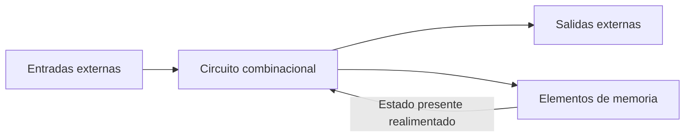
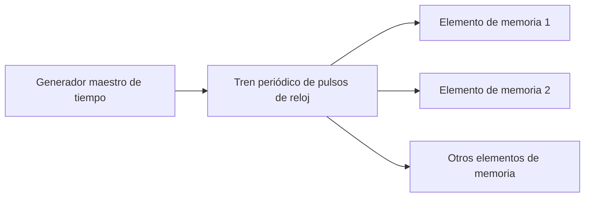
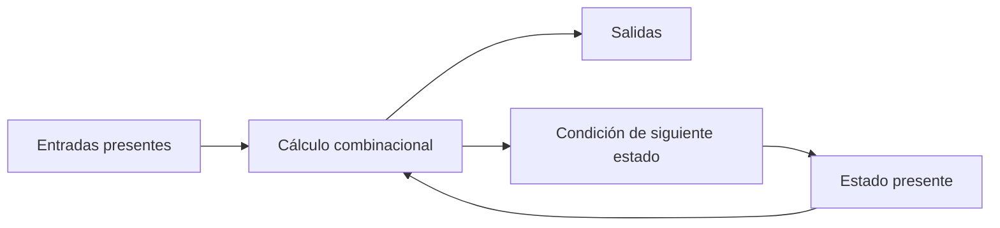

# Retroalimentación digital y su importancia en la electrónica digital secuencial

## Ubicación y alcance en el libro

Este desarrollo sigue el inicio del **capítulo 6, “Lógica secuencial”**, de Morris Mano:

1. **Sección 6-1, “Introducción”**, PDF pp. 220–222 (libro pp. 208–210).
2. **Figura 6-1, “Diagrama de bloque de un circuito secuencial”**, PDF p. 221 (libro p. 209).
3. Del PDF p. 222 solo se utiliza el párrafo final de la sección 6-1, antes del encabezado 6-2, que identifica los flip-flops como elementos de memoria de los circuitos temporizados.

La sección 6-1 no contiene tablas numeradas ni ejemplos aritméticos. Su propósito es establecer el modelo conceptual que separa la lógica combinacional de la secuencial y explicar el papel de la realimentación, la memoria, el estado, el tiempo y el reloj.

La sección 6-2 comienza el estudio de los circuitos y tipos de flip-flop. Ese contenido, incluidas sus tablas de verdad, tablas características y ecuaciones, queda reservado para el tema siguiente. Tampoco se adelantan los diagramas de tiempo, el análisis de circuitos temporizados ni los procedimientos de diseño de las secciones posteriores. [[Raw/Lógica Digital y Diseño de Computadores, 1ra Edición, por M. Morris Mano.pdf#page=220|Mano, PDF pp. 220–222 (libro pp. 208–210), sección 6-1]]

## Objetivos de aprendizaje

Al terminar el tema, un estudiante debería poder:

1. distinguir un circuito combinacional de uno secuencial;
2. explicar qué es un camino de realimentación;
3. relacionar realimentación, elementos de memoria y almacenamiento binario;
4. definir el estado presente de un circuito;
5. explicar de qué dependen las salidas y el siguiente estado;
6. justificar por qué un circuito secuencial debe describirse a través del tiempo;
7. distinguir circuitos secuenciales sincrónicos y asincrónicos;
8. explicar cómo el retardo de propagación puede producir memoria en una red asincrónica;
9. reconocer el riesgo de inestabilidad asociado a la realimentación asincrónica;
10. explicar la función del generador maestro de tiempo y de los pulsos de reloj;
11. definir un circuito secuencial temporizado;
12. comprender por qué los flip-flops se introducen como elementos de memoria, sin estudiar todavía sus tipos.

## 1. Punto de partida: lógica combinacional

Hasta el capítulo 5, Mano estudia circuitos combinacionales. En ellos, las salidas en un instante determinado dependen completamente de las entradas presentes en ese mismo instante.

Si las entradas actuales se representan por $X$, las salidas combinacionales pueden describirse como:

$$
Y=F(X).
$$

El circuito no necesita conocer lo que ocurrió antes. Cuando reaparece la misma combinación de entradas, produce la misma combinación de salidas, después del retardo físico de propagación.

Sin embargo, la mayoría de los sistemas digitales prácticos contienen también elementos de memoria. En esos sistemas no basta conocer las entradas presentes: también importa la información que el circuito conserva de su historia anterior. Esta necesidad conduce a la **lógica secuencial**. [[Raw/Lógica Digital y Diseño de Computadores, 1ra Edición, por M. Morris Mano.pdf#page=220|Mano, PDF p. 220 (libro p. 208), sección 6-1]]

> **Explicación complementaria**
>
> La palabra “secuencial” indica que interesa la secuencia de acontecimientos. Dos circuitos pueden recibir ahora la misma entrada y producir salidas distintas si antes almacenaron estados diferentes.

## 2. Qué es un circuito secuencial

Un circuito secuencial combina:

- un circuito combinacional;
- elementos de memoria;
- un camino de realimentación que devuelve al circuito combinacional información procedente de la memoria.

Los elementos de memoria almacenan información binaria. Esa información almacenada en un momento determinado define el **estado** del circuito secuencial.

El circuito recibe dos clases de información:

1. las entradas binarias externas;
2. el estado presente almacenado.

Ambas determinan:

- los valores de las salidas externas;
- la condición que hará cambiar, o conservar, el contenido de la memoria.

[[Raw/Lógica Digital y Diseño de Computadores, 1ra Edición, por M. Morris Mano.pdf#page=220|Mano, PDF pp. 220–221 (libro pp. 208–209), figura 6-1]]

## 3. Figura 6-1: estructura de un circuito secuencial

La figura 6-1 puede representarse así:

El circuito combinacional calcula dos resultados:

- las salidas observables;
- la información que determinará el nuevo contenido de la memoria.

La memoria devuelve su contenido al circuito combinacional. Ese retorno es la **realimentación**.

### 3.1 Lectura paso a paso del diagrama

1. Las entradas externas llegan al circuito combinacional.
2. Los elementos de memoria entregan el estado presente al mismo circuito.
3. El circuito combinacional utiliza ambas informaciones.
4. Produce las salidas externas.
5. Produce también señales para conservar o modificar la memoria.
6. El nuevo contenido de la memoria vuelve a influir en evaluaciones posteriores.

Este ciclo lógico explica cómo el resultado actual puede depender de acontecimientos anteriores.

## 4. Qué significa realimentación

Existe **realimentación** cuando información obtenida dentro del circuito regresa a una de sus entradas internas y participa en una evaluación posterior.

En la figura 6-1, el camino es:

$$
\text{circuito combinacional}
\longrightarrow
\text{memoria}
\longrightarrow
\text{circuito combinacional}.
$$

No se trata de devolver sin control una salida externa a una entrada externa. El modelo de Mano devuelve el **estado almacenado** como información interna necesaria para calcular el comportamiento futuro.

### 4.1 Por qué la realimentación es importante

La realimentación permite que el circuito:

- conserve información;
- distinga situaciones con las mismas entradas presentes pero diferente historia;
- haga que su salida dependa del estado;
- determine un estado siguiente;
- ejecute una sucesión ordenada de comportamientos.

Sin un camino que haga disponible el contenido de la memoria, la parte combinacional solo conocería las entradas externas presentes.

> **Explicación complementaria**
>
> La realimentación convierte el resultado anterior en parte de los datos del cálculo siguiente. Esta es la diferencia esencial respecto de una cadena combinacional que solo transforma entradas actuales.

## 5. Elementos de memoria

Los **elementos de memoria** son capaces de almacenar información binaria dentro de ellos. El capítulo aún no estudia su construcción detallada, pero establece su función:

- reciben señales que pueden modificar el contenido;
- conservan información binaria;
- proporcionan al circuito combinacional el estado presente.

En los circuitos secuenciales temporizados, Mano llama **flip-flops** a estos elementos. Los describe como celdas binarias capaces de almacenar un bit. La forma en que reciben información da lugar a tipos diferentes, que se desarrollan en la sección siguiente y quedan fuera de esta página. [[Raw/Lógica Digital y Diseño de Computadores, 1ra Edición, por M. Morris Mano.pdf#page=222|Mano, PDF p. 222 (libro p. 210), cierre de la sección 6-1]]

### 5.1 Un bit almacenado

Almacenar un bit significa que el elemento puede conservar uno de dos valores:

$$
0
$$

o:

$$
1.
$$

Ese valor no es simplemente una entrada que atraviesa el circuito. Permanece disponible como parte del estado hasta que las condiciones de cambio lo modifiquen.

## 6. Estado presente

El **estado** de un circuito secuencial en un tiempo dado es la información binaria almacenada en sus elementos de memoria en ese momento.

Si existe un solo elemento que almacena un bit, hay dos estados binarios posibles. Si existen varios elementos, el estado se representa mediante el conjunto de bits almacenados. El capítulo desarrollará más adelante la representación formal; aquí solo se necesita comprender que el estado resume la información interna relevante del pasado.

Mano distingue conceptualmente:

- **estado presente**: contenido actual de la memoria;
- **siguiente estado**: contenido que tendrá la memoria después de que se produzca el cambio correspondiente.

Las entradas externas y el estado presente determinan el siguiente estado. [[Raw/Lógica Digital y Diseño de Computadores, 1ra Edición, por M. Morris Mano.pdf#page=220|Mano, PDF p. 220 (libro p. 208)]]

> **Explicación complementaria**
>
> El estado no necesita guardar cada entrada ocurrida desde que se encendió el sistema. Conserva la información interna que el circuito requiere para decidir qué hacer después.

## 7. Salidas y siguiente estado

El texto de Mano establece dos dependencias:

1. las salidas externas son función de las entradas externas y del estado presente;
2. el siguiente estado también es función de las entradas externas y del estado presente.

> **Explicación complementaria**
>
> La afirmación verbal del autor puede escribirse de manera compacta como:
>
> $$
> Y(t)=F[X(t),Q(t)]
> $$
>
> $$
> Q(t+1)=G[X(t),Q(t)],
> $$
>
> donde $X(t)$ representa las entradas presentes, $Q(t)$ el estado presente, $Y(t)$ las salidas y $Q(t+1)$ el siguiente estado. Estas letras no aparecen como una notación formal en la sección 6-1; se usan aquí únicamente para hacer visible la relación descrita por el autor.

### 7.1 Diferencia frente al circuito combinacional

> **Explicación complementaria**

| Aspecto | Circuito combinacional | Circuito secuencial |
|---|---|---|
| Información utilizada | Entradas presentes | Entradas presentes y estado |
| Memoria | No | Sí |
| Realimentación del estado | No forma parte del modelo | Sí |
| Dependencia del pasado | No | Mediante el estado almacenado |
| Descripción suficiente | Funciones o tabla de verdad de entradas y salidas | Secuencia temporal de entradas, salidas y estados |

La tabla reorganiza las afirmaciones de la sección 6-1; no es una tabla numerada del libro.

## 8. Por qué aparece el tiempo

Un circuito combinacional puede describirse relacionando entradas con salidas. En un circuito secuencial también debe indicarse:

- cuál era el estado antes de una entrada;
- cuándo se permite cambiar la memoria;
- cuál será el estado posterior;
- cómo se suceden las entradas, salidas y estados.

Por ello, Mano afirma que un circuito secuencial se especifica mediante una **secuencia de tiempo** de:

- entradas;
- salidas;
- estados internos.

El tiempo no es un detalle secundario: determina cuándo se observa el estado presente y cuándo puede convertirse en el siguiente estado.

## 9. Clasificación según el tiempo de las señales

Mano divide los circuitos secuenciales en:

1. **sincrónicos**;
2. **asincrónicos**.

La diferencia depende de la forma en que el tiempo gobierna sus señales. [[Raw/Lógica Digital y Diseño de Computadores, 1ra Edición, por M. Morris Mano.pdf#page=220|Mano, PDF pp. 220–221 (libro pp. 208–209)]]

## 10. Circuitos secuenciales asincrónicos

El comportamiento de un circuito asincrónico depende:

- del orden en que cambian las entradas;
- del instante en que esas entradas cambian;
- de los retardos internos de propagación.

Sus elementos de memoria pueden ser mecanismos retardadores de tiempo. Una señal necesita un tiempo finito para atravesar un dispositivo. En sistemas asincrónicos construidos con compuertas, los retardos de propagación de las propias compuertas pueden proporcionar la memoria requerida.

Por esta razón, Mano indica que un circuito secuencial asincrónico puede considerarse como:

> un circuito combinacional con realimentación.

[[Raw/Lógica Digital y Diseño de Computadores, 1ra Edición, por M. Morris Mano.pdf#page=221|Mano, PDF p. 221 (libro p. 209)]]

### 10.1 Retardo de propagación

El **retardo de propagación** es el tiempo finito entre:

1. un cambio aplicado a la entrada de una compuerta;
2. la aparición del efecto correspondiente en la salida.

En lógica combinacional suele tratarse como el tiempo necesario para que la salida se estabilice. En una red asincrónica con realimentación, ese retardo forma parte del comportamiento que conserva y modifica el estado.

> **Explicación complementaria**
>
> Si una salida regresa a una entrada, el nuevo valor no vuelve de manera instantánea. Durante el intervalo de propagación, distintas partes de la red pueden estar respondiendo a valores de momentos diferentes. El orden efectivo de esos cambios puede alterar el resultado.

### 10.2 Inestabilidad

La realimentación entre compuertas puede volver inestable un circuito asincrónico. Mano señala que esta inestabilidad impone dificultades importantes al diseñador y hace que su uso sea menos común que el de los sistemas sincrónicos.

En este punto, **inestable** significa que la red puede no asentarse de manera confiable en el comportamiento deseado debido a la interacción entre realimentación y retardos.

La sección no desarrolla técnicas para analizar ni corregir esa inestabilidad; únicamente explica por qué los sistemas temporizados resultan preferibles para el estudio posterior.

## 11. Circuitos secuenciales sincrónicos

Un circuito secuencial sincrónico utiliza señales que afectan los elementos de memoria solamente en **instantes discretos de tiempo**.

“Discreto” significa que el sistema no acepta un cambio de estado en cualquier instante arbitrario. Existen momentos determinados en los cuales la memoria puede ser afectada. Entre esos momentos, el estado permanece disponible para el circuito.

### 11.1 Primera posibilidad: representar información mediante pulsos

Mano considera una primera idea:

- un pulso de cierta amplitud representa `1`;
- otra amplitud, o la ausencia de pulso, representa `0`.

La dificultad es que pulsos procedentes de fuentes independientes pueden llegar a una misma compuerta con retardos impredecibles. Si quedan ligeramente separados, la operación puede no ser confiable.

Por esa razón, los sistemas sincrónicos prácticos no dependen de la coincidencia casual de pulsos de datos independientes. [[Raw/Lógica Digital y Diseño de Computadores, 1ra Edición, por M. Morris Mano.pdf#page=221|Mano, PDF p. 221 (libro p. 209)]]

## 12. Niveles binarios y reloj

Los sistemas secuenciales sincrónicos prácticos usan amplitudes fijas, como niveles de voltaje, para representar las señales binarias.

La sincronización se obtiene mediante un dispositivo de tiempo llamado:

**generador maestro de tiempo**.

Este genera un tren periódico de **pulsos de reloj**. Los pulsos se distribuyen por el sistema para que los elementos de memoria sean afectados solamente cuando llega el pulso de sincronización.

### 12.1 Función del reloj

El reloj no representa por sí mismo los datos que se almacenarán. Su función es establecer **cuándo** se permite que las señales que solicitan cambios afecten la memoria.

Mano describe una ejecución práctica en la que el pulso de reloj se aplica a compuertas AND junto con las señales que especifican los cambios. La AND transmite esas señales únicamente cuando coincide el pulso de reloj.

> **Explicación complementaria**
>
> Puede imaginarse el reloj como una autorización periódica. Las señales de datos indican qué cambio se desea; el reloj indica el momento en que ese cambio puede pasar hacia la memoria.

## 13. Circuitos secuenciales temporizados

Los circuitos secuenciales sincrónicos que aplican pulsos de reloj a las entradas de los elementos de memoria se llaman **circuitos secuenciales temporizados**.

Según Mano, son los más utilizados porque:

- no presentan los problemas de inestabilidad atribuidos a las redes asincrónicas;
- su temporización puede dividirse en pasos discretos independientes;
- cada paso puede considerarse por separado.

El libro anuncia que los circuitos secuenciales tratados en sus capítulos serán exclusivamente de tipo temporizado. [[Raw/Lógica Digital y Diseño de Computadores, 1ra Edición, por M. Morris Mano.pdf#page=221|Mano, PDF p. 221 (libro p. 209)]]

### 13.1 Pasos discretos

> **Explicación complementaria**
>
> Si se numeran los instantes autorizados como $t_0,t_1,t_2,\ldots$, el estado puede estudiarse paso a paso:
>
> $$
> Q(t_0)\rightarrow Q(t_1)\rightarrow Q(t_2)\rightarrow\cdots
> $$
>
> Esta notación no es una tabla ni un diagrama de tiempo del libro; solo hace explícita la idea de dividir la operación en instantes discretos. Los diagramas temporales formales pertenecen a temas posteriores.

## 14. Comparación entre asincrónico y sincrónico

> **Explicación complementaria**

| Aspecto | Asincrónico | Sincrónico o temporizado |
|---|---|---|
| Momento de cambio | Puede ser afectado en cualquier instante | La memoria se afecta en instantes discretos |
| Factor decisivo | Orden y tiempo de cambios de entrada | Pulso de reloj |
| Memoria descrita en §6-1 | Retardos de propagación y realimentación | Elementos de memoria gobernados por reloj |
| Riesgo destacado | Inestabilidad | El autor lo presenta sin ese problema |
| Uso indicado por Mano | Menos común | El más común y el usado en el libro |
| Organización del análisis | Depende de secuencias y retardos continuos | Pasos discretos independientes |

La tabla sintetiza la comparación verbal de la sección 6-1.

## 15. Importancia de la retroalimentación

La realimentación es importante porque hace posible que un sistema digital posea **estado**. Su papel puede resumirse de la siguiente manera:

1. el circuito combinacional calcula resultados usando entradas y estado;
2. parte del resultado determina el contenido posterior de la memoria;
3. la memoria conserva información binaria;
4. esa información vuelve como estado presente;
5. el estado influye en el siguiente cálculo.

Sin este ciclo, el sistema se limitaría a responder a la combinación actual de entradas. Con él, puede responder en función de la secuencia temporal.

## 16. Realimentación no significa memoria confiable por sí sola

El capítulo no afirma que cualquier lazo de compuertas sea automáticamente un elemento de memoria útil. En los circuitos asincrónicos, la interacción entre el lazo y los retardos puede producir inestabilidad.

Para obtener un sistema práctico deben existir:

- estados binarios identificables;
- mecanismos que conserven la información;
- reglas para modificarla;
- organización temporal confiable.

En los sistemas estudiados por Mano, esa organización se logra mediante elementos de memoria y reloj.

> **Explicación complementaria**
>
> Dibujar una flecha de regreso solo crea una dependencia circular. Convertirla en memoria útil exige que el circuito pueda asentarse en estados válidos y cambiar entre ellos de manera controlada.

## 17. Vocabulario esencial

| Término | Significado en el alcance de §6-1 |
|---|---|
| Lógica combinacional | Salidas determinadas por las entradas presentes |
| Lógica secuencial | Comportamiento determinado por entradas, estado y secuencia temporal |
| Elemento de memoria | Componente capaz de almacenar información binaria |
| Estado presente | Información almacenada en un momento dado |
| Siguiente estado | Contenido que tendrá después la memoria |
| Realimentación | Camino que devuelve información de estado al circuito combinacional |
| Retardo de propagación | Tiempo finito que tarda una señal en atravesar un dispositivo |
| Asincrónico | Puede responder según el orden y momento de los cambios |
| Sincrónico | Restringe los cambios de memoria a instantes discretos |
| Generador maestro de tiempo | Dispositivo que produce el tren periódico de reloj |
| Pulso de reloj | Señal periódica usada para sincronizar los cambios |
| Circuito temporizado | Circuito secuencial sincrónico gobernado por pulsos de reloj |
| Flip-flop | Celda binaria de memoria usada en circuitos temporizados |

## 18. Errores frecuentes

> **Explicación complementaria**

1. **Creer que un circuito secuencial depende solo de la entrada anterior.** Depende del estado almacenado, que resume la información relevante.
2. **Confundir salida con estado.** Pueden relacionarse, pero la figura 6-1 distingue salidas externas y contenido de memoria.
3. **Pensar que realimentación significa conectar cualquier salida con cualquier entrada.** El camino debe formar parte de una organización lógica de memoria.
4. **Ignorar el tiempo.** En lógica secuencial importa la secuencia de entradas, salidas y estados.
5. **Suponer que “paralelo” o “digital” elimina los retardos físicos.** Las señales siempre necesitan tiempo de propagación.
6. **Confundir sincrónico con simultáneo en todo instante.** Significa que los cambios de memoria se coordinan en instantes discretos.
7. **Interpretar el reloj como dato.** El reloj autoriza el momento del cambio; las otras señales especifican el cambio.
8. **Suponer que todo circuito con realimentación es estable.** Mano destaca precisamente el riesgo de inestabilidad asincrónica.
9. **Adelantar los tipos de flip-flop.** §6-1 solo los identifica como celdas binarias de memoria.

## 19. Preguntas de comprobación

> **Explicación complementaria**
>
> Estas preguntas se limitan a la sección 6-1.

1. ¿De qué dependen las salidas de un circuito combinacional?
2. ¿Qué dos bloques forman el modelo de circuito secuencial de la figura 6-1?
3. ¿Qué información define el estado?
4. ¿De qué dependen las salidas de un circuito secuencial?
5. ¿De qué depende el siguiente estado?
6. ¿Por qué un circuito secuencial debe describirse como una secuencia temporal?
7. ¿Qué es un camino de realimentación?
8. ¿Qué determina el comportamiento de un circuito asincrónico?
9. ¿Cómo pueden los retardos de compuerta actuar como memoria?
10. ¿Qué dificultad asocia Mano con la realimentación asincrónica?
11. ¿En qué momentos se permite afectar la memoria de un sistema sincrónico?
12. ¿Qué dispositivo produce los pulsos de reloj?
13. ¿Qué función cumple una compuerta AND gobernada por reloj en la explicación del autor?
14. ¿Qué es un circuito secuencial temporizado?
15. ¿Qué tipo de circuito secuencial estudia el libro?
16. ¿Cómo llama Mano a los elementos de memoria de los circuitos temporizados?
17. ¿Cuántos bits almacena una celda flip-flop?

## 20. Respuestas breves

1. De las entradas presentes.
2. Un circuito combinacional y elementos de memoria.
3. La información binaria almacenada en un momento dado.
4. De las entradas externas y del estado presente.
5. De las entradas externas y del estado presente.
6. Porque entradas iguales pueden producir resultados diferentes según el estado y el momento.
7. El camino que devuelve información de la memoria al circuito combinacional.
8. El orden y el instante de los cambios de entrada, junto con los retardos.
9. Porque una señal tarda un tiempo finito en propagarse por la red realimentada.
10. Inestabilidad.
11. En instantes discretos de tiempo.
12. El generador maestro de tiempo.
13. Permite transmitir las señales de cambio cuando coincide el pulso de reloj.
14. Un circuito secuencial sincrónico cuyos elementos de memoria reciben pulsos de reloj.
15. Circuitos temporizados.
16. Flip-flops.
17. Un bit.

## Relación con el curso

Este tema inicia la [[Wiki/Unidades/Unidad 2 - Lógica secuencial|Unidad 2 - Lógica secuencial]] y depende de comprender la diferencia con [[Wiki/Conceptos/Diseño con lógica combinacional|Diseño con lógica combinacional]].

La secuencia posterior del curso desarrolla:

- [[Wiki/Conceptos/Flip-flops|el flip-flop y sus tipos]];
- diagramas de tiempo;
- diagramas de estado;
- análisis y diseño secuencial;
- bloques secuenciales MSI/LSI;
- familias lógicas.

Estos contenidos no se adelantan aquí.

## Fuentes y límites

- Diferencia entre lógica combinacional y secuencial, memoria, estado y figura 6-1. [[Raw/Lógica Digital y Diseño de Computadores, 1ra Edición, por M. Morris Mano.pdf#page=220|Mano, PDF pp. 220–221 (libro pp. 208–209)]]
- Circuitos asincrónicos, retardos e inestabilidad. [[Raw/Lógica Digital y Diseño de Computadores, 1ra Edición, por M. Morris Mano.pdf#page=220|Mano, PDF pp. 220–221 (libro pp. 208–209)]]
- Circuitos sincrónicos, generador maestro, reloj y circuitos temporizados. [[Raw/Lógica Digital y Diseño de Computadores, 1ra Edición, por M. Morris Mano.pdf#page=221|Mano, PDF p. 221 (libro p. 209)]]
- Flip-flops como celdas binarias de memoria, únicamente en el párrafo final de §6-1. [[Raw/Lógica Digital y Diseño de Computadores, 1ra Edición, por M. Morris Mano.pdf#page=222|Mano, PDF p. 222 (libro p. 210), antes de §6-2]]
- Se combinaron extracción textual y revisión visual de las tres páginas PDF.
- La sección 6-1 no contiene tablas numeradas ni ejemplos de cálculo.
- Se excluyeron §6-2 y las secciones posteriores: tipos de flip-flop, tablas características, disparo, diagramas temporales, análisis, estados y diseño.

## Contradicciones y dudas

- El párrafo final de §6-1 dice que un flip-flop tiene «dos entradas, una para el valor normal y una para el valor complemento del bit almacenado». Sin embargo, esos terminales se identifican inmediatamente en §6-2 como las **salidas** $Q$ y $Q'$, mientras las entradas dependen del tipo de flip-flop. Se conserva la frase como posible errata de la edición disponible y no se usa para definir los terminales del dispositivo. [[Raw/Lógica Digital y Diseño de Computadores, 1ra Edición, por M. Morris Mano.pdf#page=222|Mano, PDF p. 222 (libro p. 210)]]
