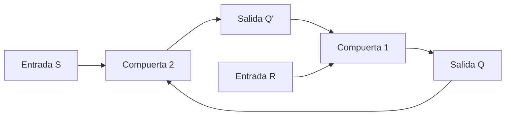

# El flip-flop y sus tipos

## Ubicación y alcance en el libro

Este desarrollo utiliza como fuente principal:

- **Capítulo 6, "Lógica secuencial".**
- **Sección 6-2, "Flip-flops".**
- **PDF pp. 222-228**, correspondientes a las **pp. 210-216 de la numeración impresa**.

La sección comienza después del párrafo final de 6-1 en la PDF p. 222 y termina en la PDF p. 228, antes del encabezado 6-3. Se revisaron mediante extracción textual y examen visual las figuras 6-2 a 6-7, sus tablas y sus ecuaciones. [[Raw/Lógica Digital y Diseño de Computadores, 1ra Edición, por M. Morris Mano.pdf#page=222|Mano, PDF pp. 222-228 (libro pp. 210-216), sección 6-2]]

Este tema incluye:

1. el circuito básico de un flip-flop;
2. las realizaciones básicas con compuertas NOR y NAND;
3. el flip-flop RS temporizado;
4. el significado de tabla y ecuación características;
5. los flip-flops D, JK y T.

Quedan fuera el disparo detallado de los flip-flops, las construcciones maestro-esclavo y activadas por flanco, el análisis de circuitos secuenciales, las tablas de excitación y el diseño secuencial. Esos contenidos comienzan en la sección 6-3 o se desarrollan en secciones posteriores del capítulo.

## Objetivos de aprendizaje

Al finalizar este tema, el estudiante debería poder:

- explicar qué almacena un flip-flop;
- reconocer el estado presente y el siguiente estado;
- distinguir las salidas normal y complementada;
- describir la realimentación de un flip-flop básico;
- interpretar las entradas de los tipos RS, D, JK y T;
- completar sus tablas características;
- usar sus ecuaciones características para obtener el siguiente estado;
- reconocer las combinaciones de conservación, puesta a uno, puesta a cero, complementación e indeterminación;
- explicar por qué ciertas combinaciones de entrada deben evitarse.

## 1. Qué es un flip-flop

Un **flip-flop** es una celda binaria capaz de almacenar **un bit de información**. Puede mantener un estado binario indefinidamente mientras reciba alimentación, hasta que una señal de entrada ordene cambiarlo. [[Raw/Lógica Digital y Diseño de Computadores, 1ra Edición, por M. Morris Mano.pdf#page=222|Mano, PDF p. 222 (libro p. 210)]]

Como solamente almacena un bit, sus dos estados posibles son:

- **estado 1** o estado de puesta a uno;
- **estado 0** o estado de puesta a cero.

Un flip-flop dispone de dos salidas:

- $Q$: salida normal;
- $Q'$: salida complementada.

En operación normal, ambas son complementarias:

| Estado almacenado | $Q$ | $Q'$ |
|---|---:|---:|
| Estado 0 | 0 | 1 |
| Estado 1 | 1 | 0 |

El estado binario del flip-flop se toma del valor de la salida normal $Q$. Por tanto, decir que el flip-flop está en el estado 1 significa que $Q=1$; decir que está en el estado 0 significa que $Q=0$. [[Raw/Lógica Digital y Diseño de Computadores, 1ra Edición, por M. Morris Mano.pdf#page=223|Mano, PDF p. 223 (libro p. 211)]]

> **Explicación complementaria**
>
> El flip-flop puede imaginarse como una memoria de una sola casilla. La casilla contiene 0 o 1. La salida $Q$ permite leer directamente el contenido y $Q'$ proporciona simultáneamente el valor contrario. No son dos bits distintos: son dos formas de observar el mismo bit almacenado.

## 2. Por qué existen diferentes tipos

Los flip-flops se diferencian principalmente por:

1. el número de entradas que poseen;
2. la forma en que esas entradas afectan el estado binario.

La información puede entrar de distintas maneras y cada manera conduce a un tipo diferente de flip-flop. Mano estudia en esta sección los tipos de uso más común: RS, D, JK y T. [[Raw/Lógica Digital y Diseño de Computadores, 1ra Edición, por M. Morris Mano.pdf#page=222|Mano, PDF p. 222 (libro p. 210)]]

## 3. Circuito básico de un flip-flop

El circuito básico puede construirse mediante:

- dos compuertas NOR; o
- dos compuertas NAND.

La salida de cada compuerta se conecta a una entrada de la otra. Este **acoplamiento intercruzado** crea un camino de realimentación. Gracias a esa realimentación, el valor producido por el circuito ayuda a conservar su propio estado. Mano clasifica estas realizaciones básicas como circuitos secuenciales asincrónicos. [[Raw/Lógica Digital y Diseño de Computadores, 1ra Edición, por M. Morris Mano.pdf#page=222|Mano, PDF p. 222 (libro p. 210), figuras 6-2 y 6-3]]

> **Explicación complementaria**
>
> El diagrama anterior representa solamente la relación de realimentación, no sustituye el símbolo electrónico exacto de las figuras 6-2 y 6-3. La idea esencial es que $Q$ influye en la compuerta que genera $Q'$ y, al mismo tiempo, $Q'$ influye en la que genera $Q$. Esta dependencia circular permite que el circuito recuerde cuál salida quedó en 1.

## 4. Entradas de puesta a uno y puesta a cero

El circuito básico tiene dos entradas:

- $S$, de *set*: **puesta a uno**;
- $R$, de *reset*: **puesta a cero**.

Mano también denomina a esta estructura **flip-flop RS acoplado directamente** o **bloqueador SR** (*SR latch*). Las letras provienen de los nombres ingleses de las acciones de entrada. [[Raw/Lógica Digital y Diseño de Computadores, 1ra Edición, por M. Morris Mano.pdf#page=222|Mano, PDF p. 222 (libro p. 210)]]

Las palabras describen la acción sobre la salida normal:

- poner a uno significa llevar $Q$ a 1;
- poner a cero significa llevar $Q$ a 0.

La realización NOR y la realización NAND no reciben las órdenes con el mismo nivel lógico. Por ello deben estudiarse por separado.

## 5. Flip-flop básico con compuertas NOR

### 5.1 Regla lógica que se necesita

Una compuerta NOR produce:

- salida 1 solamente cuando **todas** sus entradas son 0;
- salida 0 cuando **al menos una** entrada es 1.

### 5.2 Operación de puesta a uno

Se parte de:

$$
S=1,\qquad R=0
$$

El 1 aplicado a $S$ fuerza $Q'=0$. Ese 0, junto con $R=0$, permite que la otra compuerta produzca $Q=1$. El flip-flop queda en el estado de puesta a uno.

Cuando $S$ vuelve a 0, el circuito conserva:

$$
Q=1,\qquad Q'=0
$$

La realimentación mantiene el estado aunque haya desaparecido la orden momentánea. [[Raw/Lógica Digital y Diseño de Computadores, 1ra Edición, por M. Morris Mano.pdf#page=222|Mano, PDF pp. 222-223 (libro pp. 210-211), figura 6-2]]

### 5.3 Operación de puesta a cero

Si se aplica:

$$
S=0,\qquad R=1
$$

la entrada $R$ cambia la salida normal a $Q=0$ y la complementada a $Q'=1$. Cuando $R$ vuelve a 0, las salidas conservan esos valores. [[Raw/Lógica Digital y Diseño de Computadores, 1ra Edición, por M. Morris Mano.pdf#page=223|Mano, PDF p. 223 (libro p. 211)]]

### 5.4 Tabla de verdad de la figura 6-2

| $S$ | $R$ | $Q$ | $Q'$ | Interpretación |
|---:|---:|---:|---:|---|
| 1 | 0 | 1 | 0 | Puesta a uno |
| 0 | 0 | 1 | 0 | Conservación después de $S=1,\ R=0$ |
| 0 | 1 | 0 | 1 | Puesta a cero |
| 0 | 0 | 0 | 1 | Conservación después de $S=0,\ R=1$ |
| 1 | 1 | 0 | 0 | Condición no permitida en operación normal |

La tabla muestra una propiedad decisiva: para $S=R=0$, el resultado depende del estado que se había establecido anteriormente. Una misma combinación de entradas puede conservar un 1 o conservar un 0. Esta dependencia del estado anterior demuestra que no se trata de un circuito combinacional. [[Raw/Lógica Digital y Diseño de Computadores, 1ra Edición, por M. Morris Mano.pdf#page=222|Mano, PDF pp. 222-223 (libro pp. 210-211), figura 6-2]]

### 5.5 Condición no permitida

Si $S=R=1$, ambas salidas se vuelven 0:

$$
Q=Q'=0
$$

Eso viola la condición normal de complementariedad. Además, si ambas entradas regresan a 0, el estado final puede depender de cuál entrada permaneció más tiempo en 1. Mano considera este estado indefinido y establece que debe evitarse la aplicación simultánea de 1 a las dos entradas. [[Raw/Lógica Digital y Diseño de Computadores, 1ra Edición, por M. Morris Mano.pdf#page=223|Mano, PDF p. 223 (libro p. 211)]]

> **Explicación complementaria**
>
> La combinación $S=R=1$ no significa "guardar 0". Mientras está aplicada produce dos salidas iguales, que no representan correctamente un bit y su complemento. Al retirarla, pequeñas diferencias internas pueden decidir qué estado aparece. Por eso se clasifica como una combinación no permitida, no como una tercera operación útil.

## 6. Flip-flop básico con compuertas NAND

### 6.1 Diferencia fundamental

En la realización NAND, las entradas permanecen normalmente en 1. El cambio se solicita mediante un **0 momentáneo**:

- un 0 momentáneo en $S$ pone el flip-flop a uno;
- un 0 momentáneo en $R$ pone el flip-flop a cero.

Después de la acción, la entrada correspondiente debe volver a 1 para que el estado quede almacenado. [[Raw/Lógica Digital y Diseño de Computadores, 1ra Edición, por M. Morris Mano.pdf#page=223|Mano, PDF pp. 223-224 (libro pp. 211-212), figura 6-3]]

### 6.2 Tabla de verdad de la figura 6-3

| $S$ | $R$ | $Q$ | $Q'$ | Interpretación |
|---:|---:|---:|---:|---|
| 1 | 0 | 0 | 1 | Puesta a cero |
| 1 | 1 | 0 | 1 | Conservación después de $S=1,\ R=0$ |
| 0 | 1 | 1 | 0 | Puesta a uno |
| 1 | 1 | 1 | 0 | Conservación después de $S=0,\ R=1$ |
| 0 | 0 | 1 | 1 | Condición no permitida en operación normal |

Cuando $S=R=0$, ambas salidas van a 1. Al igual que en la realización NOR, las salidas dejan de ser complementarias, por lo que la combinación se evita en operación normal. [[Raw/Lógica Digital y Diseño de Computadores, 1ra Edición, por M. Morris Mano.pdf#page=224|Mano, PDF p. 224 (libro p. 212)]]

> **Explicación complementaria**
>
> En términos habituales, las entradas de esta realización actúan con nivel bajo: el 0 solicita la acción. Esta explicación ayuda a recordar la tabla, pero Mano describe la operación directamente como la aplicación de un 0 momentáneo. Lo importante es no transferir sin cambios la tabla del circuito NOR al circuito NAND.

## 7. Comparación de los dos circuitos básicos

> **Explicación complementaria**

| Propiedad | Básico NOR | Básico NAND |
|---|---|---|
| Nivel normal de las dos entradas | 0 | 1 |
| Orden de puesta a uno | $S=1,\ R=0$ | $S=0,\ R=1$ |
| Orden de puesta a cero | $S=0,\ R=1$ | $S=1,\ R=0$ |
| Combinación de conservación | $S=R=0$ | $S=R=1$ |
| Combinación no permitida | $S=R=1$ | $S=R=0$ |
| Salidas en la combinación no permitida | $Q=Q'=0$ | $Q=Q'=1$ |

La tabla es una síntesis pedagógica de las figuras 6-2 y 6-3. No es una tabla adicional numerada por el libro.

## 8. Del flip-flop básico al flip-flop temporizado

El flip-flop básico es asincrónico: sus entradas pueden afectar el circuito sin esperar una señal común de tiempo.

Mano agrega compuertas a las entradas para que el flip-flop responda durante la ocurrencia de un **pulso de reloj**, abreviado $CP$ por *clock pulse*. Así se obtiene un flip-flop temporizado. [[Raw/Lógica Digital y Diseño de Computadores, 1ra Edición, por M. Morris Mano.pdf#page=224|Mano, PDF p. 224 (libro p. 212)]]

## 9. Flip-flop RS temporizado

La figura 6-4(a) utiliza:

- un flip-flop básico NOR;
- dos compuertas AND;
- las entradas $S$ y $R$;
- la entrada de reloj $CP$.

### 9.1 Cuando $CP=0$

Las salidas de las dos compuertas AND permanecen en 0 sin importar los valores de $S$ y $R$. La información de las entradas no llega al flip-flop básico y este conserva su estado.

### 9.2 Cuando $CP=1$

Las entradas $S$ y $R$ pueden llegar al circuito básico:

- $S=1,\ R=0$: puesta a uno;
- $S=0,\ R=1$: puesta a cero;
- $S=0,\ R=0$: conservación;
- $S=1,\ R=1$: estado indeterminado al terminar el pulso.

En la última combinación, ambas salidas van momentáneamente a 0 y, al retirarse el pulso, podría resultar cualquiera de los dos estados. [[Raw/Lógica Digital y Diseño de Computadores, 1ra Edición, por M. Morris Mano.pdf#page=224|Mano, PDF pp. 224-225 (libro pp. 212-213), figura 6-4]]

### 9.3 Símbolo gráfico

El símbolo de la figura 6-4(b) muestra tres entradas: $S$, $R$ y $CP$. La entrada $CP$ se reconoce mediante un pequeño triángulo, llamado por el autor **indicador dinámico**. En esta presentación, el triángulo indica una respuesta a la transición del reloj de nivel bajo a nivel alto. Las salidas se marcan $Q$ y $Q'$. [[Raw/Lógica Digital y Diseño de Computadores, 1ra Edición, por M. Morris Mano.pdf#page=225|Mano, PDF p. 225 (libro p. 213)]]

El desarrollo detallado de las formas de disparo pertenece a la sección 6-3 y no se adelanta aquí.

## 10. Estado presente y siguiente estado

Para describir un flip-flop temporizado se distinguen:

- $Q$: **estado presente**, es decir, el valor almacenado en el tiempo considerado;
- $Q(t+1)$: **siguiente estado**, es decir, el valor después de la ocurrencia de un pulso de reloj.

Las entradas y el estado presente determinan el siguiente estado. [[Raw/Lógica Digital y Diseño de Computadores, 1ra Edición, por M. Morris Mano.pdf#page=225|Mano, PDF p. 225 (libro p. 213)]]

> **Explicación complementaria**
>
> La expresión $t+1$ no obliga a interpretar que ha transcurrido exactamente un segundo. Distingue dos pasos de la secuencia: el estado antes del evento de reloj y el estado que resulta después de él.

## 11. Tabla característica

La **tabla característica** resume en forma tabulada la operación de un flip-flop. Sus columnas contienen:

1. el estado presente;
2. todas las combinaciones posibles de entrada;
3. el siguiente estado producido por cada combinación.

No debe confundirse con una tabla de verdad puramente combinacional, porque una tabla característica incluye explícitamente el estado presente. [[Raw/Lógica Digital y Diseño de Computadores, 1ra Edición, por M. Morris Mano.pdf#page=225|Mano, PDF p. 225 (libro p. 213)]]

### 11.1 Tabla característica del RS temporizado

| $Q$ | $S$ | $R$ | $Q(t+1)$ | Operación |
|---:|---:|---:|---:|---|
| 0 | 0 | 0 | 0 | Conservar 0 |
| 0 | 0 | 1 | 0 | Poner a cero |
| 0 | 1 | 0 | 1 | Poner a uno |
| 0 | 1 | 1 | Indeterminado | No permitida |
| 1 | 0 | 0 | 1 | Conservar 1 |
| 1 | 0 | 1 | 0 | Poner a cero |
| 1 | 1 | 0 | 1 | Poner a uno |
| 1 | 1 | 1 | Indeterminado | No permitida |

La operación $S=R=0$ conserva el estado; por eso $Q(t+1)=Q$. La combinación $S=R=1$ no tiene un siguiente estado definido. [[Raw/Lógica Digital y Diseño de Computadores, 1ra Edición, por M. Morris Mano.pdf#page=224|Mano, PDF p. 224 (libro p. 212), figura 6-4(c)]]

## 12. Ecuación característica

La **ecuación característica** expresa algebraicamente la misma información que la tabla característica. Especifica el siguiente estado como función de:

- las entradas;
- el estado presente.

Para el flip-flop RS temporizado, Mano obtiene:

$$
Q(t+1)=S+R'Q
$$

con la restricción:

$$
SR=0
$$

La restricción indica que $S$ y $R$ no pueden ser simultáneamente 1. Los estados indeterminados se marcan con $X$ en el mapa usado para deducir la ecuación. [[Raw/Lógica Digital y Diseño de Computadores, 1ra Edición, por M. Morris Mano.pdf#page=224|Mano, PDF pp. 224-225 (libro pp. 212-213), figura 6-4(d)]]

### 12.1 Ejemplos de uso de la ecuación RS

**Conservación con $Q=1$:**

$$
S=0,\quad R=0,\quad Q=1
$$

$$
Q(t+1)=0+0'\cdot1=0+1=1
$$

**Puesta a cero:**

$$
S=0,\quad R=1,\quad Q=1
$$

$$
Q(t+1)=0+1'\cdot1=0+0=0
$$

**Puesta a uno desde $Q=0$:**

$$
S=1,\quad R=0,\quad Q=0
$$

$$
Q(t+1)=1+0'\cdot0=1+0=1
$$

> **Explicación complementaria**
>
> Estos cálculos aplican la ecuación de la figura 6-4(d) a filas concretas de su tabla característica. No son ejemplos numerados adicionales del libro. La ecuación no debe evaluarse con $S=R=1$, porque esa combinación incumple la condición $SR=0$.

## 13. Flip-flop D

El flip-flop D es una modificación del RS sincronizado. La entrada $D$:

- llega directamente al camino correspondiente a $S$;
- llega complementada al camino correspondiente a $R$ mediante un inversor.

Por ello, las dos entradas internas nunca solicitan simultáneamente puesta a uno y puesta a cero. El inversor reduce las entradas de datos de dos a una. [[Raw/Lógica Digital y Diseño de Computadores, 1ra Edición, por M. Morris Mano.pdf#page=225|Mano, PDF pp. 225-226 (libro pp. 213-214), figura 6-5]]

El nombre $D$ se relaciona con su capacidad para transmitir **datos** al flip-flop. Mano también menciona los nombres **bloqueador D con compuertas** y **flip-flop de bloqueo**. La entrada $CP$ puede designarse $G$, de *gate*, para indicar que habilita la entrada de datos. [[Raw/Lógica Digital y Diseño de Computadores, 1ra Edición, por M. Morris Mano.pdf#page=226|Mano, PDF p. 226 (libro p. 214)]]

### 13.1 Operación

- Si $D=1$ durante el pulso de reloj, el flip-flop pasa al estado 1.
- Si $D=0$ durante el pulso de reloj, el flip-flop pasa al estado 0.

El siguiente estado copia el dato de entrada.

### 13.2 Tabla característica del flip-flop D

| $Q$ | $D$ | $Q(t+1)$ |
|---:|---:|---:|
| 0 | 0 | 0 |
| 0 | 1 | 1 |
| 1 | 0 | 0 |
| 1 | 1 | 1 |

### 13.3 Ecuación característica

$$
Q(t+1)=D
$$

El siguiente estado es independiente del estado presente: solamente importa el valor de $D$. [[Raw/Lógica Digital y Diseño de Computadores, 1ra Edición, por M. Morris Mano.pdf#page=226|Mano, PDF p. 226 (libro p. 214), figura 6-5(c)-(d)]]

### 13.4 Ejemplo de operación

Si el flip-flop contiene $Q=1$ y durante el pulso se presenta $D=0$:

$$
Q(t+1)=D=0
$$

Si contiene $Q=0$ y se presenta $D=1$:

$$
Q(t+1)=D=1
$$

> **Explicación complementaria**
>
> El flip-flop D resulta sencillo de interpretar como memoria: el dato aplicado en $D$ se convierte en el nuevo contenido. Su estructura evita la combinación indeterminada del RS porque genera internamente valores complementarios para los dos caminos.

## 14. Flip-flop JK

El flip-flop JK es un refinamiento del RS. Sus entradas $J$ y $K$ se comportan como las entradas de puesta a uno y puesta a cero:

- $J$ corresponde a puesta a uno;
- $K$ corresponde a puesta a cero.

La diferencia decisiva aparece cuando ambas entradas valen 1. En el RS, esa combinación es indeterminada; en el JK, se define como una **complementación del estado**. Si $Q=1$, cambia a 0; si $Q=0$, cambia a 1. [[Raw/Lógica Digital y Diseño de Computadores, 1ra Edición, por M. Morris Mano.pdf#page=226|Mano, PDF pp. 226-227 (libro pp. 214-215), figura 6-6]]

La construcción mostrada por Mano realimenta:

- $Q$ hacia el camino asociado con $K$;
- $Q'$ hacia el camino asociado con $J$.

De esta forma, cuando $J=K=1$, solamente se habilita el camino que provoca el cambio contrario al estado presente.

### 14.1 Tabla característica del flip-flop JK

| $Q$ | $J$ | $K$ | $Q(t+1)$ | Operación |
|---:|---:|---:|---:|---|
| 0 | 0 | 0 | 0 | Conservar 0 |
| 0 | 0 | 1 | 0 | Poner a cero |
| 0 | 1 | 0 | 1 | Poner a uno |
| 0 | 1 | 1 | 1 | Complementar 0 a 1 |
| 1 | 0 | 0 | 1 | Conservar 1 |
| 1 | 0 | 1 | 0 | Poner a cero |
| 1 | 1 | 0 | 1 | Poner a uno |
| 1 | 1 | 1 | 0 | Complementar 1 a 0 |

### 14.2 Ecuación característica

$$
Q(t+1)=JQ'+K'Q
$$

La ecuación reproduce las cuatro operaciones:

- $J=0,\ K=0$: conservación;
- $J=0,\ K=1$: puesta a cero;
- $J=1,\ K=0$: puesta a uno;
- $J=1,\ K=1$: complementación.

[[docs/Lógica Digital y Diseño de Computadores, 1ra Edición, por M. Morris Mano.pdf#page=227|Mano, PDF p. 227 (libro p. 215), figura 6-6(c)-(d)]]

### 14.3 Ejemplos de uso de la ecuación JK

**Complementar desde $Q=0$:**

$$
J=1,\quad K=1,\quad Q=0,\quad Q'=1
$$

$$
Q(t+1)=1\cdot1+1'\cdot0=1
$$

**Complementar desde $Q=1$:**

$$
J=1,\quad K=1,\quad Q=1,\quad Q'=0
$$

$$
Q(t+1)=1\cdot0+1'\cdot1=0
$$

> **Explicación complementaria**
>
> No hay contradicción entre ambos resultados. Las entradas son iguales, pero el estado presente es distinto. Precisamente por eso la ecuación contiene $Q$ y $Q'$: el siguiente estado depende de lo que ya estaba almacenado.

### 14.4 Restricción del circuito mostrado

Mano advierte que si $CP$ permanece en 1 mientras $J=K=1$, la realimentación puede causar transiciones repetidas después de cada complementación. Para evitarlo, en el circuito de la figura 6-6(a) el pulso tendría que durar menos que la demora de propagación a través del flip-flop.

El autor señala que esa dependencia del ancho del pulso es indeseable y que los flip-flops JK no se construyen comercialmente como el circuito simplificado de la figura 6-6(a). Anuncia como soluciones la construcción maestro-esclavo y la activada por flanco, pero su explicación pertenece a la sección siguiente y se reserva para el tema de disparo. El mismo razonamiento se aplica al tipo T. [[Raw/Lógica Digital y Diseño de Computadores, 1ra Edición, por M. Morris Mano.pdf#page=227|Mano, PDF p. 227 (libro p. 215)]]

## 15. Flip-flop T

El flip-flop T es la versión de una entrada del JK. Se obtiene uniendo sus dos entradas:

$$
J=K=T
$$

El nombre $T$ se deriva de la capacidad de **variar** o cambiar el estado, del inglés *toggle*. [[Raw/Lógica Digital y Diseño de Computadores, 1ra Edición, por M. Morris Mano.pdf#page=228|Mano, PDF p. 228 (libro p. 216), figura 6-7]]

### 15.1 Operación

- Si $T=0$, el estado se conserva.
- Si $T=1$, el estado se complementa cuando ocurre el pulso de reloj.

### 15.2 Tabla característica del flip-flop T

| $Q$ | $T$ | $Q(t+1)$ | Operación |
|---:|---:|---:|---|
| 0 | 0 | 0 | Conservar 0 |
| 0 | 1 | 1 | Complementar 0 a 1 |
| 1 | 0 | 1 | Conservar 1 |
| 1 | 1 | 0 | Complementar 1 a 0 |

### 15.3 Ecuación característica

$$
Q(t+1)=TQ'+T'Q
$$

Si $T=0$:

$$
Q(t+1)=0\cdot Q'+1\cdot Q=Q
$$

Si $T=1$:

$$
Q(t+1)=1\cdot Q'+0\cdot Q=Q'
$$

Por tanto, la ecuación confirma la conservación con $T=0$ y la complementación con $T=1$. [[Raw/Lógica Digital y Diseño de Computadores, 1ra Edición, por M. Morris Mano.pdf#page=228|Mano, PDF p. 228 (libro p. 216), figura 6-7(c)-(d)]]

## 16. Comparación de los flip-flops temporizados

> **Explicación complementaria**

| Tipo | Entradas de información | Conserva | Pone a cero | Pone a uno | Complementa | Caso no permitido |
|---|---|---|---|---|---|---|
| RS | $S,R$ | $00$ | $01$ | $10$ | No posee orden directa | $11$ |
| D | $D$ | Solo si $D=Q$ | $D=0$ | $D=1$ | No posee orden directa | Ninguno en su tabla |
| JK | $J,K$ | $00$ | $01$ | $10$ | $11$ | Ninguno en su tabla |
| T | $T$ | $0$ | Depende del estado | Depende del estado | $1$ | Ninguno en su tabla |

Esta tabla reúne información de las figuras 6-4 a 6-7. No reemplaza las tablas características: sirve para comparar las acciones que cada combinación representa.

## 17. Relación entre tablas y ecuaciones características

| Tipo | Ecuación característica | Idea principal |
|---|---|---|
| RS | $Q(t+1)=S+R'Q$, con $SR=0$ | Poner a uno, poner a cero o conservar |
| D | $Q(t+1)=D$ | Copiar el dato |
| JK | $Q(t+1)=JQ'+K'Q$ | Refinar RS y definir $J=K=1$ como complemento |
| T | $Q(t+1)=TQ'+T'Q$ | Conservar o complementar |

Las ecuaciones no describen cuatro dispositivos distintos de las tablas. Cada ecuación es una forma algebraica compacta de la tabla correspondiente. Mano indica que los procedimientos posteriores de análisis y diseño pueden aplicarse a cualquier flip-flop sincronizado una vez definida su tabla característica. [[Raw/Lógica Digital y Diseño de Computadores, 1ra Edición, por M. Morris Mano.pdf#page=228|Mano, PDF p. 228 (libro p. 216)]]

## 18. Secuencia razonada para identificar el siguiente estado

> **Explicación complementaria**
>
> Para resolver una operación sin memorizar filas aisladas:
>
> 1. Identificar el tipo de flip-flop.
> 2. Anotar el estado presente $Q$.
> 3. Anotar las entradas durante el evento de reloj.
> 4. Buscar la combinación en la tabla característica o sustituirla en la ecuación.
> 5. Escribir el resultado como $Q(t+1)$.
> 6. Comprobar si existe una restricción, especialmente $S=R=1$ en el RS.

### Ejemplo integrador

Supóngase que todos los flip-flops empiezan con $Q=0$:

| Tipo | Entradas | Regla | $Q(t+1)$ |
|---|---|---|---:|
| RS | $S=1,\ R=0$ | Puesta a uno | 1 |
| D | $D=1$ | Copiar $D$ | 1 |
| JK | $J=1,\ K=1$ | Complementar | 1 |
| T | $T=1$ | Complementar | 1 |

Aunque los cuatro resultados son 1, las órdenes no significan lo mismo. En D se almacenó el dato 1; en RS y JK se dio una orden de puesta a uno o cambio; en T se ordenó complementar. Con otro estado presente, algunas respuestas serían diferentes.

## 19. Errores frecuentes

> **Explicación complementaria**

1. **Creer que $Q$ y $Q'$ almacenan dos bits.** Son las salidas normal y complementada del mismo estado.
2. **Aplicar al NAND la tabla del NOR.** Los niveles de acción y conservación son opuestos.
3. **Interpretar $S=R=1$ del RS temporizado como una operación válida.** El libro la marca como indeterminada.
4. **Olvidar el estado presente.** En JK y T, una orden de complementación produce resultados distintos según el valor anterior de $Q$.
5. **Pensar que $Q(t+1)$ es siempre el complemento de $Q$.** Solo ocurre cuando la combinación de entrada ordena complementar.
6. **Confundir tabla característica con tabla de excitación.** La tabla característica parte de entradas y estado presente para obtener el siguiente estado; las tablas de excitación se presentan más adelante.
7. **Adelantar detalles de disparo.** La sección 6-2 introduce $CP$ y el indicador dinámico, pero el tratamiento sistemático del disparo comienza en 6-3.

## 20. Preguntas de comprobación

> **Explicación complementaria**

1. ¿Cuántos bits almacena un flip-flop?
2. ¿Qué salida define el estado binario?
3. ¿Qué relación normal existe entre $Q$ y $Q'$?
4. ¿Cómo produce memoria el acoplamiento intercruzado?
5. ¿Qué significan $S$ y $R$?
6. ¿Qué combinación conserva el estado en el circuito básico NOR?
7. ¿Qué combinación conserva el estado en el circuito básico NAND?
8. ¿Qué combinación debe evitarse en cada realización básica?
9. ¿Qué función cumple $CP$ en el RS temporizado?
10. ¿Qué representa $Q(t+1)$?
11. ¿Qué información contiene una tabla característica?
12. ¿Cuál es la restricción de la ecuación característica RS?
13. ¿Por qué el flip-flop D no presenta la combinación indeterminada del RS?
14. ¿Qué hace el JK cuando $J=K=1$?
15. ¿Qué hace el T cuando $T=0$ y cuando $T=1$?
16. ¿Por qué el circuito JK simplificado de la figura 6-6(a) tiene una restricción sobre el ancho del pulso?

## 21. Respuestas breves

1. Un bit.
2. La salida normal $Q$.
3. Son complementarias.
4. Cada salida vuelve a influir en la compuerta que produce la otra salida.
5. Puesta a uno y puesta a cero.
6. $S=R=0$.
7. $S=R=1$.
8. NOR: $S=R=1$; NAND: $S=R=0$.
9. Habilita la llegada de las entradas al circuito durante el pulso de reloj.
10. El estado después de la ocurrencia del pulso.
11. Estado presente, entradas y siguiente estado.
12. $SR=0$.
13. Porque usa una sola entrada y genera internamente valores complementarios para los caminos de puesta a uno y puesta a cero.
14. Complementa el estado.
15. Con $T=0$ conserva; con $T=1$ complementa.
16. Porque con $J=K=1$ y $CP=1$ la realimentación puede producir transiciones repetidas.

## Relación con el curso

Este tema continúa [[Wiki/Conceptos/Retroalimentación digital|Retroalimentación digital]]: el flip-flop es el elemento de memoria que hace concreto el concepto de estado.

Dentro de la [[Wiki/Unidades/Unidad 2 - Lógica secuencial|Unidad 2]], prepara el estudio de:

- [[Wiki/Conceptos/Diagramas de tiempo|disparo y diagramas de tiempo]];
- tablas de excitación;
- análisis y representación de estados;
- diseño secuencial;
- registros, contadores y memoria.

Esos temas no se desarrollan aquí.

## Fuentes y límites

- Definición general, circuito básico RS con NOR y figura 6-2. [[Raw/Lógica Digital y Diseño de Computadores, 1ra Edición, por M. Morris Mano.pdf#page=222|Mano, PDF p. 222 (libro p. 210)]]
- Operación del circuito NOR y circuito básico NAND de la figura 6-3. [[Raw/Lógica Digital y Diseño de Computadores, 1ra Edición, por M. Morris Mano.pdf#page=223|Mano, PDF pp. 223-224 (libro pp. 211-212)]]
- Flip-flop RS temporizado, tabla y ecuación características, figura 6-4. [[Raw/Lógica Digital y Diseño de Computadores, 1ra Edición, por M. Morris Mano.pdf#page=224|Mano, PDF pp. 224-225 (libro pp. 212-213)]]
- Flip-flop D, figura 6-5. [[Raw/Lógica Digital y Diseño de Computadores, 1ra Edición, por M. Morris Mano.pdf#page=225|Mano, PDF pp. 225-226 (libro pp. 213-214)]]
- Flip-flop JK y restricción del circuito simplificado, figura 6-6. [[Raw/Lógica Digital y Diseño de Computadores, 1ra Edición, por M. Morris Mano.pdf#page=226|Mano, PDF pp. 226-227 (libro pp. 214-215)]]
- Flip-flop T y cierre de la sección 6-2, figura 6-7. [[Raw/Lógica Digital y Diseño de Computadores, 1ra Edición, por M. Morris Mano.pdf#page=228|Mano, PDF p. 228 (libro p. 216), antes de 6-3]]
- Se combinaron extracción textual y revisión visual de las siete páginas PDF.
- La sección 6-2 no contiene ejemplos numerados. Los cálculos identificados como explicación complementaria aplican las ecuaciones de las figuras a combinaciones incluidas en sus tablas.
- Se excluyeron la sección 6-3 y las posteriores.

## Contradicciones y dudas

- En el párrafo anterior a 6-2, la edición disponible afirma que un flip-flop tiene dos «entradas» para el valor normal y el complemento del bit. La propia sección 6-2 identifica correctamente $Q$ y $Q'$ como **salidas**. Se interpreta «entradas» como una posible errata. [[Raw/Lógica Digital y Diseño de Computadores, 1ra Edición, por M. Morris Mano.pdf#page=222|Mano, PDF p. 222 (libro p. 210)]]
- Al describir $Q=1$ y $Q=0$, el texto impreso dice que el flip-flop tiene dos «entradas útiles». Por el contexto, que enumera los estados de puesta a uno y puesta a cero, parece corresponder «dos **estados** útiles». [[Raw/Lógica Digital y Diseño de Computadores, 1ra Edición, por M. Morris Mano.pdf#page=223|Mano, PDF p. 223 (libro p. 211)]]
- Al explicar el flip-flop JK, el texto remite su ecuación característica a la figura 6-4(d). La ecuación de JK aparece realmente en la **figura 6-6(d)** de la misma página; la referencia 6-4(d) parece ser una errata tipográfica. [[Raw/Lógica Digital y Diseño de Computadores, 1ra Edición, por M. Morris Mano.pdf#page=227|Mano, PDF p. 227 (libro p. 215)]]
