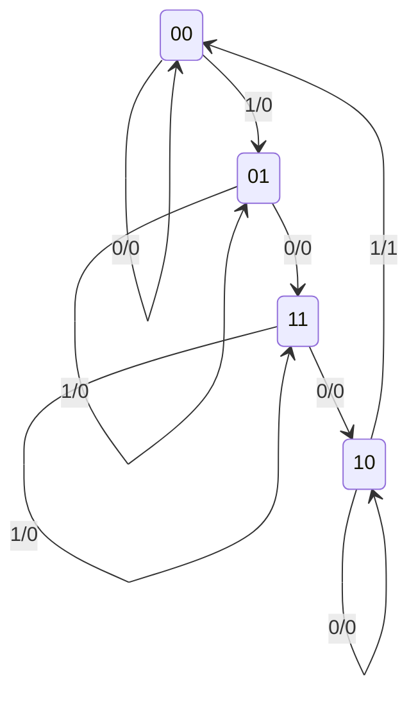

# Diagramas de estado

## Ubicación y alcance en el libro

Este desarrollo utiliza como fuente principal:

- **Capítulo 6, "Lógica secuencial".**
- **Sección 6-4, "Análisis de los circuitos secuenciales temporizados".**
- **PDF pp. 236-243**, correspondientes a las **pp. 224-231 de la numeración impresa**.

En la PDF p. 236 se utiliza únicamente el contenido que comienza bajo el encabezado 6-4. En la PDF p. 243 se utiliza el cierre de la sección, antes del encabezado 6-5. Se combinaron extracción textual y revisión visual de la Tabla 6-1 y de las figuras 6-15 a 6-18. [[Raw/Lógica Digital y Diseño de Computadores, 1ra Edición, por M. Morris Mano.pdf#page=236|Mano, PDF pp. 236-243 (libro pp. 224-231), sección 6-4]]

La sección desarrolla, en este orden:

1. qué significa analizar un circuito secuencial temporizado;
2. un circuito de ejemplo con dos flip-flops RS;
3. su tabla de estado;
4. su diagrama de estado;
5. sus ecuaciones de estado;
6. las funciones de entrada de los flip-flops.

La reducción y asignación de estados comienza en 6-5. Las tablas de excitación y el procedimiento de diseño aparecen después. Esos contenidos no se adelantan aquí.

## Objetivos de aprendizaje

Al finalizar este tema, el estudiante debería poder:

- identificar las entradas, salidas y variables de estado de un circuito secuencial;
- distinguir estado presente y estado siguiente;
- construir una tabla de estado a partir de un diagrama lógico;
- interpretar cada sección de la Tabla 6-1;
- convertir una tabla de estado en un diagrama de estado;
- interpretar etiquetas de transición en la forma entrada/salida;
- reconocer una transición hacia otro estado y una transición sin cambio;
- explicar por qué tabla y diagrama contienen la misma información;
- definir y obtener una ecuación de estado;
- relacionar las ecuaciones de estado con las ecuaciones características;
- interpretar la notación de las funciones de entrada de un flip-flop;
- reconocer distintas representaciones equivalentes de un mismo circuito.

## 1. Qué determina el comportamiento secuencial

El comportamiento de un circuito secuencial está determinado por:

- sus entradas;
- sus salidas;
- los estados de sus flip-flops.

El estado siguiente y las salidas son funciones de las entradas y del estado presente. A diferencia del análisis combinacional, también debe incorporarse la secuencia temporal, de forma directa o indirecta. [[Raw/Lógica Digital y Diseño de Computadores, 1ra Edición, por M. Morris Mano.pdf#page=236|Mano, PDF pp. 236-237 (libro pp. 224-225)]]

Una expresión lógica aislada no basta si no se sabe a qué instante pertenece cada valor. Por eso Mano utiliza notaciones como:

$$
A(t+1)
$$

para distinguir el valor que tendrá el flip-flop después del siguiente pulso.

## 2. Qué significa analizar un circuito secuencial

El **análisis de un circuito secuencial** consiste en obtener una representación de la secuencia temporal de:

- entradas;
- salidas;
- estados internos.

El resultado puede expresarse mediante una tabla o un diagrama. También pueden emplearse expresiones de Boole, siempre que incluyan la relación temporal necesaria. [[Raw/Lógica Digital y Diseño de Computadores, 1ra Edición, por M. Morris Mano.pdf#page=237|Mano, PDF p. 237 (libro p. 225)]]

> **Explicación complementaria**
>
> Analizar significa comenzar con un circuito ya dado y descubrir qué hace. En esta sección, Mano no parte de una conducta deseada para construir un circuito; ese recorrido inverso pertenece al diseño y se desarrolla más adelante.

## 3. Cómo reconocer un circuito secuencial en un diagrama lógico

Un diagrama lógico se reconoce como secuencial cuando incluye flip-flops. Estos pueden ser de cualquier tipo y pueden estar acompañados o no por compuertas combinacionales.

Los flip-flops almacenan el estado. Las compuertas combinacionales calculan:

- las señales que alimentan las entradas de los flip-flops;
- las salidas externas del circuito.

[[Raw/Lógica Digital y Diseño de Computadores, 1ra Edición, por M. Morris Mano.pdf#page=237|Mano, PDF p. 237 (libro p. 225)]]

## 4. Circuito de ejemplo de la figura 6-15

Mano utiliza el mismo ejemplo durante toda la sección. El circuito tiene:

- una variable de entrada externa $x$;
- una variable de salida externa $y$;
- dos flip-flops RS temporizados llamados $A$ y $B$;
- cuatro compuertas AND para las entradas de los flip-flops;
- una compuerta AND para la salida.

El estado del circuito queda determinado por el par:

$$
AB
$$

Como cada flip-flop almacena un bit, existen cuatro estados posibles:

$$
00,\quad 01,\quad 10,\quad 11
$$

[[Raw/Lógica Digital y Diseño de Computadores, 1ra Edición, por M. Morris Mano.pdf#page=237|Mano, PDF p. 237 (libro p. 225), figura 6-15]]

> **Explicación complementaria**
>
> En la escritura $AB$, el primer bit es el estado del flip-flop $A$ y el segundo es el estado de $B$. Por ejemplo, $AB=10$ significa $A=1$ y $B=0$.

## 5. Conexiones realimentadas y etiquetas

Para evitar demasiadas líneas cruzadas, la figura 6-15 no dibuja todas las conexiones realimentadas. En su lugar, marca cada entrada de compuerta con la variable que llega a ella.

Por ejemplo:

- una entrada marcada $x'$ recibe el complemento de $x$;
- una entrada marcada $A$ recibe la salida normal del flip-flop $A$;
- una entrada marcada $B'$ recibe la salida complementada de $B$.

Las letras permiten reconocer la conexión aunque no se dibuje físicamente la línea completa. [[Raw/Lógica Digital y Diseño de Computadores, 1ra Edición, por M. Morris Mano.pdf#page=237|Mano, PDF p. 237 (libro p. 225)]]

## 6. Temporización adoptada en el ejemplo

El autor supone disparo por **flanco negativo** para:

- los dos flip-flops;
- la fuente que produce la entrada externa $x$.

Las señales correspondientes a un estado presente permanecen disponibles entre un pulso de reloj y el siguiente. En el siguiente flanco activo, el circuito cambia al estado siguiente. [[Raw/Lógica Digital y Diseño de Computadores, 1ra Edición, por M. Morris Mano.pdf#page=237|Mano, PDF pp. 237-238 (libro pp. 225-226)]]

Esta suposición permite estudiar el comportamiento como una sucesión de pasos discretos:

$$
\text{estado presente}\ \longrightarrow\ \text{pulso}\ \longrightarrow\ \text{estado siguiente}
$$

## 7. Funciones visibles en el circuito de ejemplo

Las compuertas de la figura 6-15 generan:

| Señal | Función lógica | Destino |
|---|---|---|
| $S_A$ | $Bx'$ | Entrada $S$ del flip-flop $A$ |
| $R_A$ | $B'x$ | Entrada $R$ del flip-flop $A$ |
| $S_B$ | $A'x$ | Entrada $S$ del flip-flop $B$ |
| $R_B$ | $Ax'$ | Entrada $R$ del flip-flop $B$ |
| $y$ | $AB'x$ | Salida externa |

Estas funciones se presentan formalmente al final de la sección, pero pueden leerse directamente de las compuertas de la figura. [[Raw/Lógica Digital y Diseño de Computadores, 1ra Edición, por M. Morris Mano.pdf#page=237|Mano, figura 6-15, PDF p. 237 (libro p. 225)]] [[Raw/Lógica Digital y Diseño de Computadores, 1ra Edición, por M. Morris Mano.pdf#page=243|Mano, PDF p. 243 (libro p. 231)]]

## 8. Regla de operación de los flip-flops RS

Para determinar el siguiente estado se necesita recordar:

| $S$ | $R$ | Operación |
|---:|---:|---|
| 0 | 0 | Sin cambio |
| 0 | 1 | Puesta a cero |
| 1 | 0 | Puesta a uno |
| 1 | 1 | Estado indeterminado; diseño no aceptable |

Un 1 en $S$ pone el flip-flop en 1. Un 1 en $R$ lo pone en 0. Dos ceros conservan el estado. La combinación $S=R=1$ produciría una tabla indeterminada y revelaría un mal diseño. [[Raw/Lógica Digital y Diseño de Computadores, 1ra Edición, por M. Morris Mano.pdf#page=239|Mano, PDF p. 239 (libro p. 227)]]

## 9. Tabla de estado

La secuencia temporal de entradas, salidas y estados puede enumerarse en una **tabla de estado**.

La Tabla 6-1 contiene tres secciones:

1. **Estado presente:** valores de los flip-flops antes del pulso.
2. **Estado siguiente:** valores después del pulso.
3. **Salida:** valor de la salida durante el estado presente.

Como el ejemplo tiene una entrada $x$, las secciones de estado siguiente y salida tienen una columna para $x=0$ y otra para $x=1$. [[Raw/Lógica Digital y Diseño de Computadores, 1ra Edición, por M. Morris Mano.pdf#page=238|Mano, PDF p. 238 (libro p. 226), Tabla 6-1]]

### 9.1 Tabla 6-1

| Estado presente $AB$ | Estado siguiente con $x=0$ | Estado siguiente con $x=1$ | $y$ con $x=0$ | $y$ con $x=1$ |
|:---:|:---:|:---:|:---:|:---:|
| 00 | 00 | 01 | 0 | 0 |
| 01 | 11 | 01 | 0 | 0 |
| 10 | 10 | 00 | 0 | 1 |
| 11 | 10 | 11 | 0 | 0 |

[[Raw/Lógica Digital y Diseño de Computadores, 1ra Edición, por M. Morris Mano.pdf#page=238|Mano, Tabla 6-1, PDF p. 238 (libro p. 226)]]

### 9.2 Nota terminológica del autor

Mano señala en una nota que algunos libros de teoría de circuitos de conmutación llaman **tabla de transición** a esta tabla. Esos libros reservan "tabla de estado" para una representación en la que los estados internos se designan mediante símbolos arbitrarios. En esta sección se conserva la terminología del autor: **tabla de estado**. [[Raw/Lógica Digital y Diseño de Computadores, 1ra Edición, por M. Morris Mano.pdf#page=238|Mano, nota al pie, PDF p. 238 (libro p. 226)]]

## 10. Elección del estado inicial

La deducción puede comenzar con un estado inicial supuesto.

En muchos circuitos prácticos se utiliza:

$$
AB=00
$$

porque todos los flip-flops se inicializan en cero. Sin embargo:

- algunos circuitos tienen otro estado inicial;
- algunos no tienen un estado inicial definido;
- para el análisis se puede comenzar desde cualquier estado arbitrario.

Mano comienza el ejemplo con $00$. [[Raw/Lógica Digital y Diseño de Computadores, 1ra Edición, por M. Morris Mano.pdf#page=238|Mano, PDF p. 238 (libro p. 226)]]

## 11. Deducción de la primera fila

### 11.1 Estado presente $AB=00$ y entrada $x=0$

Se tiene:

$$
A=0,\qquad B=0,\qquad x=0
$$

Ninguna compuerta AND de entrada produce 1. Por tanto:

$$
S_A=R_A=S_B=R_B=0
$$

Los dos flip-flops conservan su estado:

$$
AB(t+1)=00
$$

La salida es:

$$
y=AB'x=0
$$

### 11.2 Estado presente $AB=00$ y entrada $x=1$

La compuerta que genera $S_B=A'x$ produce 1 y la que genera $R_A=B'x$ también produce 1:

$$
S_B=1,\qquad R_A=1
$$

El flip-flop $A$ queda en 0 y $B$ se pone en 1:

$$
AB(t+1)=01
$$

La salida continúa en 0 porque $A=0$ en el estado presente. [[Raw/Lógica Digital y Diseño de Computadores, 1ra Edición, por M. Morris Mano.pdf#page=238|Mano, PDF p. 238 (libro p. 226)]]

## 12. Deducción completa de las transiciones

> **Explicación complementaria**
>
> Las siguientes operaciones desarrollan fila por fila la Tabla 6-1 mediante las funciones de entrada de la figura 6-15. El libro explica en detalle la primera fila y señala que las demás se obtienen de modo similar.

### 12.1 Desde $AB=00$

| $x$ | Acciones principales | Estado siguiente |
|---:|---|:---:|
| 0 | Todos los $S$ y $R$ valen 0 | 00 |
| 1 | $R_A=1$ y $S_B=1$ | 01 |

### 12.2 Desde $AB=01$

| $x$ | Acciones principales | Estado siguiente |
|---:|---|:---:|
| 0 | $S_A=1$; $B$ conserva 1 | 11 |
| 1 | $A$ conserva 0; $S_B=1$ mantiene $B=1$ | 01 |

### 12.3 Desde $AB=10$

| $x$ | Acciones principales | Estado siguiente |
|---:|---|:---:|
| 0 | $A$ conserva 1; $R_B=1$ mantiene $B=0$ | 10 |
| 1 | $R_A=1$; $B$ conserva 0 | 00 |

### 12.4 Desde $AB=11$

| $x$ | Acciones principales | Estado siguiente |
|---:|---|:---:|
| 0 | $S_A=1$ y $R_B=1$ | 10 |
| 1 | Los dos flip-flops conservan 1 | 11 |

Todas estas transiciones coinciden con la Tabla 6-1. Ninguna combinación aplica simultáneamente $S=R=1$ al mismo flip-flop.

## 13. Deducción de la salida

La función de salida del circuito es:

$$
y=AB'x
$$

Para que $y=1$ deben cumplirse simultáneamente:

$$
A=1,\qquad B=0,\qquad x=1
$$

Eso ocurre solamente cuando:

$$
AB=10,\qquad x=1
$$

Por esa razón, la sección de salida de la Tabla 6-1 contiene un único 1. Todas las demás combinaciones producen 0. [[Raw/Lógica Digital y Diseño de Computadores, 1ra Edición, por M. Morris Mano.pdf#page=239|Mano, PDF p. 239 (libro p. 227)]]

> **Explicación complementaria**
>
> La salida se calcula con el estado presente, no con el estado que resultará después del pulso. En la transición $10\rightarrow00$ causada por $x=1$, la etiqueta de salida es 1 porque antes del pulso el estado era $10$.

## 14. Tamaño general de una tabla de estado

Para un circuito con:

- $m$ flip-flops;
- $n$ variables de entrada;

la tabla tiene:

$$
2^m\ \text{filas}
$$

porque cada combinación de los $m$ bits representa un estado.

Las secciones de estado siguiente y de salida tienen:

$$
2^n\ \text{columnas}
$$

una para cada combinación de entradas. [[Raw/Lógica Digital y Diseño de Computadores, 1ra Edición, por M. Morris Mano.pdf#page=239|Mano, PDF p. 239 (libro p. 227)]]

### 14.1 Aplicación al ejemplo

En la figura 6-15:

$$
m=2,\qquad n=1
$$

Por tanto:

$$
2^m=2^2=4\ \text{filas}
$$

y:

$$
2^n=2^1=2\ \text{columnas por sección}
$$

> **Explicación complementaria**
>
> Esta cuenta ayuda a comprobar que la tabla está completa. Si falta una fila o una columna, alguna combinación de estado o entrada no ha sido analizada.

## 15. Salidas de compuertas y salidas de flip-flops

Las salidas externas pueden proceder de:

- compuertas lógicas;
- elementos de memoria.

Una salida tomada directamente de un flip-flop ya aparece como parte del estado presente. La sección separada de salida se necesita para registrar salidas producidas por la lógica combinacional, como $y=AB'x$ en el ejemplo. Si no existen salidas externas de compuertas, esa sección puede omitirse. [[Raw/Lógica Digital y Diseño de Computadores, 1ra Edición, por M. Morris Mano.pdf#page=239|Mano, PDF p. 239 (libro p. 227)]]

## 16. Qué es un diagrama de estado

La información de una tabla de estado puede representarse gráficamente mediante un **diagrama de estado**.

Sus elementos son:

- un círculo para cada estado;
- un número binario dentro del círculo para identificarlo;
- líneas dirigidas para representar transiciones;
- etiquetas sobre las líneas para indicar la entrada y la salida.

[[Raw/Lógica Digital y Diseño de Computadores, 1ra Edición, por M. Morris Mano.pdf#page=239|Mano, PDF p. 239 (libro p. 227), figura 6-16]]

## 17. Etiquetas entrada/salida

Las líneas de la figura 6-16 se rotulan con dos valores separados por una barra:

$$
\text{entrada}/\text{salida}
$$

Por ejemplo:

$$
1/0
$$

significa que:

- la entrada es $x=1$;
- la salida durante el estado presente es $y=0$.

La flecha muestra el estado siguiente producido por esa combinación. [[Raw/Lógica Digital y Diseño de Computadores, 1ra Edición, por M. Morris Mano.pdf#page=240|Mano, PDF p. 240 (libro p. 228)]]

## 18. Diagrama de estado de la figura 6-16

El diagrama reproduce la información de la Tabla 6-1 y de la figura 6-16. [[Raw/Lógica Digital y Diseño de Computadores, 1ra Edición, por M. Morris Mano.pdf#page=239|Mano, figura 6-16, PDF pp. 239-240 (libro pp. 227-228)]]

## 19. Cómo leer una transición

Mano explica la flecha:

$$
00 \xrightarrow{1/0} 01
$$

de la siguiente forma:

1. el estado presente es $00$;
2. la entrada es $x=1$;
3. la salida es $y=0$;
4. al finalizar el siguiente pulso, el circuito pasa a $01$.

[[Raw/Lógica Digital y Diseño de Computadores, 1ra Edición, por M. Morris Mano.pdf#page=240|Mano, PDF p. 240 (libro p. 228)]]

### 19.1 Ejemplo con salida 1

> **Explicación complementaria**
>
> La única flecha rotulada $1/1$ es:
>
> $$
> 10 \xrightarrow{1/1} 00
> $$
>
> El circuito produce $y=1$ durante el estado presente $10$ con $x=1$ y después cambia al estado $00$.

## 20. Transición sin cambio de estado

Una línea dirigida que regresa al mismo círculo indica que el estado no cambia.

Ejemplos del circuito:

$$
00 \xrightarrow{0/0} 00
$$

$$
01 \xrightarrow{1/0} 01
$$

$$
10 \xrightarrow{0/0} 10
$$

$$
11 \xrightarrow{1/0} 11
$$

Cada una representa una combinación que conserva el estado presente. [[Raw/Lógica Digital y Diseño de Computadores, 1ra Edición, por M. Morris Mano.pdf#page=240|Mano, PDF p. 240 (libro p. 228)]]

## 21. Tabla de estado y diagrama de estado

Mano afirma que no existe diferencia en la información representada:

| Representación | Forma | Ventaja destacada |
|---|---|---|
| Tabla de estado | Tabular | Más fácil de deducir desde un diagrama lógico |
| Diagrama de estado | Gráfica | Ofrece una vista pictórica de las transiciones |

El diagrama se obtiene directamente de la tabla. Además, se usa con frecuencia como especificación inicial para el diseño de un circuito secuencial. [[Raw/Lógica Digital y Diseño de Computadores, 1ra Edición, por M. Morris Mano.pdf#page=240|Mano, PDF p. 240 (libro p. 228)]]

> **Explicación complementaria**
>
> La tabla facilita comprobar que se consideraron todas las combinaciones. El diagrama facilita seguir recorridos: por ejemplo, con entradas sucesivas $1,0,0,1$, se pueden recorrer las flechas de un estado al siguiente.

## 22. Ejemplo de recorrido por el diagrama

> **Explicación complementaria**
>
> Partiendo de $00$ y aplicando la secuencia:
>
> $$
> x: 1,\ 0,\ 0,\ 1
> $$
>
> se obtiene:
>
> | Paso | Estado presente | $x$ | $y$ | Estado siguiente |
> |---:|:---:|---:|---:|:---:|
> | 1 | 00 | 1 | 0 | 01 |
> | 2 | 01 | 0 | 0 | 11 |
> | 3 | 11 | 0 | 0 | 10 |
> | 4 | 10 | 1 | 1 | 00 |
>
> El recorrido forma el ciclo:
>
> $$
> 00\rightarrow01\rightarrow11\rightarrow10\rightarrow00
> $$
>
> Cada paso proviene de una flecha ya presente en la figura 6-16; no se introduce una transición nueva.

## 23. Qué es una ecuación de estado

Una **ecuación de estado**, también llamada por el autor **ecuación de aplicación**, es una expresión algebraica que especifica las condiciones para la transición de estado de un flip-flop.

Tiene la forma general:

$$
Q(t+1)=F(\text{entradas externas},\text{estado presente})
$$

El lado izquierdo identifica el estado siguiente. El lado derecho es una función de Boole que vale 1 en las condiciones que harán que el flip-flop tenga estado siguiente 1. [[Raw/Lógica Digital y Diseño de Computadores, 1ra Edición, por M. Morris Mano.pdf#page=240|Mano, PDF p. 240 (libro p. 228)]]

## 24. Ecuación de estado y ecuación característica

Las dos formas son semejantes, pero no idénticas:

| Ecuación | Qué expresa |
|---|---|
| Característica | El siguiente estado de un tipo de flip-flop en función de sus entradas propias y su estado |
| De estado | El siguiente estado de un flip-flop concreto en función de entradas externas y estados del circuito |

La ecuación característica del RS es:

$$
Q(t+1)=S+R'Q
$$

La ecuación de estado sustituye $S$ y $R$ por las funciones combinacionales que realmente llegan a esas entradas. [[Raw/Lógica Digital y Diseño de Computadores, 1ra Edición, por M. Morris Mano.pdf#page=240|Mano, PDF pp. 240-241 (libro pp. 228-229)]]

## 25. Ecuación de estado de $A$ desde la tabla

La Tabla 6-1 indica que $A(t+1)=1$ en estos casos:

- $x=0$ y $AB=01$;
- $x=0$ y $AB=10$;
- $x=0$ y $AB=11$;
- $x=1$ y $AB=11$.

La expresión directa es:

$$
A(t+1)=(A'B+AB'+AB)x'+ABx
$$

El símbolo $(t+1)$ recuerda que el valor será alcanzado después del siguiente pulso. La ecuación solo tiene sentido en el contexto temporizado de instantes discretos. [[Raw/Lógica Digital y Diseño de Computadores, 1ra Edición, por M. Morris Mano.pdf#page=240|Mano, PDF p. 240 (libro p. 228)]]

## 26. Simplificación de la ecuación de $A$

El mapa de la figura 6-17(a) simplifica la función a:

$$
A(t+1)=Bx'+(B'x)'A
$$

Del diagrama lógico:

$$
S_A=Bx'
$$

$$
R_A=B'x
$$

La ecuación característica del RS aplicado a $A$ es:

$$
A(t+1)=S_A+R_A'A
$$

Sustituyendo:

$$
A(t+1)=Bx'+(B'x)'A
$$

Así se llega a la misma ecuación desde la tabla o desde el circuito. [[Raw/Lógica Digital y Diseño de Computadores, 1ra Edición, por M. Morris Mano.pdf#page=241|Mano, PDF p. 241 (libro p. 229), figura 6-17(a)]]

## 27. Ecuación de estado de $B$

El mapa de la figura 6-17(b), construido a partir de las combinaciones que hacen $B(t+1)=1$, produce:

$$
B(t+1)=A'x+(Ax')'B
$$

El mismo resultado se obtiene desde el diagrama:

$$
S_B=A'x
$$

$$
R_B=Ax'
$$

Usando la ecuación característica RS:

$$
B(t+1)=S_B+R_B'B
$$

y sustituyendo:

$$
B(t+1)=A'x+(Ax')'B
$$

[[Raw/Lógica Digital y Diseño de Computadores, 1ra Edición, por M. Morris Mano.pdf#page=241|Mano, PDF pp. 241-242 (libro pp. 229-230), figura 6-17(b)]]

## 28. Dos caminos para obtener ecuaciones de estado

Mano presenta dos procedimientos:

### 28.1 Desde la tabla de estado

1. Identificar las filas y entradas que hacen el siguiente estado igual a 1.
2. Escribir la función de Boole correspondiente.
3. Simplificarla.

### 28.2 Desde el diagrama lógico

1. Obtener las funciones de las entradas del flip-flop.
2. Elegir la ecuación característica del tipo de flip-flop.
3. Sustituir las funciones de entrada.
4. Simplificar el resultado.

Ambos métodos deben producir la misma ecuación. [[Raw/Lógica Digital y Diseño de Computadores, 1ra Edición, por M. Morris Mano.pdf#page=241|Mano, PDF p. 241 (libro p. 229)]]

> **Explicación complementaria**
>
> La coincidencia funciona como comprobación. Si la ecuación derivada de la tabla no coincide con la obtenida desde el circuito, probablemente existe un error al evaluar una transición, copiar una función de entrada o aplicar la ecuación característica.

## 29. Representaciones equivalentes

Las ecuaciones de estado de todos los flip-flops, junto con las funciones de salida, especifican completamente el circuito secuencial.

La misma información puede aparecer como:

| Representación | Forma |
|---|---|
| Diagrama lógico | Compuertas, flip-flops y conexiones |
| Tabla de estado | Forma tabular |
| Diagrama de estado | Forma gráfica |
| Ecuaciones de estado y salida | Forma algebraica |

[[Raw/Lógica Digital y Diseño de Computadores, 1ra Edición, por M. Morris Mano.pdf#page=242|Mano, PDF p. 242 (libro p. 230)]]

## 30. Funciones de entrada de un flip-flop

El circuito combinacional que genera las entradas de los flip-flops puede describirse mediante funciones de Boole llamadas:

- **funciones de entrada del flip-flop**;
- o **ecuaciones de entrada**.

La parte combinacional que genera las salidas externas se describe mediante las **funciones de salida del circuito**. [[Raw/Lógica Digital y Diseño de Computadores, 1ra Edición, por M. Morris Mano.pdf#page=242|Mano, PDF p. 242 (libro p. 230)]]

## 31. Convención de dos letras

Mano adopta dos letras para nombrar una variable de entrada de flip-flop:

- la primera indica la entrada;
- la segunda indica el flip-flop.

Por ejemplo:

$$
J_A
$$

significa la señal conectada a la entrada $J$ del flip-flop $A$.

Del mismo modo:

$$
K_A
$$

significa la señal conectada a la entrada $K$ del mismo flip-flop. [[Raw/Lógica Digital y Diseño de Computadores, 1ra Edición, por M. Morris Mano.pdf#page=242|Mano, PDF p. 242 (libro p. 230)]]

## 32. Ejemplo de funciones de entrada JK

El libro propone:

$$
J_A=BC'x+B'Cx'
$$

$$
K_A=B+y
$$

La figura 6-18 configura las compuertas necesarias para producir esas dos señales y conectarlas a las entradas $J$ y $K$ del flip-flop $A$. [[Raw/Lógica Digital y Diseño de Computadores, 1ra Edición, por M. Morris Mano.pdf#page=242|Mano, PDF pp. 242-243 (libro pp. 230-231), figura 6-18]]

### 32.1 Interpretación

- $J_A$ no es el estado del flip-flop.
- $J_A$ es la salida de un circuito combinacional.
- Esa salida se conecta a la entrada $J$ del flip-flop $A$.
- $K_A$ se interpreta de la misma manera para la entrada $K$.

La primera letra identifica el terminal de destino; la segunda, el elemento de memoria de destino.

## 33. Especificación algebraica completa del ejemplo

El circuito de la figura 6-15 se expresa mediante:

$$
S_A=Bx'
$$

$$
R_A=B'x
$$

$$
S_B=A'x
$$

$$
R_B=Ax'
$$

$$
y=AB'x
$$

Las cuatro primeras ecuaciones especifican el circuito combinacional que controla los flip-flops RS $A$ y $B$. La última especifica la salida externa. [[Raw/Lógica Digital y Diseño de Computadores, 1ra Edición, por M. Morris Mano.pdf#page=243|Mano, PDF p. 243 (libro p. 231)]]

## 34. El tiempo implícito en las funciones de entrada

Las funciones de entrada no escriben explícitamente $t$ o $t+1$. Sin embargo, el tiempo está implícito en la operación del pulso de reloj:

1. las funciones combinacionales producen $S_A$, $R_A$, $S_B$ y $R_B$ a partir del estado presente;
2. llega el flanco activo;
3. los flip-flops aplican sus reglas características;
4. aparece el estado siguiente.

Por eso las funciones de entrada y de salida pueden reemplazar al diagrama lógico como especificación algebraica, siempre que se conozcan el tipo de flip-flop y la temporización. [[Raw/Lógica Digital y Diseño de Computadores, 1ra Edición, por M. Morris Mano.pdf#page=243|Mano, PDF p. 243 (libro p. 231)]]

## 35. Procedimiento completo de análisis

> **Explicación complementaria**
>
> El orden seguido por Mano puede resumirse así:
>
> 1. Identificar entradas, salidas y flip-flops.
> 2. Nombrar las variables de estado.
> 3. Obtener las funciones de entrada de cada flip-flop.
> 4. Obtener la función de salida.
> 5. Aplicar la tabla característica de cada flip-flop.
> 6. Llenar la tabla de estado.
> 7. Convertir la tabla en diagrama de estado.
> 8. Obtener y simplificar las ecuaciones de estado.
> 9. Comprobar que tabla, diagrama y ecuaciones coincidan.

## 36. Comprobación cruzada del ejemplo

> **Explicación complementaria**
>
> Para el estado $AB=10$ y $x=1$:
>
> **Desde la tabla:**
>
> $$
> AB(t+1)=00,\qquad y=1
> $$
>
> **Desde el diagrama de estado:**
>
> $$
> 10\xrightarrow{1/1}00
> $$
>
> **Desde las funciones de entrada:**
>
> $$
> S_A=Bx'=0
> $$
>
> $$
> R_A=B'x=1
> $$
>
> de modo que $A$ se pone a cero, mientras:
>
> $$
> S_B=A'x=0,\qquad R_B=Ax'=0
> $$
>
> conserva $B=0$. Además:
>
> $$
> y=AB'x=1
> $$
>
> Las tres representaciones producen el mismo resultado.

## 37. Errores frecuentes

> **Explicación complementaria**

1. **Confundir estado presente con estado siguiente.** El presente se lee antes del pulso; el siguiente, después.
2. **Invertir el orden de los bits.** En $AB$, $A$ es el primer bit y $B$ el segundo.
3. **Usar el estado siguiente para calcular la salida de la Tabla 6-1.** La salida se evalúa durante el estado presente.
4. **Leer $1/0$ como estado inicial/estado final.** La etiqueta significa entrada/salida.
5. **Creer que un lazo propio no representa transición.** Representa un evento que conserva el estado.
6. **Omitir una combinación de entrada.** Cada estado debe tener una transición para cada valor posible de $x$.
7. **Confundir ecuación característica con ecuación de estado.** La segunda ya incorpora las funciones reales del circuito.
8. **Tratar $S_A$ como una multiplicación.** Es el nombre de la señal que llega a $S$ del flip-flop $A$.
9. **Olvidar la salida $y$.** Las ecuaciones de estado por sí solas no especifican una salida combinacional externa.
10. **Iniciar reducción o diseño.** La sección 6-4 analiza un circuito dado; los procedimientos siguientes quedan fuera de este tema.

## 38. Preguntas de comprobación

> **Explicación complementaria**

1. ¿Qué tres clases de información determinan el comportamiento secuencial?
2. ¿Qué significa analizar un circuito secuencial?
3. ¿Cuántos flip-flops tiene el ejemplo?
4. ¿Cuántos estados posibles produce ese número de flip-flops?
5. ¿Qué indica $AB=01$?
6. ¿Qué flanco se supone activo en la figura 6-15?
7. ¿Cuáles son las tres secciones de la Tabla 6-1?
8. ¿Qué transición ocurre desde $00$ con $x=1$?
9. ¿En qué única combinación vale $y=1$?
10. ¿Cuántas filas tiene una tabla con $m$ flip-flops?
11. ¿Cuántas columnas por sección se necesitan para $n$ entradas?
12. ¿Qué representa un círculo en un diagrama de estado?
13. ¿Qué representa una línea dirigida?
14. ¿Qué significa la etiqueta $1/0$?
15. ¿Qué significa una flecha que vuelve al mismo círculo?
16. ¿Qué diferencia informativa existe entre tabla y diagrama de estado?
17. ¿Qué expresa una ecuación de estado?
18. ¿Cómo puede obtenerse desde el diagrama lógico?
19. ¿Qué significa $J_A$?
20. ¿Qué conjunto algebraico especifica completamente el ejemplo?

## 39. Respuestas breves

1. Entradas, salidas y estados de los flip-flops.
2. Obtener una tabla, diagrama o ecuaciones que describan su secuencia de comportamiento.
3. Dos, llamados $A$ y $B$.
4. Cuatro.
5. $A=0$ y $B=1$.
6. El flanco negativo.
7. Estado presente, estado siguiente y salida.
8. $00\rightarrow01$ con salida 0.
9. Estado presente $10$ y entrada $x=1$.
10. $2^m$.
11. $2^n$.
12. Un estado.
13. Una transición entre estados.
14. Entrada 1 y salida 0.
15. Que el estado no cambia.
16. Ninguna; cambia solamente la forma de presentación.
17. Las condiciones que producen el siguiente estado de un flip-flop.
18. Obteniendo sus funciones de entrada y sustituyéndolas en la ecuación característica.
19. La señal de la entrada $J$ del flip-flop $A$.
20. Las funciones $S_A$, $R_A$, $S_B$, $R_B$ y $y$.

## Relación con el curso

Este tema depende de:

- [[Wiki/Conceptos/Retroalimentación digital|estado presente y siguiente]];
- [[Wiki/Conceptos/Flip-flops|tablas y ecuaciones características de los flip-flops]];
- [[Wiki/Conceptos/Diagramas de tiempo|pulsos, flancos y temporización]].

Dentro de la [[Wiki/Unidades/Unidad 2 - Lógica secuencial|Unidad 2]], prepara:

- [[Wiki/Conceptos/Diseño con lógica secuencial|reducción y asignación de estados, tablas de excitación y procedimiento de diseño secuencial]];
- bloques digitales secuenciales.

Esos contenidos no se desarrollan aquí; el primero se continúa en la página enlazada.

## Fuentes y límites

- Definición del análisis secuencial e introducción del ejemplo. [[Raw/Lógica Digital y Diseño de Computadores, 1ra Edición, por M. Morris Mano.pdf#page=236|Mano, PDF pp. 236-237 (libro pp. 224-225)]]
- Circuito secuencial temporizado con flip-flops $A$ y $B$, figura 6-15. [[Raw/Lógica Digital y Diseño de Computadores, 1ra Edición, por M. Morris Mano.pdf#page=237|Mano, PDF p. 237 (libro p. 225)]]
- Tabla de estado y deducción inicial, Tabla 6-1. [[Raw/Lógica Digital y Diseño de Computadores, 1ra Edición, por M. Morris Mano.pdf#page=238|Mano, PDF pp. 238-239 (libro pp. 226-227)]]
- Diagrama de estado y equivalencia con la tabla, figura 6-16. [[Raw/Lógica Digital y Diseño de Computadores, 1ra Edición, por M. Morris Mano.pdf#page=239|Mano, PDF pp. 239-240 (libro pp. 227-228)]]
- Definición y primera derivación de ecuaciones de estado. [[Raw/Lógica Digital y Diseño de Computadores, 1ra Edición, por M. Morris Mano.pdf#page=240|Mano, PDF p. 240 (libro p. 228)]]
- Simplificación y ecuaciones de los flip-flops $A$ y $B$, figura 6-17. [[Raw/Lógica Digital y Diseño de Computadores, 1ra Edición, por M. Morris Mano.pdf#page=241|Mano, PDF pp. 241-242 (libro pp. 229-230)]]
- Funciones de entrada y ejemplo JK, figura 6-18. [[Raw/Lógica Digital y Diseño de Computadores, 1ra Edición, por M. Morris Mano.pdf#page=242|Mano, PDF pp. 242-243 (libro pp. 230-231)]]
- Especificación algebraica completa del circuito de la figura 6-15. [[Raw/Lógica Digital y Diseño de Computadores, 1ra Edición, por M. Morris Mano.pdf#page=243|Mano, PDF p. 243 (libro p. 231), antes de 6-5]]
- Se combinaron extracción textual y revisión visual de las ocho páginas PDF.
- La sección contiene un ejemplo principal, la figura 6-15, desarrollado mediante la Tabla 6-1 y las figuras 6-16 y 6-17; la figura 6-18 añade un ejemplo de notación de funciones de entrada.
- Se excluyeron la sección 6-5 y las posteriores.

## Contradicciones y dudas

- Al describir cuándo se necesita la sección de salida, la edición disponible contiene la frase «si hay tres salidas de las compuertas lógicas». Por el contexto inmediato, que distingue salidas de compuertas y salidas tomadas directamente de flip-flops, parece corresponder «si hay **otras** salidas de las compuertas lógicas». La explicación de esta página se apoya en las oraciones anterior y posterior. [[Raw/Lógica Digital y Diseño de Computadores, 1ra Edición, por M. Morris Mano.pdf#page=239|Mano, PDF p. 239 (libro p. 227)]]
- Al recapitular la figura 6-15, el texto dice que el circuito tiene «una entrada $x$, una entrada $y$». La figura, la Tabla 6-1 y el resto de la sección identifican $y$ como **salida**, por lo que la segunda palabra «entrada» parece una errata. [[Raw/Lógica Digital y Diseño de Computadores, 1ra Edición, por M. Morris Mano.pdf#page=243|Mano, PDF p. 243 (libro p. 231)]]
