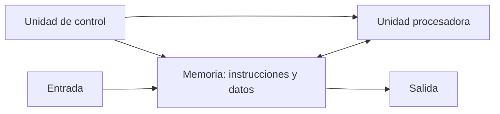

# Concepto básico de CPU con modelo de von Neumann

## Ubicación y alcance en las fuentes

El programa oficial denomina este tema **“Concepto básico de CPU con tecnología o modelo de von Neumann”**. [[Raw/Programa_0964.pdf#page=2|Programa 0964, PDF p. 2]]

La expresión *modelo de von Neumann* no aparece literalmente en las secciones revisadas del libro de Mano. Por ello, esta página no atribuye al autor una denominación que no utiliza: relaciona el nombre del programa con las características que el libro sí presenta de forma explícita (programa almacenado, memoria para instrucciones y datos, unidad procesadora, unidad de control y ejecución secuencial de instrucciones).

Se utilizan, en el orden pedagógico siguiente:

| Capítulo y sección | Páginas | Aporte al tema |
|---|---|---|
| Capítulo 1, §1-1, “Computadores digitales y sistemas digitales” | PDF pp. 13-16; libro pp. 1-4 | Computador de propósito general, bloques funcionales y definición de CPU |
| Capítulo 8, §8-11, “Códigos de instrucción” | PDF p. 360; libro p. 352 | Programa almacenado e interpretación de instrucciones |
| Capítulo 9, §9-1, “Introducción” | PDF p. 380; libro p. 372 | Unidad procesadora, microoperaciones y CPU |
| Capítulo 11, §11-1, “Introducción” | PDF pp. 485-486; libro pp. 477-478 | Computador elemental y fases generales de diseño |
| Capítulo 11, §11-2, “Configuración del sistema” | PDF pp. 486-490; libro pp. 478-482 | Memoria, registros, control y entrada/salida |
| Capítulo 11, §11-3, “Instrucciones de computador” | PDF pp. 490-497; libro pp. 482-489 | Formatos y repertorio de instrucciones |
| Capítulo 11, §11-4, “Sincronización de tiempo y control” | PDF pp. 497-499; libro pp. 489-491 | Reloj, variables de tiempo y lógica de control |
| Capítulo 11, §11-5, “Ejecución de instrucciones” | PDF pp. 500-505; libro pp. 492-497 | Ciclos de búsqueda y ejecución |

Se combinaron extracción textual y revisión visual de las páginas, las Figuras 1-1, 11-1 a 11-6 y las Tablas 11-1 a 11-9. De PDF p. 505 solo se usa el cierre de §11-5 anterior al encabezado 11-6. [[Raw/Lógica Digital y Diseño de Computadores, 1ra Edición, por M. Morris Mano.pdf#page=13|Mano, §1-1, PDF pp. 13-16 (libro pp. 1-4)]] [[Raw/Lógica Digital y Diseño de Computadores, 1ra Edición, por M. Morris Mano.pdf#page=360|Mano, §8-11, PDF p. 360 (libro p. 352)]] [[Raw/Lógica Digital y Diseño de Computadores, 1ra Edición, por M. Morris Mano.pdf#page=380|Mano, §9-1, PDF p. 380 (libro p. 372)]] [[Raw/Lógica Digital y Diseño de Computadores, 1ra Edición, por M. Morris Mano.pdf#page=485|Mano, §§11-1 a 11-5, PDF pp. 485-505 (libro pp. 477-497)]]

Quedan fuera:

- el diseño detallado de los registros de §11-6;
- las realizaciones de control de §§11-7 y 11-8;
- la consola del computador de §11-9;
- el diseño completo de las unidades procesadora y de control de los capítulos 9 y 10;
- comparaciones con otras arquitecturas y desarrollos históricos no tratados por las páginas citadas.

## Objetivos de aprendizaje

Al terminar este tema, el estudiante debería poder:

1. explicar qué hace que un computador sea de propósito general;
2. reconocer memoria, unidad procesadora, control y entrada/salida;
3. definir una CPU con la terminología de Mano;
4. explicar el concepto de programa almacenado;
5. identificar los registros del computador elemental del capítulo 11;
6. distinguir dato, instrucción, código de operación y dirección;
7. interpretar sus tres formatos de instrucción;
8. describir las seis instrucciones de memoria, las doce de registro y las cuatro de entrada/salida;
9. explicar la función del reloj, las variables $t_0$ a $t_3$ y los decodificadores;
10. seguir paso a paso los ciclos de búsqueda y ejecución;
11. relacionar una instrucción con las microoperaciones que producen su efecto.

# Parte I. Del computador de propósito general a la CPU

## 1. Computador digital de propósito general

Mano destaca como propiedad principal de un computador su **generalidad**. El computador puede seguir una serie de instrucciones llamada **programa**, que opera sobre datos. El usuario puede cambiar el programa y los datos para resolver necesidades diferentes; esa capacidad permite que una misma máquina realice tareas diversas. [[Raw/Lógica Digital y Diseño de Computadores, 1ra Edición, por M. Morris Mano.pdf#page=13|Mano, PDF p. 13 (libro p. 1)]]

Por tanto:

- los **datos** representan la información que será procesada;
- las **instrucciones** especifican qué operaciones se harán;
- el **programa** organiza esas instrucciones en una secuencia;
- cambiar el programa cambia la tarea sin reconstruir físicamente el computador.

## 2. Sistema de propósito especial y sistema de propósito general

En un sistema de propósito especial, la secuencia de microoperaciones se fija y se repite para realizar una tarea determinada. En un computador de propósito general, las instrucciones almacenadas especifican distintas secuencias de operaciones; el usuario controla el proceso mediante el programa. [[Raw/Lógica Digital y Diseño de Computadores, 1ra Edición, por M. Morris Mano.pdf#page=360|Mano, PDF p. 360 (libro p. 352)]]

| Tipo de sistema | Cómo se determina la tarea |
|---|---|
| Propósito especial | Por una secuencia interna fija |
| Propósito general | Por las instrucciones del programa almacenado |

> **Explicación complementaria**
>
> La diferencia esencial no es que una máquina sea “simple” y la otra “compleja”. Una máquina de propósito especial puede ser muy compleja. La diferencia es si su secuencia de trabajo está fijada para una función o puede seleccionarse mediante instrucciones almacenadas.

## 3. Bloques funcionales de un computador digital

La Figura 1-1 organiza el computador en:

1. unidad de memoria;
2. procesador o unidad aritmética;
3. unidad de control;
4. dispositivos de entrada y su control;
5. dispositivos de salida y su control.

La memoria almacena tanto el programa como los datos de entrada, los resultados intermedios y los resultados de salida. El procesador realiza operaciones aritméticas y de tratamiento de datos. La unidad de control supervisa el flujo de información, recupera las instrucciones una por una y ordena al procesador la operación indicada. [[Raw/Lógica Digital y Diseño de Computadores, 1ra Edición, por M. Morris Mano.pdf#page=15|Mano, Figura 1-1 y explicación, PDF p. 15 (libro p. 3)]]



> **Explicación complementaria**
>
> El diagrama anterior es una simplificación pedagógica de la Figura 1-1. Las flechas no pretenden reproducir cada conexión física: muestran que la memoria suministra instrucciones y datos, el procesador transforma datos y el control coordina la secuencia.

## 4. Unidad procesadora

La **unidad procesadora** es la parte del sistema que ejecuta las operaciones. Está compuesta por registros y funciones digitales capaces de realizar microoperaciones aritméticas, lógicas, de desplazamiento y de transferencia. [[Raw/Lógica Digital y Diseño de Computadores, 1ra Edición, por M. Morris Mano.pdf#page=380|Mano, §9-1, PDF p. 380 (libro p. 372)]]

Un **registro** conserva temporalmente una palabra binaria. Las funciones digitales transforman o mueven la información almacenada en esos registros.

## 5. Unidad de control

La **unidad de control** supervisa la secuencia de microoperaciones. Lee una instrucción de la memoria, la coloca en un registro, la interpreta y emite la sucesión de funciones de control necesarias para ejecutarla. [[Raw/Lógica Digital y Diseño de Computadores, 1ra Edición, por M. Morris Mano.pdf#page=360|Mano, PDF p. 360 (libro p. 352)]]

No realiza por sí sola la operación aritmética final. Su función es decidir:

- qué registro debe cargar información;
- qué operación debe efectuar la unidad procesadora;
- cuándo debe leerse o escribirse la memoria;
- cuándo debe avanzar o cambiar la secuencia de instrucciones.

## 6. Definición de CPU

Mano define la **unidad central de proceso**, o **CPU**, como la combinación de:

$$
\text{CPU}=\text{unidad procesadora}+\text{unidad de control}
$$

La unidad procesadora proporciona registros y operaciones; la unidad de control dirige la secuencia en la que estas operaciones ocurren. [[Raw/Lógica Digital y Diseño de Computadores, 1ra Edición, por M. Morris Mano.pdf#page=16|Mano, PDF p. 16 (libro p. 4)]] [[Raw/Lógica Digital y Diseño de Computadores, 1ra Edición, por M. Morris Mano.pdf#page=380|Mano, PDF p. 380 (libro p. 372)]]

Una CPU construida dentro de una pastilla de circuito integrado recibe el nombre de **microprocesador**. Cuando la CPU se combina con memoria y control de interconexión de entrada/salida, se obtiene un computador pequeño llamado **microcomputador**. [[Raw/Lógica Digital y Diseño de Computadores, 1ra Edición, por M. Morris Mano.pdf#page=16|Mano, PDF p. 16 (libro p. 4)]]

## 7. CPU no significa computador completo

La CPU es central, pero no es todo el computador descrito por Mano:

| Elemento | Función general |
|---|---|
| CPU | Procesar datos y controlar la secuencia |
| Memoria | Almacenar instrucciones y datos |
| Entrada | Introducir programa o información |
| Salida | Comunicar resultados |

> **Explicación complementaria**
>
> Decir que la CPU “ejecuta un programa” resume una cooperación. La CPU busca e interpreta instrucciones, pero necesita que la memoria las conserve y que los dispositivos de entrada/salida comuniquen información con el exterior.

# Parte II. Programa almacenado y correspondencia con el modelo de von Neumann

## 8. Programa

Un **programa** es un conjunto de instrucciones que especifica:

- las operaciones;
- los operandos o datos sobre los que se trabaja;
- la secuencia en la que debe ocurrir el procesamiento.

El programa permite modificar la tarea del computador escribiendo instrucciones diferentes o aplicando las mismas instrucciones a otros datos. [[Raw/Lógica Digital y Diseño de Computadores, 1ra Edición, por M. Morris Mano.pdf#page=360|Mano, §8-11, PDF p. 360 (libro p. 352)]]

## 9. Concepto de programa almacenado

En el computador de propósito general, **las instrucciones y los datos se almacenan en la memoria**. La unidad de control lee cada instrucción, la coloca en su registro de control o de instrucción, la interpreta y emite las funciones de control necesarias. Mano considera la capacidad de almacenar y ejecutar instrucciones, el concepto de programa almacenado, como la propiedad más importante del computador de propósito general. [[Raw/Lógica Digital y Diseño de Computadores, 1ra Edición, por M. Morris Mano.pdf#page=360|Mano, PDF p. 360 (libro p. 352)]]

## 10. Instrucciones y datos como palabras de memoria

La memoria conserva palabras binarias. El significado de una palabra depende del momento y del uso:

- durante el ciclo de búsqueda, la palabra leída se interpreta como instrucción;
- durante el ciclo de ejecución de una instrucción de memoria, otra palabra puede tomarse como operando.

El flip-flop $F$ del computador elemental distingue esos dos casos: $F=0$ identifica el ciclo de búsqueda y $F=1$ el ciclo de ejecución. [[Raw/Lógica Digital y Diseño de Computadores, 1ra Edición, por M. Morris Mano.pdf#page=489|Mano, PDF p. 489 (libro p. 481)]] [[Raw/Lógica Digital y Diseño de Computadores, 1ra Edición, por M. Morris Mano.pdf#page=500|Mano, PDF p. 500 (libro p. 492)]]

> **Explicación complementaria**
>
> Los bits no llevan una etiqueta física que diga “instrucción” o “dato”. La unidad de control les asigna significado según la fase de trabajo. Esta es una consecuencia directa de guardar ambos tipos de información como palabras binarias en la memoria.

## 11. Correspondencia editorial con el modelo de von Neumann

En el alcance del programa, las propiedades anteriores permiten reconocer un modelo básico de von Neumann:

1. existe una memoria que conserva instrucciones y datos;
2. la CPU reúne procesamiento y control;
3. un contador de programa señala la siguiente instrucción;
4. las instrucciones se buscan, interpretan y ejecutan mediante una secuencia de pasos;
5. la entrada/salida comunica el sistema con el exterior.

Esta lista es una **síntesis editorial** entre el nombre usado por el programa y la organización descrita por Mano. No es una cita ni una definición textual atribuida al autor. [[Raw/Programa_0964.pdf#page=2|Programa 0964, PDF p. 2]] [[Raw/Lógica Digital y Diseño de Computadores, 1ra Edición, por M. Morris Mano.pdf#page=15|Mano, PDF pp. 15-16 (libro pp. 3-4)]] [[Raw/Lógica Digital y Diseño de Computadores, 1ra Edición, por M. Morris Mano.pdf#page=360|Mano, PDF p. 360 (libro p. 352)]]

# Parte III. El computador elemental del capítulo 11

## 12. Propósito del ejemplo

El capítulo 11 presenta un computador digital pequeño de propósito general. Mano advierte que no es una máquina comercialmente útil: sus especificaciones son deliberadamente limitadas para demostrar el proceso de diseño. El sistema consta de:

- una unidad procesadora central;
- una unidad de memoria;
- una unidad de entrada/salida representada por una teleimpresora.

[[Raw/Lógica Digital y Diseño de Computadores, 1ra Edición, por M. Morris Mano.pdf#page=485|Mano, §11-1, PDF p. 485 (libro p. 477)]]

## 13. Fases del diseño

Mano divide el proceso en seis fases:

1. descomponer el computador en registros que definan su configuración general;
2. especificar las instrucciones;
3. formular los circuitos de tiempo y control;
4. listar las operaciones de transferencia entre registros necesarias para ejecutar las instrucciones;
5. diseñar la sección procesadora;
6. diseñar la sección de control.

Las cuatro primeras fases definen el comportamiento y la organización que se estudian en este tema. Las dos últimas secciones de diseño detallado quedan fuera del alcance actual. [[Raw/Lógica Digital y Diseño de Computadores, 1ra Edición, por M. Morris Mano.pdf#page=486|Mano, PDF p. 486 (libro p. 478)]]

## 14. Memoria principal

La memoria tiene:

$$
4096\ \text{palabras}\times16\ \text{bits por palabra}
$$

Como:

$$
4096=2^{12},
$$

se necesitan 12 bits para seleccionar una dirección. Cada palabra contiene 16 bits. En una instrucción de referencia de memoria, cuatro bits forman el código de operación y los doce restantes forman la dirección. [[Raw/Lógica Digital y Diseño de Computadores, 1ra Edición, por M. Morris Mano.pdf#page=486|Mano, PDF pp. 486-488 (libro pp. 478-480)]]

> **Explicación complementaria**
>
> Doce bits pueden formar desde `000000000000` hasta `111111111111`. Eso produce $2^{12}=4096$ combinaciones, una por cada palabra de memoria.

## 15. Lista de registros y flip-flops

La Tabla 11-1 especifica los elementos siguientes:

| Símbolo | Nombre usado por Mano | Bits | Función |
|---|---|---:|---|
| $A$ | Registro acumulador | 16 | Registro procesador |
| $B$ | Registro separador de memoria | 16 | Retiene la palabra de memoria |
| $PC$ | Contador de programa | 12 | Retiene la dirección de la siguiente instrucción |
| $MAR$ | Registro de dirección de memoria | 12 | Retiene la dirección de una palabra de memoria |
| $I$ | Registro de instrucción | 4 | Retiene el código de operación corriente |
| $E$ | Flip-flop de extensión | 1 | Extiende el acumulador |
| $F$ | Flip-flop de búsqueda | 1 | Controla los ciclos de búsqueda y ejecución |
| $S$ | Flip-flop de comienzo-parada | 1 | Inicia o detiene el computador |
| $G$ | Registro de secuencia | 2 | Produce señales de tiempo |
| $N$ | Registro de entrada | 9 | Retiene información del dispositivo de entrada |
| $U$ | Registro de salida | 9 | Retiene información para el dispositivo de salida |

[[Raw/Lógica Digital y Diseño de Computadores, 1ra Edición, por M. Morris Mano.pdf#page=487|Mano, Figura 11-1 y Tabla 11-1, PDF p. 487 (libro p. 479)]]

## 16. Registro de dirección de memoria, $MAR$

El $MAR$ contiene la dirección de la palabra que se va a leer o escribir. Se carga:

- desde el $PC$ al buscar una instrucción;
- desde la parte de dirección de $B$ al buscar un operando.

El $MAR$ conserva la dirección mientras ocurre el acceso a memoria. [[Raw/Lógica Digital y Diseño de Computadores, 1ra Edición, por M. Morris Mano.pdf#page=488|Mano, PDF p. 488 (libro p. 480)]]

## 17. Registro separador de memoria, $B$

El registro $B$ conserva la palabra leída de la memoria o la palabra que será escrita:

$$
B\leftarrow M
$$

representa una lectura, mientras que:

$$
M\leftarrow B
$$

representa una escritura en la dirección retenida por $MAR$. La parte de operación de una instrucción pasa de $B$ a $I$; la parte de dirección permanece disponible en $B$. [[Raw/Lógica Digital y Diseño de Computadores, 1ra Edición, por M. Morris Mano.pdf#page=488|Mano, PDF p. 488 (libro p. 480)]]

## 18. Contador de programa, $PC$

El $PC$ almacena la dirección de la siguiente instrucción que se leerá. Durante la búsqueda:

1. su contenido se transfiere al $MAR$;
2. la memoria entrega la instrucción;
3. el $PC$ se incrementa.

Así queda preparado para la siguiente instrucción secuencial. Una bifurcación modifica el $PC$ y cambia el orden normal. [[Raw/Lógica Digital y Diseño de Computadores, 1ra Edición, por M. Morris Mano.pdf#page=488|Mano, PDF p. 488 (libro p. 480)]]

> **Explicación complementaria**
>
> El $PC$ no cuenta cuántas instrucciones ya se ejecutaron. Conserva una **dirección**. Incrementarlo normalmente selecciona la palabra siguiente; cargarle otra dirección produce una bifurcación.

## 19. Acumulador, $A$

El acumulador es el registro procesador principal. Conserva datos leídos de memoria, participa en operaciones aritméticas y lógicas, recibe datos de entrada y suministra datos de salida. Junto con $B$, forma el cuerpo de la unidad procesadora de este computador reducido. [[Raw/Lógica Digital y Diseño de Computadores, 1ra Edición, por M. Morris Mano.pdf#page=488|Mano, PDF pp. 488-489 (libro pp. 480-481)]]

## 20. Registro de instrucción, $I$

El registro $I$ tiene cuatro bits y retiene el código de operación de la instrucción corriente. Los bits de operación se transfieren desde $B$:

$$
I\leftarrow B(OP)
$$

Después, un decodificador reconoce el código y activa una de las salidas $q_0$ a $q_7$. [[Raw/Lógica Digital y Diseño de Computadores, 1ra Edición, por M. Morris Mano.pdf#page=489|Mano, PDF p. 489 (libro p. 481)]] [[Raw/Lógica Digital y Diseño de Computadores, 1ra Edición, por M. Morris Mano.pdf#page=498|Mano, PDF p. 498 (libro p. 490)]]

## 21. Registro de secuencia, $G$

$G$ es un contador de dos bits. Sus cuatro estados se decodifican para producir:

$$
t_0,\ t_1,\ t_2,\ t_3
$$

Estas variables de tiempo, combinadas con el código de operación y otras condiciones, generan las funciones de control que inician las microoperaciones. [[Raw/Lógica Digital y Diseño de Computadores, 1ra Edición, por M. Morris Mano.pdf#page=489|Mano, PDF p. 489 (libro p. 481)]]

## 22. Flip-flops $E$, $F$ y $S$

| Flip-flop | Significado |
|---|---|
| $E$ | Extiende el acumulador; recibe el arrastre de la suma y participa en desplazamientos |
| $F$ | $0$: ciclo de búsqueda; $1$: ciclo de ejecución |
| $S$ | $1$: computador en marcha; $0$: computador detenido |

[[Raw/Lógica Digital y Diseño de Computadores, 1ra Edición, por M. Morris Mano.pdf#page=489|Mano, PDF p. 489 (libro p. 481)]]

## 23. Registros de entrada y salida

La teleimpresora intercambia caracteres de ocho bits. Los registros $N$ y $U$ tienen nueve bits:

- $N_1$ a $N_8$: carácter de entrada;
- $N_9$: indicador de entrada;
- $U_1$ a $U_8$: carácter de salida;
- $U_9$: indicador de salida.

El indicador de entrada se hace 1 cuando un carácter está disponible. El computador lo borra al aceptar el carácter. El indicador de salida se hace 1 cuando el dispositivo está listo para recibir un carácter y se borra al transferirlo. Estos indicadores permiten sincronizar dispositivos lentos con los circuitos rápidos del computador. [[Raw/Lógica Digital y Diseño de Computadores, 1ra Edición, por M. Morris Mano.pdf#page=490|Mano, PDF p. 490 (libro p. 482)]]

# Parte IV. Datos e instrucciones

## 24. Formatos de datos

La palabra de 16 bits puede interpretarse de tres maneras:

| Uso | Interpretación |
|---|---|
| Operando aritmético | Número binario con signo; bit 16 como signo y negativos en complemento a 2 |
| Operando lógico | Dieciséis bits tratados individualmente |
| Entrada/salida | Dos caracteres de ocho bits |

La Figura 11-2 muestra que el mismo tamaño de palabra admite usos distintos. [[Raw/Lógica Digital y Diseño de Computadores, 1ra Edición, por M. Morris Mano.pdf#page=491|Mano, Figura 11-2, PDF p. 491 (libro p. 483)]]

## 25. Código de operación y dirección

Una instrucción es una palabra binaria que especifica una operación. Su parte de **código de operación** indica qué debe hacerse. Una instrucción de referencia de memoria incluye además una parte de **dirección** que identifica la palabra de memoria relacionada con la operación. [[Raw/Lógica Digital y Diseño de Computadores, 1ra Edición, por M. Morris Mano.pdf#page=360|Mano, PDF p. 360 (libro p. 352)]] [[Raw/Lógica Digital y Diseño de Computadores, 1ra Edición, por M. Morris Mano.pdf#page=492|Mano, PDF p. 492 (libro p. 484)]]

Mano emplea:

- $m$: parte de dirección de la instrucción;
- $M$: palabra de memoria cuya dirección es $m$;
- $B(OP)$: parte de operación del registro $B$;
- $B(AD)$: parte de dirección del registro $B$.

## 26. Tres formatos de instrucción

### 26.1 Referencia de memoria

```text
bits 16-13             bits 12-1
+----------------+---------------------------+
| operación      | dirección                 |
| 4 bits         | 12 bits                   |
+----------------+---------------------------+
```

La dirección selecciona una de las 4096 palabras.

### 26.2 Referencia de registro

```text
bits 16-13             bits 12-1
+----------------+---------------------------+
| 0110           | operación o prueba         |
+----------------+---------------------------+
```

No necesita dirección de memoria: uno de los doce bits inferiores selecciona una operación o prueba sobre $A$ o $E$.

### 26.3 Entrada/salida

```text
bits 16-13             bits 12-1
+----------------+---------------------------+
| 0111           | operación o prueba E/S     |
+----------------+---------------------------+
```

Los bits inferiores especifican la operación de entrada/salida o la prueba.

[[Raw/Lógica Digital y Diseño de Computadores, 1ra Edición, por M. Morris Mano.pdf#page=491|Mano, Figura 11-3 y explicación, PDF pp. 491-492 (libro pp. 483-484)]]

## 27. Cantidad de instrucciones

Aunque cuatro bits permiten $2^4=16$ códigos principales, el computador usa:

- códigos 0 a 5: seis instrucciones de memoria;
- código 6 (`0110`): doce instrucciones de registro diferenciadas por los bits inferiores;
- código 7 (`0111`): cuatro instrucciones de entrada/salida diferenciadas por los bits inferiores.

El repertorio contiene:

$$
6+12+4=22\ \text{instrucciones}
$$

Mano deja sin utilizar los códigos 8 a 15 porque el bit 16 de toda instrucción se mantiene en 0. [[Raw/Lógica Digital y Diseño de Computadores, 1ra Edición, por M. Morris Mano.pdf#page=492|Mano, PDF p. 492 (libro p. 484)]]

# Parte V. Instrucciones de referencia de memoria

## 28. Tabla de instrucciones

| Símbolo | Código hexadecimal | Descripción normalizada | Función |
|---|---:|---|---|
| AND | `0m` | AND con $A$ | $A\leftarrow A\land M$ |
| ADD | `1m` | Sumar a $A$ | $A\leftarrow A+M,\ E\leftarrow\text{arrastre}$ |
| STO | `2m` | Almacenar $A$ en memoria | $M\leftarrow A$ |
| ISZ | `3m` | Incrementar y omitir si es cero | $M\leftarrow M+1$; si $M+1=0$, $PC\leftarrow PC+1$ |
| BSB | `4m` | Bifurcar a una subrutina | $M\leftarrow PC+5000_{16},\ PC\leftarrow m+1$ |
| BUN | `5m` | Bifurcar incondicionalmente | $PC\leftarrow m$ |

Aquí `m` representa los doce bits de dirección y $M$ la palabra de memoria seleccionada por esa dirección. [[Raw/Lógica Digital y Diseño de Computadores, 1ra Edición, por M. Morris Mano.pdf#page=492|Mano, Tabla 11-2, PDF p. 492 (libro p. 484)]]

## 29. AND

AND realiza la operación lógica bit a bit entre el contenido de $A$ y la palabra $M$. Cada bit del resultado vale 1 solo cuando los dos bits correspondientes valen 1. El resultado reemplaza el contenido anterior de $A$. [[Raw/Lógica Digital y Diseño de Computadores, 1ra Edición, por M. Morris Mano.pdf#page=493|Mano, PDF p. 493 (libro p. 485)]]

Ejemplo:

```text
A = 1010 1100 0000 1111
M = 1111 0000 1010 1010
    -------------------
A = 1010 0000 0000 1010
```

> **Explicación complementaria**
>
> El ejemplo usa valores propios para hacer visible la operación; no procede literalmente del libro. Cada columna se evalúa de forma independiente.

## 30. ADD

ADD suma $M$ al acumulador:

$$
A\leftarrow A+M
$$

El arrastre de salida del bit más significativo se guarda en $E$. Mano supone que los números negativos se representan en complemento a 2, por lo que todos los bits participan en la suma de la misma manera. [[Raw/Lógica Digital y Diseño de Computadores, 1ra Edición, por M. Morris Mano.pdf#page=493|Mano, PDF p. 493 (libro p. 485)]]

## 31. STO

STO transfiere el contenido de $A$ a la palabra de memoria indicada:

$$
M\leftarrow A
$$

No obtiene un operando de memoria; escribe un resultado. La descripción impresa “Almacenar en A” contradice esta función y la explicación de la página siguiente. La normalización se documenta en [[#72. Descripción de STO]]. [[Raw/Lógica Digital y Diseño de Computadores, 1ra Edición, por M. Morris Mano.pdf#page=492|Mano, Tabla 11-2, PDF p. 492 (libro p. 484)]] [[Raw/Lógica Digital y Diseño de Computadores, 1ra Edición, por M. Morris Mano.pdf#page=494|Mano, PDF p. 494 (libro p. 486)]]

## 32. ISZ

ISZ incrementa una palabra de memoria y la vuelve a guardar:

$$
M\leftarrow M+1
$$

Si el nuevo resultado es cero, también incrementa el $PC$ para omitir la siguiente instrucción. Mano propone su uso para controlar repeticiones: se inicia un contador negativo y se incrementa hasta llegar a cero. [[Raw/Lógica Digital y Diseño de Computadores, 1ra Edición, por M. Morris Mano.pdf#page=494|Mano, PDF p. 494 (libro p. 486)]]

## 33. BUN

BUN carga en el $PC$ la parte de dirección:

$$
PC\leftarrow m
$$

La siguiente búsqueda comienza en esa nueva dirección. Es una bifurcación incondicional porque no prueba ninguna condición antes de cambiar la secuencia. [[Raw/Lógica Digital y Diseño de Computadores, 1ra Edición, por M. Morris Mano.pdf#page=494|Mano, PDF p. 494 (libro p. 486)]]

## 34. BSB

BSB permite llamar a una subrutina. La palabra señalada por $m$ recibe una instrucción BUN que contiene la dirección de retorno; después, el $PC$ recibe $m+1$, donde comienza la subrutina:

$$
M\leftarrow PC+5000_{16}
$$

$$
PC\leftarrow m+1
$$

El valor hexadecimal $5000$ incorpora el código de operación de BUN a la dirección de retorno guardada en el $PC$. [[Raw/Lógica Digital y Diseño de Computadores, 1ra Edición, por M. Morris Mano.pdf#page=494|Mano, PDF pp. 494-495 (libro pp. 486-487)]]

## 35. Ejemplo de llamada y retorno

La Figura 11-4 presenta:

- localización 32: `BSB 64`;
- localización 33: siguiente instrucción del programa llamador;
- localización 64: espacio donde BSB guardará `BUN 33`;
- localización 65: primera instrucción de la subrutina;
- última instrucción de la subrutina: `BUN 64`.

Secuencia:

1. se busca `BSB 64` y el $PC$ queda en 33;
2. BSB construye y guarda `BUN 33` en la dirección 64;
3. el $PC$ recibe 65 y comienza la subrutina;
4. al final, `BUN 64` lleva el control a la palabra 64;
5. allí se encuentra `BUN 33`, que devuelve el control al programa llamador.

[[Raw/Lógica Digital y Diseño de Computadores, 1ra Edición, por M. Morris Mano.pdf#page=495|Mano, Figura 11-4, PDF p. 495 (libro p. 487)]]

# Parte VI. Instrucciones de referencia de registro

## 36. Forma general

Las doce instrucciones de registro usan el código principal `0110`, hexadecimal 6. Cada una pone en 1 uno de los doce bits inferiores. Las primeras siete modifican $A$ o $E$; las cuatro siguientes prueban condiciones y pueden omitir la instrucción siguiente; HLT detiene el computador. [[Raw/Lógica Digital y Diseño de Computadores, 1ra Edición, por M. Morris Mano.pdf#page=496|Mano, Tabla 11-3 y explicación, PDF p. 496 (libro p. 488)]]

## 37. Tabla de instrucciones

| Símbolo | Código | Descripción | Función |
|---|---:|---|---|
| CLA | `6800` | Borrar $A$ | $A\leftarrow0$ |
| CLE | `6400` | Borrar $E$ | $E\leftarrow0$ |
| CMA | `6200` | Complementar $A$ | $A\leftarrow\overline A$ |
| CME | `6100` | Complementar $E$ | $E\leftarrow\overline E$ |
| SHR | `6080` | Desplazar a la derecha $A$ y $E$ | $A\leftarrow shr\,A,\ A_{16}\leftarrow E,\ E\leftarrow A_1$ |
| SHL | `6040` | Desplazar a la izquierda $A$ y $E$ | $A\leftarrow shl\,A,\ A_1\leftarrow E,\ E\leftarrow A_{16}$ |
| INC | `6020` | Incrementar $A$ | $A\leftarrow A+1$ |
| SPA | `6010` | Omitir con $A$ positivo | Si $A_{16}=0$, $PC\leftarrow PC+1$ |
| SNA | `6008` | Omitir con $A$ negativo | Si $A_{16}=1$, $PC\leftarrow PC+1$ |
| SZA | `6004` | Omitir con $A$ igual a cero | Si $A=0$, $PC\leftarrow PC+1$ |
| SZE | `6002` | Omitir con $E$ igual a cero | Si $E=0$, $PC\leftarrow PC+1$ |
| HLT | `6001` | Detener el computador | $S\leftarrow0$ |

Los subíndices $A_{16}$ y $A_1$ identifican los bits extremos del acumulador. Las asignaciones de un desplazamiento se interpretan simultáneamente, utilizando los valores anteriores. [[Raw/Lógica Digital y Diseño de Computadores, 1ra Edición, por M. Morris Mano.pdf#page=496|Mano, Tabla 11-3, PDF p. 496 (libro p. 488)]]

## 38. Instrucciones de omisión

SPA, SNA, SZA y SZE implementan una decisión sencilla:

1. prueban una condición;
2. si se cumple, incrementan el $PC$ una vez más;
3. la siguiente búsqueda salta una palabra.

El $PC$ ya había sido incrementado durante la búsqueda de la instrucción actual. El segundo incremento produce la omisión. [[Raw/Lógica Digital y Diseño de Computadores, 1ra Edición, por M. Morris Mano.pdf#page=496|Mano, PDF p. 496 (libro p. 488)]]

> **Explicación complementaria**
>
> Si una instrucción de omisión está en la dirección 20, la búsqueda deja $PC=21$. Si la condición es verdadera, la instrucción lo incrementa a 22. Por eso la palabra 21 no se ejecuta.

## 39. HLT y comienzo

HLT borra $S$:

$$
S\leftarrow0
$$

Al detener la secuencia de tiempo, el computador deja de avanzar. El interruptor de comienzo vuelve a poner $S=1$ y permite reanudar los pulsos de secuencia. [[Raw/Lógica Digital y Diseño de Computadores, 1ra Edición, por M. Morris Mano.pdf#page=497|Mano, PDF p. 497 (libro p. 489)]] [[Raw/Lógica Digital y Diseño de Computadores, 1ra Edición, por M. Morris Mano.pdf#page=504|Mano, PDF pp. 504-505 (libro pp. 496-497)]]

# Parte VII. Instrucciones de entrada/salida

## 40. Tabla de instrucciones

| Símbolo | Código | Descripción | Función |
|---|---:|---|---|
| SKI | `7800` | Omitir si hay entrada | Si $N_9=1$, $PC\leftarrow PC+1$ |
| INP | `7400` | Introducir en $A$ | $A_{1-8}\leftarrow N_{1-8},\ N_9\leftarrow0$ |
| SKO | `7200` | Omitir si la salida está lista | Si $U_9=1$, $PC\leftarrow PC+1$ |
| OUT | `7100` | Sacar desde $A$ | $U_{1-8}\leftarrow A_{1-8},\ U_9\leftarrow0$ |

[[Raw/Lógica Digital y Diseño de Computadores, 1ra Edición, por M. Morris Mano.pdf#page=497|Mano, Tabla 11-4, PDF p. 497 (libro p. 489)]]

## 41. Espera mediante prueba y bifurcación

Mano combina una instrucción de omisión con una BUN para esperar un dispositivo:

1. SKI o SKO comprueba su indicador;
2. si el indicador vale 0, no omite;
3. una BUN devuelve el control a la prueba;
4. si el indicador vale 1, la prueba omite la BUN;
5. se ejecuta INP u OUT.

Así se forma un ciclo de espera hasta que el dispositivo externo está preparado. [[Raw/Lógica Digital y Diseño de Computadores, 1ra Edición, por M. Morris Mano.pdf#page=497|Mano, PDF p. 497 (libro p. 489)]]

> **Explicación complementaria**
>
> La CPU es mucho más rápida que la teleimpresora. El indicador evita que la CPU lea un carácter inexistente o sobrescriba una salida que todavía no ha sido impresa.

# Parte VIII. Sincronización de tiempo y control

## 42. Reloj maestro

Todas las operaciones están sincronizadas por un generador de reloj maestro. En §11-4, Mano establece un pulso cada microsegundo:

$$
T_{reloj}=1\ \mu s
$$

Los registros se disparan durante el flanco negativo. El acceso a memoria se supone menor que $1\ \mu s$, de modo que una lectura o escritura iniciada en un intervalo termina antes del siguiente pulso. [[Raw/Lógica Digital y Diseño de Computadores, 1ra Edición, por M. Morris Mano.pdf#page=497|Mano, PDF pp. 497-498 (libro pp. 489-490)]]

## 43. Variables de tiempo

El decodificador de $G$ produce cuatro variables:

| Estado temporal | Duración | Repetición |
|---|---:|---:|
| $t_0$ | $1\ \mu s$ | Cada $4\ \mu s$ |
| $t_1$ | $1\ \mu s$ | Cada $4\ \mu s$ |
| $t_2$ | $1\ \mu s$ | Cada $4\ \mu s$ |
| $t_3$ | $1\ \mu s$ | Cada $4\ \mu s$ |

La Figura 11-5 muestra la sucesión periódica $t_0,t_1,t_2,t_3$. Cada variable habilita las microoperaciones asignadas a ese paso. [[Raw/Lógica Digital y Diseño de Computadores, 1ra Edición, por M. Morris Mano.pdf#page=499|Mano, Figura 11-5, PDF p. 499 (libro p. 491)]]

## 44. Decodificación de operación

La instrucción leída queda en $B$:

```text
bit 16          bit 13 bit 12                    bit 1
+---------------------+-------------------------------+
|       B(OP)         |            B(AD)              |
+---------------------+-------------------------------+
```

$B(OP)$ pasa a $I$. El decodificador de operación produce:

$$
q_0,q_1,\ldots,q_7
$$

Una sola de esas variables identifica el código principal presente. [[Raw/Lógica Digital y Diseño de Computadores, 1ra Edición, por M. Morris Mano.pdf#page=498|Mano, PDF p. 498 (libro p. 490)]]

## 45. Red lógica de control

La Figura 11-6 muestra que la red de control recibe:

- las salidas $q_0$ a $q_7$ del decodificador de operación;
- las variables $t_0$ a $t_3$ del decodificador de tiempo;
- el estado de $F$;
- otras condiciones de estado.

La red combinacional produce las funciones de control que inician microoperaciones. [[Raw/Lógica Digital y Diseño de Computadores, 1ra Edición, por M. Morris Mano.pdf#page=499|Mano, Figura 11-6, PDF p. 499 (libro p. 491)]]

Una función de control como:

$$
F'q_5t_3
$$

significa que la microoperación asociada ocurre cuando:

- $F=0$, por eso $F'=1$;
- el código activa $q_5$;
- el tiempo actual es $t_3$.

> **Explicación complementaria**
>
> Una función de control se comporta como una condición lógica. Solo cuando todos sus factores valen 1 se habilita la transferencia correspondiente.

# Parte IX. Ciclo de búsqueda

## 46. Patrón general de ejecución

Una vez iniciado, el computador repite:

```text
buscar instrucción
        ↓
decodificar código
        ↓
ejecutar operación
        ↓
volver a buscar
```

Cuando $F=0$, la palabra leída se trata como instrucción. Si la operación necesita un operando de memoria, $F$ se hace 1 y comienza el ciclo de ejecución. [[Raw/Lógica Digital y Diseño de Computadores, 1ra Edición, por M. Morris Mano.pdf#page=500|Mano, §11-5, PDF p. 500 (libro p. 492)]]

## 47. Tres pasos comunes

Toda búsqueda comienza con:

| Función de control | Microoperación | Significado |
|---|---|---|
| $F't_0$ | $MAR\leftarrow PC$ | Llevar a memoria la dirección de la instrucción |
| $F't_1$ | $B\leftarrow M,\ PC\leftarrow PC+1$ | Leer la instrucción y preparar la dirección siguiente |
| $F't_2$ | $I\leftarrow B(OP)$ | Transferir el código de operación |

Estas operaciones se realizan en $t_0$, $t_1$ y $t_2$ cuando $F=0$. [[Raw/Lógica Digital y Diseño de Computadores, 1ra Edición, por M. Morris Mano.pdf#page=500|Mano, PDF p. 500 (libro p. 492)]] [[Raw/Lógica Digital y Diseño de Computadores, 1ra Edición, por M. Morris Mano.pdf#page=501|Mano, Tabla 11-5, PDF p. 501 (libro p. 493)]]

## 48. Decisión en $t_3$

Después de decodificar:

| Condición en $t_3$ | Acción |
|---|---|
| $q_0$ a $q_4$ | $F\leftarrow1$: pasar al ciclo de ejecución |
| $q_5$ | $PC\leftarrow B(AD)$: ejecutar BUN |
| $q_6$ | Ejecutar una instrucción de registro |
| $q_7$ | Ejecutar una instrucción de entrada/salida |

BUN, las instrucciones de registro y las de entrada/salida se completan en el mismo ciclo de búsqueda porque no necesitan leer un operando adicional de memoria. [[Raw/Lógica Digital y Diseño de Computadores, 1ra Edición, por M. Morris Mano.pdf#page=501|Mano, Tabla 11-5 y explicación, PDF p. 501 (libro p. 493)]]

## 49. BUN dentro del ciclo de búsqueda

Para BUN, $q_5=1$. En $t_3$:

$$
q_5t_3:\quad PC\leftarrow B(AD)
$$

No se necesita $F$ en la función porque $q_5$ solo se atiende en el ciclo de búsqueda. Al comenzar el siguiente $t_0$, el $PC$ ya contiene la nueva dirección. [[Raw/Lógica Digital y Diseño de Computadores, 1ra Edición, por M. Morris Mano.pdf#page=501|Mano, PDF p. 501 (libro p. 493)]]

# Parte X. Ciclo de ejecución

## 50. Inicio del ciclo

Para AND, ADD, STO, ISZ y BSB, el ciclo de búsqueda termina con $F=1$. En el nuevo $t_0$:

$$
Ft_0:\quad MAR\leftarrow B(AD)
$$

La dirección de la instrucción se lleva al $MAR$. [[Raw/Lógica Digital y Diseño de Computadores, 1ra Edición, por M. Morris Mano.pdf#page=502|Mano, Tabla 11-6, PDF p. 502 (libro p. 494)]]

## 51. Lectura del operando

Solo AND, ADD e ISZ necesitan leer una palabra:

$$
F(q_0+q_1+q_3)t_1:\quad B\leftarrow M
$$

STO escribe el contenido de $A$ y BSB construye una palabra de retorno; por eso no leen primero un operando. [[Raw/Lógica Digital y Diseño de Computadores, 1ra Edición, por M. Morris Mano.pdf#page=502|Mano, PDF p. 502 (libro p. 494)]]

## 52. Fin y regreso a búsqueda

Las operaciones particulares se completan en $t_2$ o $t_3$. En $t_3$:

$$
Ft_3:\quad F\leftarrow0
$$

La siguiente variable de tiempo vuelve a ser $t_0$, ahora con $F=0$, y comienza la búsqueda de la instrucción cuya dirección conserva el $PC$. [[Raw/Lógica Digital y Diseño de Computadores, 1ra Edición, por M. Morris Mano.pdf#page=502|Mano, Tabla 11-6, PDF p. 502 (libro p. 494)]]

## 53. Ejecución de AND y ADD

Después de leer el operando en $B$:

| Instrucción | Función | Microoperación |
|---|---|---|
| AND | $Fq_0t_3$ | $A\leftarrow A\land B$ |
| ADD | $Fq_1t_3$ | $A\leftarrow A+B,\ E\leftarrow\text{arrastre}$ |

[[Raw/Lógica Digital y Diseño de Computadores, 1ra Edición, por M. Morris Mano.pdf#page=503|Mano, Tabla 11-7, PDF p. 503 (libro p. 495)]]

## 54. Ejecución de STO

STO necesita dos pasos:

$$
Fq_2t_2:\quad B\leftarrow A
$$

$$
Fq_2t_3:\quad M\leftarrow B
$$

El $MAR$ conserva la dirección cargada en $t_0$. Primero se copia $A$ a $B$ y después $B$ se escribe en memoria. [[Raw/Lógica Digital y Diseño de Computadores, 1ra Edición, por M. Morris Mano.pdf#page=503|Mano, Tabla 11-7 y explicación, PDF p. 503 (libro p. 495)]]

## 55. Ejecución de ISZ

ISZ realiza:

$$
Fq_3t_2:\quad B\leftarrow B+1
$$

$$
Fq_3t_3:\quad M\leftarrow B
$$

Si el resultado de $B$ es cero:

$$
Fq_3B_zt_3:\quad PC\leftarrow PC+1
$$

$B_z$ es una variable que vale 1 cuando todos los bits de $B$ son cero. El incremento se realiza en un registro porque una palabra no puede incrementarse mientras permanece almacenada en la memoria. [[Raw/Lógica Digital y Diseño de Computadores, 1ra Edición, por M. Morris Mano.pdf#page=503|Mano, PDF p. 503 (libro p. 495)]]

## 56. Ejecución de BSB

En $t_2$:

$$
Fq_4t_2:\quad B(AD)\leftarrow PC,\ B(OP)\leftarrow0101,\ PC\leftarrow MAR
$$

En $t_3$:

$$
Fq_4t_3:\quad M\leftarrow B,\ PC\leftarrow PC+1
$$

Interpretación:

1. $B(AD)$ recibe la dirección de retorno;
2. $B(OP)$ recibe `0101`, código de BUN;
3. $PC$ recibe $m$ desde $MAR$;
4. la palabra BUN construida se guarda en la dirección $m$;
5. el $PC$ se incrementa a $m+1$, inicio de la subrutina.

[[Raw/Lógica Digital y Diseño de Computadores, 1ra Edición, por M. Morris Mano.pdf#page=503|Mano, Tabla 11-7, PDF pp. 503-504 (libro pp. 495-496)]]

# Parte XI. Ejecución de instrucciones sin operando de memoria

## 57. Referencia de registro

En el ciclo de búsqueda, $q_6$ identifica el código `0110`. Mano define:

$$
r=q_6t_3
$$

Cada bit inferior de $B$ se combina con $r$ para habilitar una microoperación. Por ejemplo:

$$
rB_{12}:\quad A\leftarrow0
$$

ejecuta CLA cuando el bit correspondiente está en 1. Las doce funciones completas aparecen en la Tabla 11-8 y coinciden con las funciones resumidas en [[#37. Tabla de instrucciones]]. [[Raw/Lógica Digital y Diseño de Computadores, 1ra Edición, por M. Morris Mano.pdf#page=504|Mano, Tabla 11-8, PDF p. 504 (libro p. 496)]]

## 58. Entrada/salida

Para entrada/salida:

$$
p=q_7t_3
$$

Las microoperaciones son:

| Instrucción | Condición | Microoperación |
|---|---|---|
| SKI | $pB_{12}N_9$ | $PC\leftarrow PC+1$ |
| INP | $pB_{11}$ | $A_{1-8}\leftarrow N_{1-8},\ N_9\leftarrow0$ |
| SKO | $pB_{10}U_9$ | $PC\leftarrow PC+1$ |
| OUT | $pB_9$ | $U_{1-8}\leftarrow A_{1-8},\ U_9\leftarrow0$ |

[[Raw/Lógica Digital y Diseño de Computadores, 1ra Edición, por M. Morris Mano.pdf#page=505|Mano, Tabla 11-9, PDF p. 505 (libro p. 497)]]

# Parte XII. Ejemplo completo desde cero

## 59. Suposición

Supóngase que:

- la dirección 20 contiene `ADD 100`;
- la palabra de memoria 100 contiene el número 3;
- el acumulador contiene 5;
- $PC=20$;
- $F=0$.

Los valores numéricos son un ejemplo complementario; la secuencia de control corresponde a las Tablas 11-5 a 11-7.

## 60. Búsqueda de `ADD 100`

En $t_0$:

$$
MAR\leftarrow PC=20
$$

En $t_1$:

$$
B\leftarrow M[20]=\texttt{ADD 100}
$$

$$
PC\leftarrow21
$$

En $t_2$:

$$
I\leftarrow B(OP)=1
$$

En $t_3$, el decodificador activa $q_1$ y:

$$
F\leftarrow1
$$

## 61. Ejecución de `ADD 100`

En el nuevo $t_0$:

$$
MAR\leftarrow B(AD)=100
$$

En $t_1$:

$$
B\leftarrow M[100]=3
$$

En $t_3$:

$$
A\leftarrow A+B=5+3=8
$$

$$
F\leftarrow0
$$

El $PC$ conserva 21, por lo que el siguiente $t_0$ comienza la búsqueda de la instrucción almacenada en esa dirección.

> **Explicación complementaria**
>
> Este recorrido muestra tres niveles a la vez: `ADD 100` es la instrucción, $A\leftarrow A+M[100]$ es su efecto global y las transferencias temporizadas son las microoperaciones que lo realizan.

# Parte XIII. Propiedades esenciales del modelo estudiado

## 62. Programa y datos comparten la memoria

La memoria almacena tanto instrucciones como datos. El control determina cómo interpretar la palabra leída según el ciclo actual. [[Raw/Lógica Digital y Diseño de Computadores, 1ra Edición, por M. Morris Mano.pdf#page=15|Mano, PDF p. 15 (libro p. 3)]] [[Raw/Lógica Digital y Diseño de Computadores, 1ra Edición, por M. Morris Mano.pdf#page=500|Mano, PDF p. 500 (libro p. 492)]]

## 63. La CPU separa procesamiento y control

La unidad procesadora contiene registros y funciones de operación; la unidad de control decide la secuencia. Su combinación forma la CPU. [[Raw/Lógica Digital y Diseño de Computadores, 1ra Edición, por M. Morris Mano.pdf#page=380|Mano, PDF p. 380 (libro p. 372)]]

## 64. El orden normal es secuencial

El $PC$ se incrementa durante la búsqueda. Por eso, si ninguna instrucción lo modifica, las instrucciones se leen de direcciones sucesivas. [[Raw/Lógica Digital y Diseño de Computadores, 1ra Edición, por M. Morris Mano.pdf#page=488|Mano, PDF p. 488 (libro p. 480)]]

## 65. Las bifurcaciones alteran el orden

BUN reemplaza la dirección siguiente; BSB llama una subrutina y conserva un retorno; las instrucciones de omisión incrementan nuevamente el $PC$ cuando una condición se cumple. [[Raw/Lógica Digital y Diseño de Computadores, 1ra Edición, por M. Morris Mano.pdf#page=494|Mano, PDF pp. 494-496 (libro pp. 486-488)]]

## 66. Una instrucción se refina en microoperaciones

El código almacenado no mueve por sí solo los datos. El decodificador y las variables de tiempo producen funciones de control que:

- cargan direcciones;
- leen o escriben la memoria;
- transfieren palabras;
- realizan operaciones;
- actualizan el $PC$;
- regresan al ciclo de búsqueda.

[[Raw/Lógica Digital y Diseño de Computadores, 1ra Edición, por M. Morris Mano.pdf#page=498|Mano, PDF pp. 498-503 (libro pp. 490-495)]]

## 67. La entrada/salida participa mediante registros e indicadores

Los registros $N$ y $U$ adaptan caracteres externos a transferencias internas. Sus bits indicadores permiten que el programa espere hasta que el dispositivo esté listo. [[Raw/Lógica Digital y Diseño de Computadores, 1ra Edición, por M. Morris Mano.pdf#page=490|Mano, PDF p. 490 (libro p. 482)]] [[Raw/Lógica Digital y Diseño de Computadores, 1ra Edición, por M. Morris Mano.pdf#page=497|Mano, PDF p. 497 (libro p. 489)]]

# Parte XIV. Distinciones necesarias

## 68. CPU, unidad procesadora y unidad de control

| Concepto | Qué incluye |
|---|---|
| Unidad procesadora | Registros y funciones para realizar microoperaciones |
| Unidad de control | Secuenciación, decodificación y funciones de control |
| CPU | Unidad procesadora más unidad de control |

## 69. Instrucción, código de operación y operando

| Concepto | Función |
|---|---|
| Instrucción | Palabra que ordena una operación |
| Código de operación | Campo que identifica qué operación se realizará |
| Dirección | Campo que identifica una palabra de memoria |
| Operando | Dato sobre el cual actúa la operación |

En `ADD 100`, `ADD` es la operación, 100 es la dirección y el contenido de la palabra 100 es el operando.

## 70. Ciclo de búsqueda y ciclo de ejecución

| Ciclo | Estado de $F$ | Propósito |
|---|---:|---|
| Búsqueda | 0 | Leer y decodificar la siguiente instrucción |
| Ejecución | 1 | Obtener el operando de memoria y completar una instrucción de códigos 0 a 4 |

BUN, registro y entrada/salida se completan durante la búsqueda porque no requieren un segundo acceso a memoria para obtener un operando. [[Raw/Lógica Digital y Diseño de Computadores, 1ra Edición, por M. Morris Mano.pdf#page=500|Mano, PDF pp. 500-502 (libro pp. 492-494)]]

## 71. Registro y palabra de memoria

Un registro es almacenamiento interno conectado a las funciones del computador. Una palabra de memoria se selecciona mediante una dirección. Para incrementar, operar o inspeccionar una palabra de memoria, normalmente debe leerse primero a un registro; ISZ muestra este proceso de forma explícita. [[Raw/Lógica Digital y Diseño de Computadores, 1ra Edición, por M. Morris Mano.pdf#page=503|Mano, PDF p. 503 (libro p. 495)]]

# Parte XV. Contradicciones, erratas y límites

## 72. Descripción de STO

La Tabla 11-2 imprime para STO la descripción “Almacenar en A”, pero su función es:

$$
M\leftarrow A
$$

y la explicación siguiente dice que almacena el contenido de $A$ en la palabra de memoria. Esta página normaliza la descripción como **“Almacenar A en memoria”**. [[Raw/Lógica Digital y Diseño de Computadores, 1ra Edición, por M. Morris Mano.pdf#page=492|Mano, Tabla 11-2, PDF p. 492 (libro p. 484)]] [[Raw/Lógica Digital y Diseño de Computadores, 1ra Edición, por M. Morris Mano.pdf#page=494|Mano, PDF p. 494 (libro p. 486)]]

## 73. Milisegundo frente a microsegundo

En §11-2, el texto afirma que una frecuencia de 1 megaciclo produce un pulso cada **milisegundo**. En §11-4 y la Figura 11-5 especifica correctamente un pulso cada **microsegundo**:

$$
1\ \text{MHz}\Rightarrow1\ \mu s
$$

Se adopta el microsegundo porque es coherente con la frecuencia y con las explicaciones posteriores del propio capítulo. [[Raw/Lógica Digital y Diseño de Computadores, 1ra Edición, por M. Morris Mano.pdf#page=486|Mano, PDF p. 486 (libro p. 478)]] [[Raw/Lógica Digital y Diseño de Computadores, 1ra Edición, por M. Morris Mano.pdf#page=497|Mano, PDF pp. 497-499 (libro pp. 489-491)]]

## 74. Registro de salida en OUT

El párrafo posterior a la Tabla 11-4 dice que OUT transfiere desde $A$ al “registro de entrada”. Sin embargo:

- la Tabla 11-4 especifica $U_{1-8}\leftarrow A_{1-8}$;
- la Tabla 11-9 vuelve a especificar $U$;
- la Figura 11-1 identifica $U$ como registro de salida.

Se interpreta “registro de entrada” como errata por **registro de salida**. [[Raw/Lógica Digital y Diseño de Computadores, 1ra Edición, por M. Morris Mano.pdf#page=487|Mano, Figura 11-1, PDF p. 487 (libro p. 479)]] [[Raw/Lógica Digital y Diseño de Computadores, 1ra Edición, por M. Morris Mano.pdf#page=497|Mano, Tabla 11-4 y texto, PDF p. 497 (libro p. 489)]] [[Raw/Lógica Digital y Diseño de Computadores, 1ra Edición, por M. Morris Mano.pdf#page=505|Mano, Tabla 11-9, PDF p. 505 (libro p. 497)]]

## 75. El nombre “von Neumann”

El programa oficial usa el nombre, pero las secciones revisadas de Mano no lo hacen. La asociación se mantiene como correspondencia curricular, no como terminología textual del autor. Si se requiere una definición histórica formal o una comparación con otras arquitecturas, hará falta incorporar otra sección o fuente explícita.

## 76. Computador didáctico, no modelo comercial

Mano declara que el computador del capítulo 11 es pequeño y limitado. Sus 4096 palabras, 22 instrucciones, acumulador único y teleimpresora sirven para demostrar organización y ejecución; no deben interpretarse como especificaciones necesarias de toda CPU. [[Raw/Lógica Digital y Diseño de Computadores, 1ra Edición, por M. Morris Mano.pdf#page=485|Mano, PDF p. 485 (libro p. 477)]]

# Parte XVI. Errores frecuentes de comprensión

## 77. Confundir CPU con memoria

La memoria participa en la ejecución, pero Mano define la CPU como unidad procesadora más unidad de control.

## 78. Pensar que el $PC$ contiene la instrucción

El $PC$ contiene una dirección. La instrucción se lee a $B$ y su código pasa a $I$.

## 79. Pensar que el registro $I$ guarda los 16 bits

En este computador, $I$ solo tiene cuatro bits y conserva el código de operación. La dirección permanece en $B(AD)$.

## 80. Confundir dirección y operando

En `ADD 100`, 100 no es necesariamente el número que se suma. Es la dirección de la palabra que contiene el operando.

## 81. Suponer que toda instrucción necesita ciclo de ejecución

BUN, las instrucciones de registro y las de entrada/salida terminan en $t_3$ del ciclo de búsqueda. Solo las instrucciones de memoria con códigos 0 a 4 llevan $F$ a 1.

## 82. Creer que la búsqueda solo lee memoria

La búsqueda también incrementa el $PC$, separa el código de operación y decide qué secuencia seguirá.

## 83. Leer las microoperaciones como acciones sin tiempo

$MAR\leftarrow PC$ y $B\leftarrow M$ no ocurren arbitrariamente: están condicionadas por $F$, $q_i$ y $t_j$.

## 84. Interpretar $M$ como un registro fijo

$M$ representa la palabra de memoria seleccionada por la dirección, no un registro único llamado M.

## 85. Suponer que BSB usa una pila

El ejemplo del libro guarda una instrucción BUN de retorno en la palabra $m$. No introduce una pila.

# Parte XVII. Comprobación

## 86. Preguntas

1. ¿Qué hace que el computador descrito sea de propósito general?
2. ¿Cuáles son los bloques funcionales principales?
3. ¿Cómo define Mano una CPU?
4. ¿Qué es un programa?
5. ¿Qué significa programa almacenado?
6. ¿Por qué una misma memoria puede contener instrucciones y datos?
7. ¿Qué capacidad y ancho tiene la memoria del computador elemental?
8. ¿Por qué se requieren doce bits de dirección?
9. ¿Qué función cumplen $MAR$ y $B$?
10. ¿Qué conserva el $PC$?
11. ¿Qué conserva $I$?
12. ¿Qué significan $E$, $F$ y $S$?
13. ¿Qué función cumplen $N_9$ y $U_9$?
14. ¿Cuáles son los tres formatos de instrucción?
15. ¿Cuántas instrucciones posee el repertorio?
16. ¿Qué hace STO?
17. ¿Cómo decide ISZ omitir una instrucción?
18. ¿Cómo cambia BUN la secuencia?
19. ¿Qué guarda BSB en la dirección $m$?
20. ¿Cómo regresa la subrutina del ejemplo?
21. ¿Qué hacen SPA, SNA, SZA y SZE?
22. ¿Qué diferencia existe entre INP y OUT?
23. ¿Qué representan $t_0$ a $t_3$?
24. ¿Qué representan $q_0$ a $q_7$?
25. ¿Cuáles son las tres microoperaciones comunes de búsqueda?
26. ¿Qué instrucciones pasan al ciclo de ejecución?
27. ¿Por qué STO no lee un operando?
28. ¿Qué hace $F\leftarrow0$ al final de $t_3$?
29. ¿Qué tres erratas se documentaron?
30. ¿Por qué la relación con el modelo de von Neumann se considera editorial?

## 87. Respuestas breves

1. Puede cambiar de tarea mediante instrucciones y datos diferentes.
2. Memoria, unidad procesadora, control, entrada y salida.
3. Unidad procesadora más unidad de control.
4. Una secuencia de instrucciones que especifica operaciones, operandos y orden.
5. Que instrucciones y datos se guardan en memoria para ser leídos y ejecutados.
6. Ambos se representan como palabras binarias; el control interpreta cada palabra según el ciclo.
7. 4096 palabras de 16 bits.
8. Porque $2^{12}=4096$.
9. $MAR$ conserva la dirección; $B$ conserva la palabra leída o por escribir.
10. La dirección de la siguiente instrucción.
11. El código de operación corriente de cuatro bits.
12. Extensión del acumulador, búsqueda/ejecución y comienzo/parada.
13. Indican disponibilidad de entrada y preparación de salida.
14. Memoria, registro y entrada/salida.
15. Veintidós.
16. Guarda $A$ en la palabra de memoria indicada.
17. Incrementa la palabra y, si el resultado es cero, incrementa otra vez el $PC$.
18. Carga en el $PC$ la dirección $m$.
19. Una instrucción BUN con la dirección de retorno.
20. Ejecuta BUN hacia $m$ y luego la BUN almacenada allí hacia la dirección de retorno.
21. Prueban signo o cero y pueden incrementar el $PC$ para omitir.
22. INP lleva un carácter de $N$ a $A$; OUT lleva un carácter de $A$ a $U$.
23. Los cuatro pasos temporales decodificados desde $G$.
24. Las salidas que identifican el código principal decodificado.
25. $MAR\leftarrow PC$; $B\leftarrow M,\ PC\leftarrow PC+1$; $I\leftarrow B(OP)$.
26. AND, ADD, STO, ISZ y BSB.
27. Porque escribe $A$ en memoria en vez de operar con un dato leído.
28. Prepara el regreso al ciclo de búsqueda.
29. STO “Almacenar en A”, milisegundo por microsegundo y “registro de entrada” por salida en OUT.
30. Porque el programa usa el nombre, mientras Mano describe las propiedades sin usar literalmente esa denominación.

## 88. Relación con otros temas

- [[Wiki/Conceptos/Lógica de transferencia entre registros|Lógica de transferencia entre registros]] introduce la notación de registros, memoria y funciones de control.
- [[Wiki/Conceptos/Microoperaciones|Microoperaciones]] desarrolla las operaciones elementales que aparecen en las tablas de ejecución.
- [[Wiki/Conceptos/Macrooperaciones|Macrooperaciones]] explica cómo una instrucción resume una secuencia interna.
- [[Wiki/Conceptos/Herramientas utilizadas en LTR|Herramientas utilizadas en LTR]] organiza símbolos, condiciones y recursos usados por la descripción.
- [[Wiki/Conceptos/Diseño con LTR|Diseño con LTR]] muestra cómo obtener camino de datos y control a partir de proposiciones temporizadas.
- [[Wiki/Unidades/Unidad 3 - Transferencia entre registros|Unidad 3]] integra estos recursos en la organización de una CPU elemental.

## Fuente principal

M. Morris Mano, *Lógica digital y diseño de computadores*, capítulo 1, §1-1, PDF pp. 13-16 (libro pp. 1-4); capítulo 8, §8-11, PDF p. 360 (libro p. 352); capítulo 9, §9-1, PDF p. 380 (libro p. 372); y capítulo 11, §§11-1 a 11-5, PDF pp. 485-505 (libro pp. 477-497). [[Raw/Lógica Digital y Diseño de Computadores, 1ra Edición, por M. Morris Mano.pdf#page=485|Abrir el desarrollo principal del capítulo 11 en el PDF]]
